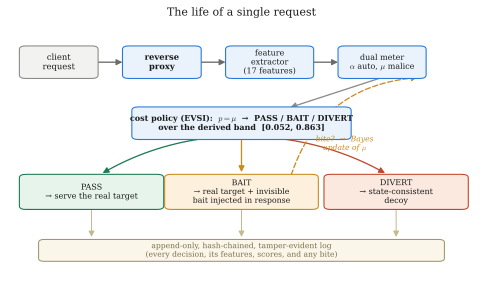
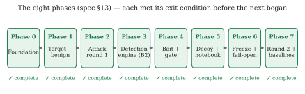
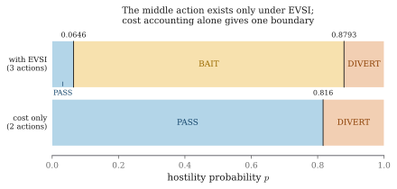

# An Active Deception Framework for Web Attack Detection

**Response-side probes and state-consistent decoys.**

Existing defences wait until they are confident before acting. This system
*deceives a little in order to become sure* — it plants invisible bait in
responses to manufacture the evidence that passive systems can only wait for,
and it measures what that costs real users.

> ⚠️ **This repository contains deliberately vulnerable software.**
> Read [SAFETY.md](SAFETY.md) before running anything. Never expose any
> service here to a network you do not fully control.

📖 **New here? Read [docs/OVERVIEW.md](docs/OVERVIEW.md).** It explains the
whole project end to end in plain language, with diagrams: what it does, why,
how each component works, how the numbers are derived, and where the work
stands. This README is the short version plus the commands.

The full specification is in [docs/PROJECT_SPEC.txt](docs/PROJECT_SPEC.txt);
section references throughout the code (`spec §6.5`) point into it.

---

## The idea in one paragraph

When the system is unsure about a visitor, it adds something to the response
that a real browser never displays but anyone reading raw traffic will see —
a fake database error naming a table that does not exist, an unused JSON
field, a hint at a deprecated login endpoint. An honest user never notices.
Someone probing the site acts on it, and the moment they do, they have
identified themselves. They are not blocked: they are moved silently into a
consistent fake copy of the site where everything they do is recorded.



## Status

| Phase | Name | State |
|---|---|---|
| 0 | Foundation — cost table, label schema, logging skeleton | ✅ complete |
| 1 | Target application + benign traffic generator | ✅ complete — corpus verified, all 6 exit checks pass |
| 2 | Attack round 1 (training corpus) | ✅ generator + verification + 2×2 coverage; clean corpus |
| 3 | Detection engine — features, dual meter, cost policy, proxy (baseline **B2**) | ✅ **B2 validated end-to-end**: caught on identical traffic, 0 benign diversions among automated clients |
| 4 | Bait library — **invisibility gate first** | ✅ gate built first; six baits, **calibrated** bite rates (per-category likelihood ratios) |
| 5 | Decoy environment + Fact Notebook + consistency fuzzer | ✅ 0.00% contradiction over 286 probes; full target/decoy parity (0 tells); credential capture |
| 6 | Integration, fail-open verification, model freeze | ✅ per-component fail-open, baits calibrated, model frozen (hash manifest, verified) |
| 7 | Attack round 2, baselines, ablations, results | ✅ B0/B1/B2/B4, feature-set v4; over **100 paired seeds**; recall B2 **0.915** → B4 **0.946**, CIs separate, **paired McNemar p<10⁻⁴** (b=446, c=72 over 12,000 pairs — *all* discordance in UI-IDOR); causal holdout **+0.053 [+0.036,+0.071], Fisher p<10⁻⁵**; B4 diverts **0/8,000** benign; see [docs/RESULTS.md](docs/RESULTS.md) |



Each phase met its exit condition before the next began (spec §13) — that
sequencing is what prevents discovering in the final week that the data was
collected in the wrong format. All eight are now complete; the work in progress
is hardening and the write-up (see [docs/PAPER_OUTLINE.md](docs/PAPER_OUTLINE.md)).

Phase 4 was built in the right order: the invisibility gate exists before the
baits do, and a passing bait carries a certificate the engine checks at run time.

## Quick start

```bash
pip install -r requirements.txt

# 1. a clean, labelled, verified corpus in one command:
#    wipe → seed a fresh DB → start a private server → run every generator
#    → stop the server → assemble and verify
python -m tools.generate_corpus
python -m tools.generate_corpus --benign 100 --agents 30 --attacks 48

# 2. train the dual meter on round 1 only — this configuration is baseline B2
python -m tools.train_meter                      # → data/models/meter.json

# 3. run the stack: the target app, with the proxy in front of it
python -m uvicorn target_app.main:app --host 127.0.0.1 --port 8001   # shell 1
python -m uvicorn adf.proxy:app       --host 127.0.0.1 --port 8000   # shell 2
#    clients talk to port 8000 (the proxy) and never to 8001 directly
```

<details>
<summary><b>Generating traffic step by step</b></summary>

```bash
# create the synthetic world (deterministic for a given seed)
python -m target_app.seed

# run the target application
python -m uvicorn target_app.main:app --host 127.0.0.1 --port 8001

# in another shell: generate labelled traffic
python -m tools.benign_traffic --sessions 100        # simulated humans
python -m tools.benign_agents  --sessions 30         # benign BUT automated
python -m tools.attack_traffic --sessions 48         # attack round 1 (train)

# assemble the corpus and verify the labels actually joined
python -m adf.dataset

# characterise it — this is the phase exit evidence
python -m tools.corpus_report
```

</details>

```bash
# inspect the cost table, and the decision bands derived from it
python -m adf.config
python -m adf.policy

# verify a log's hash chain has not been tampered with
python -m adf.logstore data/logs/target-access.<stamp>.jsonl

pytest                                    # 285 tests
```

> Add `--no-dwell` for a fast smoke run, but **never for a corpus you intend to
> train on**: it removes the think-times, and inter-request timing is the first
> automation feature in spec §6.3. `corpus_report` will tell you if timing has
> failed to separate.

`mode:` in `config/system.yaml` selects which system is running — `b2_passive`
is the baseline, `b4_full` the contribution. Same code path, one flag: that is
what makes the comparison honest (spec §5.3, FR-12).

### Why there are two benign generators

Spec §6.3 justifies the two-axis suspicion model with three cases: a scanner
(automated, hostile), a price-comparison bot (automated, harmless) and a
careful human attacker (manual, hostile). If the corpus contains only the
first and third, automation and malice are perfectly correlated — a single
combined score would do just as well, and the second axis is indefensible.

`benign_agents.py` supplies the missing class. It also supplies the hardest
negative in the corpus: a reporting integration that walks record ids in
ascending order over the API, which is the request shape of an IDOR sweep
from a client doing nothing wrong.

`benign_traffic.py` adds two awkward-but-honest human personas for the same
reason — one who looks up a colleague named *O'Connell* (the apostrophe hits
the concatenated SQL and returns the same verbose error an attacker sees while
probing), and one who forgets their password three to five times. Without
cases like these, "benign bait exposure rate" would be trivially zero and
would describe the corpus rather than the system.

### And why the attack generator refuses `--round eval`

Attack data is generated twice and the two rounds are never mixed (spec §7.2):
round 1 trains the meter, round 2 tests the finished, frozen system with
deliberately varied techniques. `attack_traffic.py` produces the
*straightforward, documented* attacks of round 1 and accepts only
`dev | train | calibrate`, so a rerun of the training corpus cannot quietly
become the test set.

Or with containers (spec NFR-12):

```bash
docker compose up target db      # Postgres backend, realistic SQL errors
```

### Sign-in details for the synthetic world

Seeded users are listed in `target_app/seed.py`. Second-factor codes are
computed by `target_app/otp.py` — deliberately predictable, which is the
OTP-bypass surface. The benign traffic generator computes them the same way,
because a legitimate user would have received the code by another channel.

## What is where

```text
adf/                the deception framework
  schema.py         FROZEN record schema v3 — every log line and dataset row
  config.py         config loading + cost-table freeze enforcement
  logstore.py       append-only, hash-chained record store
  dataset.py        corpus assembly: joins labels to traffic, verifies coverage
  features/         request -> 18 numbers (v4), session-streaming   ✅
  meter/            dual suspicion meter, two logistic heads        ✅
  policy/           three-way decision + value-of-information       ✅
    voi.py          EVSI: why bait is ever worth deploying; adaptive-adversary decay
    engine.py       score fusion, bait selection, randomised holdout
  proxy/            the reverse proxy everything sits behind        ✅
    proxy.py        session -> features -> meter -> policy -> log
    session.py      session identity (cookie; optional fingerprint)
    rules.py        signature WAF — baseline B1 (catches textbook, blind to IDOR)  ✅
  bait/             bait library + invisibility gate                ✅
    gate.py         the three tests; issues the certificate the engine checks
    baits.py        per-session bait construction and tokens
    channels.py     where a bait can ride, and rendered-output comparison
  decoy/            Fact Notebook, planted credential, world gen    ✅
target_app/         the deliberately weak application — knows nothing of adf
decoy_app/          the fake site (full target parity)                 ✅
tools/
  generate_corpus.py  one command: clean, labelled, verified corpus end to end
  run_evaluation.py   Phase 7 driver — all baseline arms (B0/B1/B2/B4), one seed
  multiseed_eval.py   the SAME arms over N seeded draws — one row per session
  stats_report.py     Wilson CIs + paired McNemar + Fisher over the multi-seed dump
  beta_sweep.py       sensitivity of the derived bands to beta_attack (invariance)
  make_figures.py     publication-quality figures (matplotlib) -> docs/img/*.svg + pdf/
  calibrate_baits.py  the dedicated calibrate round (bite likelihood ratios)
  certify_baits.py    the invisibility gate; writes bait_certificates.json
  robustness_eval.py  adaptive-adversary sweep (never-worse-than-passive)
  benign_traffic.py   simulated humans, incl. awkward-but-honest personas
  benign_agents.py    benign BUT automated clients (the §6.3 middle case)
  attack_traffic.py   attack round 1 — 12 profiles across three categories
  train_meter.py      fits both heads on round 1 only -> data/models/meter.json
  corpus_report.py    quantitative realism check + the phase exit gates
config/             costs.yaml (FROZEN), bait_library.yaml, system.yaml
data/               logs, labels, models — not committed
docs/               overview, spec, decision log, spec review, novelty framing
  img/              the diagrams used across the documentation
```

## The two things that must not drift

Both are enforced by tests rather than trusted to discipline
(`tests/test_frozen_artefacts.py`):

1. **The cost table** (`config/costs.yaml`) is hashed. The system refuses to
   start if the numbers move, because thresholds are *derived* from them
   rather than tuned, and editing them after seeing results invalidates every
   baseline comparison (spec §6.5, §16). Re-freezing is deliberate and leaves
   a dated entry in `config/costs.CHANGELOG.md`.

2. **The record schema** (`adf/schema.py`) is fingerprinted. Spec §11: fixing
   the label format after collection begins means either re-running every
   experiment or abandoning the dataset release.

## Why bait is ever justified

Baiting has **no immediate benefit**. The request still reaches the real
application, so baiting an attacker costs exactly what letting them past
costs, plus a small residual risk to benign users. On cost accounting alone
the policy collapses to an ordinary two-outcome rule — PASS below p = 0.816,
DIVERT above it, **no middle band anywhere**.

The third action exists because a probe buys *information*, and that value is
computed rather than assumed:

```text
V(p) = min_a E[C(a) | p]  −  E_Z[ min_a E[C(a) | p after observing Z] ]

effective_cost(bait) = E[C(bait) | p] − V(p)      # cheapest action wins
```

`V(p) ≥ 0` always (Jensen), and `V(0) = V(1) = 0` — when you are already
certain, probing is worth exactly nothing, so the band is bounded on both
sides by construction. With the frozen costs and the **calibrated** bait
effectiveness:

```text
PASS    p < 0.0516
BAIT    0.0516 ≤ p < 0.8626
DIVERT  p ≥ 0.8626
```



Nothing in those numbers was chosen. See [docs/NOVELTY.md](docs/NOVELTY.md);
inspect them with `python -m adf.policy`.

**Bait effectiveness is calibrated, not assumed.** The bite likelihood ratios
that set the band's edges (β_attack vs β_benign per bait category — e.g. the
IDOR bait at β_attack = 0.59, β_benign = 0.0037, n = 244) are *measured* in a
dedicated `calibrate` round, not read from priors. That round exists because the
spec's own phase order left the bait library uncalibratable in place (round 1
predates it; round 2 is the test set). See
[docs/SPEC_REVIEW.md](docs/SPEC_REVIEW.md) finding 1 and
`tools/calibrate_baits.py`; the frozen result is `data/bait_library.json`.

## Scope discipline

Spec §15 lists cuts already made, so they are not accidentally reintroduced:
three attack categories not six, no language model in the request path, no
live internet deployment, no online learning, no deep models. Section 15.2
lists the temptations to refuse — treat that list as binding.

If time runs short, drop in this order: dashboard → planted credential →
dataset release → two of the four ablations. **Never drop** the invisibility
gate, attack round 2, or the comparison against B2. (B0/B1 baselines and the
two load-bearing ablations — no-bait and no-notebook — are already done.)

## Documentation map

| Document | What it is for |
|---|---|
| [docs/OVERVIEW.md](docs/OVERVIEW.md) | **Start here.** The whole project in plain language, with diagrams. |
| [docs/PROJECT_SPEC.txt](docs/PROJECT_SPEC.txt) | The original specification — the authority on *what* is being built. |
| [docs/NOVELTY.md](docs/NOVELTY.md) | What is actually new, written as claims a reviewer can attack. |
| [docs/ABSTRACT.md](docs/ABSTRACT.md) | Title + abstract + contributions, in the order to claim them (lead with the structural result). |
| [docs/PAPER_OUTLINE.md](docs/PAPER_OUTLINE.md) | Section-by-section map from each claim to the proof/number/test that backs it. |
| [docs/RESULTS.md](docs/RESULTS.md) | The measured results, with the statistical protocol (CIs, paired tests) and honest significance. |
| [docs/LIMITATIONS.md](docs/LIMITATIONS.md) | Limitations, split into *eliminated* (fixed) and *irreducible*. |
| [docs/LITERATURE_REVIEW.md](docs/LITERATURE_REVIEW.md) | Related work: 38 verified references, comparison tables, the gap matrix, and BibTeX. |
| [docs/METHODOLOGY.md](docs/METHODOLOGY.md) | The complete method: every formula, flowcharts, feature and metric tables, experimental design. |
| [docs/SPEC_REVIEW.md](docs/SPEC_REVIEW.md) | Gaps found in the spec while implementing it, and what was done about each. |
| [docs/DECISIONS.md](docs/DECISIONS.md) | Dated log of every judgement call. Re-read before each evaluation run. |
| [docs/HUMAN_STUDY.md](docs/HUMAN_STUDY.md) | **Step-by-step guide for running the human deception study** — written for a facilitator with no knowledge of the code. |
| [SAFETY.md](SAFETY.md) | The rules for running deliberately vulnerable software. Not optional. |
