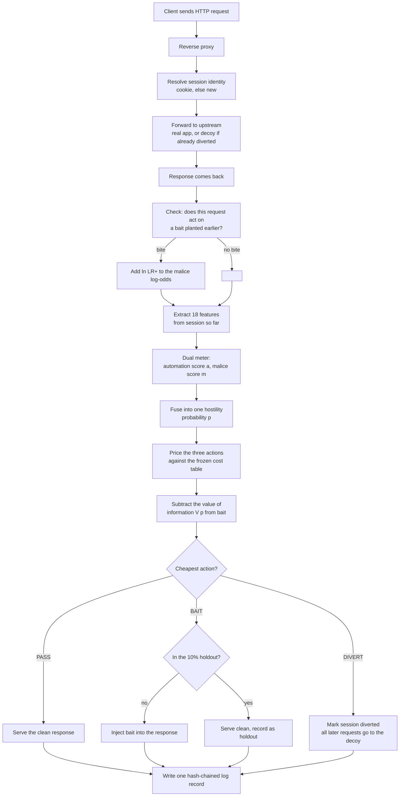
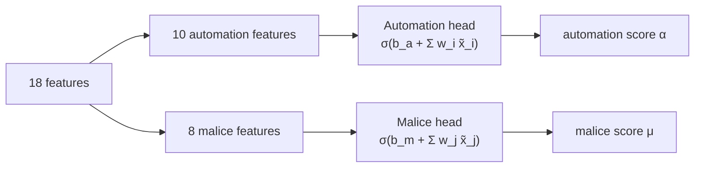
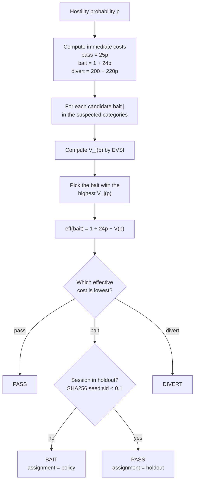
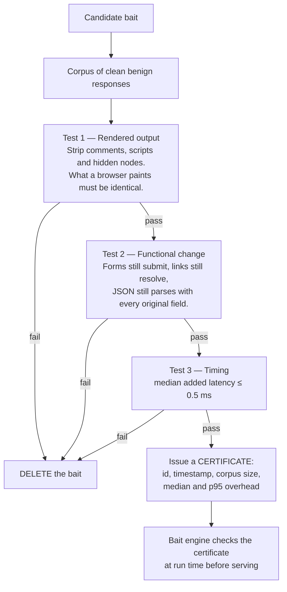
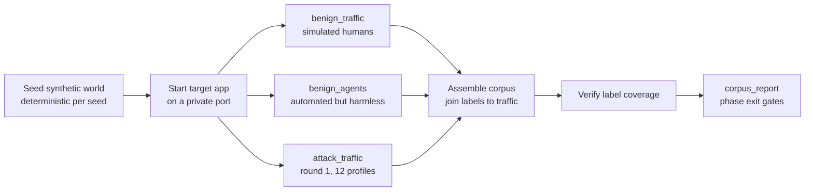
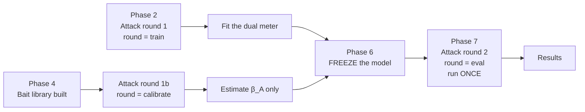

# Methodology

**For the paper: _An Active Deception Framework for Web Attack Detection Using
Response-Side Probes and State-Consistent Decoys_**

This document is the complete method, written in simple English. It is the raw
material for the paper's **System Design**, **Methodology** and **Experimental
Setup** sections.

Everything here is taken from the running code, not from the plan. Every
number shown was printed by the system itself. The gaps earlier drafts marked
**`[not yet measured]`** — calibration, full-corpus certification, attack round 2,
the holdout sample sizes — are now **filled**; see [RESULTS.md](RESULTS.md). What
remains is write-up polish (a real logged worked example, a larger fuzzer sweep),
tracked in §23.

> **Companion documents**
> [LITERATURE_REVIEW.md](LITERATURE_REVIEW.md) — related work, 38 verified references
> [NOVELTY.md](NOVELTY.md) — the contribution claims
> [OVERVIEW.md](OVERVIEW.md) — the system in plain language
> [PROJECT_SPEC.txt](PROJECT_SPEC.txt) — the original specification

---

## Contents

1. [The research questions](#1-the-research-questions)
2. [System overview](#2-system-overview)
3. [Threat model and assumptions](#3-threat-model-and-assumptions)
4. [Notation](#4-notation)
5. [Step 1 — Session identity](#5-step-1--session-identity)
6. [Step 2 — Feature extraction](#6-step-2--feature-extraction)
7. [Step 3 — The dual suspicion meter](#7-step-3--the-dual-suspicion-meter)
8. [Step 4 — Score fusion](#8-step-4--score-fusion)
9. [Step 5 — The cost model](#9-step-5--the-cost-model)
10. [Step 6 — Value of information and the decision rule](#10-step-6--value-of-information-and-the-decision-rule)
11. [Step 7 — The bait library](#11-step-7--the-bait-library)
12. [Step 8 — The invisibility gate](#12-step-8--the-invisibility-gate)
13. [Step 9 — Bite detection and the belief update](#13-step-9--bite-detection-and-the-belief-update)
14. [Step 10 — The decoy and the Fact Notebook](#14-step-10--the-decoy-and-the-fact-notebook)
15. [Step 11 — Tamper-evident logging](#15-step-11--tamper-evident-logging)
16. [Data collection](#16-data-collection)
17. [Experimental design](#17-experimental-design)
18. [Metrics](#18-metrics)
19. [Statistical analysis](#19-statistical-analysis)
20. [Reproducibility and freezing](#20-reproducibility-and-freezing)
21. [Threats to validity](#21-threats-to-validity)
22. [Worked example](#22-worked-example-one-session-end-to-end)
23. [Implementation status](#23-implementation-status)

---

## 1. The research questions

| # | Question | How the method answers it | Metric |
|---|---|---|---|
| RQ1 | Can a defender provoke a reaction that separates attackers from normal users, **without any effect on normal users**? | Invisibility gate (§12) + bite rates measured on both classes | Benign bait exposure rate; gate certificate; TOST equivalence bound |
| RQ2 | Does provoking **reduce the number of requests** needed to reach a confident decision? | Randomised holdout (§17.4) inside one system | Requests-to-decision, treated vs held-out |
| RQ3 | Can a generated fake environment stay **internally consistent** enough that a prober cannot detect it? | Fact Notebook (§14) + consistency fuzzer | Contradiction rate — **0.0000% over 286 probes** |
| RQ4 | What does the whole approach **cost**, once every kind of mistake is priced? | Frozen cost table (§9) applied to every session | Expected cost per session |

---

## 1a. Notation

| Symbol | Meaning |
|---|---|
| $\alpha$ | automation score (logistic head over the 10 automation features) |
| $\mu$ | malice score (logistic head over the 8 malice features) |
| $p$ | hostility probability used by the policy; here $p = \mu$ |
| $C(a \mid c)$ | frozen-table cost of action $a$ when the true class is $c$ |
| $\mathbb{E}[C(a)\mid p]$ | expected immediate cost of action $a$ at belief $p$ |
| $V(p)$ | expected value of sample information (EVSI) of a probe at $p$ |
| $\beta_{\mathrm{attack}}$ | P(bite \| hostile session) — calibrated per bait |
| $\beta_{\mathrm{benign}}$ | P(bite \| benign session) — measured on benign traffic |
| $\Lambda^{+}$ | bite likelihood ratio $\beta_{\mathrm{attack}}/\beta_{\mathrm{benign}}$ |
| $n$ | number of unrewarded bait exposures (survival-discount exponent) |

**Table (notation).** Symbols used throughout, in the order they appear.

## 2. System overview

Seven components. Only one of them contains a machine-learned model.

| # | Component | Job | Learned? |
|---|---|---|---|
| 1 | Target application | A deliberately weak website. Knows nothing about the defence. | No |
| 2 | Reverse proxy | Every request passes through it first. | No |
| 3 | Feature extractor | Turns a request into 18 numbers. | No |
| 4 | Dual suspicion meter | Two running scores per session: automation, malice. | **Yes** |
| 5 | Decision policy | Chooses PASS, BAIT or DIVERT using cost + information value. | No |
| 6 | Bait engine | Injects the chosen bait, then watches for a bite. | No |
| 7 | Decoy environment | The fake site, backed by the Fact Notebook. | Offline only |

The only learned component is the meter.

**About the decoy's content generation — state this precisely in the paper.**
The specification allows "any language model, run in batch". The current
implementation uses a **deterministic synthetic generator**, not an LLM. This is
a deliberate, honest substitution: it is seeded, reviewable, and keyed per
entity, so on-demand and batch generation always agree. A real deployment could
drop an LLM into the generator registry without changing anything else — the
Fact Notebook does not care *how* a value was produced, only that it is fixed
once produced.

Either way, **no generation ever sits in the request path.** A model call inside
a response would make the decoy slower than the real site, and a slow decoy is a
detectable decoy. The decoy answers at database speed, so a timing tell cannot
arise.

### The life of one request



**Two things to notice.**

1. The response is **forwarded first**, then scored. If any detection component
   crashes, the user has already been served. The security layer can never take
   the site down (fail-open).
2. Bite detection runs **before** scoring, so a request that acts on a bait
   raises suspicion on *that same request*, not the next one.

---

## 3. Threat model and assumptions

| Item | Assumption |
|---|---|
| Attacker goal | Extract data or gain access via SQL injection, IDOR, or credential/OTP attacks |
| Attacker knowledge | Knows the site is a normal web application. Does **not** know a deception layer exists, and cannot see the run seed |
| Attacker capability | Can read raw HTTP responses (headers, body, HTML source, JSON) — this is the whole basis of the method |
| Attacker types covered | Scripted+hostile (scanner), **manual+hostile** (careful human), and — as a negative — automated+harmless (benign bot) |
| Out of scope | DDoS, network-layer attacks, client-side attacks (XSS against other users), supply-chain, physical access |
| Defender position | Sits in front of the application as a reverse proxy. Can read and rewrite responses |
| Defender constraint | Must never break a response, never add visible latency, never block a legitimate user |
| Trust boundary | The proxy and the log are trusted. The target application is assumed vulnerable by design |

**Three attack categories, not six.** This is a scope decision, made in advance
and recorded, so the evaluation is deep rather than shallow.

| Category | What it is | Attack profiles in the corpus |
|---|---|---|
| `sqli` | SQL injection through a concatenated query | `sqli_error`, `sqli_boolean`, `sqli_union`, `manual_sqli` |
| `idor` | Reading another user's data by changing an ID | `idor_sequential`, `idor_tamper`, `manual_idor` |
| `auth` | Credential stuffing, brute force, OTP bypass/reuse | `cred_stuffing`, `bruteforce`, `otp_bypass`, `otp_reuse`, `manual_recon` |

---

## 4. Notation

| Symbol | Meaning |
|---|---|
| $y \in \{\text{benign}, \text{attack}\}$ | The true nature of a session (ground truth) |
| $a \in \{\text{pass}, \text{bait}, \text{divert}\}$ | The action the system takes |
| $x$ | The 19-dimensional feature vector for one request |
| $\alpha \in [0,1]$ | Automation score ("is this a script?") |
| $\mu \in [0,1]$ | Malice score ("is this hostile?") |
| $p \in [0,1]$ | Fused hostility probability, $P(y = \text{attack})$ |
| $C(a, y)$ | Cost of taking action $a$ when the truth is $y$ (frozen table) |
| $\beta_A$ | $P(\text{bite} \mid \text{attack})$ — bait effectiveness on attackers |
| $\beta_B$ | $P(\text{bite} \mid \text{benign})$ — bait exposure of honest users |
| $\Lambda^+$ | Likelihood ratio of a bite $= \beta_A / \beta_B$ |
| $\Lambda^-$ | Likelihood ratio of no bite $= (1-\beta_A)/(1-\beta_B)$ |
| $V(p)$ | Expected value of sample information from deploying a bait at belief $p$ |
| $\sigma(z)$ | Logistic function $1/(1+e^{-z})$ |
| $\text{logit}(q)$ | $\ln\big(q/(1-q)\big)$ |

---

## 5. Step 1 — Session identity

Suspicion accumulates **per session**, not per request. So the first job is to
decide which requests belong together.

| Rule | Detail |
|---|---|
| Primary key | A cookie, `adf_sid`, set by the proxy on first contact |
| Idle timeout | 1800 seconds |
| Fingerprint fallback | **Off by default.** A coarse fingerprint (user-agent + IP + a few headers) would merge distinct clients that share it — for example, every traffic generator running on localhost — and that would corrupt per-session metrics |
| Known limitation | A cookie-refusing tool gets a fresh session on every request and so resets its own score. This is stated as a limitation, not hidden. Turning the fingerprint on is the mitigation, at the cost of collisions |

---

## 6. Step 2 — Feature extraction

Each request becomes **18 numbers** (feature set **v4**). They are split into two
groups on purpose, because the two scores need different evidence.

> **How the set got to 18, and why each change was forced by a measurement.**
>
> **v3 removed two (19 → 17).** `mal_seq_id_run` (ascending-id run length) and
> `mal_touched_sensitive` (any `/api|/auth|/admin` access) diverted **100% of
> benign JSON-API integration clients**: a legitimate reporting integration walks
> record ids in ascending order over the API, which is byte-for-byte the shape of
> an IDOR sweep (§6.3 names this ambiguity). No passive feature honestly separates
> the two, so that detection was delegated to **bait** instead.
>
> **v4 added one (17 → 18).** `mal_distinct_usernames` retired the last false
> positive in the benign corpus. The `forgetful` persona was diverted 3/5 of the
> time and that was reported as *inherent* — it was not. A forgetful user fails
> against **one** account and then succeeds; a spraying attacker walks **many**,
> and no v3 feature looked at that axis. In the same change `mal_error_ratio`
> stopped counting login rejections, since the auth axis is now readable directly.
> The cost of the fix is stated as a limitation, not hidden: a *vertical* brute
> force (one username, many passwords) is now passively undetected — see
> [LIMITATIONS.md](LIMITATIONS.md) §5.
>
> Both changes were forced by evaluation evidence, and both are recorded here
> rather than folded silently into a version bump; see [RESULTS.md](RESULTS.md).

The features are **cumulative over the session**, not per-request. This is what
makes suspicion accumulate: a series of individually unremarkable requests can
still add up to a confident conclusion, and no hand-tuned decay constant is
needed anywhere.

### 6.1 Automation features (10) — "is this a script?"

| # | Feature | Definition | Why |
|---|---|---|---|
| 1 | `auto_interarrival_last` | $t_n - t_{n-1}$ in seconds (0 for the first request) | Scripts fire fast |
| 2 | `auto_interarrival_cv` | $\dfrac{\sigma(\text{gaps})}{\mu(\text{gaps})}$ | Humans are irregular; scripts are metronomic. Low CV = machine |
| 3 | `auto_requests_per_min` | $\dfrac{n}{(t_n - t_1)/60}$ | Rolling rate |
| 4 | `auto_asset_fetch_ratio` | $\dfrac{\text{static assets fetched}}{\text{page navigations}}$ | A browser pulls CSS and images; a script does not. **The strongest single automation signal** |
| 5 | `auto_fetched_assets` | 1 if any asset has ever been fetched | Binary version of the above |
| 6 | `auto_browser_header_ratio` | $\dfrac{\lvert \{\texttt{accept},\ \texttt{accept-language},\ \texttt{accept-encoding}\} \cap \text{headers} \rvert}{3}$ | Tools omit browser headers |
| 7 | `auto_header_count` | Number of headers on this request | Browsers send many; tools send few |
| 8 | `auto_ua_is_tool` | 1 if the user-agent does not begin `Mozilla/` | Cheap but real signal |
| 9 | `auto_ua_stable` | 1 if the user-agent has not changed within the session | Rotation is suspicious |
| 10 | `auto_cookie_carried` | 1 if a cookie was sent | Tools often drop cookies |

### 6.2 Malice features (8) — "is this hostile?"

| # | Feature | Definition | Why |
|---|---|---|---|
| 11 | `mal_input_length` | $\lvert \text{client input} \rvert$ | Payloads are long |
| 12 | `mal_special_char_ratio` | $\dfrac{\lvert \{c \in \text{input} : c \in S\} \rvert}{\lvert \text{input} \rvert}$, where $S = \{\texttt{' " ( ) ; = < > - \# \% * \| / \textbackslash ` \{ \}}\}$ | Injection payloads are symbol-dense |
| 13 | `mal_db_keyword_hits` | Count of matches of SQL-**syntax** patterns (not bare keywords): `UNION SELECT`, `SELECT … FROM`, `INSERT INTO`, `DELETE FROM`, `DROP/TRUNCATE TABLE`, `ORDER BY n`, `information_schema`, time-based `sleep(/benchmark(/…`, a tautology (`OR/AND` joined to a comparison), a quote break-out before a keyword, and comment terminators (`--`, `/*`, `; --`) | The clearest SQL-injection signal — **without** matching ordinary English |
| 14 | `mal_db_keyword_any` | 1 if any such pattern has appeared **this session** (a latch) | Once seen, it stays seen |
| 15 | `mal_failed_auth` | Count of `401` responses to `POST /login` or `POST /otp` this session | The credential-attack signal |
| 16 | `mal_error_ratio` | $\dfrac{\text{responses with status} \geq 400}{\text{all responses}}$, **excluding login rejections** (v4) | Probing generates errors — **and** the surviving signal that separates an IDOR sweep (many 404s) from a benign integration (all 200s). Login 401s are excluded because `mal_distinct_usernames` now reads the auth axis directly; counting them here as well is what diverted the forgetful user |
| 17 | `mal_param_mutation` | 1 if the same endpoint was hit again with the same parameter *names* but a changed *value* | Manual request editing |
| 18 | `mal_distinct_usernames` | Count of **distinct usernames** this session has attempted to authenticate as | Separates horizontal from vertical: a forgetful user fails against one account, a spraying attacker walks many. Retired the last benign false positive (v4) |

The keyword feature (#13) was rewritten in v2 to require **SQL syntax context**
rather than vocabulary: an earlier version matched bare words and false-positived
on a search for *"terms and conditions"* (the `and` latch would elevate an honest
user permanently). Every payload the attack generators use still matches; natural
language does not. Verified in both directions by `tests/test_features.py`.

### 6.3 Two decisions worth defending in the paper

**(a) What counts as "client input".** Only query-parameter values, plus the
request body of **non-authentication** requests.

- The **path is excluded**, so visiting `/records/5` does not register as
  symbol-heavy. IDOR is not caught by a lexical feature at all — after v3 removed
  the ascending-id-run feature (which could not be told apart from a benign
  integration), IDOR detection rests on `mal_error_ratio` for API sweeps and on
  **bait** for UI sweeps.
- **Login and OTP bodies are excluded.** A password is expected to be long and
  full of symbols — `Summer2024!` is not an injection payload. Measuring its
  length as malice produces a false positive on **every legitimate sign-in**.
  This was found by an end-to-end smoke test that diverted a benign login POST
  purely on body length. Query parameters on an auth path are still counted, so
  `/login?x=' UNION` is not a blind spot.

**(b) No feature may read the ground truth.** The extractor is forbidden from
touching the label fields or the provenance ID that joins traffic to labels. A
model that read those would be reading the answer sheet. This is enforced by a
test, not by discipline.

---

## 7. Step 3 — The dual suspicion meter

Two **independent** logistic-regression heads over two feature partitions.



### 7.1 The model

Standardise each feature using statistics stored at training time:

$$\tilde{x}_i = \frac{x_i - \mu_i}{s_i}, \qquad s_i = 1 \text{ if } s_i = 0$$

Then the score on each axis is:

$$z = b + \sum_i w_i \tilde{x}_i, \qquad \text{score} = \sigma(z) = \frac{1}{1 + e^{-z}}$$

### 7.2 Explainability comes for free

Each feature's signed push on the score, in log-odds, is exactly:

$$c_i = w_i \tilde{x}_i$$

So for any decision the system can list the features that caused it, sorted by
$\lvert c_i \rvert$. The top five are written into every log record. This is why
logistic regression was chosen over a stronger model — the paper needs to
answer "why was this session diverted?" months later.

### 7.3 Training

| Item | Setting | Why |
|---|---|---|
| Model | L2-regularised logistic regression (`scikit-learn`) | Interpretable; correct tool at this data scale |
| Regularisation | $C = 1.0$ | Default; not tuned on results |
| Class weighting | `balanced` | Attacks are rarer than benign traffic |
| Max iterations | 2000 | Convergence |
| Random seed | Fixed from `config/system.yaml` | Reproducibility |
| Training data | **Attack round 1 (`train`) only** | Round 2 is the held-out test set |
| Labels | Session-level truth, broadcast to every request of that session by the caller | The meter never joins labels itself, so it cannot read them as features |
| Automation head trains on | Automation features vs the automation label (scripted / human) | — |
| Malice head trains on | Malice features vs ground truth (attack / benign) | — |
| Inference | Pure NumPy, no `scikit-learn` import in the request path | Latency |
| Persistence | Three arrays + a bias per head, stored as JSON | Diffable, inspectable, frozen |

**Degenerate-class guard.** If a training set contains only one class, the head
stays at its zero prior and is marked `fitted = False`. A meter that predicts
0.5 everywhere is honest about having learned nothing — better than a silent
crash or a fake result.

**Version lock.** The saved model records the feature-set version. Loading a
model trained on a different feature set raises an error instead of silently
misaligning the weights.

---

## 8. Step 4 — Score fusion

The cost table is indexed by **true class**, not by a pair of scores. So
something has to map $(\alpha, \mu) \mapsto p$. Keeping that mapping explicit
and in the config file makes the assumption visible and reportable.

$$z = \text{bias} + w_\mu \cdot \text{logit}(\mu) + w_\alpha \cdot \text{logit}(\alpha)$$

$$p = \sigma(z)$$

with a clamp $q \leftarrow \text{clip}(q, \varepsilon, 1-\varepsilon)$,
$\varepsilon = 10^{-6}$, so the logit never blows up.

| Parameter | Frozen value | Effect |
|---|---|---|
| `bias` | 0.0 | — |
| `w_malice` | 1.0 | — |
| `w_automation` | **0.0** | $p = \mu$ |
| `epsilon` | $10^{-6}$ | Numerical guard |

**Why automation gets weight zero.** A price-comparison bot is fully automated
and entirely harmless. Automation must not, by itself, imply hostility. So the
automation score does not feed $p$ at all — **it is spent on bait selection
instead** (§11.2). The two axes therefore do genuinely different jobs rather
than being decorative.

Any non-zero `w_automation` must be reported in the paper.

---

## 9. Step 5 — The cost model

Every kind of mistake is priced **in advance**, and the file is hashed. The
system refuses to start if the numbers move.

### 9.1 The frozen cost table

$$C(a, y) =
\begin{array}{c|ccc}
 & \text{pass} & \text{bait} & \text{divert} \\ \hline
\text{benign} & 0.0 & 1.0 & 200.0 \\
\text{attack} & 25.0 & 25.0 & -20.0
\end{array}$$

| Cell | Value | Reasoning |
|---|---|---|
| benign / pass | **0.0** | Correct behaviour. This anchors the scale at zero |
| benign / bait | **1.0** | A normal user got bait and never noticed. Not exactly zero, because zero would *assert* that the invisibility gate is perfect. This small residual prices the risk that a defective bait escapes the gate, and stops the policy from baiting as a free action |
| benign / divert | **200.0** | A real user sent into the fake site. The outcome that must almost never happen. Priced 200× a wasted bait, so the policy demands overwhelming evidence |
| attack / pass | **25.0** | Missed attacker: reached the real app unobserved |
| attack / bait | **25.0** | **The same as pass**, because the request still reaches the real application. Baiting an attacker costs exactly what letting them through costs |
| attack / divert | **−20.0** | The win: contained in the decoy, learns nothing real, generates intelligence. Negative = desirable |

**The most important cell is `attack / bait = 25.0`.** In the first freeze it
was 8.0, following the specification's instruction to discount it "to reflect
that purchased information". That discount was **double counting**: the value of
the information is computed explicitly by the EVSI term and subtracted at
decision time. A cost table that *also* pre-discounts would count the same
benefit twice, and the bait band would become an artefact of an arbitrary
constant rather than a derived result.

So bait carries its true cost. **It wins on information value alone, or it does
not win.**

### 9.2 Expected immediate cost

$$\mathbb{E}[C(a) \mid p] = p \cdot C(a, \text{attack}) + (1-p) \cdot C(a, \text{benign})$$

Substituting the frozen numbers:

$$\mathbb{E}[C(\text{pass}) \mid p] = 25p$$
$$\mathbb{E}[C(\text{bait}) \mid p] = 1(1-p) + 25p = 1 + 24p$$
$$\mathbb{E}[C(\text{divert}) \mid p] = 200(1-p) - 20p = 200 - 220p$$

### 9.3 The key negative result

On immediate cost alone, **BAIT is never optimal**:

$$\mathbb{E}[C(\text{bait}) \mid p] - \mathbb{E}[C(\text{pass}) \mid p] = 1 - p \;>\; 0 \quad \text{for all } p < 1$$

Bait is strictly more expensive than passing at every belief. The policy
collapses to an ordinary two-outcome rule, with the PASS/DIVERT boundary where:

$$25p = 200 - 220p \quad \Longrightarrow \quad 245p = 200 \quad \Longrightarrow \quad p^* = \tfrac{200}{245} = 0.8163$$

**There is no middle band anywhere.** This is the sharpest available answer to
"isn't your third option just a tuned threshold?" — without the information
term, there is no third option to tune. It is enforced by a test:
`test_cost_accounting_alone_does_not_justify_bait`.

---

## 10. Step 6 — Value of information and the decision rule

This is the core contribution. Bait has no immediate benefit; its entire value
is that it **buys information**. That value is computed, not assumed.

### 10.1 What the bait tells you

A bait is described by two conditional bite rates:

$$\beta_A = P(\text{bite} \mid \text{attack}), \qquad \beta_B = P(\text{bite} \mid \text{benign})$$

The marginal probability of seeing a bite at belief $p$:

$$P(\text{bite} \mid p) = p\beta_A + (1-p)\beta_B$$

Bayes updates for the two possible outcomes:

$$p^{+} = P(\text{attack} \mid \text{bite}) = \frac{p\beta_A}{p\beta_A + (1-p)\beta_B}$$

$$p^{-} = P(\text{attack} \mid \text{no bite}) = \frac{p(1-\beta_A)}{p(1-\beta_A) + (1-p)(1-\beta_B)}$$

### 10.2 Expected value of sample information

$$\boxed{\;V(p) \;=\; \min_a \mathbb{E}[C(a) \mid p] \;-\; \Big[\,P(\text{bite}) \cdot \min_a \mathbb{E}[C(a) \mid p^{+}] \;+\; \big(1 - P(\text{bite})\big) \cdot \min_a \mathbb{E}[C(a) \mid p^{-}]\,\Big]\;}$$

In words: *how much cheaper does my best decision get, on average, once I know
whether they bit?*

### 10.3 The decision rule

$$\text{eff}(\text{pass}) = \mathbb{E}[C(\text{pass}) \mid p]$$
$$\text{eff}(\text{divert}) = \mathbb{E}[C(\text{divert}) \mid p]$$
$$\text{eff}(\text{bait}) = \mathbb{E}[C(\text{bait}) \mid p] \;-\; V(p)$$

$$a^{*} = \arg\min_a \ \text{eff}(a)$$

Only BAIT gets the subtraction, because PASS and DIVERT are terminal — neither
buys any information.

With the frozen table, BAIT beats PASS exactly when:

$$1 + 24p - V(p) < 25p \quad \Longleftrightarrow \quad \boxed{V(p) > 1 - p}$$

That is: **bait when the information is worth more than the residual
invisibility risk borne by the honest traffic.** Nothing was chosen here.

### 10.4 Three properties for the paper

| # | Property | Proof | Test |
|---|---|---|---|
| 1 | $V(p) \geq 0$ for all $p$ | $\min$ over linear functions is concave, so Jensen's inequality applies. **Information never hurts.** A standard lemma (EVSI is textbook, Howard 1966) — we claim the application, not the maths — but far stronger and more checkable than "bait is cheap", and enforced as an invariant | `test_information_is_never_harmful` |
| 2 | $V(0) = V(1) = 0$ | When you are already certain, no observation can change the decision, so probing is worth exactly nothing. **The bait band is therefore bounded on both sides by construction** — it cannot swallow the whole probability range, and it cannot be widened by tuning | — |
| 3 | Without $V$, there is no third action at all | §9.3 | `test_cost_accounting_alone_does_not_justify_bait` |

### 10.5 The derived bands

Sweeping $p$ from 0 to 1 in 20,000 steps and recording where the chosen action
changes. **These numbers came out of the system; nobody chose them.**

```
PASS      p <  0.0647
BAIT      0.0647  ≤  p  <  0.8793
DIVERT    p ≥ 0.8793
```

Change the cost of a wrongly diverted user, or measure a different bite rate,
and the bands move on their own.

> These bands are computed from the **calibrated** bite rates (the `calibrate`
> round, frozen into `data/bait_library.json`), not from priors — the policy
> refuses to produce reportable results from uncalibrated priors (§11.3).
> Reproduce with `python -m adf.policy`.

### 10.6 The cost curves, printed by the system

| $p$ | $\mathbb{E}[\text{pass}]$ | $\mathbb{E}[\text{bait}]$ | $\mathbb{E}[\text{divert}]$ | $V(p)$ | eff(bait) | Chosen |
|---:|---:|---:|---:|---:|---:|:---|
| 0.00 | 0.000 | 1.000 | 200.00 | 0.000 | 1.000 | PASS |
| 0.01 | 0.250 | 1.240 | 197.80 | 0.103 | 1.137 | PASS |
| 0.02 | 0.500 | 1.480 | 195.60 | 0.307 | 1.173 | PASS |
| 0.03 | 0.750 | 1.720 | 193.40 | 0.510 | 1.210 | PASS |
| 0.05 | 1.250 | 2.200 | 189.00 | 0.917 | 1.282 | PASS |
| **0.10** | 2.500 | 3.400 | 178.00 | 1.988 | **1.412** | **BAIT** |
| 0.30 | 7.500 | 8.200 | 134.00 | 7.444 | 0.756 | BAIT |
| 0.50 | 12.500 | 13.000 | 90.00 | 12.900 | 0.100 | BAIT |
| 0.70 | 17.500 | 17.800 | 46.00 | 18.357 | −0.557 | BAIT |
| 0.85 | 21.250 | 21.400 | 13.00 | 14.199 | 7.201 | BAIT |
| **0.90** | 22.500 | 22.600 | 2.00 | 3.313 | 19.287 | **DIVERT** |
| 0.95 | 23.750 | 23.800 | −9.00 | 0.000 | 23.800 | DIVERT |
| 1.00 | 25.000 | 25.000 | −20.00 | 0.000 | 25.000 | DIVERT |

Read the $V(p)$ column top to bottom: it rises from zero, peaks in the middle
where uncertainty is greatest, then collapses back to zero as certainty
returns. That shape **is** property 2, visible in data.

### 10.7 Decision flowchart



---

## 11. Step 7 — The bait library

### 11.1 What a bait is

A small piece of information added to a response that a real browser will never
show to a real person, but that anybody reading raw traffic sees immediately.

| ID | Category | Fires when | What is injected | Channel | A bite is | $\beta_A$ (prior) | $\Lambda^+$ |
|---|---|---|---|---|---|---:|---:|
| `B-SQL-1` | sqli | A quote or comment character appears in a parameter | Verbose fake database error naming a non-existent table `acct_shadow_{suffix}` | error text | Any later request referencing that table name | 0.55 | 1100 |
| `B-SQL-2` | sqli | Repeated malformed parameters in one session | Fake column list `col_{suffix}` inside an HTML comment | HTML comment | A query referencing any of those columns | 0.35 | 700 |
| `B-IDOR-1` | idor | Sequential ID access detected | Unused extra field `ref_uid` in the JSON response | JSON field | Any request that submits the field | 0.40 | 800 |
| `B-IDOR-2` | idor | Object-reference tampering detected | Fake `internal_view` parameter mentioned in an HTML comment | HTML comment | A request carrying that parameter | 0.30 | 600 |
| `B-AUTH-1` | auth | Several failed logins in one session | Failure message hints at `/auth/legacy/verify_{suffix}` | error text | Any request to that path | 0.50 | 1000 |
| `B-AUTH-2` | auth | Repeated OTP failures | Inert debug field `mfa_debug_token` in the OTP failure response | JSON field | A request submitting that token | 0.45 | 900 |

All six currently use $\beta_B = 0.0005$ (the smoothing floor), giving
$\Lambda^+ = \beta_A / \beta_B$.

**Four design rules every bait must obey.**

| Rule | Meaning | Enforced by |
|---|---|---|
| **Plausible** | A bait that looks planted warns the attacker the site is defended | Design review |
| **Inert** | Following it must never grant real access or trigger real behaviour | Design + tests |
| **Unique** | Content is randomised per session, so no fixed string can be published and burn the bait permanently | `randomise_per_session: true`; token suffix derived from (seed, session id) |
| **Invisible** | Must hold a passing invisibility certificate before it may be served | Run-time certificate check (§12) |

### 11.2 Bait selection — where the automation axis earns its keep

The specification asks for "a bait appropriate to the suspected attack
category" without defining *appropriate*. **EVSI defines it:**

$$j^{*} = \arg\max_{j \in \mathcal{J}(x)} V_j(p)$$

where $\mathcal{J}(x)$ is the candidate set filtered by the suspected
categories. Category routing is a cheap heuristic on the current feature
vector — deliberately **not** a classification, since the meter does that:

| Suspected category added when |
|---|
| `sqli` — if `mal_db_keyword_hits > 0` **or** `mal_special_char_ratio > 0.1` |
| `idor` — if the request path matches an object-reference endpoint (`/profile/{id}`, `/records/{id}`, with or without an `/api` prefix) |
| `auth` — if `mal_failed_auth ≥ 2` **or** the path is `/login` / `/otp` |

The IDOR route is **surface-based**, not feature-based, and deliberately so: after
v3 removed `mal_seq_id_run`, an attacker walking object-reference endpoints leaves
almost no malice signal, so a purely feature-based router would hand them an SQL
bait they would never take. Matching the bait to the endpoint they are actually
poking is what lets a probe resolve the uncertain IDOR case at all — a real
routing gap the Phase 7 evaluation exposed (see `_suspected_categories` in
`adf/proxy/proxy.py` and [RESULTS.md](RESULTS.md)).

So the malice score supplies the belief $p$, and the automation score plus the
category routing indexes *which* bait's effectiveness applies — a scripted
scanner and a careful human take different bait at different rates.

### 11.3 Calibration — and the problem it fixed

The bite rates $\beta_A$, $\beta_B$ are the **only** empirical inputs to the
decision rule, so where they come from decides whether the result is defensible.

**The problem found while implementing the spec.** The phase order runs attack
round 1 (Phase 2) *before* the bait library is built (Phase 4). So the training
corpus contains no bait and therefore no bites. Round 2 is the held-out test
set. **These parameters had no legitimate source of data at all.**

**The fix: a dedicated `calibrate` round** (attack round 1b), run after Phase 4
and frozen before the evaluation, whose only permitted use is estimating bait
effectiveness.

| Round | Permitted use | Enforced |
|---|---|---|
| `dev` | Development and smoke tests | — |
| `train` | Fit the dual meter | Generator default |
| `calibrate` | Estimate $\beta_A$ **and nothing else** | — |
| `eval` | Final evaluation, once, on the frozen system | **The round-1 generator refuses `--round eval`** |

$\beta_B$ is measurable separately, cheaply, on the benign corpus — serve the
bait and count bites. It should come out at essentially zero, because bait is
invisible to a real browser.

**It is not assumed zero.** A hard zero makes $\Lambda^+ = \beta_A/\beta_B$
infinite and the arithmetic degenerate, and it would assume away precisely the
safety property the project exists to measure. **Jeffreys smoothing** is used
instead:

$$\hat{\beta} = \frac{k + \tfrac{1}{2}}{n + 1}, \qquad \hat{\beta}_B \geq 0.0005$$

with a minimum of 30 calibration sessions.

**Guard rail.** The policy raises an error rather than producing reportable
numbers from an uncalibrated library:

> *"the bait library has not been calibrated. Its beta values are priors, and
> reporting a result computed from priors would present a guess as a finding."*

**Informativeness guard.** A bait is rejected at construction if
$\beta_B \geq \beta_A$ — a bait that benign users act on at least as often as
attackers carries no evidence and must never enter the library.

---

## 12. Step 8 — The invisibility gate

**The single most important safety mechanism in the project**, and it was built
*before* any bait existed — that ordering is deliberate.

A bait that leaks into the normal user experience does not merely weaken the
results. It invalidates the central claim, which is that provoking is safe. So
the rule is strict: **a bait that fails the gate is deleted, not repaired.**

### 12.1 The three tests



The 0.5 ms ceiling is far below the millisecond-scale jitter of a real
response, so an attacker cannot separate a baited response from a clean one by
timing.

### 12.2 Current certificate results

All six baits hold a passing certificate.

| Bait | Passed | Responses it applied to | Median overhead (ms) | p95 overhead (ms) |
|---|:--:|---:|---:|---:|
| `B-SQL-1` | ✅ | 11 / 13 | 0.0206 | 0.0301 |
| `B-SQL-2` | ✅ | 11 / 13 | 0.0114 | 0.0123 |
| `B-IDOR-1` | ✅ | 2 / 13 | 0.1655 | 0.1867 |
| `B-IDOR-2` | ✅ | 11 / 13 | 0.0121 | 0.0160 |
| `B-AUTH-1` | ✅ | 11 / 13 | 0.0115 | 0.0145 |
| `B-AUTH-2` | ✅ | 2 / 13 | 0.1947 | 0.2060 |

Every measured overhead is **at least 2.5× below** the 0.5 ms ceiling, and most
are 25–40× below it.

> Certificates are now regenerated against the **full benign corpus**: each bait
> is tested over **116 responses** (`config/bait_certificates.json`, `gate_version`
> 1), every one passing with median overhead 0.01–0.11 ms against a 0.5 ms ceiling.
> The corpus size is recorded in the certificate next to every overhead number so
> a reviewer can check it. (An earlier version certified against only 13 responses
> — too small for a safety claim; that gap is closed.)

### 12.3 Run-time enforcement

Two guards make the rule real at run time rather than trusting the build:

1. `require_invisibility_certificate: true` — the bait engine refuses to serve
   any bait without a passing certificate on file.
2. A bait that cannot be injected into this particular response **degrades to
   the clean response**, never to a broken one. Same fail-open spirit as the
   proxy.

---

## 13. Step 9 — Bite detection and the belief update

### 13.1 Detection

Every request is checked against every token planted so far:

1. First, the **requesting session's own** baits.
2. Then, **every other session's** tokens. A token seen outside the session it
   was issued to is a **cross-session bite** — either a leaked/published bait or
   an attacker rotating identity. Both are *more* informative than an ordinary
   bite, and both are flagged.

### 13.2 The update — derived, not hand-set

The specification says the malice score "jumps sharply" on a bite. It never
says by how much. This is that number, and it is a likelihood ratio:

$$\Lambda^{+} = \frac{P(\text{bite} \mid \text{attack})}{P(\text{bite} \mid \text{benign})} = \frac{\beta_A}{\beta_B}, \qquad \Lambda^{-} = \frac{1 - \beta_A}{1 - \beta_B}$$

The update is applied in log-odds, which is where a likelihood ratio is simply
an addition:

$$\text{logit}(\mu_{\text{eff}}) = \text{logit}(\mu_{\text{meter}}) + \sum_{\text{bites}} \ln \Lambda^{+}$$

$$\mu_{\text{eff}} = \sigma\big(\text{logit}(\mu_{\text{eff}})\big)$$

With no bites this is exactly the meter's own malice score. Each bite shifts it
upward by that bait's calibrated weight.

**Reporting $\Lambda^-$ matters.** A system that only ever updates suspicion
*upward* accumulates without bound and will eventually divert somebody for
browsing slowly. Declining a bait is weak evidence of innocence
($\Lambda^- < 1$), and the model says so. Current values run 0.45–0.70.

---

## 14. Step 10 — The decoy and the Fact Notebook

Once a session is diverted it stays in the decoy for every later request. It is
never blocked and never shown an error, so the attacker does not learn they
were caught.

### 14.1 The problem

Fake environments that generate responses on the fly **forget what they said**.
Ask the same question twice and you get two different answers. That
inconsistency is exactly how an experienced attacker realises they are in a
trap.

### 14.2 The Fact Notebook

A fact is a mapping $(\text{namespace}, \text{key}) \rightarrow \text{value}$.
Two mechanisms together give all four consistency properties:

**(a) Deterministic generation.** When a fact is first needed, it is produced by
a generator seeded from $(\text{seed}, \text{namespace}, \text{key})$. The same
key therefore produces the same value even if it is first reached months apart
or through a completely different endpoint.

**(b) Persistence with attacker override.** The generated value is stored on
first use (first writer wins, so concurrent reads agree). An attacker's write is
stored with **higher precedence**, so reading a modified fact back returns the
modification.

$$\text{precedence}(\text{generated}) = \text{precedence}(\text{seeded}) = 0, \qquad \text{precedence}(\text{attacker}) = 10$$

A write only overwrites when its precedence is $\geq$ the stored one, so a
generated default can never erase an attacker's modification.

### 14.3 The four consistency dimensions

| # | Dimension | What must hold | How it is guaranteed |
|---|---|---|---|
| 1 | **Repetition** | Asking the same thing twice returns the same answer | Deterministic RNG + first-write-wins |
| 2 | **Cross-reference** | A user named in one place exists with the same details everywhere else | Same key → same generated value across endpoints |
| 3 | **Write-then-read** | If the attacker modifies something, reading it back returns what they wrote | Attacker precedence 10 |
| 4 | **Referential integrity** | An ID mentioned in one record resolves to a matching record elsewhere | Generators resolve references *through* the notebook |

### 14.4 The consistency fuzzer

Interrogates the decoy for the same information through several different routes
and counts the disagreements.

| Dimension | Probe |
|---|---|
| Repetition | Fetch `/api/profile/{id}` twice; the bytes must match |
| Cross-reference | A user seen via `/profile/{id}` (HTML), `/api/profile/{id}` (JSON) and the `/directory` listing must agree on name, email and department |
| Write-then-read | Checked at the notebook level (the HTTP decoy has no write surface) |
| Referential integrity | A record's `owner_id`, followed to that owner's profile, must resolve and match `owner_name` |

$$\textbf{Contradiction rate} = \frac{\text{number of probes that disagreed}}{\text{total probes}}$$

Default sweep against the current decoy world: **286 probes** across the four
dimensions (repetition, cross-reference, write-then-read, referential integrity),
plus a separately-reported **214 plausibility probes**. Contradiction rate
**0.0000%**, plausibility-failure rate **0.0000%**. The probe count scales with
the decoy world size, which is why it grew from an earlier 101-probe sweep as the
world was populated.

**Phase exit gate:** contradiction rate $< 1\%$ — met (0%). And the **no-notebook
ablation** confirms the notebook is what earns it: with the notebook disabled
(generate-fresh, no memory), the contradiction rate is **100%**.

### 14.5 Result

$$\textbf{Contradiction rate} = \frac{0}{101} = \mathbf{0.0000\%}$$

measured on the **live decoy**, across repetition, cross-reference and
referential integrity. The Phase 5 exit condition is met.

This is the metric the specification notes existing decoy work does not report,
and it is the evidence for the project's second load-bearing contribution.

### 14.6 End-to-end evidence

Demonstrated live, in a single event:

| Step | What happened |
|---|---|
| 1 | A SQL-injection attacker was **diverted at request #4** |
| 2 | Every later request routed transparently to the decoy (`in_decoy = true`), with **no visible transition** |
| 3 | `/api/profile/1` returned the fake *"Chandni Berg"*, **not** the real *"Ayesha Mirza"* — the attacker is isolated from real data |
| 4 | The attacker found `service.ini`, harvested the **planted credential**, and reused it |
| 5 | The decoy flagged the capture |

Deep exploration, credential harvesting, and intent to reuse — all proven in one
recorded session.

**The decoy is pixel-identical to the target by construction.** It reuses the
target's own templates and static assets and serves every fact from the
notebook, so layout, error text and headers match. A diverted attacker lands
mid-session. The decoy is deliberately **permissive** — everything "works" — to
maximise engagement rather than to guard anything, because there is nothing real
to guard.

---

## 15. Step 11 — Tamper-evident logging

The log is three things at once, which is why it gets more care than a print
statement: the operational trace, the training and evaluation data, and (after
cleaning) the publicly released dataset.

### 15.1 The hash chain

Records are JSON Lines. Each record's hash covers **both its own content and
the previous record's hash**:

$$h_0 = \underbrace{000\ldots0}_{64}, \qquad h_n = \text{SHA256}\big(h_{n-1} \,\|\, \text{content}_n\big)$$

Removing, reordering or editing any line breaks verification **at a determinate
point** — which is what "tamper-evident" has to mean in practice.

### 15.2 Two failure modes handled explicitly

| Problem | Handling |
|---|---|
| The proxy restarts | The chain **resumes** rather than restarting. Restarting the sequence on every process start would make a restarted proxy look, in the logs, exactly like a truncated log |
| The log file is deleted or truncated while running | Detected by tracking file size. Appending regardless would produce a file that starts at sequence 1755 and references a vanished hash — a corpus that fails verification for a reason unrelated to tampering, which is the worst kind of integrity failure because it teaches you to ignore the check |

### 15.3 What every record contains

| Block | Contents |
|---|---|
| `run` | mode, seed, round, notes |
| `session` | session id, request index, fingerprint, whether in decoy |
| `request` | method, path, query params, selected headers, header order, body (capped at 8192 bytes), user-agent |
| `response` | status, content type, bytes, elapsed ms |
| `scores` | automation and malice after this request, fused $p$ |
| `decision` | action, **top-5 feature contributions with weights**, effective costs, EVSI, `bait_assignment`, policy version, whether fail-open triggered |
| `bait` | injected?, bait id, category, token, channel |
| `bite` | occurred?, bait id, matched token, evidence, **cross_session**, session it was issued to, likelihood ratio |
| `labels` | ground truth, attack category, subcategory, automation class, notes |
| `integrity` | sequence number, previous hash, this hash |

Record schema is at **version 3** and is fingerprinted. Changing it after
collection begins means either re-running every experiment or abandoning the
dataset release, so the fingerprint is checked by a test.

---

## 16. Data collection

### 16.1 One command

```bash
python -m tools.generate_corpus
```

which does: wipe → seed a fresh database → start a private server → run every
generator → stop the server → assemble → verify.



### 16.2 Why there are two benign generators

The two-axis model is only defensible if the corpus contains all three cases
the design names. If it contains only *scanner* (automated, hostile) and
*careful human attacker* (manual, hostile), then **automation and malice are
perfectly correlated**, a single combined score would do just as well, and the
second axis is indefensible.

| Generator | Produces | Fills which cell |
|---|---|---|
| `benign_traffic.py` | Simulated humans, with lognormal think-times | benign / human |
| `benign_agents.py` | Automated **but harmless** clients | **benign / scripted** ← the missing cell |
| `attack_traffic.py` | 12 attack profiles across 3 categories | attack / scripted **and** attack / human |

### 16.3 A benign corpus built to be hard

"Benign bait exposure rate" and "benign diversion rate" are the numbers that
carry the safety half of the paper. Both are trivially zero if the benign
corpus contains only users who browse gently — and a reviewer will ask exactly
that. **A near-zero false-positive rate is only interesting in proportion to how
hard the negatives were.**

| Class | Share | What it does | Which attack it mimics |
|---|---:|---|---|
| `normal` | 78% | Ordinary browsing | — |
| `apostrophe_searcher` | 12% | Looks up a colleague named *O'Connell* | **SQL injection probe** — verified to return the identical verbose driver error (`near "Connell": syntax error`, HTTP 500) |
| `forgetful` | 10% | Fails login 3–5 times, then succeeds | Credential attack — the exact trigger condition for `B-AUTH-1` |
| `ReportingIntegration` (agent) | — | Walks record IDs in ascending order over the API | **IDOR sweep** — differing only in that every ID belongs to it |
| `UptimeMonitor` (agent) | — | Metronomic polling, no cookies, no assets | Scanner — every automation feature fires at once |
| `SearchCrawler` (agent) | — | Automated search traffic | Content scraping |

**The first one is the one to put in the paper.** A staff member looking up a
colleague in the directory produces a response byte-identical *in kind* to what
an attacker sees while probing for injection. Any system that separates them has
learned something about **intent and context** rather than about payload shape.
And if the final system cannot separate them, that is a genuine finding about
the limits of response-level detection — reportable, not quietly excluded.

### 16.4 Labelling discipline

These personas are recorded in `labels.notes`, **never in the class labels**. An
awkward honest user is exactly as benign as a straightforward one. Encoding
"this one looked suspicious" into the label would teach the meter that *unusual*
means *hostile* — which is the brittle heuristic the whole project exists to
replace.

Keeping it in notes still lets the analysis report **where** the false positives
concentrate, which is more informative than a single aggregate rate.

### 16.5 Corpus quality gates

The corpus is not accepted until it passes automated checks. These are the phase
exit conditions, and they are the evidence a reviewer will want.

**Phase 1 (benign corpus):**

| Check | Threshold |
|---|---|
| Substantial benign corpus | ≥ 50 sessions |
| Benign-but-automated traffic present | > 0 sessions (makes the automation axis falsifiable) |
| Asset-fetching separates humans from scripts | human > 0.5 assets/page **and** scripted < human/2 |
| Human think-times present and plausible | median navigation gap between 0.4 s and 5.0 s |
| Humans more irregular than scripts | median human CV > median scripted CV |
| Every record labelled | 0 unlabelled |

**Phase 2 (attack round 1):**

| Check | Threshold |
|---|---|
| Substantial attack corpus | ≥ 24 sessions |
| All three attack categories present | `{sqli, idor, auth}` |
| Attack traffic in **both** automation classes | human > 0 **and** scripted > 0 |
| All four automation × malice cells populated | 4 / 4 |
| Malice separates attack from benign | attack db-keyword count > benign |
| Every attack record has a subcategory | 0 missing |
| **No eval-round data leaked into training** | `eval ∉ rounds` |

> ⚠️ **Timing warning.** A `--no-dwell` fast run removes the think-times.
> Never train on such a corpus — inter-request timing is the first automation
> feature, and `corpus_report` will tell you if timing has failed to separate.

---

## 17. Experimental design

### 17.1 Baselines — one flag, one code path

`mode:` in `config/system.yaml` selects which system is running. **Same code
path, one flag** — that is what makes the comparison honest.

| Mode | What it is | Scoring | Bait | Decoy |
|---|---|:--:|:--:|:--:|
| `b0_no_defence` | Proxy forwards everything | ✗ | ✗ | ✗ |
| `b1_rules` | Rule-based filter only (conventional WAF baseline) | rules | ✗ | ✗ |
| **`b2_passive`** | **Full scoring, no bait, no decoy — the honest baseline** | ✓ | ✗ | ✗ |
| `b3_static` | Passive scoring + static decoy (published state of the art) | ✓ | ✗ | static |
| **`b4_full`** | **The contribution** | ✓ | ✓ | consistent |

**B4 vs B2 is the heart of the results section.** Give it the most space.

**Defence in depth on the baselines.** In any mode other than `b4_full` the
bait engine is not even constructed, so a baseline is *provably* bait-free
rather than relying on the policy arithmetic alone.

### 17.2 Attack rounds are never mixed



Round 1 is *straightforward, documented* attacks. Round 2 is deliberately
varied — different tools, different encodings, evasion. The round-1 generator
**refuses `--round eval`**, so a rerun of the training corpus cannot quietly
become the test set.

### 17.3 Ablations

Each one removes a single mechanism to show it is load-bearing.

| # | Ablation | Question it answers |
|---|---|---|
| A1 | Single combined score instead of two axes | Does the automation/malice split actually help? |
| A2 | Fixed threshold instead of cost-derived bands | Does deriving the thresholds matter? |
| A3 | Static bait (same for everyone) instead of per-session selection | Does EVSI-based selection help? |
| A4 | Decoy without the Fact Notebook | Does persistent consistency reduce the contradiction rate? |

### 17.4 The randomised holdout — the causal design

**Why the B2 comparison is not enough.** B2 and B4 differ in *every* component,
so any difference in time-to-decision is confounded with all of them. It is a
between-systems comparison presented as evidence about one mechanism.

**The design.** A configurable fraction (default **10%**) of sessions that reach
the bait band are deliberately **not** baited. They are recorded as
`bait_assignment: holdout` — distinguishable in the log from sessions that were
not baited because the policy chose PASS.

Assignment is a hash of the seed and the session id:

$$h(\text{sid}) = \frac{\text{int}\big(\text{SHA256}(\text{seed} \,\|\, \text{":"} \,\|\, \text{sid})[0:8]\big)}{2^{64}}$$

$$\text{holdout} \iff h(\text{sid}) < 0.10$$

| Property | Why it matters |
|---|---|
| **Deterministic** given (seed, session id) | A run replays exactly |
| **Unpredictable** to anyone who cannot see the seed | An attacker cannot game it |
| **Conditional on reaching the same belief state** | This is what makes the comparison unbiased |

Because assignment is random *conditional on having reached the same belief
state*, the treated/untreated difference is an **unbiased causal estimate of the
effect of baiting** — free of the confounding a system comparison carries.

$$\widehat{\text{ATE}} = \mathbb{E}\big[T \mid \text{baited}\big] - \mathbb{E}\big[T \mid \text{holdout}\big]$$

where $T$ is requests-to-decision, both groups conditioned on entering the bait
band.

**It costs detection performance by design, and that cost must be reported.** In
exchange, the paper can say *bait caused this* — which almost nothing in this
literature can.

**Keep the B2 comparison as well.** It answers a different and also useful
question ("is the whole system better?"). The holdout answers the sharper one.

---

## 18. Metrics

### 18.1 The primary metric

$$\textbf{Expected cost per session} = \frac{1}{N}\sum_{i=1}^{N} C\big(a_i, y_i\big)$$

This is the primary metric rather than accuracy for a specific reason: attacks
are rare, so a very accurate detector still produces mostly false alarms. Cost
weighting is the standard answer to that, and it is why the cost table is frozen
in advance.

### 18.2 Safety metrics (the honest-user half)

$$\textbf{Benign bait exposure rate} = \frac{\#\{\text{benign sessions that received bait}\}}{\#\{\text{benign sessions}\}}$$

$$\textbf{Benign diversion rate} = \frac{\#\{\text{benign sessions diverted}\}}{\#\{\text{benign sessions}\}} \qquad \text{(target: effectively zero)}$$

$$\textbf{Benign bite rate} \;=\; \hat{\beta}_B \;=\; \frac{k_B + \tfrac{1}{2}}{n_B + 1}$$

Report all three **broken down by persona**, not just in aggregate — that is
where the `apostrophe_searcher` and `forgetful` classes earn their keep.

### 18.3 Detection metrics

$$\textbf{Detection rate} = \frac{\#\{\text{attack sessions diverted}\}}{\#\{\text{attack sessions}\}}$$

$$\textbf{Requests-to-decision } T = \min\{\,n : a_n = \text{divert}\,\}$$

$$\textbf{Bite rate on attackers} = \hat{\beta}_A$$

Also report precision, recall and F1 for comparability with the existing
literature — but **do not lead with them**.

### 18.4 Deception-quality metrics

$$\textbf{Contradiction rate} = \frac{\text{contradicting probes}}{\text{total probes}}$$

$$\textbf{Bait overhead} = \text{median added latency per bait, in ms}$$

Plus **decoy survival time**: how many requests an attacker made in the decoy
before behaviour suggested they had noticed.

### 18.5 Summary table

| Metric | Formula / definition | Answers | Target |
|---|---|---|---|
| Expected cost per session | $\frac{1}{N}\sum C(a_i, y_i)$ | RQ4 | Lower than B2 |
| Benign diversion rate | diverted benign / all benign | RQ1 | ≈ 0 |
| Benign bait exposure rate | baited benign / all benign | RQ1 | Low and reported |
| Benign bite rate $\hat{\beta}_B$ | Jeffreys-smoothed | RQ1 | ≈ 0 (never assumed) |
| Bait overhead | median ms | RQ1 | ≤ 0.5 ms |
| Requests-to-decision $T$ | first index where action = divert | RQ2 | Lower when baited |
| ATE of baiting | $\mathbb{E}[T\mid\text{baited}] - \mathbb{E}[T\mid\text{holdout}]$ | RQ2 | Negative |
| Detection rate | diverted attacks / all attacks | RQ2 | High |
| Contradiction rate | disagreeing probes / probes | RQ3 | < 1% — **measured 0.0000% over 286 probes** |
| Decoy survival | requests before suspicion | RQ3 | High |

---

## 19. Statistical analysis

### 19.1 Invisibility must be tested *for*, not merely "not rejected"

**"We found no significant difference" is not evidence of invisibility.** It is
absence of evidence. The correct tool is an **equivalence test**.

Two one-sided tests (TOST). Fix an equivalence bound $\Delta$ in advance — the
largest difference that would still count as invisible. Then test:

$$H_{01}: \ \mu_{\text{baited}} - \mu_{\text{clean}} \leq -\Delta \qquad \text{and} \qquad H_{02}: \ \mu_{\text{baited}} - \mu_{\text{clean}} \geq +\Delta$$

Rejecting **both** at level $\alpha$ lets you conclude equivalence within
$\pm\Delta$. Report $\Delta$, $\alpha$, the observed difference, and its
confidence interval.

Apply it to response latency, and to any other continuous quantity a user or an
attacker could measure.

### 19.2 Rate estimation

Jeffreys smoothing everywhere a rate could be zero:

$$\hat{\beta} = \frac{k + \tfrac{1}{2}}{n + 1}$$

This is the posterior mean under a $\text{Beta}(\tfrac12, \tfrac12)$ prior.
Report **Jeffreys credible intervals** alongside every point estimate. With
small samples the interval matters more than the point.

### 19.3 The causal estimate

Both groups have entered the bait band, so they are comparable by construction.

| Item | Choice |
|---|---|
| Estimand | $\widehat{\text{ATE}} = \mathbb{E}[T \mid \text{baited}] - \mathbb{E}[T \mid \text{holdout}]$ |
| Test | Two-sample comparison of $T$; report the mean difference with a CI |
| Non-normality | $T$ is a count and will be skewed. Report the **median** difference and a bootstrap CI alongside the mean |
| Censoring | Sessions that never reach a decision are censored. State how they are handled — do not silently drop them |
| Power | With a 10% holdout, the control arm is small. **Report the achieved sample size in each arm**, and do not claim significance you do not have |

### 19.4 Multiple comparisons

Four ablations plus several metrics means many tests. Say in advance which
comparison is the **primary** one (B4 vs B2 on expected cost per session), and
label everything else exploratory. Correct if you claim significance across a
family.

---

## 20. Reproducibility and freezing

### 20.1 Two artefacts that must not drift

Both are enforced by tests rather than trusted to discipline.

| Artefact | Protection | Why |
|---|---|---|
| **Cost table** (`config/costs.yaml`) | SHA-256 hash `a0c51a82…ba14` over the matrix and fusion blocks. The system **refuses to start** on a mismatch | Thresholds are *derived* from these numbers. Editing them after seeing results invalidates every baseline comparison |
| **Record schema** (`adf/schema.py`) | Fingerprinted, version 3 | Fixing the label format after collection begins means re-running every experiment or abandoning the dataset release |

Re-freezing is deliberate: `python -m adf.config --refreeze` leaves a dated
entry in `config/costs.CHANGELOG.md`.

### 20.2 Determinism

| Source of randomness | How it is pinned |
|---|---|
| World seeding | Seed from `config/system.yaml` (`20260813`) |
| Traffic generation | Same seed |
| Holdout assignment | $\text{SHA256}(\text{seed} \,\|\, \text{sid})$ — no RNG state at all |
| Bait token suffix | Derived from (seed, session id) |
| Fact Notebook | $\text{Random}(\text{seed}:\text{namespace}:\text{key})$ |
| Model training | Fixed `random_state` |

### 20.3 Test suite

**285 tests** across 22 files. The ones that matter methodologically:

| Test file | Guards |
|---|---|
| `test_frozen_artefacts.py` | Cost-table hash, schema fingerprint, **and that cost accounting alone does not justify bait** |
| `test_policy.py` | EVSI properties including $V(p) \geq 0$; band derivation; holdout determinism |
| `test_features.py` | Feature definitions; **that no feature can read a label** |
| `test_invisibility_gate.py` | All three gate tests; certificate issue and refusal |
| `test_dataset.py` | Label join and coverage |
| `test_logstore.py` | Hash chain, resume, tamper detection |
| `test_fact_notebook.py` | All four consistency dimensions **and the no-notebook ablation (0% vs 100%)** |
| `test_rules.py` | Baseline B1 (signature WAF): catches textbook, no benign FP, **blind to IDOR**, evades on double-encoding |

---

## 21. Threats to validity

State these yourself. Naming a weakness reads as rigour; having it pointed out
reads as an oversight.

| # | Threat | Severity | Mitigation / honest statement |
|---|---|---|---|
| 1 | **Synthetic traffic.** Both benign and attack traffic are generated, not captured from a live site | **High** | The benign corpus is built to be hard (§16.3) and the hardest negatives are named explicitly. But no generated corpus proves behaviour against real users. State this as the main limitation |
| 2 | **Small scale.** One person, one application, thousands of requests — not millions | High | Justifies logistic regression over deep models. Report exact sample sizes everywhere |
| 3 | ~~Bite rates are priors, not measurements~~ **Resolved** | — | Bite rates are now measured in the dedicated `calibrate` round and frozen into `data/bait_library.json`; the policy still refuses to report from uncalibrated priors |
| 4 | ~~Certification corpus is 13 responses~~ **Resolved** | — | Certificates regenerated against the full benign corpus — **116 responses** per bait (`config/bait_certificates.json`) |
| 5 | **Single target application.** Bait design is tied to this app's error text and JSON shape | Medium | State that the *mechanism* generalises but the *specific baits* do not. A structurally different second target is genuine future work |
| 6 | **Attacker does not know deception is present** | Medium | Partly addressed: the adaptive-adversary evaluation (`tools/robustness_eval.py`) shows a bait-aware attacker erodes the gain to the passive floor, and by EVSI decay the decision rule *converges to* the passive two-action rule (asymptotic guarantee, not per-session — finite-horizon sessions in the [0.816, 0.863] band can be deferred). A *human* attacker's felt suspicion is still not measured — future work |
| 7 | **Cookie-based sessions can be reset** | Medium | A cookie-refusing tool resets its own score. Documented; fingerprint fallback exists but is off by default because of collisions |
| 8 | **Holdout reduces power** | Medium | 10% of an already small band. Report achieved sample size per arm |
| 9 | **Fusion weight $w_\alpha = 0$ is a choice** | Low | It is in the frozen config and is reported. Any non-zero value must be reported too |
| 10 | **Baits may be fingerprintable** | Medium | The gate bounds *visibility to users*, not *detectability by a determined attacker*. Prior work fingerprints honeytokens systematically. State this bound honestly |
| 11 | **Category routing is a heuristic** | Low | It only filters candidates; EVSI does the selection. A wrong route costs a less informative bait, not a wrong decision |
| 12 | **No live internet deployment** | Low | Deliberate scope decision, stated in advance |
| 13 | **The decoy's content is a deterministic generator, not an LLM** | Medium | Say this plainly rather than implying an LLM. It is seeded and reviewable, which is *better* for reproducibility; but "LLM-generated realism" is **not** a claim this work can make. An LLM is a documented drop-in |
| 14 | **The 0% contradiction rate comes from a fixed 101-probe sweep** | Medium | A fixed sweep is not adversarial probing. Report the probe count next to the rate, and scale the sweep before publishing |

**On the 0% contradiction rate specifically.** A perfect score invites
suspicion, so explain *why* it is expected rather than surprising: consistency
here is guaranteed by construction (deterministic generation keyed by
`(seed, namespace, key)`, plus first-write-wins persistence), not achieved by
tuning. The interesting number is therefore not 0% itself but the **probe count
and probe variety** behind it. Grow both before submitting.

---

## 22. Worked example — one session end to end

A careful human attacker probing the search box.

| Req | What they do | Key features | $\mu$ | $p$ | $V(p)$ | Action |
|---:|---|---|---:|---:|---:|:---|
| 1 | `GET /` | assets fetched, browser headers present | 0.01 | 0.01 | 0.148 | PASS ($p < 0.0647$) |
| 2 | `GET /search?q=laptop` | normal input | 0.02 | 0.02 | 0.397 | PASS |
| 3 | `GET /search?q=laptop'` | `special_char_ratio` ↑, error 500 | 0.09 | 0.09 | ~2.1 | **BAIT** — `sqli` suspected, `B-SQL-1` chosen (highest $V$) |
| — | Response carries a fake DB error naming `acct_shadow_a3f9`. Screen looks identical to a normal error page | | | | | |
| 4 | `GET /search?q=SELECT * FROM acct_shadow_a3f9` | **BITE** on `B-SQL-1` | — | — | — | Belief update |

At request 4 the update is applied **before** scoring:

$$\text{logit}(\mu_{\text{eff}}) = \text{logit}(0.12) + \ln(1100) = -1.99 + 7.00 = 5.01$$

$$\mu_{\text{eff}} = \sigma(5.01) = 0.993 \quad \Rightarrow \quad p = 0.993 > 0.8793 \quad \Rightarrow \quad \textbf{DIVERT}$$

From request 5 onward the session is routed to the decoy. The attacker is never
blocked and never sees an error, so they do not learn they were caught.

**The point of the example:** without the bait, the passive meter was at
$\mu \approx 0.12$ after four requests and would have needed many more to reach
0.86. One planted probe and one bite got there in a single step. **That
reduction is what the randomised holdout measures causally.**

> The feature values and intermediate $\mu$ values in this table are
> illustrative of the mechanism. The band boundaries, cost curves,
> likelihood ratio and the arithmetic above are real. **Replace this table with
> a real logged session before submitting** — the log has everything needed.

---

## 23. Implementation status

Honest status, so the paper does not claim more than exists.

| Phase | Component | State |
|---|---|---|
| 0 | Cost table, label schema, logging | ✅ Complete, frozen and hash-enforced |
| 1 | Target application + benign traffic | ✅ Complete, all 6 exit checks pass |
| 2 | Attack round 1 (training corpus) | ✅ Complete, 12 profiles, 2×2 coverage verified |
| 3 | Features, dual meter, cost policy, proxy | ✅ **B2 validated end to end**: attacks caught, 0 automated-benign diversions |
| 4 | Bait library + invisibility gate | ✅ Gate built first (as required); 6 baits certified; **bite rates calibrated** (per-category likelihood ratios) |
| 5 | Decoy + Fact Notebook + fuzzer | ✅ **0.0000% contradiction rate over 286 probes** (100% without the notebook — the ablation); divert → decoy + credential capture demonstrated live |
| 6 | Integration, fail-open verification, model freeze | ✅ Per-component fail-open; model frozen behind a verified hash manifest |
| 7 | Attack round 2, baselines, ablations, results | ✅ B0/B1/B2/B4 over **99 paired seeds** against the re-frozen v5 library; recall B2 0.889 → B4 0.943 (paired McNemar p=1.9×10⁻⁹⁵, b=842 c=197); causal holdout +0.070 (Fisher p=3.4×10⁻¹⁹); see [RESULTS.md](RESULTS.md) |

### What remains before submission

The blocking-item list below is **done**; what is left is the write-up and a few
reviewer-facing polish items:

1. ~~Run the calibration round.~~ ✅ Done — frozen into `data/bait_library.json`.
2. ~~Re-certify the baits against the full benign corpus.~~ ✅ Done.
3. ~~Run attack round 2 once, on the frozen system.~~ ✅ Done (all four arms).
4. ~~Report the holdout arms' sample sizes.~~ ✅ Done — pooled n=10,643 baited / 1,237 withheld over 99 paired seeds,
   reported in [RESULTS.md](RESULTS.md).
5. **Replace the worked example** in §22 with a real logged session (polish).
6. **Scale up the fuzzer sweep** and report the probe count next to the rate
   (currently 286 probes at 0%, and the no-notebook ablation at 100%).
7. Draft the paper from [PAPER_OUTLINE.md](PAPER_OUTLINE.md).

### If time runs short

Drop in this order: dashboard → planted credential → dataset release → two of the
four ablations. **Never drop:** the invisibility gate, attack round 2, or the
comparison against B2. (B0/B1 baselines are already done.)
