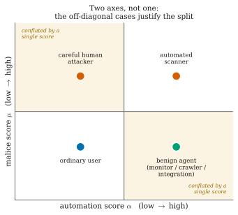

# What is actually new here

Written for the paper. The specification's §4 already states five
contributions; this document sharpens two of them into claims that are
mathematically defensible rather than merely plausible, and adds a third that
strengthens the evaluation. It also states plainly what is *not* new, because
a contributions section that overclaims is the fastest way to lose a reviewer.

> **New to the project?** [OVERVIEW.md](OVERVIEW.md) explains the whole system
> in plain language, with diagrams. This document assumes it and goes straight
> to the arguments.

---

## The short version

| The claim | In one sentence | How strong |
|---|---|---|
| 1 · Bait is **priced**, not guessed | Probing is the cost-optimal action over a band derived from the cost of errors and the measured effectiveness of the probe — a band that does not exist at all under cost accounting alone. | theorem + implementation |
| 2 · The bite weight is **derived** | The evidence value of a bite is a likelihood ratio estimated in a dedicated calibration round, not a constant chosen to make the system work. | measured |
| 3 · Bait is a **randomised treatment** | 10% of sessions that reach the bait band are deliberately not baited, so bait's effect on time-to-decision is a causal estimate rather than a comparison between two different systems. | experimental design |
| 4 · The benign corpus is **built to be hard** | The safety numbers are measured against honest traffic that genuinely looks like an attack, not against traffic that could never have been misclassified. | measured |

If you remember one thing: **without the value-of-information term there is no
third action at all**, so it cannot be a tuned threshold.

---

## Not new (state this early in the paper)

- Using a language model to write realistic fake content. Studied since 2022.
- Machine-learned detection of web attacks. That is a WAF.
- Redirecting a detected attacker into a honeypot.
- Honeytokens: planting a fake credential or file as a tripwire. Widely
  deployed commercially.

The novelty is not any single ingredient. It is the decision rule that
decides *when to deceive*, and the fact that its parameters are derived
rather than chosen.

---

## Contribution 1 — Bait priced as an information purchase

**The claim.** Response-side probing is not a heuristic middle option between
allowing and blocking. It is the action that maximises the expected value of
sample information, and its operating band is a *derived consequence* of the
cost of errors and the measured effectiveness of the probe.

**Why this is stronger than the original framing.** The specification argues
that bait is worth deploying because it is cheap (§6.5): wasted bait costs
"near zero", so the middle band is wide. That argument works, but it hides the
mechanism in two hand-set numbers:

1. the cost of baiting an attacker is "discounted [...] to reflect that
   purchased information" — a discount nobody computed;
2. on a bite the malice score "jumps sharply" (§5.2) — a jump nobody derived.

Both are the same quantity, counted twice and measured never. A reviewer who
reads §6.5's insistence that thresholds are derived rather than tuned will go
looking for exactly these constants.

**What this implementation does instead.** Bait carries its *true* immediate
cost. The request still reaches the real application, so baiting an attacker
costs precisely what passing them costs (25.0 = 25.0 in the frozen table).
Bait therefore has **no immediate benefit at all** — it is strictly more
expensive than passing at every belief, by the residual invisibility risk
borne by the benign probability mass.

Its entire value is informational, and that value is computed:

```text
V(p) = min_a E[C(a) | p]  −  E_Z[ min_a E[C(a) | p after observing Z] ]
```

the expected reduction in optimal cost from observing the bait outcome
Z ∈ {bite, no bite}. The decision rule becomes

```text
effective_cost(pass)   = E[C(pass)   | p]
effective_cost(divert) = E[C(divert) | p]
effective_cost(bait)   = E[C(bait)   | p] − V(p)
```

and the cheapest wins.

**Three properties worth putting in the paper.**

1. **V(p) ≥ 0 always.** `min` over linear functions is concave, so Jensen's
   inequality gives it in two lines. Information never hurts. This is a
   theorem, not an assumption, and it is a much stronger statement than "bait
   is cheap". *(`tests/test_policy.py::test_information_is_never_harmful`)*

2. **V(0) = V(1) = 0.** When you are already certain, no observation can
   change the decision, so probing is worth exactly nothing. The bait band is
   therefore bounded on both sides *by construction* — it cannot swallow the
   whole probability range, and it cannot be widened by tuning.

3. **Without the information term there is no third action at all.** On
   immediate cost alone the policy collapses to an ordinary two-outcome rule,
   PASS below p = 0.816 and DIVERT above it, with no middle band anywhere.
   *(`tests/test_frozen_artefacts.py::test_cost_accounting_alone_does_not_justify_bait`)*

   This is the sharpest available answer to "isn't your third option just a
   tuned threshold?" — without the EVSI term there is no third option to tune.

With the frozen cost table and the **calibrated** bait effectiveness (B-SQL-1,
β_attack = 0.73, β_benign = 0.0038, measured in the calibrate round), the
derived bands are:

```text
PASS    p < 0.047
BAIT    0.047 ≤ p < 0.875
DIVERT  p ≥ 0.875
```

Contrast the single boundary under cost accounting alone — **PASS/DIVERT at
p = 0.816, no middle band** — which is the theorem below.


Nothing in those numbers was chosen. Change the cost of a wrongly diverted
user, or measure a different bite rate, and they move on their own.

**Bonus: bait selection stops being hand-waved.** Spec §6.6 asks for "a bait
appropriate to the suspected attack category" without defining appropriate.
EVSI defines it: deploy the bait with the highest V(p) for this session. And
this is where the two-axis suspicion model finally earns its keep — the
automation score indexes *which* bait's effectiveness applies (a scripted
scanner and a careful human take different bait at different rates), while
malice supplies the belief p. The two scores are doing genuinely different
jobs rather than being decorative.

---

## Contribution 2 — The bite weight is derived, and it has a calibration round

**The claim.** The evidence value of a bite is a likelihood ratio estimated
from data, not a constant chosen to make the system work.

```text
LR(bite)    = P(bite | attacker) / P(bite | benign)
LR(no bite) = P(no bite | attacker) / P(no bite | benign)
```

Reporting the second matters: a system that only ever updates suspicion upward
accumulates without bound and will eventually divert somebody for browsing
slowly. Declining a bait is weak evidence of innocence, and the model says so.

**The problem this exposed in the original plan.** These parameters had **no
legitimate source of data**. Spec §13 runs attack round 1 (Phase 2) *before*
the bait library is built (Phase 4), so the training corpus contains no bait
and therefore no bites. Round 2 is the held-out test set. Estimating bait
effectiveness on either would be indefensible, and there was no third option.

**The fix.** A dedicated `calibrate` round (attack round 1b), run after Phase 4
and frozen before Phase 7, whose *only* permitted use is estimating bait
effectiveness. The round vocabulary is now `dev | train | calibrate | eval`,
each with exactly one permitted use, enforced in the frozen schema.

`P(bite | benign)` is separately measurable, cheaply, on the benign corpus —
and it should come out at essentially zero, because bait is invisible to a
real browser. It is *not* assumed zero: a hard zero makes the likelihood ratio
infinite and would assume away precisely the safety property the project
exists to measure. Jeffreys smoothing with a stated floor is used instead.

---

## Contribution 3 — Bait as a randomised treatment, not a system comparison

**The claim.** The headline result — that provoking reduces the number of
requests needed to reach a confident decision — is established by a randomised
experiment inside one system, not by comparing two different systems.

**Why the original design is weaker.** Spec §10.1 compares the full system
against baseline B2 (passive classifier, no bait). But B2 and B4 differ in
every component, so any difference in time-to-decision is confounded with all
of them. It is a between-systems comparison presented as evidence about one
mechanism.

**What this implementation adds.** A configurable fraction (default 10%) of
sessions that reach the bait band are deliberately **not** baited. They are
recorded as `bait_assignment: holdout` — distinguishable in the log from
sessions that were not baited because the policy chose PASS.

Because assignment is random, conditional on having reached the same belief
state, the treated/untreated difference is an **unbiased causal estimate of
the effect of baiting**, free of the confounding that a system comparison
carries. Assignment is a hash of (seed, session id): deterministic, so runs
replay exactly (NFR-08), and unpredictable to anyone who cannot see the seed.

It costs a little detection performance by design, and that cost must be
reported. In exchange the paper can say *bait caused this*, which almost
nothing in this literature can.

Keep the B2 comparison as well — it answers a different and also useful
question ("is the whole system better?"). The holdout answers the sharper one.

---

## Contribution 4 (supporting) — A benign corpus built to be hard

**The claim.** The safety result is measured against benign traffic that
genuinely approaches the decision boundary, not against traffic that could
never have been misclassified in the first place.

**Why this needs saying.** "Benign bait exposure rate" and "benign diversion
rate" (spec §10.3, NFR-05) are the numbers that carry the safety half of the
paper. Both are trivially zero if the benign corpus consists only of users
who browse gently and never do anything unusual — and a reviewer will ask
exactly that. A near-zero false-positive rate is only interesting in
proportion to how hard the negatives were.

So the corpus deliberately contains benign sessions that look like attacks:

| Class | What it does | Which attack it mimics |
|---|---|---|
| `apostrophe_searcher` | looks up a colleague named *O'Connell* | SQL injection probe — verified to return the identical verbose driver error (`near "Connell": syntax error`, HTTP 500) |
| `forgetful` | fails login 3–5 times, then succeeds | credential attack; the exact trigger condition for B-AUTH-1 |
| `integration` (agent) | walks record ids in ascending order over the API | IDOR sweep — differing only in that every id belongs to it |
| `monitor` (agent) | metronomic polling, no cookies, no assets | scanner — every automation feature in §6.3 fires at once |



The first is the one to put in the paper. A staff member looking up a
colleague in the directory produces a response byte-identical in kind to what
an attacker sees while probing for injection. Any system that separates them
has learned something about *intent and context* rather than about payload
shape — and if the final system cannot separate them, that is a genuine
finding about the limits of response-level detection, reportable under §7.4
rather than quietly excluded from the corpus.

**Important labelling discipline.** These personas are recorded in
`labels.notes`, never in the class labels. An awkward honest user is exactly
as benign as a straightforward one; encoding "this one looked suspicious" into
the label would teach the meter that unusual means hostile, which is the
brittle heuristic the whole project exists to replace. Keeping it in notes
still lets the analysis report *where* the false positives concentrate, which
is more informative than a single aggregate rate.

---

## What to claim, and how strongly

| Claim | Strength | Evidence |
|---|---|---|
| Bait is the EVSI-optimal action in a derived band | **Theorem + implementation** | Jensen; `test_information_is_never_harmful` |
| No tuned constants anywhere in the decision path | **Verifiable** | frozen cost table + calibrated β; both hash-enforced |
| Provoking reduces requests-to-decision | **Randomised experiment** | holdout arm, round 2 |
| Bait is invisible to real users | **Measured, with a stated bound** | invisibility gate + TOST equivalence |
| Low false positives against *hard* negatives | **Measured** | apostrophe/forgetful/integration classes |
| The decoy stays self-consistent | **Measured** | contradiction rate, consistency fuzzer |
| A public labelled dataset | **Artefact** | schema v3, frozen before collection |

Two of these — the EVSI band and the randomised holdout — do not appear in the
deception literature as far as the related-work survey has found. They are
also the two cheapest to defend, because one is a proof and the other is an
experimental design rather than a result that could fail to replicate.

---

## Suggested abstract-level sentence

> Existing web defences wait passively for an attacker to reveal themselves,
> forcing a choice between acting early on weak evidence and acting late on
> strong evidence. We show that this trade-off is avoidable: a defender can
> *manufacture* evidence by planting invisible, inert probes in responses, and
> the decision of when to do so follows from the expected value of the
> information the probe buys. Probing is not a heuristic compromise but the
> cost-optimal action over a band derived from the cost of errors and the
> measured effectiveness of the probe — a band that does not exist at all under
> cost accounting alone. We evaluate with a randomised holdout that identifies
> the causal effect of probing on time-to-decision, and we measure what
> probing costs the users it was never aimed at.
