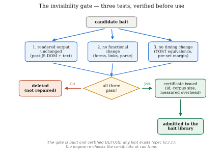
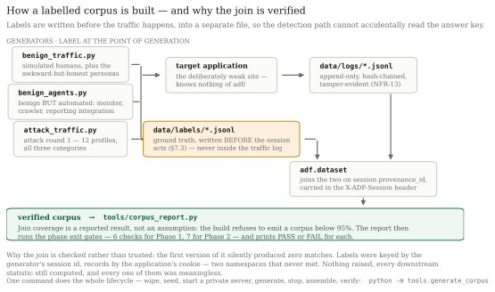

# The project, explained end to end

This is the document to read first, and the one to explain the project from.
It assumes no prior knowledge of the codebase and very little of web security.
Everything here is either plain description or a number you can reproduce with
a command that is given alongside it.

**Where to read what**

| Document | What it is for |
|---|---|
| **OVERVIEW.md** (this file) | The whole project in plain language. Start here. |
| [PROJECT_SPEC.txt](PROJECT_SPEC.txt) | The original specification. The authority on *what* is being built; section numbers like `§6.5` refer into it. |
| [NOVELTY.md](NOVELTY.md) | What is actually new, stated as claims a reviewer can attack. Written for the paper. |
| [SPEC_REVIEW.md](SPEC_REVIEW.md) | Twelve places where the spec was under-determined or wrong, and what was done about each. |
| [DECISIONS.md](DECISIONS.md) | Dated log of every judgement call, with the reasoning. Re-read before each evaluation run. |
| [../SAFETY.md](../SAFETY.md) | The rules for running deliberately vulnerable software. Non-optional. |
| [../README.md](../README.md) | Quick start and repository map. |

---

## 1. The project in one paragraph

A website is fitted with a security layer that, when it is unsure whether a
visitor is an attacker, **adds a small piece of fake information to the
response** — a database error naming a table that does not exist, an unused
field in a JSON reply, a hint at an old login page. A real browser never shows
any of it to a real person, so an honest visitor notices nothing. Someone
probing the site reads the raw response, sees what looks like a slip-up, and
acts on it — and the moment they do, they have identified themselves. They are
then not blocked but silently moved into a **convincing fake copy of the site**
where everything they do is recorded and nothing they touch is real. The
research question is whether this is safe: whether provoking gets to a
confident decision faster than waiting, and what it costs the users it was
never aimed at.

The one-sentence claim:

> Existing systems wait until they are sure before deceiving. This system
> deceives a little in order to become sure — and measures the cost of doing so
> to real users.

---

## 2. The problem being solved

There are three common ways a website defends itself, and all three share one
weakness.

| Defence | How it works | Weakness |
|---|---|---|
| Firewall / rule filter | Blocks anything matching a known bad pattern | Bypassed by changing the pattern slightly; tells the attacker instantly that they were caught |
| ML classifier (a WAF) | Predicts from traffic whether a request is malicious | Needs a lot of evidence before it is confident; false alarms on unusual-but-honest users |
| Honeypot | A fake system left exposed to attract attackers | Sits *beside* the real site, so it only catches whoever wanders in |

The shared weakness is that **all three are passive**. They wait for the
attacker to produce evidence, and until it arrives they can only guess. That
forces an unpleasant choice:

- act **early**, on weak evidence → innocent users get punished;
- act **late**, on strong evidence → a careful attacker gets a long head start.

Every threshold anybody tunes in such a system is a choice about which of those
two failures they prefer.

**The insight of this project:** that trade-off only exists because the
defender treats evidence as something that arrives on its own. It does not have
to. Evidence can be *manufactured* — cheaply, safely, and invisibly.

---

## 3. The idea, in one picture

### The guard and the dropped keycard

A security guard in a shopping mall wants to spot shoplifters. All he can do is
watch and guess, which is hard: honest shoppers behave oddly all the time, and
a careful thief behaves perfectly normally.

So he changes tactics. When he is unsure about someone, he "accidentally" drops
a keycard near them, labelled **Staff Only — Stockroom**.

- An honest shopper walks straight past. They never even registered it.
- A thief picks it up.

The guard now knows — after one action instead of twenty minutes of watching.
He did not wait for evidence; he *created* it. And the honest shopper was never
inconvenienced. They do not even know the test happened.

### The same thing on a website

The dropped keycard becomes a small piece of information added to the response
that a real browser never displays but anyone reading raw traffic sees at once:

| Situation | What gets added | What a real user sees | What counts as a bite |
|---|---|---|---|
| A visitor sends a malformed value to the search box | A chatty fake database error naming a table `acct_shadow_v2` that does not exist | The normal "something went wrong" page | A later request querying that table name |
| A visitor is stepping through profile IDs one by one | An unused extra field `ref_uid` in the JSON reply | Nothing — no button on the site produces that field | A request that submits `ref_uid` |
| A visitor has failed to log in six times | The failure message hints at an old endpoint `/auth/legacy/verify` | The normal failure message; they click "forgot password" | Any request to that path |

In all three cases the rendered page is identical, nothing breaks, and there is
no extra delay. But if a later request mentions `acct_shadow_v2`, the system has
**proof** rather than a suspicion.

### After the bite

The attacker is not blocked and sees no error. Their session is silently
switched to a **decoy** — a fake copy of the site with no real data — and every
action from then on is recorded. Because they were never blocked, they never
learn they were caught, and the defender learns far more than a block page
would ever reveal.

This creates a second problem, and the second contribution of the project.
Fake environments that generate answers on the fly **forget what they said**.
Ask the same question twice, get two different answers — and that is exactly
how an experienced attacker realises they are in a trap. The fix here is the
**Fact Notebook**: every fake user, file, and table the decoy has ever
mentioned is written down, and when the same thing is asked about again the
answer is read from the notebook rather than invented afresh. The fake world
therefore cannot contradict itself.

---

## 4. Objectives

### 4.1 Research questions (spec §2.3)

1. **Can a defender deliberately provoke a response that separates attackers
   from normal users, with no observable effect on normal users?**
   → answered by the invisibility gate (§6.6 below) plus the benign bait
   exposure measurement.
2. **Does provoking reduce the number of requests needed to reach a confident
   decision, compared with passively waiting?**
   → answered by requests-to-decision, measured with a randomised holdout.
3. **Can a generated fake environment stay internally consistent enough that
   an attacker probing it does not detect the deception?**
   → answered by the contradiction rate produced by the consistency fuzzer.
4. **What does the whole approach cost, once the price of each kind of mistake
   is accounted for?**
   → answered by expected cost per session, compared across all baselines.

### 4.2 The five claimed contributions (spec §4.3)

1. **Bait as a third decision option** — provoking to resolve uncertainty
   instead of waiting to resolve it.
2. **A two-axis suspicion model** separating *automation* from *hostility*, so
   bait can be matched to the attacker type.
3. **Cost-weighted thresholds derived** from the stated price of each error,
   reported as expected cost per session.
4. **A decoy with a persistent consistency layer**, plus a measurable
   contradiction rate — a metric this literature does not currently report.
5. **A public labelled dataset** of attack traffic, benign traffic, and bait
   interactions.

Contributions 1 and 4 are load-bearing. If the others underdeliver, the paper
still stands.

### 4.3 What would count as success — and what counts as failure

Success is **not** "high accuracy". It is:

- benign diversion rate ≈ 0 (NFR-05), measured against benign traffic that
  genuinely looks suspicious;
- bait provably invisible (rendered output, functionality, timing);
- fewer requests to a confident decision *with* bait than without, measured
  causally;
- a decoy that survives repeated probing with a low, reported contradiction
  rate;
- lower expected cost per session than the passive baseline B2.

And a negative result is a legitimate outcome, reported as the finding
(spec §7.4). If bait does not reduce time-to-decision, or if honest users trip
over bait more often than predicted, **that is the paper**. Adjusting the
experiment until the desired number appears is not.

---

## 5. How the system works

### 5.1 The seven components

| # | Component | What it does | Machine learning? | Where |
|---|---|---|---|---|
| 1 | **Target application** | A deliberately weak website: login, OTP step, search, pages addressed by ID. This is what gets attacked. | No | [target_app/](../target_app/) ✅ |
| 2 | **Reverse proxy** | Sits in front of everything. Every request passes through it first. | No | [adf/proxy/](../adf/proxy/) ✅ |
| 3 | **Feature extractor** | Turns each raw request into a row of numbers. | No | [adf/features/](../adf/features/) ✅ |
| 4 | **Dual suspicion meter** | Keeps two running scores per session: automation and malice. | **Yes** | [adf/meter/](../adf/meter/) ✅ |
| 5 | **Decision policy** | Uses the two scores plus the cost table to pick pass / bait / divert. | No | [adf/policy/](../adf/policy/) ✅ |
| 6 | **Bait engine** | Selects and injects bait, then watches for a bite. | No | [adf/bait/](../adf/bait/) ✅ |
| 7 | **Decoy environment** | The fake site, backed by the Fact Notebook and a planted credential. | Offline only | `adf/decoy/`, `decoy_app/` ✅ |

That "machine learning?" column is worth stating out loud because it resets
expectations: **the only genuinely learned component is the suspicion meter.**
Everything else is ordinary engineering. The decoy's fake world is generated
*offline*, before the system runs — never in the request path, because a slow
decoy is a detectable decoy. The specification envisages a batched language
model for that offline step (§6.8, §12); the implementation here uses a
**deterministic synthetic generator** instead (`adf/decoy/world.py`), which is
seeded and reproducible. Either works: the contribution is the offline
generation plus the persistent consistency layer, not the generator itself, so
an LLM could be dropped into `world.GENERATORS` without changing anything else.

### 5.2 The life of a single request


Two details that matter:

- **BAIT is not a block.** The request still reaches the real application and
  is served normally; the bait is added to the response on the way back. That
  is why baiting an attacker costs *exactly* what letting them through costs
  (see §6.5) — the only thing bait buys is information.
- **A bite is a later request.** Injecting bait proves nothing. The evidence
  arrives when a *subsequent* request touches the fake table, field, or
  endpoint. That request raises the malice score sharply, which usually pushes
  the session straight past the divert threshold.

Put together, one session looks like this:


### 5.3 Why a proxy design

Placing everything behind a reverse proxy has three consequences worth stating:

1. **The real application never knows the security layer exists.** It can be
   swapped out or rewritten without touching detection code (NFR-10). You could
   delete the whole `adf/` package and the site would still serve traffic.
2. **Baseline comparison becomes one config flag.** Turning bait off converts
   the system into an ordinary passive classifier — which is exactly baseline
   B2, the thing this research must beat. Same code, `mode:` in
   [config/system.yaml](../config/system.yaml).
3. **It is a single point of failure**, which is why it must **fail open**: if
   any part of the detection stack crashes, the request goes to the real
   application rather than being dropped (NFR-04). The security layer must
   never be able to take the site down.

---

## 6. Component by component

### 6.1 The target application — [target_app/](../target_app/) ✅ built

A small but realistic app. Realism matters more than size: if the real app is
obviously a toy, the fake copy of it will be obviously a toy too.

Each weakness is deliberate, and each one hosts exactly one attack category:

| Feature | Weakness left in on purpose | Attack category |
|---|---|---|
| `POST /login` | no rate limiting, no lockout, verbose failure messages | credential attack |
| `POST /otp` | codes predictable from user id + date, no attempt cap, reusable | OTP bypass |
| `GET /search` | user input concatenated straight into SQL, raw driver errors returned | SQL injection |
| `GET /profile/{id}`, `GET /records/{id}` (+ JSON twins) | sequential numeric IDs, no ownership check | IDOR |
| Static assets (CSS, images) | none — they exist purely so that bot traffic *looks different* from human traffic | supports automation detection |

That last row is easy to overlook and important. A real browser fetches the
CSS, images and fonts; a scripted attack tool usually does not. That difference
alone is one of the strongest automation signals available — and it only exists
if the site has assets worth fetching.

The injection surface is confined to a single `query_raw()` call site, and a
test enforces that it stays that way. A second injection point would widen the
threat model and make the attack-category labels wrong.

### 6.2 The reverse proxy — [adf/proxy/](../adf/proxy/) ✅ built

The one component that sees the whole pipeline. It identifies the session, runs
the extractor → meter → policy chain, forwards to the target, and writes the
full record. In `b2_passive` mode that is the entire behaviour — and that
configuration *is* baseline B2.

Three properties it is built around:

- **Fail open (NFR-04).** If any detection component raises, the request is
  still forwarded to the real application rather than dropped. The security
  layer must never be able to take the site down.
- **The target app stays ignorant (NFR-10).** Delete the whole `adf/` package
  and the site still serves traffic.
- **Bait injection and decoy routing are explicit empty hooks**
  (`_maybe_inject_bait`, `_route_upstream`), so Phases 4 and 5 extend this file
  rather than rewrite it.

Per-session state — the streaming extractor and the running scores — lives in
memory in the proxy, so it runs unreplicated: a single worker is what keeps
that state coherent and the corpus reproducible.

Sessions are keyed on a cookie the proxy mints on first contact. The
coarse-fingerprint fallback (IP + User-Agent) exists for the specific case of a
cookie-refusing tool trying to reset its accumulated score, but it defaults
**off**, because a coarse fingerprint cannot separate distinct clients that
share it — and merging distinct clients would corrupt every per-session metric
(see [DECISIONS.md](DECISIONS.md), 2026-08-14).

### 6.3 The feature extractor — [adf/features/extractor.py](../adf/features/extractor.py) ✅ built

Turns a request into numbers. The features are **deliberately split into two
groups**, because the two scores need different evidence.

**Automation features — is this a script or a person?** (10)

| Feature | Intuition |
|---|---|
| `auto_interarrival_last` | seconds since the previous request |
| `auto_interarrival_cv` | how *regular* the gaps are — humans are irregular, scripts are metronomic |
| `auto_requests_per_min` | rolling rate |
| `auto_asset_fetch_ratio` | static assets fetched per page — the strongest single signal |
| `auto_fetched_assets` | has this session ever fetched an asset at all |
| `auto_browser_header_ratio` | fraction of the headers a real browser always sends |
| `auto_header_count` | how many headers arrived |
| `auto_ua_is_tool` | the User-Agent does not present as a browser |
| `auto_ua_stable` | the User-Agent has not changed mid-session |
| `auto_cookie_carried` | cookies carried consistently |

**Malice features — is this hostile?** (8, feature set v4)

| Feature | Intuition |
|---|---|
| `mal_input_length` | length of client-controlled input on the injection surface |
| `mal_special_char_ratio` | density of `' " ( ) ; = --` etc. in that input |
| `mal_db_keyword_hits` | SQL-**syntax** patterns on this request (`UNION SELECT`, `… FROM …`, tautologies, comment terminators — not bare English) |
| `mal_db_keyword_any` | has any such pattern appeared this session (latches) |
| `mal_failed_auth` | failed authentication attempts so far this session |
| `mal_error_ratio` | 4xx/5xx over all responses so far, **excluding login rejections** (v4) |
| `mal_param_mutation` | a parameter value changed on an otherwise identical request |
| `mal_distinct_usernames` | how many **distinct accounts** this session has tried to log in as (v4) — a forgetful user retries one, a sprayer walks many |

> **Two features were removed in v3.** `mal_seq_id_run` (ascending-id run) and
> `mal_touched_sensitive` (any `/api|/auth|/admin` access) diverted **100% of
> benign JSON-API integration clients** — a legitimate integration walks ids in
> order exactly like an IDOR sweep. No passive feature honestly separates them,
> so IDOR detection is delegated to `mal_error_ratio` (API sweeps hit many 404s)
> and to **bait** (UI sweeps). This audit is the central story of Phase 7 —
> [RESULTS.md](RESULTS.md).

"Client-controlled input" is scoped deliberately: query-parameter values, plus
the body of **non-authentication** requests. The URL path is excluded, so
visiting `/records/5` does not read as special-character-laden — IDOR is not a
lexical signal at all. Login and OTP bodies are excluded too, because a password
is legitimately long and symbol-dense; that exclusion was added after a real
false positive (see §6.4). Query parameters on an auth path are still measured,
so `/login?x=' UNION` is not a blind spot.

Three properties of this module that are deliberate:

- **It is session-streaming, not per-request.** Scores accumulate across a
  session, so features are computed from *everything seen so far*, not from one
  request in isolation. `SessionFeatureExtractor.observe(record)` is fed
  requests in order and returns the vector reflecting the session up to and
  including that request.
- **It is the single source of truth.** The corpus diagnostic imports the same
  primitives, so the numbers used to justify a phase and the numbers the meter
  trains on cannot drift apart.
- **It structurally cannot read the answer key.** No feature may read
  `session.provenance_id` or anything in `adf.schema.NEVER_FEATURE_FIELDS` —
  those carry the ground-truth join key — and a test enforces it.

### 6.4 The dual suspicion meter — [adf/meter/meter.py](../adf/meter/meter.py) ✅ built and trained (this is baseline B2)

Two scores per session, both in [0, 1], both starting low:

- **automation** — is this a script?
- **malice** — is this hostile?

**Why two and not one.** A single score cannot express the three situations the
project has to handle:

| Visitor | Automation | Malice |
|---|---|---|
| Vulnerability scanner | high | high |
| Price-comparison bot | high | **none** |
| Careful human attacker | **low** | high |

One combined number collapses cases 2 and 3 into "medium suspicion", which is
precisely the wrong answer for both. Two numbers keep them apart. This is why
the benign corpus deliberately contains automated-but-harmless traffic — without
it, automation and malice would be perfectly correlated in the data, a single
score would perform identically, and the second axis would be indefensible.


**How it works.** Each axis is a logistic regression over its own feature
partition: `score = sigmoid(bias + Σ wᵢxᵢ)`. Two commitments the paper has to
defend, both honoured by that choice:

- **Explainable (NFR-07).** Every decision can be traced to the exact features
  that produced it — each `wᵢxᵢ` is that feature's signed contribution in
  log-odds, and `explain()` returns them sorted. A neural network cannot offer
  this, and in a viva that matters.
- **Works on small data.** A single-person campaign yields thousands of
  requests, not millions. Logistic regression is the right tool at that scale;
  a deep model would overfit and could not be defended.

**Where accumulation lives.** Not in a hand-tuned decay constant — in the
*features*, which are already session-cumulative (failed-auth count, longest
ID run, keyword latch, rolling rate). So a series of individually unremarkable
requests can still add up to a confident conclusion, without any magic number.

The two heads are fit **only** on round-1 `train` data and frozen before
evaluation. `tools/train_meter.py` enforces that: it keeps only `train`-round
records, replays each session through the streaming extractor so the vectors
are exactly what the live proxy would see, fits both heads, prints the
interpretable weights, and saves the model to `data/models/meter.json`.

The train-set separation it prints is a **sanity check, not a result**. Real
precision and recall come from the held-out `eval` round in Phase 7, against a
model frozen before it ever sees that traffic.

**What the first end-to-end run caught.** Running the trained meter behind the
proxy on live traffic diverted a *benign* login — an ordinary sign-in whose
password was long and symbol-dense, which the malice head had learned to read
as an injection payload. The login form is not even the injection surface (it
uses parameterised queries; only `/search` concatenates), and the real
credential-attack signal is the failed-auth count, not input content. The fix
excludes authentication bodies from the content features while still inspecting
query parameters on those paths. After retraining: **0 of 308 benign requests
diverted across 12 sessions, and 6 of 6 attack sessions still diverted**, most
within 1–6 requests. Two regression tests lock it.

That failure is worth reporting rather than hiding: it is a concrete instance
of the project's own thesis about false positives, and it was caught by the
safety instrument — a benign corpus containing a realistic login — rather than
shipped into the evaluation.

### 6.5 The decision policy — [adf/policy/](../adf/policy/) ✅ built

This is where the project's sharpest claim lives, so it is worth going slowly.

#### Step 1: state the cost of each mistake, then freeze it

[config/costs.yaml](../config/costs.yaml), frozen and hash-enforced:

| | PASS | BAIT | DIVERT |
|---|---|---|---|
| **benign visitor** | 0 | 1 | **200** |
| **attacker** | 25 | 25 | **−20** |

Read across: wrongly diverting a real user costs 8× a missed attacker (it is
the outcome that must almost never happen, NFR-05). Wasted bait costs ~4% of a
missed attacker — not zero, so the policy cannot treat baiting as free.
Diverting an attacker has *negative* cost: it is the win.

The table is hashed and the system refuses to start if the numbers move,
because the thresholds are **derived** from them rather than tuned. Editing
them after seeing results would invalidate every comparison. Re-freezing is
possible but deliberate, and leaves a dated entry in
[config/costs.CHANGELOG.md](../config/costs.CHANGELOG.md).

#### Step 2: notice that cost accounting alone kills the third action

Since baiting still lets the request through, **baiting an attacker costs
exactly what passing them costs** (25 = 25), plus a small residual risk to
benign users. So on immediate cost alone, bait is *never* the cheapest action —
the policy collapses to an ordinary two-outcome rule with a single boundary at
p = 0.816 and **no middle band anywhere**.

This is not a problem. It is the strongest available answer to *"isn't your
third option just a tuned threshold?"* — without the next step, there is no
third option to tune.

#### Step 3: price the information the bait buys

The value of a probe is the expected reduction in optimal cost from observing
its outcome Z ∈ {bite, no bite} — the *expected value of sample information*:

```text
V(p) = min_a E[C(a) | p]  −  E_Z[ min_a E[C(a) | p after observing Z] ]

effective_cost(pass)   = E[C(pass)   | p]
effective_cost(divert) = E[C(divert) | p]
effective_cost(bait)   = E[C(bait)   | p] − V(p)      ← cheapest action wins
```

Three properties worth putting in the paper:

1. **V(p) ≥ 0 always.** A `min` over linear functions is concave, so Jensen's
   inequality gives it in two lines. Information never hurts. This is a standard
   lemma (the underlying object, EVSI, is textbook — Howard 1966); we claim the
   *application*, not the mathematics, and we enforce it as an invariant.
2. **V(0) = V(1) = 0.** When you are already certain, no observation can change
   the decision, so probing is worth exactly nothing. The bait band is
   therefore **bounded on both sides by construction** — it cannot swallow the
   whole probability range and cannot be widened by tuning.
3. **Without V(p) there is no third action at all** (step 2 above).


**Figure.** Expected cost of each action vs. $p$, from the frozen cost table and
calibrated bait library. Effective bait (immediate cost minus $V(p)$) is cheapest
only inside the derived band $[0.0647, 0.8793]$. Reproduce with `python -m adf.policy`.

#### Step 4: the bands fall out

With the frozen cost table and the **calibrated** bait effectiveness —
run `python -m adf.policy` to reproduce:

```text
PASS    p < 0.0647
BAIT    0.0647 ≤ p < 0.8793
DIVERT  p ≥ 0.8793
```


**Figure.** The derived decision bands: three actions with the value-of-information
term (top), versus a single boundary at 0.816 under cost accounting alone (bottom).

Nothing in those numbers was chosen. Change the cost of a wrongly diverted
user, or measure a different bite rate, and they move on their own.

#### Two supporting pieces

- **Score fusion.** The cost matrix is indexed by *true class*, so something
  must map two scores to one hostility probability:
  `p = sigmoid(bias + w_m·logit(malice) + w_a·logit(automation))` with
  `w_m = 1, w_a = 0` — i.e. p = malice. Automation deliberately does not raise
  hostility on its own (a price-comparison bot is fully automated and entirely
  harmless); it is spent on **bait selection** instead. Keeping this mapping
  explicit and configurable keeps the gap visible instead of burying an
  arbitrary combination inside the policy.
- **The randomised holdout.** A configurable fraction of sessions that reach the
  BAIT band (10% by default, raised to 25% in the Phase 7 evaluation for a larger
  holdout arm) are deliberately *not* baited, and recorded as
  `bait_assignment: holdout` —
  distinguishable in the log from sessions that were not baited because the
  policy chose PASS. Because assignment is random conditional on reaching the
  same belief state, the treated/untreated difference is an **unbiased causal
  estimate of the effect of baiting**, rather than a confounded comparison
  between two different systems. Assignment hashes (seed, session id): runs
  replay exactly, but an attacker who cannot see the seed cannot predict it.
  It costs a little detection performance by design, and that cost is reported.

### 6.6 The bait library and the invisibility gate — [adf/bait/](../adf/bait/) ✅

Six baits are catalogued in [config/bait_library.yaml](../config/bait_library.yaml),
two per attack category:

| ID | Fires when | What is injected | Bite signal |
|---|---|---|---|
| B-SQL-1 | a quote or comment character appears in a parameter | verbose fake DB error naming `acct_shadow_v2` | a later request referencing that table |
| B-SQL-2 | repeated malformed parameters | a fake column list inside an HTML comment | a query using any of those column names |
| B-IDOR-1 | sequential ID access detected | unused `ref_uid` field in the JSON reply | a request submitting `ref_uid` |
| B-IDOR-2 | object-reference tampering detected | a fake `internal_view` parameter in an HTML comment | a request carrying `internal_view` |
| B-AUTH-1 | several failed logins | failure message hints at `/auth/legacy/verify` | any request to that path |
| B-AUTH-2 | repeated OTP failures | inert `mfa_debug_token` in the OTP failure response | a request submitting that token |

Every bait must obey four rules: **plausible** (a bait that looks planted warns
the attacker that the site is defended), **inert** (following it must never
grant real access), **unique per session** (one fixed fake table name would be
published online and the bait would die permanently), and **invisible**.

**The invisibility gate is the single most important safety mechanism in the
project** — it is what decides whether the whole idea is viable, and it is
built *before* any bait. Every candidate bait must pass an automated test on
three counts:

1. **Rendered output unchanged** — the post-JavaScript DOM and visible text a
   real browser displays are indistinguishable from the no-bait page.
2. **No functional change** — every form still submits, every link still works,
   every API response still parses.
3. **No timing change** — added latency is statistically *equivalent*, tested
   with TOST against a pre-registered margin (not a t-test with p > 0.05,
   which proves nothing).

A bait that fails any of the three is **deleted, not repaired**. A bait that
leaks into normal user experience does not merely weaken the results — it
invalidates the central claim that provoking is safe.

A pass produces a **certificate** — id, timestamp, corpus size, measured
overhead — and the bait engine checks it at run time before serving anything.
That enforces "verified before use" in the running system rather than trusting
the build process to have done it.



One honest caveat that belongs in the paper's limitations: the raw response
bytes *must* differ — that is the mechanism. Invisibility is a claim about the
rendered page, the functionality and the timing, and the JSON-field bait is
invisible to *the application's own client*, not to an arbitrary parser.

**Bait effectiveness is calibrated, not assumed.** The `beta_attack` /
`beta_benign` bite rates are **measured** in a dedicated `calibrate` round (attack
round 1b) and written to `data/bait_library.json` marked `calibrated: true`; the
policy refuses to produce reportable results from uncalibrated priors. That round
exists because the spec's own phase order left the library uncalibratable in
place — round 1 predates the bait library, and round 2 is the test set (see
[SPEC_REVIEW.md](SPEC_REVIEW.md) finding 1). Worked example: the UI-IDOR bait
calibrates to β_attack = 0.59, β_benign = 0.0037 over n = 244.

The weight a bite carries is likewise derived rather than chosen — it is a
likelihood ratio:

```text
LR(bite)    = P(bite | attacker) / P(bite | benign)
LR(no bite) = P(no bite | attacker) / P(no bite | benign)
```

Reporting the second matters: a system that only ever updates suspicion upward
accumulates without bound and will eventually divert somebody for browsing
slowly. Declining a bait is weak evidence of innocence, and the model says so.
`P(bite | benign)` is measured, not assumed zero — a hard zero makes the ratio
infinite and would assume away exactly the safety property being measured — so
a stated smoothing floor (0.0005) is used.

### 6.7 The decoy, the Fact Notebook, the planted credential — `adf/decoy/`, `decoy_app/` ✅

The decoy is a parallel copy of the application with no real data: same layout,
same error messages, same timings, same headers.

It is **populated in advance, not on demand**. An offline generator produces the
fake world — user records, filenames, schema, config files, log entries — and
all of it is written into the Fact Notebook before the system ever runs. The
specification envisages a batched language model here (§6.8, §12); the
implementation uses a **deterministic synthetic generator** instead
(`adf/decoy/world.py`), which is seeded and reproducible and keyed per entity,
so an on-demand fact is byte-identical to a batch-generated one. Either works —
the contribution is generator-agnostic. This solves three problems at once: no
generation sits in the request path (a slow decoy is a detectable decoy),
content cannot vary between requests, and everything can be reviewed before use.

**The Fact Notebook** guarantees the decoy never contradicts itself. Every fact
it has ever stated is recorded; when the same fact is asked for again — through
a different route, phrasing, or endpoint — the answer is read back rather than
regenerated. Consistency must hold in four ways:

| Dimension | Test |
|---|---|
| Repetition | ask the same thing twice → same answer |
| Cross-reference | a user named in one place exists with the same details everywhere else |
| Write-then-read | if the attacker modifies something, reading it back returns what they wrote |
| Referential integrity | an ID mentioned in one record resolves to a matching record |

A **consistency fuzzer** interrogates the decoy for the same information
through several routes and counts disagreements. The resulting **contradiction
rate** is a reportable metric that, as far as the related-work survey found, no
existing work measures.

**The planted credential** is a fake API key sitting in a config file where a
determined attacker would eventually find it. It grants nothing. Its only
function is that the system watches for it — and if it ever appears in a later
request, three things are proven at once: the attacker explored the decoy
deeply, harvested credentials, and tried to use them. That upgrades the logs
from *what the attacker clicked* to *what the attacker intended*.

### 6.8 Logging, schema and dataset — [adf/schema.py](../adf/schema.py), [adf/logstore.py](../adf/logstore.py), [adf/dataset.py](../adf/dataset.py) ✅ built

Every record is append-only, timestamped, and **hash-chained** — each entry
carries the digest of the previous one, so any edit to history is detectable
(NFR-13). Verify a log with:

```bash
python -m adf.logstore data/logs/target-access.<stamp>.jsonl
```

A record captures the session, the full request, the extracted features, both
scores before and after, the action chosen, **the reason it was chosen**, which
bait was injected, whether a bite occurred, and the response served. The reason
field matters more than it looks: being able to explain, months later, why a
specific request was diverted is what makes the evaluation credible rather than
anecdotal.

The schema is **frozen and fingerprinted** (v3, 68 fields). Spec §11: changing
the label format after collection begins means either re-running every
experiment or abandoning the dataset release, so a test fails if the shape
drifts.

---

## 7. Where the data comes from



### 7.1 Labels are written before the traffic happens

Ground truth is written to a sidecar file (`data/labels/*.jsonl`) keyed by
session, **before** the session acts — never inferred afterwards by looking at
what the traffic did (spec §7.3). Keeping labels physically out of the traffic
log means the detection path *cannot* accidentally read the answer key, which
is a stronger guarantee than remembering not to.

The join between labels and traffic happens in [adf/dataset.py](../adf/dataset.py)
and is **verified**, not assumed: it reports coverage as a first-class result
and refuses to emit a corpus below 95%. This is not paranoia — the first
version of this join silently produced **zero matches** (labels keyed by the
generator's session id, records by the app's cookie: two namespaces that never
met). Everything downstream still computed, and every number was meaningless.
The fix is `session.provenance_id`, a generator-issued marker carried in the
`X-ADF-Session` header and held deliberately *outside* `request.headers`, so no
feature vector can reach it.

### 7.2 Four kinds of traffic, filling a 2×2 grid

|  | **human** | **scripted** |
|---|---|---|
| **benign** | `benign_traffic.py` — logs in, browses, waits, mistypes | `benign_agents.py` — uptime monitor, crawler, reporting integration |
| **attack** | `attack_traffic.py` manual profiles — browser UA, fetches assets, slow and irregular | `attack_traffic.py` scripted profiles — fast, metronomic, tool UA |

All four cells must be populated, and this is checked as an exit condition. If
only benign/human and attack/scripted existed, automation and malice would be
perfectly correlated, a single combined score would do just as well, and the
two-axis contribution would be unfalsifiable.

**The benign corpus is deliberately built to be hard.** "Benign bait exposure
rate" and "benign diversion rate" are the numbers carrying the safety half of
the paper — and both are trivially zero if the benign corpus only contains
users who never do anything unusual. That zero would describe the corpus, not
the system. So it contains honest sessions that look like attacks:

| Class | What it does | Which attack it mimics |
|---|---|---|
| `apostrophe_searcher` | looks up a colleague named *O'Connell* | SQL injection probe — verified to return the **identical** verbose error (`near "Connell": syntax error`, HTTP 500) an attacker sees |
| `forgetful` | fails login 3–5 times, then succeeds | credential attack; the exact trigger for B-AUTH-1 |
| `integration` (agent) | walks record IDs in ascending order over the API | IDOR sweep — differing only in that every ID belongs to it |
| `monitor` (agent) | metronomic polling, no cookies, no assets | scanner — every automation feature fires at once |

Crucially, these personas live in `labels.notes`, **never in the class labels**.
An awkward honest user is exactly as benign as a straightforward one; encoding
"this one looked suspicious" into the label would teach the meter that *unusual*
means *hostile* — the brittle heuristic this project exists to replace. The
analysis can still break them out to see where false positives concentrate.

The attack generator provides 12 profiles across the three categories:
`sqli_error`, `sqli_boolean`, `sqli_union`, `idor_sequential`, `idor_tamper`,
`cred_stuffing`, `bruteforce`, `otp_bypass`, `otp_reuse`, plus manual
`manual_sqli`, `manual_idor`, `manual_recon`. The manual ones are the hard
case: a careful human attacker who is barely distinguishable on the automation
axis and entirely hostile on the malice axis.

### 7.3 The methodological rule everything depends on

**Attack data is generated twice, in rounds that are never mixed** (spec §7.2).

| | Round 1 (`train`) | Calibration (`calibrate`) | Round 2 (`eval`) |
|---|---|---|---|
| Purpose | train the meter | estimate bait effectiveness | test the finished system |
| When | before detection logic exists | after Phase 4, before Phase 7 | after everything is frozen |
| Technique | straightforward, documented attacks | short campaign with bait live | deliberately varied — different tools, encodings, pacing |
| Used for | model fitting only | β and the bite likelihood ratio only | reported results only |

If the same data were used for training and testing, the evaluation would be
meaningless and any reviewer would spot it immediately. The generator enforces
this at the CLI: `tools/attack_traffic.py` accepts `dev | train | calibrate`
and **refuses `eval`**, so a rerun of the straightforward corpus cannot
accidentally become the test set.

The `calibrate` round is an addition to the original spec, which had no
legitimate source of data for bait effectiveness at all — round 1 predates the
bait library and round 2 is the test set.

### 7.4 One command, one clean corpus

Running generators by hand against a long-lived server is how a corpus gets
contaminated: any stray request — a health check, a manual `curl`, a debugging
poke — lands in the same append-only log with no label. `tools/generate_corpus.py`
removes that failure mode by owning the whole lifecycle:

```text
wipe logs+labels → seed a fresh DB → start a private server
  → run every generator → stop the server → assemble and verify
```

so the only traffic in the log is what the generators put there, and nothing
can append afterwards. Everything runs from a fixed seed (NFR-08).

---

## 8. How the project proves it works

### 8.1 Baselines (spec §10.1)

Each is progressively stronger, so the contribution of each piece is isolated.
All of them are the same code, selected by `mode:` in `config/system.yaml`.

| Label | Configuration | What it establishes |
|---|---|---|
| B0 | no defence at all | the ceiling on attacker success |
| B1 | rule-based filter, standard ruleset | what an off-the-shelf defence achieves |
| **B2** | **passive ML classifier, no bait, no decoy** | **the honest baseline this research must beat** |
| B3 | passive classifier + static decoy | the current published state of the art |
| B4 | full system: bait, dual meter, cost policy, consistent decoy | the proposed contribution |

B2 is the original passive design, so no earlier work is wasted — it becomes
the control group.

### 8.2 Ablations (spec §10.2)

Each removes exactly one component:

1. **without bait** — how much the bait mechanism itself contributes;
2. **one combined score instead of two** — the value of separating automation
   from malice;
3. **fixed thresholds instead of cost-derived ones** — the value of the cost
   model;
4. **Fact Notebook disabled** — how quickly consistency failures betray the
   decoy.

### 8.3 Metrics (spec §10.3)

| Category | Metric | Why it matters |
|---|---|---|
| Detection | precision / recall / F1 per category | comparability with existing literature |
| **Efficiency** | **requests-to-decision (median, p90)** | **the primary claim: bait should decide faster** |
| **Safety** | **benign bait exposure rate** | how often a normal user ever received bait |
| Safety | benign diversion rate | how often a normal user was wrongly trapped — target zero |
| Cost | expected cost per session | the practical bottom line, comparable across baselines |
| Deception | contradiction rate | how often the decoy contradicted itself |
| Deception | engagement depth | how many actions and techniques the decoy elicited |
| Deception | time to suspicion | how long before the attacker suspected deception |
| Intelligence | planted credential capture rate | evidence of intent, not just of clicks |
| Performance | added latency (median, p95) | confirms the system is deployable |

The two that carry the paper are **requests-to-decision** and **benign bait
exposure rate**. Together they say the whole thing: *the system decides faster,
and it costs innocent users nothing to do so.*

Two honest measurement notes:

- **Requests-to-decision needs a censoring rule.** It is undefined for sessions
  that never decide, and taking a median over only the sessions that *did*
  decide systematically flatters whichever system decides less often — the
  opposite of the intended comparison. Fix the rule (survival curve, or a
  stated cap with the decision rate reported alongside) *before* Phase 7.
- **Benign bait exposure will not be small, and that is correct.** With the
  frozen cost table, BAIT is optimal from p ≥ 0.0647, so a non-trivial fraction
  of benign sessions will receive bait (measured: 90% over 99 paired seeds, with **zero**
  benign bites). Frame it as *"exposure is common and provably harmless"* — the
  invisibility gate is what makes the safety claim, not a low exposure rate.
- **Time to suspicion is a structured self-assessment**, not a population
  estimate. Working alone, the honest method is a fixed checklist of deception
  indicators written down *before* attacking, recording the request number at
  which each was first noticed. It produces an ordered list of which weaknesses
  betray a decoy first — useful — and the sample size is stated plainly rather
  than left for a reviewer to discover.

---

## 9. The rules that must not be broken

These are enforced by tests rather than trusted to discipline
([tests/test_frozen_artefacts.py](../tests/test_frozen_artefacts.py)).

1. **The cost table is frozen and hashed.** The system refuses to start if the
   numbers move. Thresholds are derived from them, so editing them after seeing
   results invalidates every baseline comparison. Re-freezing leaves a dated
   entry in the changelog.
2. **The record schema is frozen and fingerprinted.** Fixing the label format
   after collection begins means re-running everything or abandoning the
   dataset release.
3. **The rounds are never mixed.** Train on round 1, calibrate on the calibrate
   round, report on round 2, with the model frozen before round 2 starts.
4. **The invisibility gate is built before the baits**, and failing baits are
   deleted rather than repaired.
5. **The proxy fails open.** A crashed detector forwards traffic; it never
   drops it.
6. **Nothing here is ever exposed to a network you do not control.** See
   [SAFETY.md](../SAFETY.md).

### Scope discipline (spec §15)

Cuts already made, listed so they are not accidentally reintroduced: three
attack categories not six; no language model in the request path; no live
internet deployment; no online learning; no deep models; no multi-participant
deception study.

Temptations to refuse — treat this list as binding, each has ended student
projects on this timescale: adding a fourth attack category because the first
three went well; rewriting the meter as a neural network to sound advanced;
building a dashboard before the evaluation is done; changing the cost table
after disappointing results; deciding late to release a dataset whose schema
was never frozen.

If time runs short, drop in this order: dashboard → planted credential →
dataset release → baselines B0/B1 → two of the four ablations. **Never drop**
the invisibility gate, attack round 2, or the comparison against B2.

---

## 10. Where the project stands today


A snapshot of the current working tree — the phase table in
[../README.md](../README.md) and the running log in [DECISIONS.md](DECISIONS.md)
are the authoritative record. All **358 tests pass** (`pytest`).

| Phase | Name | State |
|---|---|---|
| 0 | Foundation — cost table, label schema, logging skeleton | ✅ **complete** — costs frozen (twice, both documented), schema v3 fingerprinted, hash-chained log store |
| 1 | Target application + benign traffic generator | ✅ **complete** — corpus generated and verified, all 6 exit checks pass |
| 2 | Attack round 1 (training corpus) | ✅ **complete** — 12 profiles across all three categories, every automation×malice cell populated and labelled, `eval` refused at the CLI, corpus generates clean |
| 3 | Detection engine — features, dual meter, cost policy, proxy (baseline **B2**) | ✅ **complete — B2 validated end to end**: attack sessions diverted, **0 automated benign clients diverted** |
| 4 | Bait library — invisibility gate first | ✅ **complete** — the gate was built first, as spec §13.1 requires; six baits each carry a certificate the engine checks at run time, and bite rates are **calibrated** (per-category likelihood ratios in the dedicated round) |
| 5 | Decoy environment + Fact Notebook + consistency fuzzer | ✅ **complete** — 0.00% contradiction over 286 probes; full target/decoy parity; planted credential captured on reuse |
| 6 | Integration, fail-open verification, model freeze | ✅ **complete** — per-component fail-open, model frozen behind a verified hash manifest |
| 7 | Attack round 2, baselines, ablations, results | ✅ **complete** — B0/B1/B2/B4 over **99 paired seeds** against the re-frozen v5 library; recall B2 0.889 → B4 0.943 (CIs separate, paired McNemar p=1.9×10⁻⁹⁵); causal holdout +0.070 (Fisher p=3.4×10⁻¹⁹); ablations. See [RESULTS.md](RESULTS.md). |

All eight phases are complete. Each met its exit condition before the next began
— that sequencing is what prevents discovering in the final week that the data
was collected in the wrong format. The remaining work is hardening and the
write-up ([PAPER_OUTLINE.md](PAPER_OUTLINE.md)).

### What "B2 validated" means

The passive half of the system runs end to end on live traffic through the proxy,
catches attack sessions, and diverts no automated benign traffic — the control
group working correctly. The **reportable** numbers are not these: they come from
the held-out `eval` round (Phase 7) against a frozen model, alongside every
baseline (B0/B1/B2/B4) and ablation on identical traffic, in [RESULTS.md](RESULTS.md).

### The exit conditions, concretely

`python -m tools.corpus_report` prints both gates and a PASS/FAIL per check.

**Phase 1 (6 checks)** — ≥50 benign sessions; benign-but-automated traffic
present; asset-fetching separates humans from scripts; human think-times
present and plausible (0.4–5 s median navigation gap); humans more irregular
than scripts; every record labelled. ✅ all pass.

**Phase 2 (7 checks)** — ≥24 attack sessions; all three categories present;
attack traffic in *both* automation classes; all four automation×malice cells
populated; malice separates attack from benign; every attack record carries a
subcategory; no `eval`-round data leaked into the training corpus. ✅ all pass.

---

## 11. Running everything

```bash
pip install -r requirements.txt

# --- 1. build a clean, labelled, verified corpus --------------------------
python -m tools.generate_corpus                 # wipe → seed → serve → generate → verify
python -m tools.generate_corpus --benign 100 --agents 30 --attacks 48

# --- 2. train the meter on round 1 only (this is baseline B2) -------------
python -m tools.train_meter                     # → data/models/meter.json

# --- 3. run the stack: target app behind the proxy ------------------------
python -m uvicorn target_app.main:app --host 127.0.0.1 --port 8001   # shell 1
python -m uvicorn adf.proxy:app       --host 127.0.0.1 --port 8000   # shell 2
#   clients talk to port 8000 — the proxy — and never to 8001 directly

# --- or generate traffic step by step -------------------------------------
python -m target_app.seed                       # build the synthetic world (deterministic)
python -m tools.benign_traffic --sessions 100   # simulated humans
python -m tools.benign_agents  --sessions 30    # benign BUT automated
python -m tools.attack_traffic --sessions 48    # attack round 1 (train)
python -m adf.dataset                           # join labels to traffic, verify coverage
python -m tools.corpus_report                   # the phase exit evidence

# --- inspection -----------------------------------------------------------
python -m adf.config                            # cost table + freeze status
python -m adf.policy                            # derived bands, EVSI curve, bait LRs
python -m adf.logstore data/logs/target-access.<stamp>.jsonl   # verify the hash chain

pytest                                          # 358 tests

# --- containers (spec NFR-12) --------------------------------------------
docker compose up target db                     # Postgres backend, realistic SQL errors
```

> `mode:` in [config/system.yaml](../config/system.yaml) selects which system is
> running — `b2_passive` is the baseline, `b4_full` the contribution. Same code
> path, one flag: that is what makes the comparison honest (spec §5.3, FR-12).

> `--no-dwell` gives a fast smoke run but **must never be used for a corpus you
> intend to train on**: it removes think-times, and inter-request timing is the
> first automation feature. `corpus_report` will tell you if timing has failed
> to separate.

**Sign-in details** for the synthetic world are in
[target_app/seed.py](../target_app/seed.py); second-factor codes are computed
by [target_app/otp.py](../target_app/otp.py) — deliberately predictable, which
is the OTP-bypass surface. The benign generator computes them the same way,
because a legitimate user would have received the code by another channel.

**Postgres vs SQLite.** SQLite is a development fallback so the test suite does
not require Docker. Postgres is the intended backend, because its error text is
what makes the SQL bait plausible — **all corpus generation must use Postgres**,
or the SQL bait will be calibrated against the wrong error text.

---

## 12. Repository map

```text
adf/                the deception framework
  schema.py         FROZEN record schema v3 — every log line and dataset row
  config.py         config loading + cost-table freeze enforcement
  logstore.py       append-only, hash-chained record store
  dataset.py        corpus assembly: joins labels to traffic, verifies coverage
  features/         request → 18 numbers (v4), session-streaming       ✅
  meter/            dual suspicion meter (two logistic heads)          ✅
  policy/           three-way decision + value of information          ✅
    voi.py          EVSI: why bait is ever worth deploying
    engine.py       score fusion, bait selection, randomised holdout
  proxy/            the reverse proxy everything sits behind           ✅
    proxy.py        the pipeline: session → features → meter → policy → log
    session.py      session identity (cookie, optional fingerprint)
    rules.py        signature WAF — baseline B1                        ✅
  bait/             bait library + invisibility gate                   ✅
    gate.py         the three tests; issues the run-time certificate
    baits.py        per-session bait construction and tokens
    channels.py     where a bait can ride; rendered-output comparison
  decoy/            Fact Notebook, planted credential, world gen       ✅
target_app/         the deliberately weak application — knows nothing of adf
decoy_app/          the fake site (full target parity)                 ✅
tools/
  generate_corpus.py  one-command reproducible corpus (wipe → serve → generate → verify)
  benign_traffic.py   simulated humans, incl. awkward-but-honest personas
  benign_agents.py    benign BUT automated clients (the §6.3 middle case)
  attack_traffic.py   attack round 1 — 12 profiles across three categories
  train_meter.py      fits both heads on round 1 only → data/models/meter.json
  corpus_report.py    quantitative realism check + phase exit gates
config/             costs.yaml (FROZEN), bait_library.yaml, system.yaml
data/               logs, labels, models — not committed
docs/               this file, spec, decision log, spec review, novelty framing
```

---

## 13. Glossary

| Term | Meaning |
|---|---|
| **Ablation** | Removing one component to measure how much it was contributing |
| **Bait** (probe) | A small piece of false information placed in a response, invisible to normal users, designed to tempt an attacker into revealing themselves |
| **Baseline** | An alternative approach the new system is compared against |
| **Bite** | The moment an attacker acts on a bait, thereby identifying themselves |
| **Credential stuffing** | Trying many stolen username/password pairs against a login form |
| **Decoy** | A convincing fake copy of a system with no real data, used to observe attackers safely |
| **EVSI** | Expected Value of Sample Information — how much a new observation is worth, in cost units, before you make it |
| **Fact Notebook** | The persistent store that makes the decoy's answers consistent |
| **Holdout** | Sessions that reached the bait band but were deliberately not baited, so bait's effect can be measured causally |
| **Honeypot** | A system deliberately left exposed to attract and study attackers |
| **Honeytoken** | A piece of fake data that raises an alert when anyone touches it |
| **IDOR** | Insecure Direct Object Reference — reading another user's data by changing an ID in the URL |
| **Likelihood ratio** | How much more likely an observation is under one hypothesis than another; the derived weight of evidence |
| **OTP** | One-Time Password — a short code used as a second login step |
| **Precision / Recall** | Of what was flagged, how much was real / of what was real, how much was flagged |
| **Reverse proxy** | A server in front of a web application through which all traffic must pass |
| **Session** | One continuous run of activity by a single visitor |
| **SQL injection** | Inserting database commands into an input field so the database executes them |
| **TOST** | Two One-Sided Tests — the correct way to show two things are *equivalent*, rather than failing to show they differ |
| **WAF** | Web Application Firewall — a filter blocking requests that match known malicious patterns |

---

## 14. Questions you will be asked, and the short answers

**"Isn't the third action just a tuned threshold?"**
No — and this is the sharpest result. Under cost accounting alone there is *no*
middle band at all: the policy collapses to PASS below p = 0.816 and DIVERT
above it. The third action exists only because a probe buys information whose
value is computed (EVSI), and that value is provably zero at p = 0 and p = 1,
so the band is bounded on both sides by construction. There is nothing to tune.
*(`tests/test_frozen_artefacts.py::test_cost_accounting_alone_does_not_justify_bait`)*

**"Where did the cost numbers come from?"**
They are a reasoned estimate, stated as a limitation, and — crucially — frozen
and hashed *before* any data existed. The ordering follows the spec: wrongly
diverting a real user is the outcome that must almost never happen; a missed
attacker is expensive; wasted bait is small but not zero. Every re-freeze is
dated in `config/costs.CHANGELOG.md`. Change the table and the thresholds move
on their own, which is the point.

**"Why two scores instead of one?"**
Because three real cases exist and one number cannot hold them: a scanner
(automated + hostile), a price-comparison bot (automated + harmless), a careful
human attacker (manual + hostile). The benign corpus deliberately contains the
middle case, so this is a claim the data can falsify rather than an assertion.

**"How do you know bait is invisible?"**
It is measured, not asserted: normalised post-JS DOM equality, functional
equivalence, and timing equivalence via TOST against a pre-registered margin.
Any bait failing any of the three is deleted rather than repaired. The honest
caveat is stated up front: the raw bytes must differ, and the JSON-field bait
is invisible to the application's own client, not to an arbitrary parser.

**"How do you know bait actually helped, and not the rest of the system?"**
A randomised holdout: 10% of sessions that reach the bait band are not baited,
recorded as such. Since assignment is random given the same belief state, the
difference is an unbiased causal estimate rather than a confounded comparison
between two systems. The B2 comparison is kept too — it answers a different
question.

**"What if a benign user bites?"**
Then that is the result and it gets reported. `P(bite | benign)` is measured
with a stated smoothing floor rather than assumed zero, precisely because
assuming zero would assume away the safety property under test. The corpus
contains hard negatives (an O'Connell search producing the identical verbose
SQL error an attacker sees; a user who fails login five times) so the number
means something.

**"What stops the model from cheating by reading the labels?"**
Labels live in a separate sidecar file, are written before the traffic happens,
and the join key is held outside `request.headers` in a field listed in
`NEVER_FEATURE_FIELDS`. A test asserts no feature name can reach it. The
detection path structurally cannot see the answer key.

**"Has anything gone wrong so far?"**
Yes, and it is worth telling. The first end-to-end run of the trained passive
system diverted a benign login: the malice head had learned that long,
symbol-dense input means injection, and a strong password looks exactly like
that. The input scoping was fixed, the model retrained, and the result is 0 of
308 benign requests diverted with all 6 attack sessions still caught. The point
is not that a bug existed — it is that the safety instrument caught it before
the evaluation, which is what the hard-negative benign corpus is for.

**"What are the limitations?"**
Three attack categories, so generality is untested. Attack traffic comes from
one person, so it reflects one individual's habits. The deception assessment is
a structured self-assessment, not a controlled study. It is a lab environment,
so the benign traffic mix is an approximation. The attacker is assumed not to
know this specific defence exists — one who did could hunt for bait
deliberately, and countering that is out of scope. The cost table is a reasoned
estimate, not incident data from a real organisation.
