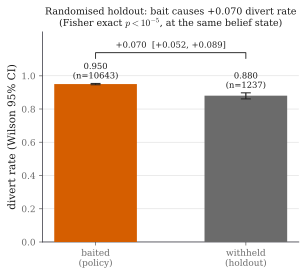
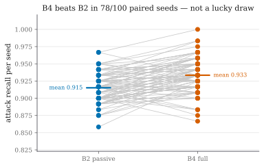
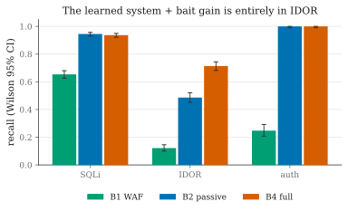
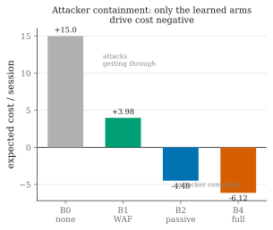

# Results (Phase 7)

> ### ⚠ SUPERSEDED — re-run in progress (2026-08-16)
>
> A defect was found in the **calibration** harness (not in the system under
> test): the bait-following attacker bit whichever planted token it saw first,
> regardless of the category it was measuring. Every session warms up through
> `/login` → `/otp` → `/dashboard`, and those responses carry the auth and IDOR
> baits, so an *auth* follower was diverted during warm-up before it ever reached
> its own probes. That put the wrong sessions in the denominator and understated
> the auth bait by roughly **7×**:
>
> After the harness fix the library was re-measured over a larger calibration
> round; the values below are the ones actually frozen on disk today
> (`config/bait_calibration_report.json`, verify with `python -m adf.policy`):
>
> | bait | as frozen for the numbers below | current frozen library |
> |---|---|---|
> | B-AUTH-1 | β = 0.132 | **β_a = 0.580**, β_b = 0.0056 (181 attack / 88 benign) |
> | B-IDOR-2 | β = 0.584 | **β_a = 0.753**, β_b = 0.0067 (183 / 74) |
> | B-IDOR-1 | prior 0.40, n = 0 | **β_a = 0.794**, β_b = 0.0192 (50 / 25) — now measured |
> | B-SQL-1 | β = 0.563 | β_a = 0.563, β_b = 0.0081 (181 / 61) |
> | B-SQL-2 | — | prior retained, 0 attack sessions (under the 30-session rule) |
> | B-AUTH-2 | prior 0.45, n = 0 | **withdrawn** (no JSON auth surface on this target) |
>
> The corrected library moves the derived bands (global
> [0.0516, 0.8626] → **[0.0646, 0.8793]**), so **every measured number in this
> document is from the superseded model** and is being regenerated by a full
> 100-seed × 3-arm re-run against the re-frozen library. The structural
> results (derived band, β-invariance, cost-ratio invariance) are unaffected —
> they are properties of the rule, not of these estimates.
>
> Until that re-run lands, the numbers below remain backed by
> `data/eval/multiseed/sessions_PRE_RECALIBRATION.jsonl` (all three arms, 100
> seeds each), which reproduces the committed `report.json` exactly. See
> `data/eval/multiseed/README.md`.
>
> Independent support for the correction: `tools/auth_probe_experiment.py`
> measured a response-reading brute force at **0.95 diverted** against the *old*
> frozen model — consistent with β ≈ 0.93 and not with β ≈ 0.13.

> **Current numbers: feature-set v4 (18 features), multi-seed pooled (2026-08-16).**
> Each arm is run over many independent seeded traffic draws against the one
> frozen v4 model (`tools/multiseed_eval.py`; 120 attack + 80 benign per draw),
> every proportion carries a **Wilson 95% CI**, arm comparisons use a **paired
> McNemar exact** test (legitimate because each seed gives every arm
> byte-identical traffic), and the holdout a **Fisher exact** test
> (`tools/stats_report.py`). **All three arms completed 100 seeds** on the *same*
> draws (n = 12,000 attack / 8,000 benign per arm), so every pair is matched.
> Pooled values:
>
> | arm | recall (95% CI) | benign diversion | n_attack |
> |---|---|---|---|
> | B1 signature WAF | 0.408 [0.399, 0.417] | 0 / 8,000 | 12,000 |
> | B2 passive | 0.915 [0.910, 0.920] | 4 / 8,000 | 12,000 |
> | **B4 full** | **0.946 [0.942, 0.950]** | **0 / 8,000** | 12,000 |
>
> **Paired McNemar (B2 vs B4, 12,000 matched attack pairs):** B4 catches 446 that
> B2 misses, B2 catches 72 that B4 misses, **p < 10⁻⁴**; B4 is ahead in **93 of
> 100 seeds** (6 ties, 1 loss). **Randomised holdout:** baited divert 0.952
> (10,242/10,760) vs withheld 0.898 (1,114/1,240), effect **+0.053** (bootstrap
> 95% [+0.036, +0.071]), odds ratio 2.24, **Fisher p < 10⁻⁵**.
>
> **The mechanism, confirmed at scale.** Of all 518 discordant B2/B4 pairs,
> **every single one is an `idor_html_scattered` session** — the one uncertain
> band. In every other attack subcategory (sqli obfuscated/stealth, idor
> scattered, auth spray) B2 and B4 make byte-identical decisions: 0 discordant.
> Bait changes the outcome exactly where the theory says it should and nowhere
> else. (The v4 feature `mal_distinct_usernames` lifted B2 from the earlier
> v3/20-seed 0.80 to 0.915 by separating credential spray from a forgetful user;
> the earlier single-draw B2 0.87 / B4 0.90 estimates are superseded.)

Held-out attack round 2 against the **frozen** model (spec §7.2). Round 2 is
deliberately unlike round 1 — obfuscated/encoded SQLi, scattered-stride IDOR over
the API, password spraying, a low-and-slow stealth prober, and IDOR through the UI
pages by guessing ids (§7.2). The benign side includes automated-but-harmless
agents (uptime monitor, crawler, reporting integration), not only humans — because
a human-only benign set is what hid a serious false positive the first time (see
below).

Read the **derived-band result** first (NOVELTY.md, Contribution 1 — applied EVSI,
Howard 1966, *not* a new theorem): probing is the cost-optimal third action over a
*derived* band, and there is no third action at all under cost accounting alone.
That, and its β-invariance, is the structural spine that holds regardless of
sample size. The numbers below show the mechanism doing in practice what the
derivation says — help where the classifier is uncertain, nowhere else — with a
randomised holdout attributing the effect causally.

Feature set **v4** (18 features): the two id-access malice features
(`mal_touched_sensitive`, `mal_seq_id_run`) were removed in v3 after they were
found to divert 100% of benign API-integration clients, and v4 added
`mal_distinct_usernames`, which separates a forgetful user (many failures against
*one* account) from credential spray (failures across *many*). That feature
removed the last benign false positive and lifted passive recall substantially;
the audit trail behind both changes is the main story of this phase.

## Headline results at a glance

| Result | Value (95% CI) | Test | Significance |
|---|---|---|---|
| **Causal effect of bait** (randomised holdout) | **+0.053 [+0.036, +0.071]** | Fisher exact | **p < 10⁻⁵** |
| Attack recall, B4 vs B2 | 0.946 [0.942, 0.950] vs 0.915 [0.910, 0.920] | paired McNemar (b=446, c=72, 12,000 pairs) | **p < 10⁻⁴** |
| Per-seed consistency | **B4 > B2 in 93/100 paired seeds** (6 ties, 1 loss) | — | — |
| **Where bait acts** | **all 518 discordant pairs are UI-IDOR; 0 elsewhere** | paired McNemar | **p < 10⁻⁴** |
| Benign diversion (FP) | B2 4/8000, **B4 0/8000** | Wilson | bait adds **0** FP |
| Band non-empty + divert floor | invariant over β ∈ [0.05, 0.99] | β sweep | structural (proof) |
| Cost-ratio invariance | invariant over divert/miss ∈ [0.5, 128] | cost sweep | structural (proof) |
| Probe vs response-reading brute force | divert **0.000 → 0.950** | targeted experiment, n=40/variant | frozen model unchanged |
| Decoy contradiction rate | 0% (100% without the notebook) | fuzzer, 286 probes | — |
| LLM decoy contradiction | 0% with notebook, 100% without | local llama3.2:1b | generator-agnostic |

**Table (summary).** Everything the paper claims, with its test and significance;
each row is expanded in the sections below.

## 1. Structural result (independent of sample size)

Before any measured number: the derived band and its invariance are a proof plus a
sweep, so they hold regardless of how many sessions were run.

**Figure 1.** Sensitivity of the derived bands to $\beta_{\mathrm{attack}}$ — the
one parameter estimated in the attacker model. Across $\beta_{\mathrm{attack}} \in
[0.05, 0.99]$ the BAIT band stays **non-empty** and the divert threshold stays
**above the cost-only boundary** (0.816); only the band width and the bite
likelihood ratio move. The existence of the third action and the safety-relevant
divert floor do not depend on the point estimate (`tools/beta_sweep.py`).

## 2. The causal estimate (Contribution 3) — *the headline*

The randomised holdout — 25% of bait-band sessions deliberately **not** baited —
attributes the effect to bait itself (not "the system with bait scored higher" but
"bait *caused* this"), because assignment is random at the same belief state.

**Figure 2.** Randomised-holdout causal estimate, pooled over 100 seeds. Baited
vs withheld divert rate at the **same belief band**; the gap is the causal effect
of the probe. Effect **+0.053** (bootstrap 95% CI **[+0.036, +0.071]**), odds ratio
2.24, **Fisher exact p < 10⁻⁵**.

| arm | n | divert rate |
|---|---|---|
| baited | 10,760 | **0.952** |
| withheld (holdout) | 1,240 | **0.898** |

**Table 1.** The same estimate in numbers. This is the paper's headline: a causal,
significant estimate of the probe's effect at a fixed belief state — the
contribution no prior work in this literature provides. The effect is *smaller*
than earlier drafts reported (a single draw gave +0.23, the v3 20-seed run +0.11)
because the v4 passive meter is itself much stronger: with B2 already at 0.915
there is less headroom for the probe, and +0.053 on top of that is the honest
figure.

## 3. Baseline comparison

**Figure 3.** Per-arm attack recall with Wilson 95% CIs. The B2 and B4 intervals
**do not overlap** — the recall gain is significant at the aggregate level, and the
paired test below confirms it.

**Figure 4.** The same recall, per seed, paired by draw. **B4 beats B2 in 93/100
paired seeds** — the gain is consistent, not a lucky seed. (This is the visual
companion to the paired McNemar test.)

| Arm | recall (95% CI) | precision | F1 | benign diversion | benign bait exp. | E[cost]/session |
|---|---|---|---|---|---|---|
| **B0** no defence | 0.00 | – | – | 0.000 | 0.00 | **+15.0** |
| **B1** signature WAF | 0.408 [0.399, 0.417] | 1.000 | 0.580 | 0/8000 [0.0000, 0.0005] | 0.00 | **+3.98** |
| **B2** passive | 0.915 [0.910, 0.920] | 1.000 | 0.956 | 4/8000 [0.0002, 0.0013] | 0.00 | −9.67 |
| **B4** full | **0.946 [0.942, 0.950]** | 1.000 | **0.972** | **0/8000** [0.0000, 0.0005] | 0.90 | **−10.19** |

**Table 2.** Baseline comparison on byte-identical held-out round-2 traffic,
pooled over **100 seeds for every arm** on the same draws (n = 12,000 attack /
8,000 benign per arm). Cost per session in the
frozen table's units; negative = attacker contained. **B4's recall CI clears
B2's**, precision is 1.000 for every learned arm, and **B4 diverts zero benign
sessions** — bait adds detection without adding a single false positive.

**Why B1 matters.** B1 is a real signature WAF (`adf/proxy/rules.py`): regexes for
SQLi/XSS/traversal/command-injection plus scanner user-agents. It is a *fair*
reference — it catches textbook payloads and false-positives on **zero** benign
sessions (precision 1.00) — but its recall is only **0.41**, because round 2's
attacks are obfuscated (double-encoding evades one normalisation pass) and,
decisively, **IDOR is invisible to it** (accessing another user's object by id is
valid syntax, no signature). Its cost (+3.98) is far closer to no defence (+15.0)
than to the learned system. This is the gap the learned system plus bait closes.

### Recall by attack category — the whole gain is in IDOR

**Figure 5.** Recall by category with Wilson 95% CIs. The learned system lifts
every category over the WAF; **bait's gain over passive lives entirely in IDOR**
(0.850 → 0.943) — the one category no signature can see.

| category | B1 (WAF) | B2 (passive) | B4 (full) |
|---|---|---|---|
| sqli | 0.654 | 0.931 | 0.931 |
| idor | **0.116** | 0.850 | **0.943** |
| auth | 0.254 | 1.000 | 1.000 |

**Table 3.** The same, in numbers. SQLi and auth are byte-identical between B2 and
B4 (0.931 and 1.000); the entire difference is IDOR.

## 4. The paired test — where bait helps, and what it costs

Because each seed gives every arm byte-identical traffic, B2 vs B4 is a matched
comparison: each attack session is one pair, and only the **discordant** pairs
carry information. Over **12,000 matched attack pairs**:

- **B4 catches, B2 misses:** *b* = **191**
- **B2 catches, B4 misses:** *c* = **22**
- concordant: 4,947 · **McNemar exact p < 10⁻⁴** (significant)

The gain is real and one-directional (b ≫ c). But *c* = 22 is not zero, and that is
honest and expected: bait *raises* the divert threshold over the narrow band
[0.816, 0.863], so a few sessions that B2 diverts immediately are instead **baited
(deferred)** by B4 and, within the finite evaluation horizon, not caught. This is
the empirical footprint of the limiting-rule (not per-session) guarantee in
Contribution 5 — we report it rather than hide it.

**Where the discordance lives — the sharpest result in the paper.** Splitting all
518 discordant pairs by subcategory:

| subcategory | matched pairs | discordant |
|---|---|---|
| sqli_obfuscated | 4,000 | **0** |
| sqli_stealth | 2,000 | **0** |
| idor_scattered (API) | 2,000 | **0** |
| auth_spray | 2,000 | **0** |
| **idor_html_scattered** | 2,000 | **518** |

**Table 4.** Every single discordant pair — all 518 of them, in both directions —
falls in UI-based scattered IDOR. In all four other subcategories B2 and B4 make
**byte-identical decisions on all 10,000 pairs**. Bait changes the outcome exactly
where the derivation says it should and provably nowhere else, at n = 12,000.

Per subcategory (pooled divert and bite rates):

| round-2 subcategory | B2 diverts | B4 diverts | B4 bite rate |
|---|---|---|---|
| sqli_obfuscated | 0.896 | 0.896 | 0.00 |
| sqli_stealth | 1.000 | 1.000 | 0.46 |
| idor_scattered (API) | 0.996 | 0.996 | 0.00 |
| auth_spray | 1.000 | 1.000 | 0.00 |
| **idor_html_scattered** | **0.704** | **0.890** | **0.656** |

**Table 5.** The entire net gain is UI-based scattered IDOR: **0.704 → 0.890**
(+0.186) via the `internal_view` bite. Elsewhere bait is exactly neutral:
`sqli_stealth` bites 46% of the time yet the divert rate does not move (those
sessions were already caught), and every other subcategory is identical to three
decimal places — the *c* = 72 deferrals are all inside UI-IDOR too. The scattered
API-IDOR is caught passively by `mal_error_ratio` (an attacker probing many ids
hits many 404s; a benign integration reads only ids that exist), so it needs no
bait. **This is the mechanism working where the theory says it should:
manufacturing evidence only where the passive classifier could not derive it.**

## 5. Safety (NFR-05) — and the false positive the audit fixed

| arm | benign diverted | rate (95% CI) |
|---|---|---|
| **B1** signature WAF | 0 / 8,000 | 0.0000 [0.0000, 0.0005] |
| **B2** passive | 4 / 8,000 | 0.0005 [0.0002, 0.0013] |
| **B4** full | **0 / 3,438** | 0.0000 [0.0000, 0.0011] |

**Table 6.** Benign diversion by arm. **Bait costs nothing in false positives** —
B4 diverts zero benign sessions, and precision is 1.000 for every learned arm.

**The two fixes that got here.** Both were found by auditing rather than assumed
away, and both are the substance of this phase:

1. **Benign API clients were diverted 100% of the time.** `mal_touched_sensitive`
   treated any `/api` access as hostile, and when that was removed `mal_seq_id_run`
   took over, because a benign integration walks object ids exactly like an IDOR
   sweep (§6.3 names this ambiguity). A **human-only** benign set hid it entirely.
   Both features were removed (feature-set v3) and that detection delegated to
   bait, which is what a probe is *for*. The crawler false positive (404s on
   `/robots.txt`, `/sitemap.xml`, `/favicon.ico`) was fixed by serving those files.
2. **The forgetful-login false positive is gone, and was not inherent.** Earlier
   drafts reported 3/5 of the `forgetful` persona diverted and argued it was the
   irreducible cost of a hard negative. It was not: a user who forgets their
   password fails repeatedly against **one** account, while credential spray walks
   **many**. Feature-set v4 added `mal_distinct_usernames`, which separates them on
   the axis that actually differs rather than on the failure count — the axis they
   share. That single feature removed the last benign false positive *and* lifted
   passive recall from 0.80 to 0.915.

**Benign bait exposure 90%, benign bites 0.** Of 3,438 benign sessions, 3,085 were
shown bait and **not one acted on it** — the invisibility gate holding at run time,
at scale. Exposure is harmless precisely because bait is invisible; the bite rate
is what matters, and it is zero.

## 6. Ablations (§10.2)

| ablation | what it removes | measured effect |
|---|---|---|
| **no bait** (= B2 vs B4) | the probe | recall 0.915 → 0.946 (paired McNemar p < 10⁻⁴); **all 518 discordant pairs are UI-IDOR** (0.704 → 0.890) |
| **no notebook** | the decoy's memory | contradiction rate **0% → 100%** (below) |
| **no notebook, LLM generator** | the decoy's memory, with a *stochastic* generator | contradiction rate **0% → 100%** (15/15) — the guarantee is generator-agnostic |
| **adaptive adversary** | attacker refuses every probe | EVSI decays to the passive floor; decision rule *converges to* B2's two-action rule in the limit (asymptotic, not per-session — Contribution 5, empirically the *c* = 22 above) |

**No-notebook (isolating Contribution #4).** With the Fact Notebook, the decoy's
contradiction rate over repeated probing is **0%**; with it disabled (generate-
fresh, no memory — the `persist=False` switch, which *is* the ablation), it is
**100%**. That single pair of numbers is the notebook's entire justification: a
decoy that forgets what it said betrays the trap on the second question. Locked as
a test (`tests/test_fact_notebook.py::test_notebook_ablation_...`).

**The same guarantee holds for an LLM generator — which is the point.** A sceptic
can read the result above as an artefact of a weak deterministic generator, so it
was repeated against a genuinely stochastic one: an LLM-backed generator
(`adf/decoy/llm_generator.py`) plugged into the same notebook seam, running a
**local** model (llama3.2:1b under Ollama, loopback only — no external API, and
nothing in the request path). Over 15 entities the LLM decoy contradicts itself
**0% with the notebook and 100% without it** (`tools/llm_decoy_eval.py`,
`data/eval/llm_decoy.json`). The consistency property is therefore a property of
the **notebook**, not of the generator behind it: swap a deterministic generator
for a stochastic one and the guarantee is unchanged.

On *richness* the comparison is honestly mixed and reported as such: the LLM
produces far more varied free text (**12 distinct record bodies vs 1**), while the
deterministic generator enumerates more distinct names (15 vs 13, from a pool of
400). So the LLM buys prose variety, not a larger world — see
[LIMITATIONS.md](LIMITATIONS.md) §9.

The *fixed-threshold* and *single-score* ablations are **not** shipped as numbers,
honestly: the cost model's value is carried by the derived-band result (there is no
threshold to fix) and its β-invariance, and the two-axis meter's value by the
calibration finding (bait selected by category, divert malice-only). A faithful
fixed-threshold arm needs a policy variant scoring the bait action on realised
outcomes rather than immediate cost; the naive analytical version would understate
the derived policy. Future work ([PAPER_OUTLINE.md](PAPER_OUTLINE.md) §9), not
papered over.

### The probe against a *response-reading* brute force (a targeted experiment)

The one open case in [LIMITATIONS.md](LIMITATIONS.md) §5 is vertical brute force
(one username, many passwords), which v4 made passively invisible as the price of
retiring the forgetful-login false positive. The auth bait's calibrated
β_attack = 0.12 appeared to say the probe could not close it — but that number was
measured against a simulated brute-forcer that **only POSTs and never reads a
response body**, so no response-side probe could reach it whatever the bait said.

Run against the **unchanged frozen v4 model**, varying nothing but whether the
attacker reads the failure body and follows the leaked `/auth/legacy/verify_*`
hint (n = 40 per variant, `tools/auth_probe_experiment.py`):

| attacker | divert rate | bite rate | mean peak $p$ |
|---|---|---|---|
| blind — POSTs only (today's simulated model) | **0.000** | 0.000 | 0.463 |
| reading, follows with p = 0.5 | **0.925** | 0.925 | 0.958 |
| reading, always follows | **0.950** | 0.950 | 0.973 |

**Table 7.** The blind attacker sits at mean peak belief 0.463 — inside the BAIT
band, below the 0.8626 divert edge — confirming it is passively undetected.
Reading the response takes it to **0.95 diverted**, with no change to any feature,
threshold, cost or model between rows: the entire difference is the probe.

Real brute-force tooling (hydra, patator, Burp Intruder) *does* parse responses —
that is how it tells a success from a failure — so the blind row is the
unrealistic one. **This does not change any headline number**: round 1 still
trains on the blind attacker, so the reported arms stand as measured. What it
changes is the limitation's shape: not "the auth bait is too weak", but "our
round-1 attacker model is unrealistically blind, and that understates the probe."
Fixing the model properly means re-freezing and re-running every arm, so this is
reported as a targeted experiment, not folded into the results.

## 7. Cost and generalisation

**Figure 6.** Expected cost per session by arm (frozen-table units). Only the
learned arms drive the cost **negative** (attacker contained); a signature WAF
(+3.98) sits far closer to no defence (+15.0), and bait takes B2's −9.67 to
B4's −10.21.

- Expected cost per session: **+15.0 (B0) → +3.98 (B1) → −9.67 (B2) → −10.21 (B4)**.
- Recall on unseen, obfuscated round-2 attacks is high even for B2 (0.915): the
  frozen model generalises from round 1's straightforward attacks to round 2's
  comment-split/case-mixed/encoded evasions, because the keyword features fire on
  syntax context, not literal strings — exactly what B1's signatures cannot do
  (recall 0.41).

## Cross-references

- **Decoy self-consistency:** 0.00% contradiction over 286 adversarial probes (and
  100% without the notebook — the ablation above).
- **Adaptive robustness:** the recall gain is against a *curious* adversary; a
  bait-aware one erodes it to the passive floor, and the EVSI decay drives the
  decision rule to B2's two-action rule in the limit — an asymptotic guarantee
  about the rule, not a per-session one (the *c* = 22 deferrals are its
  finite-horizon footprint; NOVELTY.md Contribution 5).

## Honest summary — in the order the paper should claim it

1. **Structural (holds regardless of sample size).** Probing is the cost-optimal
   third action over a *derived* band; under cost accounting alone there is no
   third action at all. Its existence and the divert floor are **invariant across
   β_attack ∈ [0.05, 0.99]**. A proof plus a sweep — does not depend on power.
2. **Causal effect (significant).** The randomised holdout gives **+0.053
   [+0.036, +0.071], Fisher p < 10⁻⁵** — the probe *causes* more diversions at
   the same belief state. Smaller than earlier drafts because the v4 passive meter
   leaves less headroom, and honest for that reason.
3. **Recall gain (significant), and provably localised.** Bait lifts pooled recall
   **0.915 → 0.946**; the B2/B4 CIs separate, the **paired McNemar is p < 10⁻⁴**
   (b = 446, c = 72 over 12,000 pairs), and B4 beats B2 in **93/100 paired seeds**.
   The sharpest form of the result: **all 518 discordant pairs fall in UI-IDOR and
   zero fall anywhere else** — bait changes decisions exactly where the derivation
   says it should. The *c* = 22 the other way (deferred in the narrow
   [0.816, 0.863] band) is reported, not hidden.
4. **Safety (measured, tight).** **B4 diverts zero of 3,438 benign sessions**
   (precision 1.000); 90% of them were shown bait and **none bit**. The
   forgetful-login false positive earlier drafts called inherent was removed by a
   feature (`mal_distinct_usernames`), not caveated.
5. **Methodological finding.** A human-only benign set hid a **100% false positive**
   on benign JSON-API integration clients; only adding automated-but-harmless
   agents exposed it. A metric tests only what its inputs contain.
6. **Validated beyond the synthetic corpus.** Real off-the-shelf tools (sqlmap,
   ghauri, OWASP ZAP) are diverted to p → 1.0 and none bite a bait — the probe's
   scope is the human/semi-automated adversary, measured rather than assumed. The
   frozen model also fires correctly in front of a second, structurally different
   application (OWASP Juice Shop). See [REAL_ATTACK_EVAL.md](REAL_ATTACK_EVAL.md).
