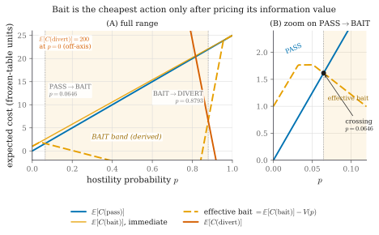
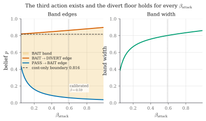
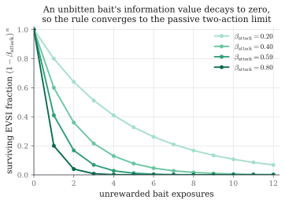

# CHAPTER 3

# DESIGN FLOW / PROCESS

## 3.1 Concept Generation

The starting observation is that a web application firewall has an **action set
problem**, not an evidence problem. Improving the classifier improves how well the
system reads what arrives; it does nothing about the fact that the system has only
two things it can do with what it has read.

Consider the situation from the defender's seat at a specific moment. A session has
sent eleven requests. Three of them touched `/records/{id}` with identifiers that
are not sequential but are close together. One search parameter contained an
apostrophe. The client carries a browser user-agent and fetched the stylesheet on
its first page load. The inter-request timing is irregular, in the way a human is
irregular rather than in the way a script with random jitter is irregular.

Is this an attack? Honestly: it might be. It might equally be a support engineer
looking up three related tickets whose customer's surname contains an apostrophe. A
passive detector must now choose. If it blocks, it has a meaningful chance of
having just cut off a colleague. If it allows, it has a meaningful chance of
watching an object-reference sweep proceed. Its threshold determines which of those
mistakes it prefers; it does not help it avoid both.

The generative question of this project is therefore:

> Is there a **third thing the defender can do** — something that is neither
> allowing nor blocking — that would make the next request more informative than
> this one was?

Framing it this way immediately suggests an answer, because the defender controls
something the passive framing ignores: **the response**. A detector that only reads
requests has thrown away half of its available surface. The response is a channel
the defender writes and the client reads, and what the defender writes into it can
be chosen to *discriminate between the two hypotheses that are currently confused*.

The discriminating idea is this. Add to the response something that

- a real browser will **never render**, so an honest user cannot see it, cannot be
  confused by it, and cannot report a bug about it;
- is **completely inert**, so following it grants no access, changes no state and
  produces no behaviour;
- but is **visible and attractive to anyone reading raw traffic** and probing the
  application.

A fake database error naming a table called `acct_shadow_a3f91c` that does not
exist. An unused field `ref_uid` in a JSON response. A hint at a deprecated endpoint
`/auth/legacy/verify_{suffix}` in a login failure message. A parameter named in an
HTML comment that no template ever reads.

An honest user never notices any of it, because none of it is rendered. A client
that is reading raw responses and looking for a way in will see it, and — this is
the key point — **acting on it is diagnostic**. There is no legitimate reason to
request a table name that appears only inside an error message, or to submit a
parameter that appears only inside an HTML comment. The moment the client does so,
it has told the defender what it is.

This suggests a three-action system: **PASS**, **BAIT**, **DIVERT**. But the design
is not finished, because it now has a much harder question to answer, and answering
it badly would make the whole thing worthless:

> **When** should the middle action be used?

A hand-set threshold is the obvious answer and the wrong one. It would be a third
free parameter in a system that already has one, and a reviewer would be entirely
correct to suspect it had been adjusted until the results looked acceptable. Worse,
it would leave the design unable to say *why* the middle band has the width it has.

The resolution is to notice what kind of object a probe actually is. A probe changes
no outcome by itself. The request still reaches the real application; nothing is
blocked, nothing is allowed that would not have been. Its entire worth is the
**information** a bite would reveal. That is not a security concept; it is a
decision-theory concept with a name, a literature and an arithmetic: the **expected
value of sample information** [32]. Once the probe is recognised as an information
purchase, the question "when should we probe?" becomes "when does the information
we would buy cost less than it is worth?" — and that question has a derived answer
rather than a chosen one.

## 3.2 Proposed Concept

The framework comprises five components, developed in the five subsections that
follow:

1. a **dual suspicion meter** that maintains two independent axes and fuses them
   into a belief (§3.2.1);
2. a **priced decision rule** that turns that belief into one of three actions using
   a frozen cost table and the measured effectiveness of each probe (§3.2.2);
3. a **bait library** with an invisibility gate that no bait may bypass (§3.2.3);
4. a **state-consistent decoy** backed by a write-once Fact Notebook (§3.2.4);
5. a **tamper-evident log** and a **frozen model manifest** that make the evaluation
   reproducible and hard to fudge (§3.2.5).

### 3.2.1 The Dual Suspicion Meter

#### Why two axes rather than one

The natural implementation is a single suspicion score, and it is wrong. The reason
is visible as soon as the space of clients is drawn out honestly.


**Figure 3 — The two-axis threat space and why one score is insufficient.**

A single score is a projection of this plane onto a line, and any such projection
must collapse two of the four quadrants together. The **automated-and-harmless**
quadrant — uptime monitors, crawlers, nightly reporting integrations — is the
casualty. A nightly reporting job walks record identifiers in ascending order at
machine speed, which is precisely the signature of an object-reference sweep. Any
single score that is high for scanners will also be high for that job.

This is not a hypothetical concern. An earlier version of this project contained two
features, `mal_seq_id_run` (a run of ascending object identifiers) and
`mal_touched_sensitive` (any access to `/api`, `/auth` or `/admin` paths), which
together diverted **100 % of benign JSON-API integration clients**. The failure was
completely invisible while the benign corpus contained only simulated humans; it
appeared the moment automated-but-harmless clients were added. Both features were
removed, and the detection they had been providing was delegated to the probe —
which is the correct place for it, because a probe distinguishes a reporting job from
an IDOR sweep by asking rather than by guessing.

The design consequence is that the meter maintains **two independent axes**:

- an **automation axis**, answering *is this client a program?*
- a **malice axis**, answering *are these inputs hostile?*

and, critically, only the malice axis contributes to the hostility belief on which
the decision is made. The automation axis is spent on **bait selection** — choosing
which probe to deploy, since a scripted client and a human client are enticed by
different things — and never on the decision to divert.

#### Feature extraction

Each request is reduced to **eighteen numbers**, computed only from what the live
proxy can observe. Nothing is derived from ground-truth labels, and the feature
extractor never has access to them; a model that could read labels would be reading
the answer sheet.

| # | Feature | Meaning |
|---|---|---|
| 1 | `auto_interarrival_last` | Seconds since this session's previous request |
| 2 | `auto_interarrival_cv` | Coefficient of variation of inter-arrival times; machine regularity is low-variance |
| 3 | `auto_requests_per_min` | Session request rate |
| 4 | `auto_asset_fetch_ratio` | Fraction of page loads followed by sub-resource fetches |
| 5 | `auto_fetched_assets` | Count of distinct static assets fetched |
| 6 | `auto_browser_header_ratio` | Fraction of requests carrying `Accept`, `Accept-Language`, `Accept-Encoding` |
| 7 | `auto_header_count` | Number of headers; scripted clients send fewer |
| 8 | `auto_ua_is_tool` | User-agent matches a known tool string |
| 9 | `auto_ua_stable` | User-agent unchanged across the session |
| 10 | `auto_cookie_carried` | Client returns the session cookie it was issued |

**Table 4 — Automation-axis features (10).**

| # | Feature | Meaning |
|---|---|---|
| 11 | `mal_input_length` | Length of the longest parameter value |
| 12 | `mal_special_char_ratio` | Proportion of quote, comment and operator characters in inputs |
| 13 | `mal_db_keyword_hits` | Count of SQL keywords appearing in parameters |
| 14 | `mal_db_keyword_any` | Binary indicator that any SQL keyword appeared |
| 15 | `mal_failed_auth` | Count of failed authentication attempts in the session |
| 16 | `mal_error_ratio` | Fraction of responses in the 4xx/5xx range |
| 17 | `mal_param_mutation` | Rate at which the same parameter is re-sent with a changed value |
| 18 | `mal_distinct_usernames` | Number of distinct usernames tried — separates spray from a forgetful user |

**Table 5 — Malice-axis features (8).**

Feature 18 deserves comment because it was added in response to a measured false
positive. An early version diverted a simulated user who had forgotten their
password, and this was initially written up as an inherent cost of including hard
negatives. It was not inherent at all. It was a *missing feature* — the system could
not distinguish "one user, many password attempts" from "one password, many users" —
compounded by a *double count*, since login rejections were also inflating
`mal_error_ratio`. Once `mal_distinct_usernames` was added and the double count
removed, the false positive disappeared entirely.

#### Fusion into a belief

Each axis is a logistic head. For a feature vector **x** with automation
sub-vector **x**_A and malice sub-vector **x**_M:

```
    a(x) = σ( w_A · x_A + b_A )          automation score,  a ∈ (0, 1)
    m(x) = σ( w_M · x_M + b_M )          malice score,      m ∈ (0, 1)

    where  σ(z) = 1 / (1 + e^(−z))
```

The two are fused into a single hostility belief by a weighted combination whose
weights are part of the frozen model:

```
    p = clamp( w_auto · a(x) + w_mal · m(x),  ε,  1 − ε )      ε = 10⁻⁶
```

with the shipped configuration setting **w_auto = 0.0** and **w_mal = 1.0**. In
other words, the automation axis carries *zero weight in the hostility belief* — the
belief equals the malice score exactly. This is a deliberate consequence of the
argument above and of the bot-detection literature [30], [31]: automation is not
evidence of hostility. It was verified against the logs rather than merely against
the configuration; across 12,954 scored requests in an audit, the belief equals the
malice score exactly within the documented 10⁻⁶ clamp, while the automation score
ranges over its whole domain.

The clamp exists so that the log-odds transform used in the belief update never
diverges.

#### The Bayesian update on a bite

When a probe is deployed and the client subsequently acts on it, the belief is
updated in log-odds space by that bait's measured likelihood ratio:

```
    logit(p′) = logit(p) + log Λ⁺        if the client bit
    logit(p′) = logit(p) + log Λ⁻        if the probe was shown and ignored

    where   Λ⁺ = β_attack / β_benign          (the bite likelihood ratio)
            Λ⁻ = (1 − β_attack) / (1 − β_benign)
```

Here β_attack is the probability that a hostile session bites this bait when shown
it, and β_benign the probability that a benign session does. Both are **measured**
in a dedicated calibration round rather than assumed; Section 3.2.3 gives the
estimator and Table 8 the values.

This is ordinary Bayesian evidence accumulation, and its correctness is precisely
why the two rates must be measured rather than chosen. A likelihood ratio invented
by the designer is a free parameter in disguise.


**Figure 4 — Life of a single request through the framework.** The loop is the
important part: a bait deployed on one request is only evidence when a *later*
request in the same session does or does not act on it. This is why the framework is
session-scoped rather than request-scoped, and why session identity (§3.2.5) is a
security-relevant component rather than plumbing.

### 3.2.2 Pricing the Probe as an Information Purchase

This subsection contains the core contribution and is developed in full, because
every number in Chapter 4 depends on it.

#### The cost model

Every combination of true session label and defender action is assigned a cost.
These numbers were written down, hashed and committed **before any evaluation data
existed**, and the hash is verified on every load — the file cannot be edited after
results are seen without the system refusing to run.

| | **PASS** | **BAIT** | **DIVERT** |
|---|---:|---:|---:|
| **Session is benign** | 0 | 1 | 200 |
| **Session is an attack** | 25 | 25 | −20 |

**Table 6 — The frozen cost matrix.**

Each entry encodes a judgement, and each is worth stating explicitly:

- **benign / PASS = 0.** The correct outcome. The baseline against which every
  other cost is measured.
- **benign / BAIT = 1.** A real user was shown a probe and did not notice, because
  the invisibility gate guarantees the rendered page is unchanged. This is
  deliberately *not* zero. Setting it to zero would assert that the gate is perfect,
  and would also make baiting a **free action**, which would let the policy probe
  everybody with no penalty. The value of 1 prices the residual risk that a defective
  bait escapes the gate, and it is what forces the policy to be selective.
- **benign / DIVERT = 200.** A real user sent into a fake copy of the application:
  the outcome that must almost never happen. Priced at 200 times a wasted probe, so
  that the policy demands overwhelming evidence before diverting. This ratio is a
  direct consequence of the base-rate argument [35].
- **attack / PASS = 25.** A missed attack.
- **attack / BAIT = 25.** *The same as passing.* This is essential and easy to
  overlook: baiting confers **no immediate benefit**, because the request still
  reaches the real application. Whatever the attacker was going to accomplish on this
  request, they still accomplish. The probe's worth lies entirely in the future.
- **attack / DIVERT = −20.** Negative, i.e. a gain: the attacker is contained inside
  a decoy where their actions are recorded and harmless.

#### Why cost alone yields no middle action

Let *p* be the belief that the session is hostile. Expected costs are:

```
    E[C(pass)]   = (1 − p)·0   + p·25   = 25p
    E[C(bait)]   = (1 − p)·1   + p·25   = 1 + 24p
    E[C(divert)] = (1 − p)·200 + p·(−20) = 200 − 220p
```

Now subtract:

```
    E[C(bait)] − E[C(pass)] = (1 + 24p) − 25p = 1 − p
```

For every belief strictly below certainty, **1 − p > 0**. Therefore:

> **Property 0.** Under cost accounting alone, baiting is *strictly worse* than
> passing at every belief *p* < 1. The BAIT band is empty everywhere.

The rule collapses to a two-action policy with a single boundary where passing and
diverting cross:

```
    25p = 200 − 220p   ⟹   245p = 200   ⟹   p* = 200/245 = 0.8163
```



**Figure 5 — Expected cost of each action under cost accounting alone.** The bait
line never dips below both others, at any belief. The BAIT region is empty, and the
rule reduces to a single PASS/DIVERT boundary at 0.8163.

This is not a defect in the cost table; it is the **most important structural fact
in the design**. It means the middle action cannot be recovered by adjusting a
threshold, because there is no threshold to adjust — the region does not exist.
Anything that produces a middle band must come from somewhere other than immediate
cost.

#### The information term

What cost accounting omits is that a probe may *change what the defender does next*.
That is exactly the object Howard [32] formalised.

Let *Z* denote the observation the probe produces: `bite` or `no-bite`. Before
probing, the defender's best achievable expected cost is

```
    min_a E[C(a) | p]
```

After observing *Z*, the belief becomes a posterior *p′*, and the defender may
choose a different action. The expected best cost *after* observing is

```
    E_Z[ min_a E[C(a) | p′] ]
```

The **expected value of sample information** is the difference:

```
    V(p) = min_a E[C(a) | p]  −  E_Z[ min_a E[C(a) | p′] ]
```

Concretely, with the bait's measured rates:

```
    P(bite)    = p·β_attack + (1 − p)·β_benign

    p′(bite)   = p·β_attack / P(bite)                                  (Bayes)

    p′(no)     = p·(1 − β_attack) / (1 − P(bite))

    V(p) = min_a E[C(a) | p]
           − [ P(bite)·min_a E[C(a) | p′(bite)]
             + (1 − P(bite))·min_a E[C(a) | p′(no)] ]
```

The **effective cost of baiting** is then its immediate cost minus the value of what
it buys:

```
    effective(bait) = E[C(bait)] − V(p) = 1 + 24p − V(p)
```

and the policy selects whichever of `pass`, `effective(bait)`, `divert` is least.

#### Three properties of V(p)

**Property 1 — V(p) ≥ 0 for all p (information never hurts).**
`min_a E[C(a) | p]` is a minimum of affine functions of *p*, and a minimum of affine
functions is concave. Jensen's inequality applied to the posterior mean of the belief
gives `E_Z[min_a E[C(a) | p′]] ≤ min_a E[C(a) | p]` immediately, hence V(p) ≥ 0.
This is a standard lemma and **not a contribution of this work**; the report claims
the application, not the mathematics. It is nevertheless enforced as a runtime
invariant with a test (`test_information_is_never_harmful`), which is a stronger and
more checkable statement than an informal assertion that "bait is cheap".

**Property 2 — V(0) = V(1) = 0 (the band is bounded on both sides by construction).**
When the belief is already certain, no observation can change the decision, so the
probe is worth exactly nothing. The BAIT band therefore *cannot* swallow the whole
probability range and *cannot* be widened by tuning; its edges are pinned by the cost
geometry at both ends.

**Property 3 — the band exists exactly where V(p) exceeds the residual cost of
baiting.** BAIT is chosen when `effective(bait)` is least, i.e. when

```
    V(p) > E[C(bait)] − min( E[C(pass)], E[C(divert)] )
```

Since Property 0 established that the right-hand side is 1 − p > 0 on the passing
side, the band opens only where the information value strictly exceeds that residual.

#### The derived bands

Applying the arithmetic above to the frozen table and the calibrated bait library
(Table 8) yields:

```
    PASS      p  <  0.0647
    BAIT      0.0647  ≤  p  <  0.8793
    DIVERT    p  ≥  0.8793
```


**Figure 6 — The derived band after subtracting the value of information.** Compare
directly with Figure 5. The only change is that the bait line has been lowered by
V(p); the middle region appears, and both of its edges are consequences of that
subtraction rather than choices.

| Boundary | Value | Origin |
|---|---:|---|
| `pass_to_bait` | **0.06465** | Where V(p) first exceeds the residual cost of baiting |
| `bait_to_divert` | **0.8793** | Where diverting becomes best even after the probe's value is credited |
| Cost-only boundary | 0.8163 | Where PASS and DIVERT cross with no information term |

**Table 7 — Derived action bands under the frozen cost table.**

Two observations follow, and the second is the one a reader should carry away.

First, **neither edge was chosen**. Both are outputs of the arithmetic. Changing them
requires changing either the cost table (which is hashed and frozen) or the measured
bite rates (which come from a calibration round with recorded counts).

Second, notice **which way the upper edge moved**. Introducing the probe raised the
divert threshold from 0.8163 to 0.8793. A system that can probe is therefore *more
reluctant* to divert an honest user than the same system without one, because it now
has a cheaper way of resolving its uncertainty and no longer needs to gamble. This
was not a design goal and was not anticipated; it falls out of the arithmetic. It is
also, as Chapter 4 shows, the property that buys the zero-benign-diversion result:
the highest belief any benign session in the corpus reaches is 0.829, and the derived
divert edge sits at 0.879, above all of them.

#### Sensitivity of the conclusions

Two quantities in the derivation are estimates rather than givens: the cost ratio and
the attacker bite rate β_attack. If the structural conclusions depended on their
exact values, the result would be fragile. They do not.

Sweeping **β_attack across [0.05, 0.99]** and the **divert-to-miss cost ratio from
0.5 to 128** leaves both structural facts intact throughout: the BAIT band remains
non-empty, and the divert threshold never falls below the cost-only boundary of
0.8163. Only the *width* of the band and the *level* of conservatism move.



**Figure 7 — Invariance of the band across β_attack.** The upper edge stays above the
cost-only boundary for every value in the plausible range, and the band never closes.
Neither the existence of the third action nor the direction of the safety guarantee
is an artefact of the two estimated numbers.

#### Behaviour against an adaptive adversary

An attacker who learns that probes exist can simply refuse them. The design's
response is not to claim this cannot happen, but to make the consequence bounded.

Each unrewarded exposure of the same bait decays its surviving information value by a
**survival discount**:

```
    V_k(p) = V(p) · (1 − β_attack)^k          k = number of prior unrewarded exposures
```

The reasoning is Bayesian: if a hostile session bites with probability β_attack when
shown a bait, then a session that has been shown it *k* times and never bitten is
progressively less likely to be the kind of session that would. As *k* grows, V_k(p)
falls geometrically toward zero. Once it is negligible, the effective cost of baiting
is its immediate cost, which Property 0 showed is strictly above passing, and the
three-action rule **collapses back to the two-action rule** the passive baseline
already implements.



**Figure 26 — Value of information decaying over repeated unrewarded exposures.** As
V falls toward zero the effective cost of baiting rises to its immediate cost, which
is strictly above passing, and the three-action rule collapses to the two-action rule.

> **Limiting-rule guarantee.** Against an adversary who refuses every probe, the
> policy converges to the passive two-action policy as exposures accumulate. It
> therefore cannot be *asymptotically* worse than the detector it is built on.

The guarantee is deliberately stated as a limiting property and not as per-session
dominance, because per-session dominance is false and Chapter 4 reports the cases
where it fails: 197 of 11,880 matched attack sessions go the other way, where the
probing arm defers a diversion that the passive arm would have made.

### 3.2.3 The Bait Library and the Invisibility Gate

#### What a bait is

A bait is a small piece of content added to a response that a real browser will never
display and that a client reading raw traffic will see. Every bait must satisfy four
rules, and the fourth is enforced mechanically:

| Rule | Meaning | Enforced by |
|---|---|---|
| **Plausible** | A bait that looks planted warns the attacker the site is defended | Design review |
| **Inert** | Following it must never grant real access or trigger real behaviour | Design and tests |
| **Unique** | Content is randomised per session, so no fixed string can be published and burn the bait permanently | `randomise_per_session`; token suffix derived from (seed, session id) |
| **Invisible** | Must hold a passing invisibility certificate before it may be served | Run-time certificate check |

#### The shipped library

| Bait | Category | Fires when | What is injected | Channel | Bite signal | β_attack | β_benign | Λ⁺ |
|---|---|---|---|---|---|---:|---:|---:|
| `B-SQL-1` | sqli | A quote or comment character appears in a parameter | Verbose fake DB error naming a non-existent table | error text | A later request referencing that table | 0.5632 | 0.0081 | 69.5 |
| `B-SQL-2` | sqli | Repeated malformed parameters | Fake column list inside an HTML comment | HTML comment | A query using any of those column names | 0.5125 | 0.0038 | 134.9 |
| `B-IDOR-1` | idor | Sequential identifier access detected | Unused extra field `ref_uid` in the JSON response | JSON field | Any request submitting that field | 0.7941 | 0.0192 | 41.4 |
| `B-IDOR-2` | idor | Object-reference tampering detected | Fake `internal_view` parameter named in an HTML comment | HTML comment | A request carrying that parameter | 0.7527 | 0.0067 | 112.3 |
| `B-AUTH-1` | auth | Several failed logins in one session | Failure message hints at `/auth/legacy/verify_{suffix}` | error text | Any request to that path | 0.5797 | 0.0056 | 103.5 |
| ~~`B-AUTH-2`~~ | auth | Repeated OTP failures | Inert `mfa_debug_token` in the OTP failure response | JSON field | A request submitting that token | — | — | — |

**Table 8 — The shipped bait library and its calibrated effectiveness.**

`B-AUTH-2` is **withdrawn** and is listed only for completeness. Its channel requires
a JSON authentication response, and this target has none — `/login` and `/otp` both
return HTML — so it was shown to zero sessions while carrying a fabricated β_attack
of 0.45. Removing it is the correct action and is recorded here because a bait that
was designed, certified, and then withdrawn for lack of a surface is part of the
honest record.

#### Estimating the bite rates

Both rates come from a dedicated **calibration round** run before evaluation, using
the Jeffreys posterior mean of a Beta(½, ½) prior:

```
    β̂ = (k + ½) / (n + 1)          floor: β̂_benign ≥ 0.0005
```

where *k* is the number of sessions that bit and *n* the number shown the bait. The
half in the numerator is what stops an observed zero from becoming a certainty: with
zero benign bites in 74 sessions, a naive estimate would give β_benign = 0 and hence
an infinite likelihood ratio, which is nonsense. The Jeffreys estimate gives
(0 + ½)/(74 + 1) = 0.0067.

Two properties of the resulting estimates matter:

1. **None of the deployed baits sits at the smoothing floor.** The five measured
   β_benign values run from 0.0056 to 0.0192 on samples of 25 to 88 benign sessions.
   A likelihood ratio computed against the floor would be a *bound* rather than a
   *measurement*, and it matters that none of them is.
2. **The estimate is deliberately unfavourable to the probe.** With zero benign
   bites observed, any smaller prior — or none at all — would push β_benign toward
   zero and the likelihood ratio toward infinity, making the probe look better. The
   Jeffreys choice is the conservative one.

A further property of the token design determines what evidence may legitimately be
carried across sessions. **Value baits** — where the bite signal is the client
submitting a planted *value* — carry a per-session suffix, so a token seen in
session B could only have come from session B, and cross-session reporting is valid.
**Name baits** — where the signal is the client using a planted parameter *name* —
do not, because the name is fixed. The implementation therefore reports cross-session
bites only for value baits, and Chapter 4's numbers respect that distinction.

#### The invisibility gate

The gate is built **before** any bait, and no bait may enter the library without a
passing certificate. For each candidate bait and each response it can inject into,
the gate performs four checks:


**Figure 8 — The invisibility gate as a decision flowchart.**

The first check deserves emphasis because it is counter-intuitive: the gate
**refuses a bait that applies to none of the corpus**. A bait that never fires cannot
be verified, and an unverifiable bait that nevertheless sits in the library is a
latent hazard.

| Bait | Passed | Responses injected / tested | Median overhead (ms) | p95 overhead (ms) |
|---|:--:|---:|---:|---:|
| `B-SQL-1` | ✅ | 82 / 116 | 0.0116 | 0.0235 |
| `B-SQL-2` | ✅ | 82 / 116 | 0.0122 | 0.0212 |
| `B-IDOR-1` | ✅ | 34 / 116 | 0.1076 | 0.1263 |
| `B-IDOR-2` | ✅ | 82 / 116 | 0.0095 | 0.0168 |
| `B-AUTH-1` | ✅ | 82 / 116 | 0.0107 | 0.0213 |
| `B-AUTH-2` (withdrawn) | ✅ | 34 / 116 | 0.1163 | — |

**Table 9 — Invisibility certificates for the deployed baits.**

The worst certified median overhead among deployed baits is **0.1076 ms** against a
ceiling of 0.5 ms — a factor of 4.6 — and the worst 95th percentile is 0.1263 ms.
Most baits sit 40 to 50 times below the ceiling. These are the figures recorded in
the certificates that the freeze manifest hashes, so a reader can check them rather
than taking them on trust.

It should be stated plainly that the timing criterion is a **threshold on the
median**, not a formal equivalence test. A two-one-sided-tests procedure against a
pre-registered margin [40] would be the stronger claim, and it is named here as the
natural way to tighten the result rather than glossed over.


**Figure 9 — Bait life-cycle across one session.** Note that the baited request is
*still forwarded* to the real application and still receives a real answer. The probe
adds information; it withholds nothing.

### 3.2.4 The Decoy Environment and the Fact Notebook

#### The problem a decoy must solve

Once a session is diverted, it must land somewhere that does not contradict itself.
If the decoy answers "user 1041 is Rakesh Malhotra" on one request and "user 1041 is
Priya Nair" two requests later, the deception has announced itself — and, per
Vetterl and Clayton [10], an attacker who can detect the deception is in a *better*
position than one who was never deceived, because they now know they are watched.

This is harder than it sounds because a decoy must generate content for a world that
does not exist, on demand, for arbitrary queries. Any generator that produces content
independently for each request will eventually contradict itself.

#### The Fact Notebook

The design separates **what the fake world contains** from **what generates it**.

The Fact Notebook is a **write-once key-value store**. Every entity the decoy has
ever asserted — a user, a record, a file, a configuration value — is written to it
the first time it is needed. On every subsequent request, the notebook is consulted
*first*:

```
FUNCTION decoy_fact(kind, key):
    IF notebook.has(kind, key):
        RETURN notebook.get(kind, key)        # already asserted; must not change
    value ← generator.produce(kind, key)      # deterministic RNG or language model
    notebook.put(kind, key, value)            # write-once: never overwritten
    RETURN value
```

The consistency guarantee is a property of the **store**, not of the generator. This
is the design decision that makes the layer generator-agnostic: a deterministic
seeded generator and a language model both satisfy it, because neither is ever asked
the same question twice.


**Figure 10 — Decoy consistency with and without the Fact Notebook.**

#### Target/decoy parity

Consistency of *content* is necessary but not sufficient. The decoy must also match
the real application's **surface**, or the difference itself becomes the tell. Parity
is enforced by tests rather than by inspection, and the tests assert equality in both
directions:

- **Route surfaces are identical.** A route present in the target but absent from the
  decoy would 404; a route present in the decoy but absent from the target is a tell.
  Both directions are asserted.
- **Status codes and content types match** on every shared path.
- **Unauthenticated access is gated identically** — the same redirect, the same code.
- **Bad logins are rejected identically**, including the message text.
- **The injectable surface matches**: a quote in a search parameter produces a 500
  with the same error shape in both.
- **Mundane files are byte-identical**, with exactly one deliberate exception: the
  decoy's `service.ini` contains a planted credential that the real one does not.
  That single asymmetry is the point of the decoy, and the test asserts it in both
  directions.

Crawler-facing files (`robots.txt`, `sitemap.xml`, `favicon.ico`) are served by both
applications. This is not cosmetic: an earlier version diverted a benign crawler
because 404s on these standard paths inflated its error ratio.

### 3.2.5 Tamper-Evident Logging and the Frozen Model

#### Hash-chained decision log

Every decision is written to an append-only store whose records are chained by hash,
following Schneier and Kelsey [39]:

```
    H_i = SHA256( D_i ‖ T_i ‖ H_{i−1} )
```

where D_i is the record content, T_i its timestamp and H_{i−1} the previous record's
hash. A later edit to any record breaks the chain from that point onward and is
detectable by recomputation. Each record carries the request, the extracted features,
both axis scores, the fused belief, the action taken with the expected costs that
justified it, any bait injected with its certificate reference, any bite detected
with its likelihood ratio, and the ground-truth labels for evaluation.

#### Session identity

Because evidence accumulates across a session, session identity is security-relevant.
The proxy mints a cookie on first contact. A coarse IP-plus-user-agent fingerprint
fallback exists and defaults to **off**, which is the honest default: enabling it by
default would let the framework claim robustness against session-resetting attackers
that the shipped configuration does not have. Section 4.4.8 reports a real tool that
exploits exactly this, and reports both what happens with the fallback off and what
happens with it on.

#### Fail-open

Scoring, pricing and injection all sit between the client and the real application, so
a fault in any of them is a fault in front of production traffic. The proxy therefore
**fails open**: if the feature extractor, the meter or the policy raises an exception,
the request is served normally, the fault is recorded with the decision marked
failed-open, and no session is diverted on the strength of a component that did not
run. Failing closed would turn a defect in the detector into an outage for legitimate
users — a worse failure than missing an attack, and the cost table already says so.

This leaves an obvious question about the evaluation: how should a failed-open request
count in a recall figure? The question was settled by checking rather than by ruling.
Across the **875,703 decisions recorded in the reported runs, the fail-open path was
taken zero times**, so no number in this report depends on the answer.

#### The frozen model

Before evaluation, a manifest hashes everything a decision depends on:

```
freeze():
    state ← {
      cost_table     : sha256(costs.yaml),
      features       : { version, sha256(ordered feature-name list) },
      meter          : sha256(trained meter weights),
      schema         : fingerprint(record schema),
      bait_library   : { calibrated?, sha256(per-bait β_attack, β_benign) },
      certificates   : { count, sha256(all invisibility certificates) }
    }
    REFUSE if not state.bait_library.calibrated     # no priors in a frozen model
    WRITE manifest ← state + { timestamp, policy version, seed }

require_frozen():                       # called before ANY reported number
    m ← load_manifest()
    RAISE if m is absent
    FOR each component c in m:
        RAISE if recompute(c) ≠ m[c]    # loud, and names which one moved
```

Two details carry the weight. The feature **list** is hashed, not merely its version
number, so reordering or renaming a feature invalidates a model trained against it —
turning the failure mode where weights and features drift out of step into a start-up
error rather than a silent misprediction. And the refusal is placed at the *reporting*
boundary: a developer may run the stack while iterating, but no tool will emit a
number against a model it cannot vouch for.

The cost table is protected more strictly still. Its loader verifies the hash on
**every load**, so a moved cost table stops every component that makes a decision, not
merely the reporting tools.

## 3.3 Design Constraints

The framework operates under constraints that are technical, legal, economic, ethical
and practical. Each shaped the architecture, and several ruled out designs that would
otherwise have been attractive.

### 1. Safety and non-interference constraints

The hardest constraint, and the one that most shaped the design, is that **the
defence must be invisible to legitimate users**. A security control that honest users
can perceive has not removed a cost; it has moved it. This produced three concrete
requirements:

- Injected content must not change the rendered page — enforced by the gate, not
  promised.
- Injected content must not add perceptible latency — median overhead is certified
  below 0.5 ms, and measured at 0.11 ms in the worst deployed case.
- Following a bait must never grant access or change state — baits are inert by
  design and by test.

### 2. Regulatory and privacy constraints

The framework observes user behaviour, which brings data-protection obligations under
regimes such as the GDPR. Three design responses follow. Features are computed from
request metadata rather than from content wherever possible. No behavioural biometric
requiring client-side instrumentation — mouse movement, keystroke dynamics — is
collected, even though the bot-detection literature [31] shows these are effective;
the privacy cost was judged too high for the benefit. And logs are structured so that
the audit trail can be retained while personal identifiers are minimised.

A deception system also raises a question the technical literature often skips: is it
*ethical* to lie to a visitor? The position taken here is that the deception is
proportionate because it is (a) inert, (b) invisible to anyone not probing the
application, and (c) triggered only by behaviour the visitor chose. A user who never
submits a token that appears only inside an HTML comment never encounters any of it.

### 3. Economic and computational constraints

The framework sits in the request path, so every millisecond is paid on every
request. This ruled out a design in which a language model is consulted during
scoring or during response generation: a model call inside a response would make the
decoy measurably slower than the real site, and a slow decoy is a detectable decoy.
The consequence is the architectural seam of §3.2.4 — generation happens *outside*
the request path, and the notebook serves at database speed.

### 4. Fairness, safety and ethical constraints

A model that produces biased risk scores denies access unfairly. Three mitigations
apply. The two axes are inspectable, and the fusion weights are explicit rather than
learned. The removal of `mal_seq_id_run` and `mal_touched_sensitive` was in part a
fairness fix: those features penalised a *class of legitimate client* rather than a
behaviour. And the decision rule is fully explainable — for any session, the log
records the belief, the expected cost of each action, and which comparison decided it.

### 5. Implementation feasibility constraints

The system had to be buildable by a student team in a semester on a single laptop.
This favoured a Python stack (FastAPI, httpx, scikit-learn, SQLite) over a
distributed one, and favoured a **simulated adversary** over live traffic, since no
ethical source of real attack traffic against a live application was available. That
choice is the origin of the most significant limitation in Chapter 4, and it is
reported there rather than defended.

### 6. Evaluation-integrity constraints

Because the project makes a causal claim, the evaluation had to be designed to be
hard to fudge — a constraint on *method* rather than on the artefact:

- the model is frozen and hashed before evaluation, addressing data snooping [37];
- traffic is seeded and replayed so that arms differ only in the code path selected
  by one flag;
- the primary comparison was fixed before the runs and everything else is labelled
  exploratory;
- an industry-standard ruleset is replayed on identical traffic, addressing the
  inappropriate-baseline pitfall [37];
- the effect of the probe is identified by randomisation rather than inferred from
  a between-system comparison.

### 7. Social and political constraints

Deception technology is unevenly regulated and unevenly trusted. A defence that lies
to visitors invites reasonable questions about proportionality and about what happens
when it misfires. The design's answer is the cost table: the asymmetry between 200
for diverting a benign user and 25 for missing an attack is an explicit, auditable
statement that the system would rather miss eight attacks than wrongly divert one
real person.

## 3.4 Alternative Designs

Three architectures were considered. They differ in what actions the defender has
available and in how the choice among them is made.

### 3.4.1 Design 1: Passive Two-Action Detector

**Structure.** Extract features, score, threshold, allow or block. Deception, if
present at all, is a separate honeypot reached only after a session has been judged
hostile.

**Advantages.** Simple, fast, stateless per decision, easy to explain, and the
industry norm. There is exactly one parameter to tune and its effect is monotone and
intuitive. It has no novel failure modes, because everything about it is understood.

**Limitations.** It inherits the dilemma of §3.1 in full. In the uncertain middle it
must choose between two bad options, and its only response to uncertainty is to move
the threshold, which trades one error for the other. Against valid-syntax attacks it
has no purchase at all, because the requests contain nothing anomalous.

**Measured outcome.** This design was built and is reported as baseline **B2**. It
achieves recall 0.889 with 4 benign diversions out of 7,920 — a strong result that
nonetheless leaves a large share of user-interface IDOR sessions uncaught.

### 3.4.2 Design 2: Always-On Honeytokens

**Structure.** The two-action detector, plus honeytokens planted in every response
regardless of belief, following the standard honeytoken pattern [17], [18], [19].

**Advantages.** Simple to reason about — there is no decision to make, so there is no
decision to get wrong. Maximum coverage: every attacker sees every trap. It removes
the need for a policy entirely.

**Limitations.** Three, and they compound.

First, **cost**. Under the frozen table, showing a probe to a benign session costs 1
unit each time. With 90 % of benign sessions receiving probes on this corpus, a policy
that probes unconditionally accumulates that cost across every honest visitor for the
entire life of the deployment.

Second, **burn**. A token that every visitor sees will eventually be catalogued and
published. This is the honeytoken-fingerprinting result [20] applied at scale: the
tokens become known, and a known token is worse than no token because its absence
becomes informative.

Third, and most importantly, **it answers the wrong question**. The literature gap of
§2.2 is precisely that honeytokens are deployed without regard to belief. Building
that again would reproduce the gap rather than close it.

### 3.4.3 Design 3: Priced Three-Action Policy (Proposed)

**Structure.** The two-axis meter of §3.2.1 produces a belief. A cost-derived policy
selects among PASS, BAIT and DIVERT, where the BAIT band's two edges are computed
from a frozen cost table and measured bite likelihood ratios rather than chosen. A
bite updates the belief in log-odds space; repeated unrewarded exposures decay the
probe's value geometrically. A diverted session lands in a state-consistent decoy.

**Advantages.**

- The middle action exists **only because information has value**, so it cannot be
  reproduced by tuning a threshold — Property 0 proves the band is empty under cost
  alone.
- Both edges are **derived**, so there is no free parameter to accuse of having been
  fitted.
- The upper edge moves **upward** relative to the cost-only boundary, making the
  system *more* cautious about diverting honest users than the passive design.
- The rule **degrades gracefully**: against an adversary who refuses every probe, it
  provably converges to the passive rule rather than to something worse.
- Probing is **selective**, so the burn and cost problems of Design 2 are bounded.

**Limitations and costs.**

- Substantially more complex: a bait library, an invisibility gate, a certificate
  mechanism, a decoy, a fact store and a calibration round all have to exist.
- It introduces a **new failure surface** — injection into live responses — which is
  why the gate exists and why fail-open is mandatory.
- It requires a **calibration round** to measure bite rates, which is additional
  experimental work that a threshold-tuned system does not need.
- Its benefit depends on the attacker actually reading responses. Against a purely
  blind injection engine the probe is unreachable by construction, and Chapter 4
  reports exactly that.

| Criterion | Design 1: Passive | Design 2: Always-on tokens | Design 3: Priced policy |
|---|---|---|---|
| Actions available | 2 | 2 (+ passive tripwire) | **3** |
| Middle action exists | No | Not a decision | **Yes, derived** |
| Free parameters in the policy | 1 threshold | 0 (no policy) | **0 — both edges derived** |
| Cost to benign users | 0 | 1 unit per benign session, always | **1 unit, only when uncertain** |
| Token burn risk | n/a | **High** — every visitor sees them | Low — selective and per-session randomised |
| Behaviour vs. bait-aware adversary | n/a | Tokens ignored, no fallback | **Converges to Design 1** |
| Handles valid-syntax attacks | Poorly | Only if the attacker trips a token | **Yes — the probe creates the evidence** |
| Implementation complexity | Low | Low–medium | **High** |
| Requires calibration round | No | No | **Yes** |
| Reported as | Baseline **B2** | Not built (subsumed) | **B4**, the proposed system |

**Table 10 — Comparison of the three candidate designs.**

## 3.5 Best Design Selection

**Design 3, the priced three-action policy, is selected.** The justification is
developed below against the criteria that matter for this problem.

**It is the only candidate that addresses the identified gap.** Design 1 reproduces
the dilemma; Design 2 reproduces the literature's timing gap. Only Design 3 makes
deception an instrument of the decision rather than a consequence of it or a
constant background.

**Its middle action is not a tuned parameter.** This is the decisive argument. A
reviewer confronted with a three-action system will ask where the two extra numbers
came from, and for Design 3 the answer is arithmetic that the reviewer can redo:
given the cost table and β, the edges follow. Property 0 goes further — under cost
alone the band is *empty*, so the third action cannot be produced by threshold
tuning at all. That is a much stronger position than "we chose 0.3 and 0.7 and it
worked well".

**It improves safety rather than trading it away.** The usual objection to adding an
action is that it must cost something somewhere. Here the arithmetic moves the divert
threshold *up*, from 0.8163 to 0.8793, because a defender with a cheap way to resolve
uncertainty need not gamble. Chapter 4 measures the consequence: **zero benign
diversions out of 7,920**, against 4 for the passive design, on the same traffic.

**It fails gracefully.** The survival discount guarantees convergence to Design 1
against a bait-aware adversary. The system therefore cannot be *asymptotically* worse
than the detector it is built on — a bound Design 2 cannot offer, since an ignored
always-on token contributes nothing and has no fallback.

**Its cost is selective rather than constant.** Probing only in the uncertain band
bounds both the nuisance cost and the token-burn risk that make Design 2
unattractive at scale.

**Its added complexity is contained by construction.** The complexity is real and is
not minimised here. But it is confined behind three seams that are each independently
testable: the invisibility gate (a bait either holds a certificate or is not served),
the fact store (consistency is a property of the store, not the generator), and
fail-open (a fault in any scoring component degrades to plain forwarding). The system
has 358 automated tests, all of which must pass before a model can be frozen.

**Honest counter-argument.** Design 3's benefit depends on an attacker who reads
responses. Against a purely blind injection engine, the probe is unreachable — not
ineffective, but unreachable, because nothing ever reads the planted content.
Chapter 4 measures this directly rather than assuming it away: against an otherwise
identical attacker that ignores response bodies, the bite rate is 0.000 and the
divert rate is 0.000; against one that reads them, both rise to 0.950. That is a
statement about the attacker model, not about the probe, and it is reported as such.
