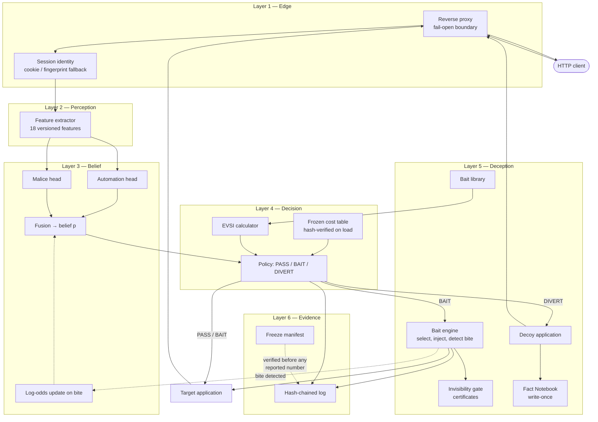
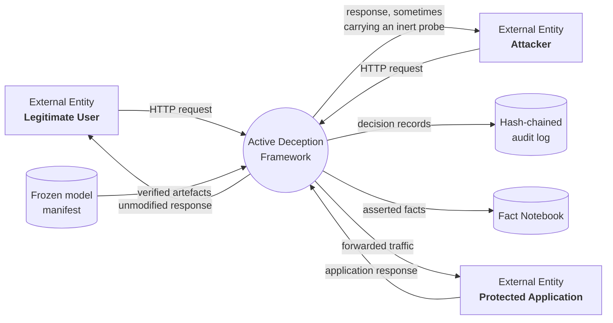
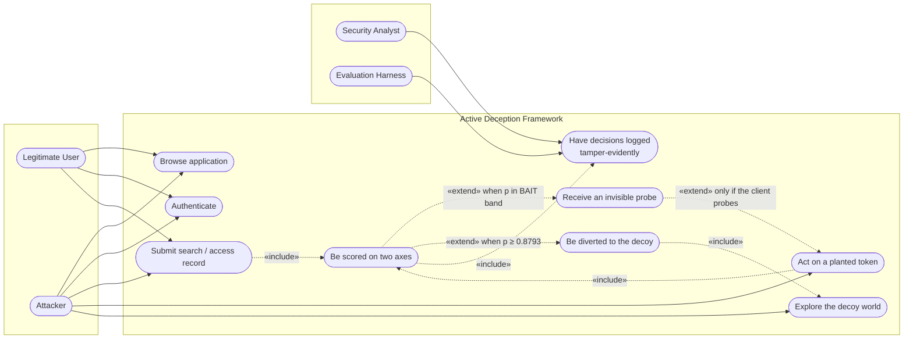
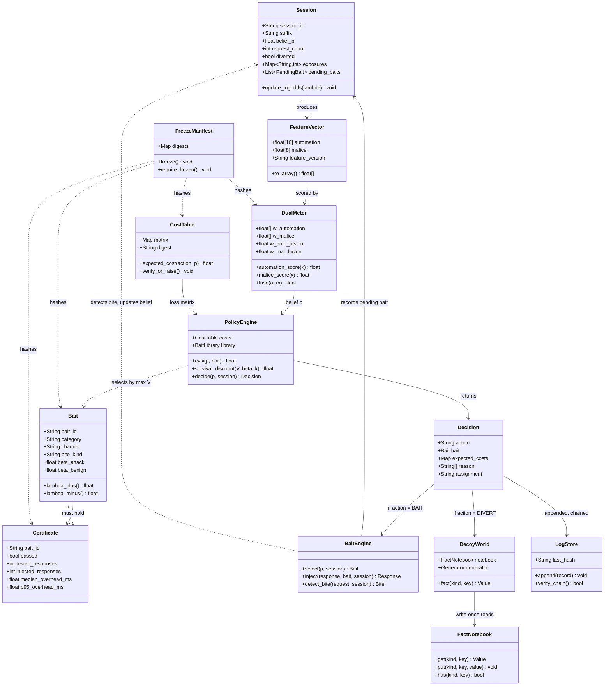
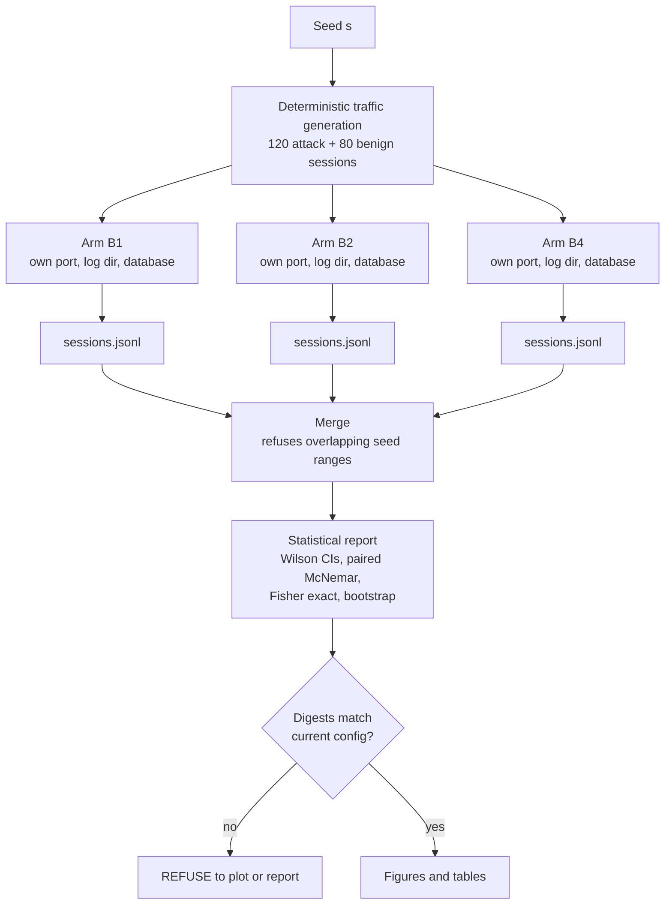

# CHAPTER 3 (continued)

## 3.6 System Architecture Overview

The framework follows a **modular, layered architecture**. Each component has one
responsibility and communicates with its neighbours through a narrow interface, so
that components can be tested in isolation and disabled independently — which is what
makes the ablation study of Chapter 4 possible at all.

### 3.6.1 The layers

**Layer 1 — Edge (reverse proxy).** The only component in the request path. It
terminates the client connection, establishes session identity, invokes the layers
below, forwards to the correct upstream, and — if the policy chose BAIT — injects
into the response on its way back. It is also the fail-open boundary: any exception
raised beneath it results in the request being served normally.

**Layer 2 — Perception (feature extraction).** Converts the request, plus the
session's accumulated history, into the eighteen features of Tables 4 and 5. It is
strictly request-side: it never sees ground truth, and it never inspects the response
body. The feature set is versioned and its ordered name list is hashed into the
freeze manifest.

**Layer 3 — Belief (dual meter).** Two logistic heads produce the automation and
malice scores; the fusion block produces the belief *p*. This layer also applies the
Bayesian log-odds update when a bite is detected on a later request.

**Layer 4 — Decision (priced policy).** Computes the expected cost of each action,
computes the value of information for each *deployable* bait, subtracts it, and
returns the action with the least effective cost together with the reasons. This
layer owns the frozen cost table and refuses to operate against an uncalibrated bait
library.

**Layer 5 — Deception (bait engine, gate, decoy, notebook).** Selects and injects
baits, verifies certificates at run time, detects bites on subsequent requests, and —
for diverted sessions — serves the state-consistent decoy backed by the Fact
Notebook.

**Layer 6 — Evidence (hash-chained log, freeze manifest).** Records every decision in
a tamper-evident store and guarantees that no reported number can be produced against
a model that has drifted.



**Figure 11 — Layered system architecture.**

### 3.6.2 Component responsibilities

| Component | Responsibility |
|---|---|
| **Reverse proxy** | Sole request-path component; routes to target or decoy; injects on the response path; enforces fail-open |
| **Session manager** | Mints and tracks session identity; maintains per-session accumulated state |
| **Feature extractor** | Produces 18 versioned features from request and session history; never sees labels |
| **Dual meter** | Two logistic heads plus explicit fusion; owns the belief and its Bayesian updates |
| **Cost table** | Frozen, hashed, verified on every load; the sole source of the loss matrix |
| **EVSI calculator** | Computes V(p) per deployable bait, applies the survival discount |
| **Policy engine** | Selects the least-effective-cost action; records the comparison that decided it |
| **Bait library** | Holds the calibrated baits with their measured β_attack, β_benign |
| **Invisibility gate** | Issues certificates offline; the engine re-checks them at run time |
| **Bait engine** | Selects a bait by max V, injects it, detects bites on later requests |
| **Decoy application** | Serves a parity-matched fake world to diverted sessions |
| **Fact Notebook** | Write-once entity store; the source of the consistency guarantee |
| **Log store** | Append-only, hash-chained; records every decision with its justification |
| **Freeze manifest** | Hashes every artefact a decision depends on; verified before reporting |

**Table 14 (forward reference) — Key architectural components.** Repeated with
implementation detail in Section 4.2.2.

### 3.6.3 Evaluation arms

Because every component is separately switchable, the same binary serves as six
different systems selected by a single mode flag. This is what makes the comparison in
Chapter 4 a comparison of *systems* rather than of *samples*.

| Arm | Rules | Scoring | Probe | Decoy | Purpose |
|---|:--:|:--:|:--:|:--:|---|
| **B0** no defence | – | – | – | – | Undefended traffic; the ceiling on attacker success |
| **B1** signature WAF | ✓ | – | – | – | The conventional baseline |
| **B2** passive | – | ✓ | – | – | The detector without the probe |
| **B3** static | – | ✓ | – | ✓ | Diversion without the priced middle action |
| **B4** full | – | ✓ | ✓ | ✓ | **The system of this report** |
| **B5** fixed edges | – | ✓ | ✓ | ✓ | B4 with hand-set band edges, for §4.5.3 |

**Table 11 — Evaluation arms and the components each enables.**

B4 and B5 differ in exactly one function: B5 prices the probe at its immediate cost
and takes hand-set thresholds, where B4 subtracts the value of information and derives
them. Nothing else in the two paths differs, which is what makes the comparison in
Section 4.5.3 a test of *the derivation* rather than of two different systems.

An arm cannot leak capability into another by accident, because components are
constructed only in the modes that declare them: a mode without probing has no bait
engine object to call.

**A note on the word "diverted".** Throughout the evaluation, *diverted* means **the
policy decided to divert** — a detection event, counted identically in every arm.
Whether the session is then contained depends on whether that arm has a decoy: B4
routes it into one; B2 records the same decision and lets the request continue to the
real application, because B2 exists to measure the detector rather than the
containment. Recall is therefore comparable across arms by construction, and a recall
figure in this report is a claim about *deciding*, not about what the attacker
experienced afterwards.

This also explains why **B3 is implemented but not reported**. Its decision path is
identical to B2's — same features, same meter, same two-action rule — and the only
difference is where a diverted session is sent afterwards, which cannot change whether
the policy decided to divert it. Its recall would equal B2's by construction, and
reporting it as a separate row would suggest an independent measurement that does not
exist.

### 3.6.4 Overall system flow

```mermaid
flowchart TD
    A(["User / attacker sends request"]) --> B["Proxy establishes session identity"]
    B --> C["Extract 18 features from<br/>request + session history"]
    C --> D["Dual meter &rarr; belief p"]
    D --> E{"Was a bait planted<br/>earlier in this session?"}
    E -->|"yes"| F{"Does this request<br/>carry the token?"}
    E -->|"no"| H
    F -->|"yes — BITE"| G1["logit(p) += log &Lambda;&#8314;"]
    F -->|"no"| G2["logit(p) += log &Lambda;&#8315;<br/>exposure count k += 1"]
    G1 --> H
    G2 --> H
    H["Policy: compute E[C(a)] for each action<br/>and V(p) for each deployable bait"] --> I{"Least effective cost?"}
    I -->|"PASS"| J["Forward untouched"]
    I -->|"BAIT"| K["Forward untouched,<br/>then inject on the response"]
    I -->|"DIVERT"| L["Route session to decoy<br/>for the rest of its life"]
    J --> M["Hash-chained log record"]
    K --> N{"Holdout draw:<br/>withhold probe?"}
    N -->|"~10% — control"| J2["Forward untouched,<br/>recorded as withheld"]
    N -->|"~90% — treated"| K2["Certificate re-checked,<br/>probe injected"]
    J2 --> M
    K2 --> M
    L --> O["Fact Notebook serves<br/>consistent fake world"] --> M
    M --> P(["Response returned to client"])
```



**Figure 12 — Overall system flow, including the randomised holdout.** The holdout
branch is not a production feature; it is an experimental instrument built into the
treated arm so that the probe's causal effect can be identified. It is described in
Section 3.7 and analysed in Section 4.4.3.

## 3.7 Design Flow (Algorithm)

This section states the framework's behaviour as executable pseudocode. It is written
so that the system could be reimplemented from this report alone, without reference to
the source code.

### Algorithm 1 — Request handling (top level)

```
ALGORITHM handle_request(req)
INPUT   req — an incoming HTTP request
OUTPUT  resp — the HTTP response returned to the client

 1  sess ← session_for(req)                       # cookie, else fingerprint if enabled
 2  IF sess is new THEN
 3      sess.state ← { p: prior, exposures: {}, pending_baits: [], diverted: false }
 4
 5  TRY                                            # ---- fail-open boundary ----
 6      x    ← extract_features(req, sess)         # Algorithm 2
 7      sess ← detect_bite_and_update(req, sess)   # Algorithm 3
 8      p    ← fuse(meter.automation(x), meter.malice(x))
 9      dec  ← decide(p, sess)                     # Algorithm 4
10  CATCH any exception e
11      log_fail_open(req, sess, e)
12      RETURN forward(req, target_upstream)       # serve normally; divert nothing
13
14  IF sess.diverted OR dec.action = DIVERT THEN
15      sess.diverted ← true                       # a diverted session stays diverted
16      upstream ← decoy_upstream IF decoy_enabled ELSE target_upstream
17  ELSE
18      upstream ← target_upstream
19
20  resp ← forward(req, upstream)                  # the request is ALWAYS served
21
22  IF dec.action = BAIT THEN
23      IF in_holdout(sess.id) THEN                # deterministic draw; Algorithm 6
24          record(sess, assignment := "holdout")  # control: probe withheld
25      ELSE
26          resp ← inject_bait(resp, dec.bait, sess)   # Algorithm 5
27          record(sess, assignment := "policy")
28
29  append_to_hash_chain(req, x, p, dec, resp_meta, labels)
30  RETURN resp
```

Line 20 is the line that matters most: **the request is always served**. Baiting adds
information; it withholds nothing. This is why `attack / BAIT` costs the same as
`attack / PASS` in Table 6.

### Algorithm 2 — Feature extraction

```
ALGORITHM extract_features(req, sess)
OUTPUT  x — an 18-dimensional feature vector

 1  now ← req.timestamp
 2  # ---- automation axis (10) ----
 3  x.auto_interarrival_last    ← now − sess.last_request_time
 4  x.auto_interarrival_cv      ← stdev(sess.gaps) / mean(sess.gaps)   # 0 if <2 gaps
 5  x.auto_requests_per_min     ← 60 · sess.request_count / age(sess)
 6  x.auto_asset_fetch_ratio    ← sess.asset_fetches / max(sess.page_loads, 1)
 7  x.auto_fetched_assets       ← |sess.distinct_assets|
 8  x.auto_browser_header_ratio ← sess.reqs_with_browser_headers / sess.request_count
 9  x.auto_header_count         ← |req.headers|
10  x.auto_ua_is_tool           ← 1 IF req.user_agent matches TOOL_PATTERNS ELSE 0
11  x.auto_ua_stable            ← 1 IF req.user_agent = sess.first_user_agent ELSE 0
12  x.auto_cookie_carried       ← 1 IF req carries the issued session cookie ELSE 0
13
14  # ---- malice axis (8) ----
15  params ← parse_query_and_body(req)
16  x.mal_input_length       ← max(|v| for v in params.values())
17  x.mal_special_char_ratio ← count(v, SPECIAL_CHARS) / total_length(params)
18  x.mal_db_keyword_hits    ← count of SQL keywords across params
19  x.mal_db_keyword_any     ← 1 IF x.mal_db_keyword_hits > 0 ELSE 0
20  x.mal_failed_auth        ← sess.failed_auth_count
21  x.mal_error_ratio        ← sess.responses_4xx_5xx / sess.request_count
22  x.mal_param_mutation     ← sess.param_revisions / max(sess.request_count, 1)
23  x.mal_distinct_usernames ← |sess.usernames_attempted|
24
25  ASSERT no ground-truth label was read           # enforced by construction
26  RETURN x
```

Line 21 is where the double count of Section 3.2.1 was removed: login rejections
count once, in `mal_failed_auth`, and are excluded from the error ratio.

### Algorithm 3 — Bite detection and Bayesian update

```
ALGORITHM detect_bite_and_update(req, sess)

 1  FOR EACH b IN sess.pending_baits DO
 2      IF bait_signal_present(req, b) THEN             # value, name, or path match
 3          IF b.kind = "value" AND b.session_suffix ≠ sess.suffix THEN
 4              cross_session ← true                    # valid: value tokens are unique
 5          ELSE IF b.kind = "name" AND b.issued_to ≠ sess.id THEN
 6              CONTINUE                                # name tokens are NOT unique:
 7                                                      # cross-session claim invalid
 8          sess.p ← sigmoid( logit(sess.p) + log(b.lambda_plus) )
 9          record_bite(sess, b, cross_session)
10          sess.pending_baits.remove(b)
11      ELSE IF b.was_shown AND request_count_since(b) ≥ 1 THEN
12          sess.p ← sigmoid( logit(sess.p) + log(b.lambda_minus) )
13          sess.exposures[b.id] ← sess.exposures[b.id] + 1
14  RETURN sess
```

Lines 3–7 encode the token-uniqueness distinction of Section 3.2.3. Reporting a
cross-session bite for a *name* bait would be unsound, because the name is fixed and
could have been learned anywhere.

### Algorithm 4 — The priced decision rule

```
ALGORITHM decide(p, sess)
OUTPUT  dec — { action, bait, expected_costs, reason }

 1  # ---- immediate expected costs from the FROZEN cost table ----
 2  E_pass   ← (1 − p)·C[benign][pass]   + p·C[attack][pass]      # = 25p
 3  E_bait   ← (1 − p)·C[benign][bait]   + p·C[attack][bait]      # = 1 + 24p
 4  E_divert ← (1 − p)·C[benign][divert] + p·C[attack][divert]    # = 200 − 220p
 5
 6  # ---- value of information for each DEPLOYABLE bait ----
 7  best_V ← 0 ; best_bait ← NONE
 8  FOR EACH j IN bait_library WHERE applicable(j, sess) AND certified(j) DO
 9      V_j ← evsi(p, j.beta_attack, j.beta_benign)               # Algorithm 5a
10      k   ← sess.exposures[j.id]
11      V_j ← V_j · (1 − j.beta_attack)^k                         # survival discount
12      IF V_j > best_V THEN best_V ← V_j ; best_bait ← j
13
14  ASSERT best_V ≥ 0                                             # Property 1, enforced
15
16  effective_bait ← E_bait − best_V
17
18  # ---- choose the least effective cost ----
19  costs ← { pass: E_pass, bait: effective_bait, divert: E_divert }
20  action ← argmin(costs)
21
22  IF action = BAIT AND best_bait = NONE THEN
23      action ← PASS                     # nothing deployable; do not pretend
24
25  RETURN { action, bait: best_bait, expected_costs: costs,
26           reason: comparison that decided it }
```

### Algorithm 5a — Expected value of sample information

```
ALGORITHM evsi(p, beta_a, beta_b)
OUTPUT  V — the expected value of running this probe at belief p

 1  IF p ≤ 0 OR p ≥ 1 THEN RETURN 0            # Property 2: V(0) = V(1) = 0
 2
 3  P_bite ← p·beta_a + (1 − p)·beta_b
 4  IF P_bite ≤ 0 OR P_bite ≥ 1 THEN RETURN 0
 5
 6  p_yes ← (p · beta_a)       / P_bite                    # Bayes posterior, bite
 7  p_no  ← (p · (1 − beta_a)) / (1 − P_bite)              # Bayes posterior, no bite
 8
 9  before ← min_action_cost(p)
10  after  ← P_bite · min_action_cost(p_yes)
11              + (1 − P_bite) · min_action_cost(p_no)
12
13  RETURN max(before − after, 0)               # clamp enforces Property 1
```

```
ALGORITHM min_action_cost(q)
 1  RETURN min( (1−q)·C[benign][pass]   + q·C[attack][pass],
 2              (1−q)·C[benign][bait]   + q·C[attack][bait],
 3              (1−q)·C[benign][divert] + q·C[attack][divert] )
```

### Algorithm 5b — Bait injection

```
ALGORITHM inject_bait(resp, bait, sess)

 1  cert ← certificate_for(bait)
 2  IF cert is absent OR NOT cert.passed THEN
 3      RETURN resp                            # refuse to serve an uncertified bait
 4  IF cert.median_overhead_ms > MAX_OVERHEAD_MS THEN
 5      RETURN resp
 6
 7  suffix ← sha256(seed ‖ sess.id)[0:6]       # per-session uniqueness
 8  token  ← bait.template.format(suffix)
 9
10  SWITCH bait.channel
11      CASE "error_text":    body ← splice_into_error_message(resp.body, token)
12      CASE "html_comment":  body ← insert_before_closing_body(resp.body, token)
13      CASE "json_field":    body ← add_unused_field(resp.body, bait.field, token)
14
15  ASSERT rendered_text(body) = rendered_text(resp.body)     # invariant, tested
16  resp.body ← body
17  sess.pending_baits.append({ id: bait.id, token, suffix,
18                              kind: bait.bite_kind, issued_to: sess.id,
19                              lambda_plus: bait.beta_a / bait.beta_b,
20                              lambda_minus: (1−bait.beta_a)/(1−bait.beta_b) })
21  RETURN resp
```

### Algorithm 6 — The randomised holdout

```
ALGORITHM in_holdout(session_id)
OUTPUT  true if this session's probe should be WITHHELD (control group)

 1  digest ← sha256( run_seed ‖ session_id )
 2  draw   ← int(digest[0:8]) / 2^64                # uniform in [0, 1)
 3  RETURN draw < holdout_fraction                  # 0.1 in the shipped config
```

The draw is **deterministic given the seed and the session id**, which has two
consequences that matter for the evaluation. It is reproducible: re-running the same
seed reproduces the same assignment exactly. And it is independent of the belief, the
features and the outcome, so the treated and control groups are exchangeable at the
moment of assignment — which is what licenses the causal interpretation in
Section 4.4.3.

### Algorithm 7 — Decoy fact resolution

```
ALGORITHM decoy_fact(kind, key)

 1  IF notebook.has(kind, key) THEN
 2      RETURN notebook.get(kind, key)         # already asserted; MUST NOT change
 3  value ← generator.produce(kind, key)       # deterministic RNG or language model
 4  notebook.put(kind, key, value)             # write-once; never overwritten
 5  RETURN value
```

### Algorithm 8 — Hash-chained log append

```
ALGORITHM append_to_hash_chain(req, x, p, dec, resp_meta, labels)

 1  record ← { request: summarise(req), features: x, scores: {automation, malice},
 2             belief: p, decision: dec, bait: injected_bait_or_none,
 3             bite: bite_or_none, labels: labels, timestamp: now }
 4  prev  ← store.last_hash  OR  "0" × 64
 5  h     ← sha256( canonical_json(record) ‖ record.timestamp ‖ prev )
 6  record.integrity ← { hash: h, prev_hash: prev }
 7  store.append(record)                       # append-only; no update path exists
```

### Worked example: one session end to end

| Req | Path | Features (abridged) | p before | Action | Event | p after |
|---:|---|---|---:|---|---|---:|
| 1 | `GET /` | browser headers, assets fetched | 0.020 | PASS | — | 0.020 |
| 2 | `GET /search?q=widget` | clean parameter | 0.031 | PASS | — | 0.031 |
| 3 | `GET /search?q=widget'` | special char ratio ↑, 500 seen | 0.163 | **BAIT** | `B-SQL-1` injected | 0.163 |
| 4 | `GET /records/1041` | id access | 0.163 | BAIT | already pending | 0.163 |
| 5 | `GET /records/1042` | sequential id | 0.476 | BAIT | `B-IDOR-2` injected | 0.476 |
| 6 | `GET /records/1043?internal_view=1` | **carries planted parameter** | 0.476 | — | **BITE**, Λ⁺ = 112.3 | **0.990** |
| 7 | `GET /records/1044` | — | 0.990 | **DIVERT** | routed to decoy | 0.990 |

At request 6 the belief moves from 0.476 to 0.990 in a single step, because
log(112.3) = 4.72 is added to the log-odds. The probe did not detect the attack; it
*created the evidence* that let the passive meter's belief cross the divert edge.
This is the mechanism the entire report is about.

## 3.8 Flowcharts

### 3.8.1 Sequence Diagram (Step-by-Step Execution)

```mermaid
sequenceDiagram
    autonumber
    actor U as Client
    participant PX as Reverse Proxy
    participant FE as Feature Extractor
    participant MT as Dual Meter
    participant PO as Policy Engine
    participant BE as Bait Engine
    participant TG as Target App
    participant DC as Decoy + Notebook
    participant LG as Hash-Chained Log

    U->>PX: HTTP request
    PX->>PX: resolve session identity
    PX->>FE: request + session history
    FE-->>PX: 18 features
    PX->>BE: check pending baits
    alt token present in request
        BE-->>MT: BITE (bait id, &Lambda;&#8314;)
        MT->>MT: logit(p) += log &Lambda;&#8314;
    else probe shown but ignored
        BE-->>MT: no bite (&Lambda;&#8315;), exposures += 1
        MT->>MT: logit(p) += log &Lambda;&#8315;
    end
    PX->>MT: features
    MT-->>PX: belief p
    PX->>PO: p, session state
    PO->>PO: E[C(pass)], E[C(bait)], E[C(divert)]
    PO->>PO: V(p) per deployable bait, survival-discounted
    PO-->>PX: action + reasons

    alt action = PASS
        PX->>TG: forward
        TG-->>PX: response (unmodified)
    else action = BAIT
        PX->>TG: forward (request still served)
        TG-->>PX: response
        PX->>BE: holdout draw
        alt withheld (~10%)
            BE-->>PX: return unmodified, record as control
        else treated (~90%)
            BE->>BE: verify certificate
            BE-->>PX: response with probe injected
        end
    else action = DIVERT
        PX->>DC: forward (session pinned to decoy)
        DC->>DC: notebook.get or generate-then-write-once
        DC-->>PX: consistent fake response
    end

    PX->>LG: append record (chained hash)
    PX-->>U: response
```

**Figure 13 — Sequence diagram (step-by-step execution).**

### 3.8.2 DFD Level 0 (Context Diagram)



**Figure 14 — DFD Level 0 (context diagram).** From outside, the framework is a
transparent reverse proxy. The legitimate user and the attacker send the same kind of
request and receive responses that differ only in bytes neither a browser nor a human
ever renders.

### 3.8.3 DFD Level 1 (Detailed System Flow)

```mermaid
flowchart TD
    U["User / Attacker"] -->|"1. request"| P1["Process 1<br/><b>Session Resolution</b>"]
    P1 -->|"2. session id + history"| P2["Process 2<br/><b>Feature Extraction</b>"]
    P1 <-->|"session state"| D1[("Session Store")]
    P2 -->|"3. 18 features"| P3["Process 3<br/><b>Belief Estimation</b>"]
    D2[("Frozen meter<br/>weights")] --> P3
    P3 -->|"4. belief p"| P4["Process 4<br/><b>Priced Decision</b>"]
    D3[("Frozen cost table")] --> P4
    D4[("Calibrated<br/>bait library")] --> P4
    P4 -->|"5a. PASS / BAIT"| P5["Process 5<br/><b>Upstream Forwarding</b>"]
    P4 -->|"5b. DIVERT"| P6["Process 6<br/><b>Decoy Service</b>"]
    P5 <--> A1["Target Application"]
    P6 <--> D5[("Fact Notebook<br/>write-once")]
    P4 -->|"6. bait selected"| P7["Process 7<br/><b>Bait Injection</b>"]
    D6[("Invisibility<br/>certificates")] --> P7
    P5 -->|"response"| P7
    P7 -->|"7. response + probe"| U
    P5 -->|"response"| U
    P6 -->|"decoy response"| U
    P7 -->|"8. pending bait record"| D1
    P2 -->|"token present?"| P8["Process 8<br/><b>Bite Detection</b>"]
    D1 --> P8
    P8 -->|"9. &Lambda;&#8314; or &Lambda;&#8315;"| P3
    P4 -->|"10. decision record"| P9["Process 9<br/><b>Tamper-Evident Logging</b>"]
    P7 --> P9
    P8 --> P9
    P9 --> D7[("Append-only<br/>hash-chained log")]
```



**Figure 15 — DFD Level 1 (detailed system flow).** Process 8 closes the loop:
evidence created by a probe on an earlier request re-enters belief estimation on a
later one.

### 3.8.4 Use Case Diagram



**Figure 16 — Use case diagram.** Only the attacker reaches "act on a planted token":
not because the framework prevents the legitimate user from doing so, but because the
token appears nowhere a browser renders. This was measured: among the benign sessions
that were shown a probe (7,098 of them), **zero** acted on one.

### 3.8.5 Class Diagram



**Figure 17 — Class diagram.** The `Certificate` association on `Bait` is a hard
requirement rather than a convenience: a `Bait` without a passing `Certificate` cannot
be served, and the check happens at run time rather than at load time.

### 3.8.6 Session State Machine

```mermaid
stateDiagram-v2
    [*] --> Observed : first request
    Observed --> Observed : p &lt; 0.0647 (PASS)
    Observed --> Probed : 0.0647 &le; p &lt; 0.8793 (BAIT)
    Observed --> Contained : p &ge; 0.8793 (DIVERT)

    Probed --> Probed : probe ignored, k += 1,<br/>V decays by (1 &minus; &beta;)^k
    Probed --> Contained : BITE, logit(p) += log &Lambda;&#8314;,<br/>p crosses 0.8793
    Probed --> Observed : belief falls back below 0.0647
    Probed --> Withheld : holdout draw (control)
    Withheld --> Observed : no probe served
    Withheld --> Contained : passive evidence alone crosses the edge

    Contained --> Contained : all further requests<br/>served by the decoy
    Contained --> [*] : session ends

    note right of Probed
        As k grows, V &rarr; 0 and the rule
        collapses to the two-action policy:
        the limiting-rule guarantee of &sect;3.2.2
    end note
```



**Figure 18 — Session state machine.** `Contained` is absorbing: once a session is
diverted it stays diverted for its lifetime, so an attacker cannot oscillate back into
the real application by behaving well for a few requests.

## 3.9 Implementation Plan

Implementation proceeded in eight phases. Each had a written exit condition that was
verified before the next began.

| Phase | Objective | Exit condition | Verified by |
|---|---|---|---|
| 0 | Foundation | Cost table written, hashed, committed; label schema fixed; logging skeleton | Hash recorded in changelog; schema tests |
| 1 | Target app + benign corpus | Six corpus checks pass; hard negatives present | `generate_corpus` verification |
| 2 | Attack round 1 | 2 × 2 automation/malice coverage; label join verified non-empty | Provenance-id join coverage test |
| 3 | Detection engine (B2) | End-to-end on identical traffic; zero benign diversions among automated clients | Multi-seed smoke run |
| 4 | Bait library, **gate first** | Gate exists before any bait; every bait certified; bite rates calibrated | Certificate file; calibration report |
| 5 | Decoy + notebook + fuzzer | 0 % contradiction over 286 probes; full target/decoy parity | Consistency fuzzer; 19 parity tests |
| 6 | Integration, fail-open, freeze | Per-component fail-open verified; manifest frozen and verified | Fault-injection tests; freeze verify |
| 7 | Round 2, baselines, ablations | 99-seed evaluation; protocol pre-registered; ablations reported | Statistical report; figure digests |

**Table 12 — Development phases and their exit conditions.**

### Phase 0 — Foundation

**Objective.** Fix everything that must not move later.

**Detail.** The cost matrix of Table 6 was written, given a SHA-256 digest over its
matrix and fusion blocks, and committed with a dated changelog entry. The loader
verifies this digest on **every load** and raises `FrozenConfigError` on mismatch, so
a moved cost table stops every component that makes a decision. The record schema was
fixed at this point too, because retrofitting a schema after data collection is the
classic way to lose a corpus.

**Output.** A hashed cost table, a versioned record schema, and an append-only log
store with hash chaining.

### Phase 1 — Target application and benign corpus

**Objective.** Build something worth defending and traffic worth defending it against.

**Detail.** The target is a FastAPI records application with deliberate weaknesses: an
SQL-injectable search, object-reference endpoints without ownership checks, and a
login flow that leaks account existence. The benign generator produces **80 sessions
per draw**: three-quarters simulated humans and one quarter automated-but-harmless
clients.

The composition of the benign set is the single most consequential decision in the
whole evaluation, because a safety metric measures only what its inputs contain. The
human quarter deliberately includes **hard negatives** — honest users who behave in
ways an attacker also behaves:

- a staff member searching for a colleague named *O'Connell* (apostrophe in a query);
- a user who has forgotten their password (repeated failed logins);
- a user who mistypes URLs (elevated 404 rate).

The automated quarter contains an uptime monitor, a search-engine crawler, and a
nightly reporting integration that walks record identifiers in ascending order. That
last client is not decoration: it produced the most useful finding in the project, and
it is the reason the benign numbers in Chapter 4 mean anything.


**Figure 19 — Corpus construction and label-join verification.** The refusal at the
coverage check exists because an early version of this project produced a corpus whose
label join matched **zero** requests, and nothing downstream noticed.

**Output.** A labelled, verified benign corpus with hard negatives.

### Phase 2 — Attack round 1 (training corpus)

**Objective.** Produce hostile traffic with reliable labels, covering all four
quadrants of Figure 3.

**Detail.** Generators for SQL injection, object-reference walking and credential
attacks, deliberately spanning the automation/malice grid so that the meter cannot
learn "automated ⇒ hostile". Every session carries a provenance identifier that joins
to its ground-truth label, and the join coverage is asserted before the corpus is
emitted.

**Output.** Round-1 corpus, used **only** for training the meter. It is never used for
any reported result.

### Phase 3 — Detection engine (baseline B2)

**Objective.** A working passive detector, which is both a component and a baseline.

**Detail.** Two logistic heads trained on round 1 with scikit-learn; explicit fusion
weights; the cost policy in two-action mode; the reverse proxy wired end to end. This
phase also established fail-open: the proxy serves normally if any scoring component
raises.

**Output.** Baseline **B2**, and the foundation on which B4 is built.

### Phase 4 — Bait library, invisibility gate first

**Objective.** A calibrated bait library in which every bait is provably invisible.

**Detail.** The ordering is the requirement. The gate (Figure 8) was implemented
first, against a corpus of 116 real responses. Baits were then written and submitted
to it; a bait that failed any check was revised or discarded rather than accepted with
a caveat.

The **calibration round** then measured β_attack and β_benign for each bait by
deploying it against both hostile and benign traffic and counting bites, using the
Jeffreys estimator of Section 3.2.3. The policy refuses to produce reportable results
from an uncalibrated library, so this step cannot be skipped.

During this phase `B-AUTH-2` was withdrawn, because the target has no JSON
authentication response and the bait was therefore shown to zero sessions while
carrying a fabricated β_attack of 0.45.

**Output.** Five deployed baits with measured effectiveness and passing certificates.

### Phase 5 — Decoy, Fact Notebook and consistency fuzzer

**Objective.** A fake world that cannot contradict itself, and evidence that it does
not.

**Detail.** The decoy is a second FastAPI application whose route surface is asserted
identical to the target's in both directions. The Fact Notebook is a write-once SQLite
store. The **consistency fuzzer** is an adversarial prober that asks the same question
in different ways, revisits entities after intervening requests, and cross-references
answers across endpoints — seven probe types in total, several hundred probes per run.

A planted credential is placed in the decoy's `service.ini`, and a test asserts it is
absent from the real one, in both directions.

**Output.** A parity-matched decoy with a measured contradiction rate.

### Phase 6 — Integration, fail-open verification and model freeze

**Objective.** One system, verified to degrade safely, with every artefact hashed.

**Detail.** Fault injection breaks each of the three scoring components in turn and
asserts the request is still served. The freeze manifest is then written over the
meter, cost table, feature list, schema, bait library and certificates. Freezing
refuses if the bait library is uncalibrated.

**Output.** A frozen, hash-verified model.

### Phase 7 — Attack round 2, baselines, ablations

**Objective.** Evaluate honestly against traffic the detector has never seen.

**Detail.** A second attack corpus, written after the detector was built and
deliberately unlike round 1, with **120 attack sessions per draw** across five
subcategories. Each arm runs over **99 independent seeded draws** against the one
frozen model. Within a seed, every arm sees byte-identical traffic.



**Figure 20 — Evaluation harness and arm isolation.** Because a draw is serial, the
seed range is split across processes with disjoint seeds and separate ports, logs and
databases; the merge refuses to combine overlapping ranges so that a mistake in the
split fails loudly rather than double-counting sessions into every pooled proportion.

**Output.** The results of Chapter 4.
