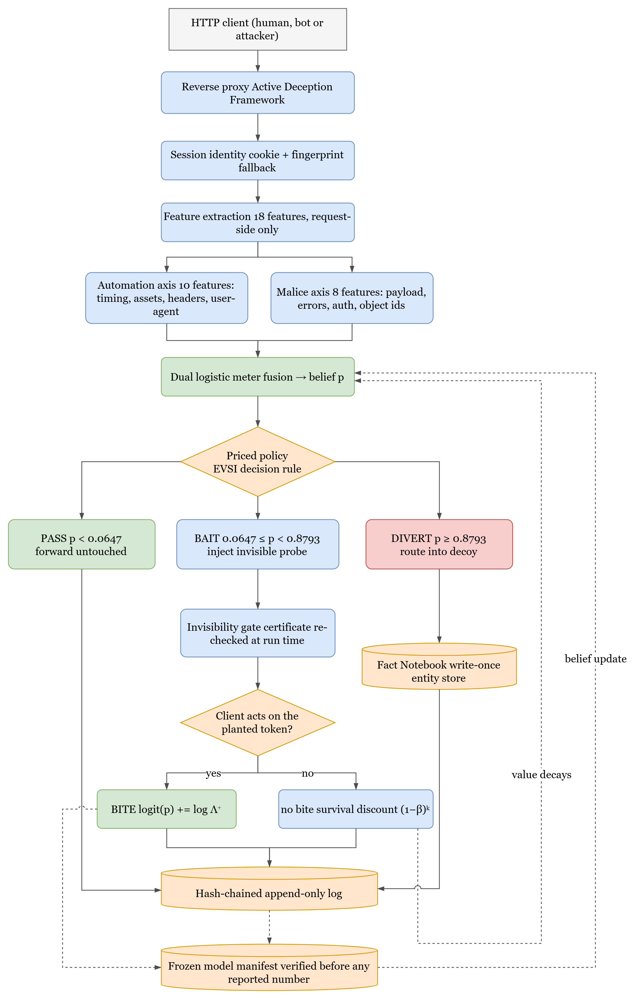

# Front Matter

---

## Title Page

**An Active Deception Framework for Web Attack Detection:
Response-Side Probes and State-Consistent Decoys**

A PROJECT REPORT

Submitted by:

23BIS70035 Parth Kansal
_(co-author roll numbers to be filled in)_ Amrit Singh Nijjer
_(co-author roll numbers to be filled in)_ Siddhant Suyog Mehta

in partial fulfilment for the award of the degree of

**BACHELOR OF ENGINEERING**

IN

COMPUTER SCIENCE WITH SPECIALIZATION IN
INFORMATION SECURITY

Under the Supervision of:
_(supervisor name and employee code to be filled in)_

Chandigarh University, Gharuan, Mohali – 140413, Punjab

_(month and year to be filled in)_

---

## Bonafide Certificate

Certified that this project report **An Active Deception Framework for Web Attack
Detection: Response-Side Probes and State-Consistent Decoys** is the Bonafide work
of **Parth Kansal (23BIS70035), Amrit Singh Nijjer (_roll no._), Siddhant Suyog
Mehta (_roll no._)** who carried out the project work under my/our supervision.

|  |  |
|---|---|
| **SIGNATURE** | **SIGNATURE** |
| _(HOD name and code)_ | _(Supervisor name and code)_ |
| **HEAD OF THE DEPARTMENT** | SUPERVISOR |
| AIT-CSE(Core) | Assistant Professor |
|  | AIT-CSE(Core) |

Submitted for the project viva-voce examination held on ______________

INTERNAL EXAMINER                    EXTERNAL EXAMINER

---

## Table of Contents

| Section | Page |
|---|---|
| ABSTRACT | i |
| GRAPHICAL ABSTRACT | ii |
| LIST OF FIGURES | iii |
| LIST OF TABLES | iv |
| LIST OF ABBREVIATIONS | v |
| **CHAPTER 1 — INTRODUCTION** | 1 |
| 1.1 Problem Definition | 1 |
| 1.2 Problem Overview | 4 |
| 1.3 Task Identification | 6 |
| 1.4 Timeline | 9 |
| **CHAPTER 2 — LITERATURE SURVEY** | 10 |
| 2.1 Literature Survey | 10 |
| 2.2 Research Gaps | 17 |
| 2.3 Top Papers to Read | 19 |
| 2.4 Research Paper Summaries | 20 |
| 2.5 Datasets and Tools | 25 |
| **CHAPTER 3 — DESIGN FLOW / PROCESS** | 27 |
| 3.1 Concept Generation | 27 |
| 3.2 Proposed Concept | 29 |
| 3.2.1 The Dual Suspicion Meter | 30 |
| 3.2.2 Pricing the Probe as an Information Purchase | 34 |
| 3.2.3 The Bait Library and the Invisibility Gate | 41 |
| 3.2.4 The Decoy Environment and the Fact Notebook | 46 |
| 3.2.5 Tamper-Evident Logging and the Frozen Model | 49 |
| 3.3 Design Constraints | 51 |
| 3.4 Alternative Designs | 54 |
| 3.4.1 Design 1: Passive Two-Action Detector | 55 |
| 3.4.2 Design 2: Always-On Honeytokens | 56 |
| 3.4.3 Design 3: Priced Three-Action Policy (Proposed) | 57 |
| 3.5 Best Design Selection | 59 |
| 3.6 System Architecture Overview | 61 |
| 3.7 Design Flow (Algorithm) | 65 |
| 3.8 Flowcharts | 70 |
| 3.9 Implementation Plan | 76 |
| **CHAPTER 4 — RESULTS ANALYSIS AND VALIDATION** | 84 |
| 4.1 Implementation Using Modern Engineering Tools | 84 |
| 4.2 System Design and Architecture | 87 |
| 4.3 Testing and Validation | 90 |
| 4.4 Results and Observations | 94 |
| 4.5 Data Analysis and Interpretation | 102 |
| 4.6 Validation of the System | 108 |
| 4.7 Challenges and Limitations | 111 |
| **CHAPTER 5 — CONCLUSION AND FUTURE WORK** | 114 |
| 5.1 Conclusion | 114 |
| 5.2 Deviation from Expected Results | 117 |
| 5.3 Future Work (Way Ahead) | 121 |
| 5.4 Final Remarks | 125 |
| 5.5 References | 126 |

---

## ABSTRACT

A web application firewall must commit to a decision — allow the request or block
it — on the evidence that a single request happens to carry. Deception, when it is
used at all, normally happens *after* that commitment: a session already judged
hostile is moved into a honeypot. This project asks a different question. Instead
of treating deception as a destination for attackers who have already been caught,
it treats deception as an *instrument the detector can use while the decision is
still open*.

The system built here is an Active Deception Framework (ADF) that sits as a reverse
proxy in front of a web application. Every request is reduced to eighteen features
across two independent axes — how automated the client behaves, and how malicious
its inputs look — which a dual logistic meter fuses into a single belief that the
session is hostile. When that belief is neither low enough to ignore nor high enough
to act on, the framework adds an invisible, inert **probe** to the response: a fake
table name inside a database error, an unused field in a JSON reply, a hint at a
deprecated endpoint planted in a login failure. A real browser never renders any of
it. A client reading raw traffic and probing the application will act on it, and the
moment it does, it has identified itself.

The contribution is not the probe but the rule that decides when to deploy one.
Probing has no immediate benefit — the request still reaches the real application —
so its entire worth is the information a bite would reveal. Pricing that worth as
the **expected value of sample information** makes probing the cost-optimal action
over a belief band whose two edges are *outputs* of a frozen cost table and a
measured bite likelihood ratio rather than thresholds chosen by hand. Under cost
accounting alone the band is provably empty, so the middle action cannot be
reproduced by tuning a threshold: it exists only because information has value.

The framework was evaluated over **99 independent seeded traffic draws** against one
cryptographically frozen model, with 120 attack and 80 benign sessions per draw
(11,880 attack and 7,920 benign sessions per configuration). A **randomised holdout
inside the treated arm** — the probe is withheld from about one session in ten at the
same belief state — estimates the probe's causal effect at **+0.070 [+0.052, +0.088]**
(Fisher exact, *p* = 3.4 × 10⁻¹⁹). Attack recall rises from **0.889** for the passive
detector to **0.943** for the full system (exact paired McNemar over 11,880 matched
pairs, *p* = 1.9 × 10⁻⁹⁵), with the full system ahead in **99 of 99 seeds**. The entire
gain is concentrated in user-interface object-reference attacks, the one category a
signature firewall cannot see and the passive meter finds genuinely uncertain.
Crucially, **none of 7,920 benign sessions is diverted**, and of the 90 % of benign
sessions that were shown a probe, **not one acted on it**.

Against the OWASP ModSecurity Core Rule Set replayed on the same traffic, a real
signature ruleset reaches 0.544 at settings that leave benign users alone, and 1.000
only by blocking 30 % of legitimate sessions. Two further results test the parts a
cost model cannot: a consistency layer holds the decoy's story together over 286
adversarial probes against a 100 % contradiction rate without it, and an autonomous
language-model attacker, told nothing about bait, takes probes at a rate whose
interval overlaps the range measured for the scripted adversary. The report also
documents, in full, the measurement errors that were found and corrected during the
work, because a security evaluation that hides its own near-misses is worth less
than one that reports them.

**Keywords:** cyber deception · honeytokens · value of information · cost-sensitive
detection · web application security · intrusion detection evaluation · Zero Trust

---

## GRAPHICAL ABSTRACT

**Figure 1 — Graphical abstract.** A request enters the reverse proxy, which
identifies the session and reduces it to eighteen features on two independent axes.
A dual logistic meter fuses these into a belief *p* that the session is hostile. A
cost-derived policy then selects one of three actions. **PASS** forwards the request
untouched. **BAIT** injects an invisible, inert probe whose invisibility certificate
is re-checked at run time; if the client later acts on the planted token, the belief
is updated by that bait's measured likelihood ratio, and if it does not, the value of
repeating the probe decays geometrically. **DIVERT** moves the session into a decoy
whose facts are pinned by a write-once Fact Notebook so the fake world cannot
contradict itself. Every decision is written to a hash-chained append-only log, and
every model artefact is hashed into a manifest that must verify before any reported
number can be produced.

---

## LIST OF FIGURES

| Figure | Title | Page |
|---|---|---|
| Figure 1 | Graphical abstract — end-to-end decision and deception pipeline | ii |
| Figure 2 | Project timeline across the eight development phases | 9 |
| Figure 3 | The two-axis threat space and why one score is insufficient | 31 |
| Figure 4 | Life of a single request through the framework | 33 |
| Figure 5 | Expected cost of each action under cost accounting alone | 36 |
| Figure 6 | The derived band after subtracting the value of information | 38 |
| Figure 7 | Invariance of the band across the attacker base rate β | 40 |
| Figure 8 | The invisibility gate as a decision flowchart | 44 |
| Figure 9 | Bait life-cycle across one session | 45 |
| Figure 10 | Decoy consistency: with and without the Fact Notebook | 48 |
| Figure 11 | Layered system architecture | 62 |
| Figure 12 | Overall system flow | 64 |
| Figure 13 | Sequence diagram — step-by-step execution | 70 |
| Figure 14 | DFD Level 0 (context diagram) | 71 |
| Figure 15 | DFD Level 1 (detailed system flow) | 72 |
| Figure 16 | Use case diagram | 73 |
| Figure 17 | Class diagram | 74 |
| Figure 18 | Session state machine | 75 |
| Figure 19 | Corpus construction and label-join verification | 79 |
| Figure 20 | Evaluation harness and arm isolation | 82 |
| Figure 21 | Recall with 95 % confidence intervals by arm | 95 |
| Figure 22 | Per-seed paired comparison across 99 draws | 96 |
| Figure 23 | Randomised holdout: treated against withheld | 98 |
| Figure 24 | Recall by attack subcategory | 100 |
| Figure 25 | Expected cost per session by arm | 104 |
| Figure 26 | Value of information decaying over repeated unrewarded exposures | 40 |
| Figure 27 | Reliability diagram of the shipped belief | 106 |
| Figure 28 | Adaptive adversary: bite rate against awareness | 110 |

## LIST OF TABLES

| Table | Title | Page |
|---|---|---|
| Table 1 | Summary of research papers surveyed | 15 |
| Table 2 | Research gaps and how this project addresses them | 18 |
| Table 3 | Datasets, tools and platforms used | 25 |
| Table 4 | Automation-axis features | 31 |
| Table 5 | Malice-axis features | 32 |
| Table 6 | The frozen cost matrix | 35 |
| Table 7 | Derived action bands under the frozen cost table | 39 |
| Table 8 | The shipped bait library and its calibrated effectiveness | 42 |
| Table 9 | Invisibility certificates for the deployed baits | 45 |
| Table 10 | Comparison of the three candidate designs | 58 |
| Table 11 | Evaluation arms and the components each enables | 63 |
| Table 12 | Development phases and their exit conditions | 77 |
| Table 13 | Technologies used | 84 |
| Table 14 | Key architectural components | 88 |
| Table 15 | Test suite composition | 91 |
| Table 16 | Attack traffic composition per draw | 94 |
| Table 17 | Headline results by arm | 95 |
| Table 18 | Paired McNemar contingency table | 97 |
| Table 19 | Randomised holdout outcome | 98 |
| Table 20 | Holdout balance check across subcategories | 99 |
| Table 21 | Recall by attack subcategory | 100 |
| Table 22 | OWASP CRS paranoia sweep on identical traffic | 101 |
| Table 23 | Benign safety by client class | 102 |
| Table 24 | Hand-set against derived band edges on expected cost | 103 |
| Table 25 | Probability calibration map selection | 105 |
| Table 26 | Reliability table of the shipped belief | 106 |
| Table 27 | Effect of calibrating the belief under the frozen cost table | 107 |
| Table 28 | Third-party attack tools against the framework | 108 |
| Table 29 | Autonomous language-model attackers | 110 |
| Table 30 | The same agent measurement under four harness conditions | 110 |
| Table 31 | Validation criteria and outcomes | 111 |

## LIST OF ABBREVIATIONS

| Abbreviation | Expansion |
|---|---|
| ADF | Active Deception Framework |
| API | Application Programming Interface |
| AUC | Area Under the Receiver Operating Characteristic Curve |
| CI | Confidence Interval |
| CRS | Core Rule Set (OWASP ModSecurity) |
| DFD | Data Flow Diagram |
| ECE | Expected Calibration Error |
| EVSI | Expected Value of Sample Information |
| IAM | Identity and Access Management |
| IDOR | Insecure Direct Object Reference |
| LLM | Large Language Model |
| LR | Likelihood Ratio |
| MFA | Multi-Factor Authentication |
| ML | Machine Learning |
| NLP | Natural Language Processing |
| OWASP | Open Worldwide Application Security Project |
| RBA | Risk-Based Authentication |
| SQLi | SQL Injection |
| TOST | Two One-Sided Tests |
| UA | User Agent |
| VoI | Value of Information |
| WAF | Web Application Firewall |
