<!--
  GENERATED FILE -- do not edit directly.

  This document is built from the chapter files in docs/report/ by:

      python -m tools.build_report

  Edit the chapter files, then regenerate. Editing this file directly means the
  next regeneration silently discards the change.

  Before submission see docs/report/README.md: placeholders to fill, references
  [44]-[60] to confirm against publisher records, table-of-contents page numbers
  to regenerate, and eight Mermaid diagrams to render.
-->

# Front Matter

---

## Title Page

**An Active Deception Framework for Web Attack Detection:
Response-Side Probes and State-Consistent Decoys**

A PROJECT REPORT

Submitted by:

23BIS70035 Parth Kansal
_(co-author roll numbers to be filled in)_ Amrit Singh Nijjer
_(co-author roll numbers to be filled in)_ Siddhant Suyog Mehta

in partial fulfilment for the award of the degree of

**BACHELOR OF ENGINEERING**

IN

COMPUTER SCIENCE WITH SPECIALIZATION IN
INFORMATION SECURITY

Under the Supervision of:
_(supervisor name and employee code to be filled in)_

Chandigarh University, Gharuan, Mohali – 140413, Punjab

_(month and year to be filled in)_

---

## Bonafide Certificate

Certified that this project report **An Active Deception Framework for Web Attack
Detection: Response-Side Probes and State-Consistent Decoys** is the Bonafide work
of **Parth Kansal (23BIS70035), Amrit Singh Nijjer (_roll no._), Siddhant Suyog
Mehta (_roll no._)** who carried out the project work under my/our supervision.

|  |  |
|---|---|
| **SIGNATURE** | **SIGNATURE** |
| _(HOD name and code)_ | _(Supervisor name and code)_ |
| **HEAD OF THE DEPARTMENT** | SUPERVISOR |
| AIT-CSE(Core) | Assistant Professor |
|  | AIT-CSE(Core) |

Submitted for the project viva-voce examination held on ______________

INTERNAL EXAMINER                    EXTERNAL EXAMINER

---

## Table of Contents

| Section | Page |
|---|---|
| ABSTRACT | i |
| GRAPHICAL ABSTRACT | ii |
| LIST OF FIGURES | iii |
| LIST OF TABLES | iv |
| LIST OF ABBREVIATIONS | v |
| **CHAPTER 1 — INTRODUCTION** | 1 |
| 1.1 Problem Definition | 1 |
| 1.2 Problem Overview | 4 |
| 1.3 Task Identification | 6 |
| 1.4 Timeline | 9 |
| **CHAPTER 2 — LITERATURE SURVEY** | 10 |
| 2.1 Literature Survey | 10 |
| 2.2 Research Gaps | 17 |
| 2.3 Top Papers to Read | 19 |
| 2.4 Research Paper Summaries | 20 |
| 2.5 Datasets and Tools | 25 |
| **CHAPTER 3 — DESIGN FLOW / PROCESS** | 27 |
| 3.1 Concept Generation | 27 |
| 3.2 Proposed Concept | 29 |
| 3.2.1 The Dual Suspicion Meter | 30 |
| 3.2.2 Pricing the Probe as an Information Purchase | 34 |
| 3.2.3 The Bait Library and the Invisibility Gate | 41 |
| 3.2.4 The Decoy Environment and the Fact Notebook | 46 |
| 3.2.5 Tamper-Evident Logging and the Frozen Model | 49 |
| 3.3 Design Constraints | 51 |
| 3.4 Alternative Designs | 54 |
| 3.4.1 Design 1: Passive Two-Action Detector | 55 |
| 3.4.2 Design 2: Always-On Honeytokens | 56 |
| 3.4.3 Design 3: Priced Three-Action Policy (Proposed) | 57 |
| 3.5 Best Design Selection | 59 |
| 3.6 System Architecture Overview | 61 |
| 3.7 Design Flow (Algorithm) | 65 |
| 3.8 Flowcharts | 70 |
| 3.9 Implementation Plan | 76 |
| **CHAPTER 4 — RESULTS ANALYSIS AND VALIDATION** | 84 |
| 4.1 Implementation Using Modern Engineering Tools | 84 |
| 4.2 System Design and Architecture | 87 |
| 4.3 Testing and Validation | 90 |
| 4.4 Results and Observations | 94 |
| 4.5 Data Analysis and Interpretation | 102 |
| 4.6 Validation of the System | 108 |
| 4.7 Challenges and Limitations | 111 |
| **CHAPTER 5 — CONCLUSION AND FUTURE WORK** | 114 |
| 5.1 Conclusion | 114 |
| 5.2 Deviation from Expected Results | 117 |
| 5.3 Future Work (Way Ahead) | 121 |
| 5.4 Final Remarks | 125 |
| 5.5 References | 126 |

---

## ABSTRACT

A web application firewall must commit to a decision — allow the request or block
it — on the evidence that a single request happens to carry. Deception, when it is
used at all, normally happens *after* that commitment: a session already judged
hostile is moved into a honeypot. This project asks a different question. Instead
of treating deception as a destination for attackers who have already been caught,
it treats deception as an *instrument the detector can use while the decision is
still open*.

The system built here is an Active Deception Framework (ADF) that sits as a reverse
proxy in front of a web application. Every request is reduced to eighteen features
across two independent axes — how automated the client behaves, and how malicious
its inputs look — which a dual logistic meter fuses into a single belief that the
session is hostile. When that belief is neither low enough to ignore nor high enough
to act on, the framework adds an invisible, inert **probe** to the response: a fake
table name inside a database error, an unused field in a JSON reply, a hint at a
deprecated endpoint planted in a login failure. A real browser never renders any of
it. A client reading raw traffic and probing the application will act on it, and the
moment it does, it has identified itself.

The contribution is not the probe but the rule that decides when to deploy one.
Probing has no immediate benefit — the request still reaches the real application —
so its entire worth is the information a bite would reveal. Pricing that worth as
the **expected value of sample information** makes probing the cost-optimal action
over a belief band whose two edges are *outputs* of a frozen cost table and a
measured bite likelihood ratio rather than thresholds chosen by hand. Under cost
accounting alone the band is provably empty, so the middle action cannot be
reproduced by tuning a threshold: it exists only because information has value.

The framework was evaluated over **99 independent seeded traffic draws** against one
cryptographically frozen model, with 120 attack and 80 benign sessions per draw
(11,880 attack and 7,920 benign sessions per configuration). A **randomised holdout
inside the treated arm** — the probe is withheld from about one session in ten at the
same belief state — estimates the probe's causal effect at **+0.070 [+0.052, +0.088]**
(Fisher exact, *p* = 3.4 × 10⁻¹⁹). Attack recall rises from **0.889** for the passive
detector to **0.943** for the full system (exact paired McNemar over 11,880 matched
pairs, *p* = 1.9 × 10⁻⁹⁵), with the full system ahead in **99 of 99 seeds**. The entire
gain is concentrated in user-interface object-reference attacks, the one category a
signature firewall cannot see and the passive meter finds genuinely uncertain.
Crucially, **none of 7,920 benign sessions is diverted**, and of the 90 % of benign
sessions that were shown a probe, **not one acted on it**.

Against the OWASP ModSecurity Core Rule Set replayed on the same traffic, a real
signature ruleset reaches 0.544 at settings that leave benign users alone, and 1.000
only by blocking 30 % of legitimate sessions. Two further results test the parts a
cost model cannot: a consistency layer holds the decoy's story together over 286
adversarial probes against a 100 % contradiction rate without it, and an autonomous
language-model attacker, told nothing about bait, takes probes at a rate whose
interval overlaps the range measured for the scripted adversary. The report also
documents, in full, the measurement errors that were found and corrected during the
work, because a security evaluation that hides its own near-misses is worth less
than one that reports them.

**Keywords:** cyber deception · honeytokens · value of information · cost-sensitive
detection · web application security · intrusion detection evaluation · Zero Trust

---

## GRAPHICAL ABSTRACT


**Figure 1 — Graphical abstract.** A request enters the reverse proxy, which
identifies the session and reduces it to eighteen features on two independent axes.
A dual logistic meter fuses these into a belief *p* that the session is hostile. A
cost-derived policy then selects one of three actions. **PASS** forwards the request
untouched. **BAIT** injects an invisible, inert probe whose invisibility certificate
is re-checked at run time; if the client later acts on the planted token, the belief
is updated by that bait's measured likelihood ratio, and if it does not, the value of
repeating the probe decays geometrically. **DIVERT** moves the session into a decoy
whose facts are pinned by a write-once Fact Notebook so the fake world cannot
contradict itself. Every decision is written to a hash-chained append-only log, and
every model artefact is hashed into a manifest that must verify before any reported
number can be produced.

---

## LIST OF FIGURES

| Figure | Title | Page |
|---|---|---|
| Figure 1 | Graphical abstract — end-to-end decision and deception pipeline | ii |
| Figure 2 | Project timeline across the eight development phases | 9 |
| Figure 3 | The two-axis threat space and why one score is insufficient | 31 |
| Figure 4 | Life of a single request through the framework | 33 |
| Figure 5 | Expected cost of each action under cost accounting alone | 36 |
| Figure 6 | The derived band after subtracting the value of information | 38 |
| Figure 7 | Invariance of the band across the attacker base rate β | 40 |
| Figure 8 | The invisibility gate as a decision flowchart | 44 |
| Figure 9 | Bait life-cycle across one session | 45 |
| Figure 10 | Decoy consistency: with and without the Fact Notebook | 48 |
| Figure 11 | Layered system architecture | 62 |
| Figure 12 | Overall system flow | 64 |
| Figure 13 | Sequence diagram — step-by-step execution | 70 |
| Figure 14 | DFD Level 0 (context diagram) | 71 |
| Figure 15 | DFD Level 1 (detailed system flow) | 72 |
| Figure 16 | Use case diagram | 73 |
| Figure 17 | Class diagram | 74 |
| Figure 18 | Session state machine | 75 |
| Figure 19 | Corpus construction and label-join verification | 79 |
| Figure 20 | Evaluation harness and arm isolation | 82 |
| Figure 21 | Recall with 95 % confidence intervals by arm | 95 |
| Figure 22 | Per-seed paired comparison across 99 draws | 96 |
| Figure 23 | Randomised holdout: treated against withheld | 98 |
| Figure 24 | Recall by attack subcategory | 100 |
| Figure 25 | Expected cost per session by arm | 104 |
| Figure 26 | Value of information decaying over repeated unrewarded exposures | 40 |
| Figure 27 | Reliability diagram of the shipped belief | 106 |
| Figure 28 | Adaptive adversary: bite rate against awareness | 110 |

## LIST OF TABLES

| Table | Title | Page |
|---|---|---|
| Table 1 | Summary of research papers surveyed | 15 |
| Table 2 | Research gaps and how this project addresses them | 18 |
| Table 3 | Datasets, tools and platforms used | 25 |
| Table 4 | Automation-axis features | 31 |
| Table 5 | Malice-axis features | 32 |
| Table 6 | The frozen cost matrix | 35 |
| Table 7 | Derived action bands under the frozen cost table | 39 |
| Table 8 | The shipped bait library and its calibrated effectiveness | 42 |
| Table 9 | Invisibility certificates for the deployed baits | 45 |
| Table 10 | Comparison of the three candidate designs | 58 |
| Table 11 | Evaluation arms and the components each enables | 63 |
| Table 12 | Development phases and their exit conditions | 77 |
| Table 13 | Technologies used | 84 |
| Table 14 | Key architectural components | 88 |
| Table 15 | Test suite composition | 91 |
| Table 16 | Attack traffic composition per draw | 94 |
| Table 17 | Headline results by arm | 95 |
| Table 18 | Paired McNemar contingency table | 97 |
| Table 19 | Randomised holdout outcome | 98 |
| Table 20 | Holdout balance check across subcategories | 99 |
| Table 21 | Recall by attack subcategory | 100 |
| Table 22 | OWASP CRS paranoia sweep on identical traffic | 101 |
| Table 23 | Benign safety by client class | 102 |
| Table 24 | Hand-set against derived band edges on expected cost | 103 |
| Table 25 | Probability calibration map selection | 105 |
| Table 26 | Reliability table of the shipped belief | 106 |
| Table 27 | Effect of calibrating the belief under the frozen cost table | 107 |
| Table 28 | Third-party attack tools against the framework | 108 |
| Table 29 | Autonomous language-model attackers | 110 |
| Table 30 | The same agent measurement under four harness conditions | 110 |
| Table 31 | Validation criteria and outcomes | 111 |

## LIST OF ABBREVIATIONS

| Abbreviation | Expansion |
|---|---|
| ADF | Active Deception Framework |
| API | Application Programming Interface |
| AUC | Area Under the Receiver Operating Characteristic Curve |
| CI | Confidence Interval |
| CRS | Core Rule Set (OWASP ModSecurity) |
| DFD | Data Flow Diagram |
| ECE | Expected Calibration Error |
| EVSI | Expected Value of Sample Information |
| IAM | Identity and Access Management |
| IDOR | Insecure Direct Object Reference |
| LLM | Large Language Model |
| LR | Likelihood Ratio |
| MFA | Multi-Factor Authentication |
| ML | Machine Learning |
| NLP | Natural Language Processing |
| OWASP | Open Worldwide Application Security Project |
| RBA | Risk-Based Authentication |
| SQLi | SQL Injection |
| TOST | Two One-Sided Tests |
| UA | User Agent |
| VoI | Value of Information |
| WAF | Web Application Firewall |


<div style="page-break-after: always;"></div>

# CHAPTER 1

# INTRODUCTION

## 1.1 Problem Definition

Almost every organisation now delivers its core services over the web. Banking,
healthcare records, student information systems, internal dashboards and customer
portals are all reachable over HTTP, and the application in front of that data is
frequently the only thing standing between a stranger and the records it holds.
Protecting that application is therefore not a peripheral concern; it is the
security boundary itself.

The standard control placed in front of a web application is a **Web Application
Firewall (WAF)**. A WAF inspects each incoming request, compares it against a body
of rules, and makes a decision. That decision is binary: the request is allowed
through to the application, or it is blocked. Modern learned detectors replace the
hand-written rules with a statistical model, but the shape of the decision does not
change — the system watches evidence accumulate and eventually commits to one of two
outcomes.

This binary structure creates a dilemma that cannot be resolved by improving the
classifier, because it is a property of the *action set* rather than of the
*evidence*. Consider what the defender faces at the moment a request arrives:

1. **Acting early on weak evidence.** If the system blocks whenever suspicion
   crosses a low threshold, it will interrupt legitimate users. A customer searching
   for a colleague named *O'Connell* sends an apostrophe in a query parameter, which
   is indistinguishable, at the level of a single request, from the opening move of
   an SQL injection. A staff member who has forgotten their password produces a run
   of failed logins that looks like a credential-stuffing attempt. A nightly
   reporting integration walks record identifiers in ascending order, which is
   exactly the access pattern of an object-reference sweep. Blocking these users
   damages the business more reliably than the attack would have.

2. **Acting late on strong evidence.** If the system waits until suspicion is
   overwhelming, it will be right when it finally acts — but by then the attacker
   has had many requests in which to succeed. An object-reference attack does not
   need a hundred requests; it needs the handful required to walk from record 1041
   to record 1042. Waiting for certainty means waiting past the point at which the
   damage is done.

Between those two failures lies a wide region in which the defender is *genuinely
uncertain*, and it is precisely in that region that a two-action system has nothing
useful to do. It must choose one of two bad options, and its only tuning knob — the
threshold — merely selects which of the two errors it prefers to make.

The problem is sharpest for attacks that are **valid syntax**. The canonical example
is the **Insecure Direct Object Reference (IDOR)**, in which an attacker changes an
identifier in a URL — `/records/1041` becomes `/records/1042` — and reads another
user's data. There is nothing malformed to match. There is no injection payload, no
suspicious character class, no signature. The request is exactly the request a
legitimate user would send if that record were theirs. A signature firewall is blind
to it by construction, and a learned detector must infer hostility from the *pattern
of access* rather than from the content of any single request, which takes time it
may not have.

A second structural weakness follows from the same binary design. Because a WAF must
commit, its verdict is a **terminal event**. Once a session is blocked, the defender
learns nothing further about it: the attacker simply changes address and returns. The
defence has spent its only move and gained no intelligence. Deception technologies —
honeypots and honeynets — do collect intelligence, but they are conventionally
deployed as *separate destinations*, and a session only reaches them once it has
already been judged hostile. Deception, in current practice, is something that
happens **after** the decision, not something that helps to **make** it.

Stated compactly, the problem this project addresses is:

> A web-attack detector is forced to commit to allowing or blocking a session using
> only the evidence that arrives on its own. In the region where the detector is
> genuinely uncertain — which is exactly where valid-syntax attacks such as IDOR
> live — neither action is defensible, and the detector has no mechanism by which it
> could *acquire* the evidence that would let it decide correctly.

An adequate solution must therefore satisfy several conditions simultaneously,
and it is the *simultaneity* that makes the problem hard:

1. It must give the detector a **third action** that neither allows nor blocks, so
   that uncertainty has a response other than a coin flip.
2. That third action must be **invisible to legitimate users**, since a defence that
   is felt by honest traffic has replaced one cost with another.
3. It must be **inert** — it can never grant real access, change application state,
   or produce behaviour a user could trip over.
4. The decision to use it must be **principled rather than tuned**, because a
   hand-set threshold in the middle of a two-action system is simply a third
   arbitrary number, and a reviewer is right to distrust it.
5. Its effect must be **measurable causally**, not merely correlated with better
   outcomes, since a system that improves for reasons its designers cannot identify
   has not been evaluated.
6. Everything it records must be **tamper-evident**, so that the audit trail retains
   value even when an attacker obtains privileges.

## 1.2 Problem Overview

The gap identified above is narrow but consequential, and it is worth being precise
about where existing work stops.

**Signature firewalls** encode known-bad patterns. They are fast, explainable and
widely deployed, and they perform well against textbook payloads. They fail in two
predictable ways: obfuscation, where the same injection is split across inline
comments, case-mixed, or URL-encoded twice until the canonical pattern no longer
matches; and valid-syntax attacks, where there is no pattern to match at all. This
project measured both failures directly. A signature ruleset built from regular
expressions for injection, scripting, traversal and command injection, plus scanner
user-agents, reaches an attack recall of only **0.366** on the evaluation corpus, and
its recall on user-interface IDOR is **exactly zero** — not low, but zero, because
nothing in such a request is anomalous at the byte level. To confirm this is not an
artefact of a weak in-house baseline, the industry-standard **OWASP ModSecurity Core
Rule Set** was replayed against identical traffic and scored **0.353** at its default
paranoia level, marginally *below* the project's own baseline.

**Learned detectors** replace signatures with a model and do materially better on
obfuscation, because they generalise over payload shape rather than matching it. But
they keep the passive stance. They observe, accumulate, and commit. Their improvement
is in *how well they read the evidence*, not in *whether they can obtain more of it*.
The passive detector built in this project reaches a recall of **0.889**, a large
improvement over signatures, and yet it still misses a substantial share of
user-interface IDOR sessions — precisely the ones on which its belief sits in the
uncertain middle and never rises far enough to act.

**Honeypots and cyber deception** are a mature field with decades of work behind
them, and this project reuses much of it. But in almost all of that literature the
deception is a **destination**: a caught attacker is moved somewhere. The move
follows a decision that has already been made by some other mechanism. The question
of *whether deception could contribute to making the decision in the first place* is
largely unasked.

**Honeytokens** — planting a fake credential, file or record as a tripwire — come
closest. A honeytoken is deception used as a sensor rather than as a destination,
which is the right idea. But the literature treats honeytokens as **always-on**: the
token is planted once and left in place. That is reasonable when planting is free.
It is not free here, because a probe placed in a response served to a real user
carries a small but genuine risk, and because a token that every visitor sees is a
token that will eventually be catalogued and published, burning it permanently. The
question the honeytoken literature does not ask is **when** to deploy one.

The gap, then, is a decision-theoretic one. There exists a body of work on *how to
build convincing deception* and a body of work on *how to detect attacks passively*,
and almost nothing on *how a detector should decide, at a given moment and for a
given visitor, whether deploying deception is worth what it costs*. That is the
question this project answers, and answering it requires treating the probe not as a
security gadget but as an **information purchase** with a price and a return.

## 1.3 Task Identification

From the problem definition and the gap analysis, the work decomposes into eight
concrete tasks. Each was treated as a phase with an explicit exit condition that had
to be met before the next phase began, and the sequencing is deliberate: several of
these tasks are impossible to do honestly if attempted in the wrong order.

**Task 1 — Build a deliberately vulnerable target and a labelled benign corpus.**
Before any detector can be evaluated, there must be an application to defend and
traffic to defend it against. The target is a small records application with genuine,
intentional weaknesses: an SQL-injectable search, object-reference endpoints with no
ownership check, and a login flow that leaks whether an account exists. The benign
generator must produce traffic that is *hard*, not merely normal — including honest
users who behave in ways an attacker also behaves.

**Task 2 — Construct a training attack corpus and verify the label join.**
Attack traffic must be generated with ground-truth labels attached, and — this is the
part that is easy to get wrong — those labels must actually join to the requests they
describe. An early version of this project produced a labelled corpus in which the
join matched **zero** requests, a failure that would have silently invalidated every
downstream number.

**Task 3 — Build the two-axis detection engine.**
Rather than collapsing everything into one suspicion score, the detector maintains
two independent axes: **automation** (is this client a script?) and **malice** (are
these inputs hostile?). The reason is that the interesting cases live in the
off-diagonal quadrants. A scanner is automated *and* hostile. A price-comparison bot
is automated *and* harmless. A careful human attacker is *neither* automated *nor*
obviously hostile. A single score cannot express the middle cases, and it is exactly
the middle cases the probe exists to resolve.

**Task 4 — Build the bait library, with the invisibility gate first.**
The ordering here is a hard requirement rather than a preference. A bait may not
enter the library until it holds a passing **invisibility certificate** proving that
injecting it leaves the rendered output unchanged, keeps JSON parseable, and adds
negligible latency. Building the gate after the baits would mean the baits were
designed without the constraint they must satisfy.

**Task 5 — Build the state-consistent decoy.**
A diverted attacker must land in a fake world that does not contradict itself. If the
decoy answers "user 1041 is Rakesh Malhotra" on one request and "user 1041 is Priya
Nair" on the next, it has announced itself. This requires separating *what the fake
world contains* from *what generates it*, so that the consistency guarantee holds
regardless of whether a deterministic generator or a language model produces the
content.

**Task 6 — Derive the decision rule and freeze the cost model.**
The core intellectual task. The cost of every kind of mistake must be written down
**before any results are seen**, hashed, and enforced, because the entire argument
depends on those numbers not having been chosen to make the results look good. The
decision rule is then *derived* from that table plus the measured effectiveness of
each probe, not tuned against outcomes.

**Task 7 — Evaluate against a held-out attack round with statistical rigour.**
A second attack corpus, written after the detector was built and deliberately unlike
the one it was tuned on, is run over many independent seeds against one frozen model.
Comparisons use paired tests because the harness gives every arm byte-identical
traffic. A randomised holdout inside the treated arm isolates the probe's causal
contribution from every other difference between two configurations.

**Task 8 — Validate against adversaries the project did not design.**
Because the attacker model is the project's own construction, the sharpest objection
is that it was chosen to suit the defence. This task answers it from three
directions: real third-party attack tools, a swept-parameter adversary population,
and an autonomous language-model attacker that chooses its own requests and is told
nothing about bait.

The overall goal is an **Active Deception Framework (ADF)**: a system that treats
deception as a priced, measurable action available to the detector during
uncertainty, rather than as a container for attackers who have already been caught.

## 1.4 Timeline

The project ran across eight phases. Each phase had a written exit condition, and
work on the next phase did not begin until that condition was met and verified —
the discipline that prevents discovering in the final week that data was collected
in the wrong format.

| Phase | Name | Exit condition | Period |
|---|---|---|---|
| 0 | Foundation | Cost table written and hashed; label schema fixed; logging skeleton in place | Week 1 |
| 1 | Target application + benign corpus | All six corpus verification checks pass | Weeks 2–3 |
| 2 | Attack round 1 (training) | 2 × 2 automation/malice coverage; clean label join | Weeks 3–4 |
| 3 | Detection engine (baseline B2) | Validated end-to-end on identical traffic; zero benign diversions among automated clients | Weeks 5–6 |
| 4 | Bait library — **gate first** | Gate built before any bait; every bait certified; bite rates calibrated | Weeks 7–8 |
| 5 | Decoy + Fact Notebook + fuzzer | 0 % contradiction rate over 286 adversarial probes; full target/decoy parity | Weeks 9–10 |
| 6 | Integration, fail-open, model freeze | Per-component fail-open verified; hash manifest frozen and verified | Week 11 |
| 7 | Attack round 2, baselines, ablations | 99-seed evaluation; statistical protocol pre-registered; all ablations reported | Weeks 12–14 |

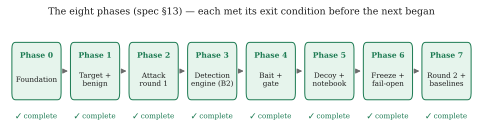

**Figure 2 — Project timeline.** The phases are strictly ordered. Phase 4 in
particular could not be reordered: the invisibility gate had to exist before any
bait was written, because a bait designed without its acceptance criterion tends to
be a bait that fails it.

### 1.5 Organisation of This Report

The remainder of the report is organised as follows.

**Chapter 2** surveys the literature across seven themes — web attack detection, bot
and automation detection, honeypots and cyber deception, honeytokens,
application-layer and LLM-generated deception, probability calibration, and the
decision theory the pricing rests on — and identifies the specific gap this work
occupies.

**Chapter 3** is the design chapter and the longest. It develops the two-axis meter,
derives the three-action decision rule from the frozen cost table, presents the bait
library with its invisibility gate, describes the state-consistent decoy, states the
design constraints, compares three candidate architectures, presents the selected
architecture with full flowcharts and pseudocode, and sets out the phased
implementation plan.

**Chapter 4** reports the evaluation: the tools used, the testing strategy, the
headline results with confidence intervals and paired significance tests, the causal
holdout estimate, comparison against a real signature ruleset, the subcategory
breakdown that localises the entire effect, the calibration analysis, validation
against third-party tools and autonomous agents, and an honest account of the
system's limitations.

**Chapter 5** concludes, documents the ways in which results deviated from
expectations — including two measurement errors that were found and corrected —
proposes future work, and lists references.


<div style="page-break-after: always;"></div>

# CHAPTER 2

# LITERATURE SURVEY

## 2.1 Literature Survey

The framework proposed in this report sits at the intersection of several
established research areas. None of the individual ingredients is new; what is new
is where the decision to deceive is placed and how its parameters are obtained. To
make that claim precisely, this survey is organised into **seven themes**, each of
which contributes something the design depends on, and each of which stops short of
the specific question this project answers.

### 2.1.1 Theme A — Web Attack Detection and Web Application Firewalls

The oldest and largest of the seven themes concerns how a defender recognises a
hostile HTTP request at all.

**Signature-based detection** matches requests against a curated body of known-bad
patterns. It is fast, explainable, and remains the dominant deployed control. Its
limitations are equally well understood and are of two kinds. The first is
*obfuscation*: the same injection can be split across inline comments, case-mixed,
URL-encoded once or twice, or expressed through equivalent SQL constructs until the
canonical pattern no longer matches. Amouei, Rezvani and Fateh [29] make this
concrete by treating WAF evasion as a search problem, using reinforcement learning
to discover bypassing payloads automatically; their **RAT** system finds
bypass patterns 33.5 % more effectively than prior black-box testing techniques,
which is a direct statement about how fragile pattern matching is under adversarial
pressure. The second limitation is more fundamental: some attacks contain no
anomalous pattern whatsoever. An insecure direct object reference is a
syntactically perfect request that differs from a legitimate one only in *who is
sending it*. No amount of rule refinement addresses this, because the rule would
have to match a request that is, byte for byte, exactly what a legitimate user
sends.

**Anomaly-based detection** replaces signatures with a model of normality. Kruegel
and Vigna [25] established the approach for web requests, building per-parameter
statistical profiles — character distribution, length, token structure, presence and
ordering — and flagging deviations. Robertson et al. [26] extended this with
generalisation and characterisation techniques that allow anomalies to be grouped
into recognisable attack classes rather than reported as undifferentiated outliers,
addressing the practical problem that a raw anomaly score is difficult for an
operator to act on.

**Deep learning approaches** followed. Tekerek [28] applies a convolutional neural
network to web request payloads, treating the request as a sequence and letting the
network learn discriminative structure rather than hand-specifying it, evaluated on
the CSIC 2010 corpus [27]. Such models generalise better over obfuscation than
signature matching does, precisely because they operate on learned representations
rather than on literal patterns.

What every entry in this theme shares — signature, statistical, and deep alike — is
the **passive stance**. The detector watches a session accumulate evidence and then
commits. Its sophistication lies entirely in *how well it reads the evidence that
arrives*; none of these systems has any mechanism by which it could *cause more
evidence to arrive*. The detector built in this project is an ordinary member of
this family and is not offered as a contribution; it exists to be the honest
baseline against which the contribution is measured.

### 2.1.2 Theme B — Bot and Automation Detection

A separate line of work asks a different question: not *is this client hostile* but
*is this client a program*. The distinction matters because the two properties are
independent, and conflating them is a recognised source of error.

Iliou et al. [30] propose a framework for detecting advanced web bots from server
logs, and report a result that is uncomfortable for log-only approaches: while
conspicuous bots are detected with balanced accuracy above 95 %, bots that
deliberately present a browser fingerprint and human-like pacing are considerably
harder. Their follow-up work [31] responds by combining web logs with **mouse
behavioural biometrics**, showing that the fusion is more robust against evasive
bots than either signal alone.

The finding this project takes from Theme B is a **negative** one, and it directly
shaped the architecture. Advanced bots imitate browsers closely enough that
automation signals alone stop separating them from people. It follows that
automation must not be used as a proxy for hostility. This is why the meter
described in Chapter 3 keeps automation and malice on **separate axes** rather than
collapsing them into a single score: a vulnerability scanner is automated and
hostile, an uptime monitor is automated and harmless, and a careful human attacker
is neither automated nor obviously hostile. A single score cannot express the middle
cases, and the middle cases are exactly what the probe exists to resolve.

### 2.1.3 Theme C — Honeypots and Cyber Deception

Deception as a defensive strategy has a long and well-developed literature.

Provos [6] established the modern practice with **Honeyd**, a framework for
instantiating large numbers of virtual hosts with configurable personalities,
demonstrating that deception could be deployed at scale rather than as a handful of
sacrificial machines. Nawrocki et al. [7] survey the resulting software ecosystem
and the analysis pipelines built around it.

The theoretical treatments matter more to this project than the software.
Almeshekah and Spafford [1] provide a model for *planning* deception rather than
bolting it on, arguing that a successful deception must present a plausible
alternative to the truth and must be designed against specific adversary biases —
a framing this project adopts directly, since a probe that looks planted warns the
attacker that the site is defended. Han, Kheir and Balzarotti [2] survey deception
techniques from a research perspective and identify precisely the weakness this
report tries not to repeat: it is unclear how the effectiveness of deception
solutions should be *measured*, and the field markets zero-false-positive claims
without the evaluation methodology to support them. Pawlick, Colbert and Zhu [3]
supply a game-theoretic taxonomy across six deception types, and Zhu et al. [4]
survey the game-theoretic and machine-learning approaches together. The most recent
comprehensive treatment is Beltrán-López, Gil Pérez and Nespoli [5], which builds a
unified taxonomy and explicitly lists the gaps that remain open. Cho et al. [11]
survey the adjacent moving-target-defence space, which shares the proactive
philosophy while changing the attack surface rather than populating it with lures.

Two empirical results in this theme are load-bearing for the present work. Barron
and Nikiforakis [9] ran 102 medium-interaction honeypots for four months while
varying location, break-in difficulty and file population, and found that **bots act
environment-agnostically while human attackers do not** — humans execute more
commands on honeypots with realistic file and folder structures. This is the
empirical justification for the Fact Notebook of Chapter 3: realism and consistency
change human behaviour, so they are worth engineering. Ferguson-Walter et al. [38]
provide the field's rare controlled human-subject study of decoy-based and
psychological deception, and it is the closest methodological ancestor of the
randomised holdout used in Chapter 4.

Against this, Vetterl and Clayton [10] demonstrate a *class break*: low- and
medium-interaction honeypots can be fingerprinted at internet scale with a single
packet at an equal error rate of 0.0183, because their protocol implementations
differ subtly from the systems they impersonate. Srinivasa, Pedersen and
Vasilomanolakis [20] extend fingerprinting to honeytokens specifically. Together
these say that **consistency is not free** and that a deception which can be
detected is worse than no deception at all, since it tells the attacker that they
are being watched.

The structural observation across this entire theme is that deception is treated as
a **destination**. A caught attacker is moved somewhere. The move follows a decision
that has already been made by some other mechanism, and the deception's job begins
after the detector's job ends.

### 2.1.4 Theme D — Honeytokens, Decoys and Bait

The sub-literature that comes closest to the present work treats deception as a
*sensor* rather than as a destination.

Yuill et al. [17] introduced **honeyfiles**: bait files on a file server that raise
an alarm when accessed, with the observation that they can increase internal
security without affecting normal operations. Bowen et al. [18] generalise this to
automatically generated **decoy documents** carrying bogus credentials and embedded
beacons, and — importantly for this project — *formalise properties* that a decoy
should satisfy in order to be effective. Juels and Rivest [19] propose **honeywords**:
storing decoy passwords alongside the real one so that an adversary who inverts the
password hash cannot tell which is genuine, with an auxiliary honeychecker raising
an alarm when a honeyword is used. Timmer et al. [21] move the field towards
measurement, comparing proposed honeyfile metrics for realism and enticement against
the judgements of human participants, and reporting the sobering finding that some
widely used metrics do not consistently align with human perception.

The gap in this theme is one of **timing**. Every scheme above is *always on*: the
token is planted once and left in place. That is entirely reasonable when planting
is free. It is not free in the setting studied here, for two reasons. First, a probe
placed in a response served to a real user carries a small but genuine cost, and a
system that probes everybody has simply moved its cost from false positives to
nuisance. Second, a token that every visitor sees will eventually be catalogued and
published, burning it permanently — which is the fingerprinting result of [20]
applied to tokens rather than to hosts. The question these papers do not ask is
**when** a token should be deployed.

### 2.1.5 Theme E — Application-Layer and LLM-Generated Deception

A recent line of work moves deception out of separate honeypot hosts and into the
application itself, which is the same architectural position this project occupies.

Kahlhofer and Rass [22] review **nineteen technical methods** for deploying
application-layer deception without developer interaction — that is, by an operator
who has the built artefact but not the source code. Their finding is doubly useful:
it defines the space, and it reports that everything beyond honeypots and reverse
proxies "seems to have received little research interest", which says the space is
nearly empty. Kahlhofer et al. [23] contribute **Honeyquest**, which measures the
*enticingness* of 25 deception techniques against 19 true security risks with 47
human participants, and reports that the presence of deception reduces the risk that
an adversary finds a real vulnerability by about 22 %. The methodological caveat the
authors themselves state is that Honeyquest uses code-based questionnaires, so it
captures what people say they would click rather than what they do against a live
system. Kahlhofer, Golinelli and Rass [24] then contribute **Koney**, a Kubernetes
operator that treats deception "as code" and automates the setup, rotation,
monitoring and removal of traps using service meshes and eBPF.

Koney is the closest neighbour to this project, and the boundary between them is
sharp and worth stating plainly: **Koney solves deployment; it does not decide
deployment.** It will place, rotate and tear down a trap reliably, but it does not
choose whether to deploy one *based on a belief about the visitor currently being
served*. That decision is the contribution of the present work.

A parallel line uses language models to *generate* deception. Sladić et al. [12]
build **shelLM**, an LLM-backed Linux shell honeypot, reporting a true-negative rate
of 0.90 in convincing cybersecurity researchers that they were interacting with a
real shell. Adebimpe, Neukirchen and Welsh [16] compare retrieval-augmented against
prompt-tuned LLM honeypots in the **SBASH** framework. Reworr and Volkov [13] deploy
an LLM-agent honeypot to monitor AI hacking agents in the wild, which is direct
evidence that autonomous attackers are becoming a real population rather than a
hypothetical one. Bridges et al. [14] systematise the whole area, producing a
taxonomy of honeypot detection vectors, a canonical architecture, an evaluation
tetrad and an attacker trichotomy, while noting that real-world deployments show
only incremental progress. Vero et al. [15] contribute **Honeyval**, an evaluation
framework for LLM-powered HTTP honeypots.

This project's relationship to the LLM line is **complementary rather than
competing**. The decoy's consistency layer described in Chapter 3 is
generator-agnostic by design, and a language model is exactly the kind of generator
it is built to sit in front of. What the LLM honeypot line tends to lack is a
guarantee of *self-consistency over an engagement*: evaluation frameworks measure
stealth and fidelity but not whether the same question asked twice receives the same
answer. Chapter 4 measures precisely that, and shows it is a property of the
consistency layer rather than of the generator.

### 2.1.6 Theme F — Probability Calibration

A cost-sensitive threshold is only meaningful if the score it is applied to behaves
like a probability. This is the subject of a mature literature that the present work
uses as a **diagnostic tool** rather than extending.

Platt [41] introduced logistic scaling of classifier outputs, fitting a
one-dimensional sigmoid to map uncalibrated scores onto probabilities. Zadrozny and
Elkan [42] developed non-parametric alternatives, most notably isotonic regression,
which fits an arbitrary monotone map and is therefore more flexible but more prone
to overfitting on small samples. Kull, Filho and Flach [43] identified a specific
failure of logistic calibration — it is designed for normally distributed per-class
scores and can *uncalibrate* an already-calibrated classifier, since the logistic
family does not contain the identity function — and proposed the three-parameter
**beta calibration** map to fix it.

Chapter 4 applies all three to the hand-weighted meter built here, selects between
them by leave-one-draw-out held-out expected calibration error, and reports a result
that is uncomfortable and therefore worth reporting: the shipped belief is **not
calibrated**.

### 2.1.7 Theme G — Value of Information and Cost-Sensitive Decision Making

The decision-theoretic machinery on which the contribution rests is textbook, and
this report is explicit about that.

Howard [32] introduced **information value theory**, arguing that no theory
concerned only with the probabilities of outcomes — and not with their consequences
— can describe the importance of uncertainty to a decision maker, and showing that a
numerical value can be assigned to the reduction of any uncertainty. This is the
**Expected Value of Sample Information (EVSI)**, and it is the object used in
Section 3.2.2 to price the probe.

Elkan [33] provides the complementary half: how to make optimal decisions when
different misclassification errors carry different penalties, how to tell whether a
cost matrix is economically coherent, and why the recommended procedure is to learn
a classifier and then compute optimal decisions explicitly from its probability
estimates rather than to bake costs into training. The frozen cost table of
Section 3.2.2 follows this prescription exactly.

Axelsson [35] supplies the constraint that dominates intrusion detection in
practice: the **base-rate fallacy**. Because intrusions are rare, the false-alarm
rate — not the detection rate — is the limiting factor on usable performance. This
is the reason benign diversion is priced so severely in the cost table and why
Chapter 4 leads with the benign side of every result.

Pawlick, Colbert and Zhu [34] model deception with a detector that emits
probabilistic warnings, deriving equilibria for *leaky* deception, which is the
game-theoretic counterpart of the situation studied here.

Finally, the methodological guidance. Sommer and Paxson [36] set out why machine
learning for intrusion detection is harder than it looks and why laboratory results
so rarely survive deployment. Arp et al. [37] catalogue the specific pitfalls —
sampling bias, label inaccuracy, spurious correlations, inappropriate baselines,
data snooping, and base-rate neglect among them. Both are used in Chapter 4 not as
decoration but as a checklist; several design decisions in this project (freezing the
model before evaluation, pre-registering the primary comparison, replaying a real
ruleset rather than only an in-house baseline) exist specifically because of them.

## 2.2 Research Gaps

Reading across the seven themes, four gaps emerge. Each is stated as an observation
about what the literature does *not* do, followed by what this project does instead.

**Gap 1 — Deception is a destination, not an instrument.**
In Themes C and D, deception is deployed either after a decision has been made
(honeypots) or independently of any decision at all (always-on honeytokens). No
surveyed work treats deception as an action available to a detector *during*
uncertainty, whose deployment is chosen per-visitor on the basis of current belief.

**Gap 2 — The middle action, where it exists, is a tuned heuristic.**
Systems that offer something between allow and block — step-up authentication,
additional verification, escalation to review — select that action by a hand-set
threshold. A threshold is a free parameter, and a free parameter placed in the
middle of a two-action system can always be accused of having been tuned until the
results looked acceptable. No surveyed work *derives* the middle action's operating
region from stated costs.

**Gap 3 — Deception effectiveness is asserted, correlated, or questionnaire-based.**
Han et al. [2] identify this explicitly as an open problem for the field. Honeyquest
[23] measures enticingness by questionnaire and says so. Timmer et al. [21] find
that some standard realism metrics do not track human judgement. Ferguson-Walter et
al. [38] is the notable exception, and it is a human-subject study rather than a
system evaluation. No surveyed system-building work isolates the causal contribution
of its deception component from the rest of the system.

**Gap 4 — Generated decoys are not guaranteed self-consistent.**
Theme E's LLM honeypots are evaluated for stealth, fidelity and realism, but not for
whether the fake world answers the same question the same way twice. Vetterl and
Clayton [10] show that subtle inconsistency is exactly what fingerprinting exploits.

| # | Gap in the literature | How this project addresses it | Where |
|---|---|---|---|
| 1 | Deception used only after the decision, or always-on regardless of it | A third action, **BAIT**, available to the detector while the decision is still open, chosen per session from the current belief | §3.2.2 |
| 2 | The middle action is a hand-set threshold | Both band edges are *derived* from a frozen cost table and a measured bite likelihood ratio; under cost alone the band is provably empty | §3.2.2, §4.4 |
| 3 | Deception effectiveness asserted or correlated, not identified | A **randomised holdout inside the treated arm** withholds the probe from ~10 % of sessions at the same belief state, giving a causal estimate | §3.7, §4.4.3 |
| 4 | Generated decoys not guaranteed self-consistent | A write-once **Fact Notebook** pins every entity the decoy has ever asserted; consistency is a property of the store, not of the generator | §3.2.4, §4.4.7 |

**Table 2 — Research gaps and how this project addresses them.**

Two of these claims — the priced band (Gap 2) and the randomised holdout (Gap 3) —
do not, to our knowledge, appear together in the deception literature. They are also
the two cheapest to defend, and it is worth being precise about why. Neither is a
measurement. The band is a *derivation*: given the frozen cost table and a stated
bite rate, its edges follow by arithmetic that a reader can redo, and the decision
theory underneath is textbook [32], [33] rather than ours. The holdout is an
*experimental design*: it identifies the probe's effect by construction, whatever
magnitude that effect turns out to have. A replication could reasonably find a
smaller gain than reported here; it could not find that the arithmetic yields
different edges, or that the randomisation stopped identifying what it identifies.

## 2.3 Top Papers to Read

For a reader approaching this project for the first time, the following eight works
are the ones on which the design most directly depends. They are ordered by how
early they are needed rather than by importance.

1. **Howard (1966)** [32] — *Information Value Theory.* The source of the EVSI
   object used to price the probe. Read first; nothing in Section 3.2.2 makes sense
   without it.
2. **Elkan (2001)** [33] — *The Foundations of Cost-Sensitive Learning.* Establishes
   how to make decisions under a loss matrix and what makes a cost matrix coherent.
   The frozen cost table follows its prescription.
3. **Axelsson (2000)** [35] — *The Base-Rate Fallacy and the Difficulty of Intrusion
   Detection.* Explains why the false-alarm rate, not the detection rate, is the
   binding constraint — and therefore why benign diversion is priced at 200.
4. **Kahlhofer, Golinelli & Rass (2025)** [24] — *Koney.* The closest neighbour;
   read it to see exactly where automated trap deployment stops and where the
   decision problem this project solves begins.
5. **Kahlhofer & Rass (2024)** [22] — *Application Layer Cyber Deception Without
   Developer Interaction.* Defines the application-layer deception space and reports
   how sparsely populated it is.
6. **Ferguson-Walter et al. (2021)** [38] — *Examining the Efficacy of Decoy-based
   and Psychological Cyber Deception.* The field's controlled study of whether
   deception changes attacker behaviour; the methodological ancestor of the holdout.
7. **Arp et al. (2022)** [37] — *Dos and Don'ts of Machine Learning in Computer
   Security.* Used as an evaluation checklist throughout Chapter 4.
8. **Iliou et al. (2021)** [31] — *Detection of Advanced Web Bots.* The negative
   result that forced automation and malice onto separate axes.

## 2.4 Research Paper Summaries

| Theme | Citation | Year | Relevance (1–5) |
|---|---|---|---|
| Deception planning model | Almeshekah & Spafford — *Planning and Integrating Deception* [1] | 2014 | 4 |
| Deception survey, measurement critique | Han, Kheir & Balzarotti — *Deception Techniques* [2] | 2018 | 5 |
| Game-theoretic deception taxonomy | Pawlick, Colbert & Zhu [3] | 2019 | 3 |
| Deception survey (GT + ML) | Zhu et al. [4] | 2021 | 3 |
| Cyber deception taxonomy, open challenges | Beltrán-López, Gil Pérez & Nespoli [5] | 2026 | 4 |
| Virtual honeypot framework | Provos — *Honeyd* [6] | 2004 | 3 |
| Honeypot software survey | Nawrocki et al. [7] | 2016 | 2 |
| Honeypot performance via deception | Javadpour et al. [8] | 2024 | 3 |
| Attacker behaviour vs environment realism | Barron & Nikiforakis — *Picky Attackers* [9] | 2017 | 5 |
| Honeypot fingerprinting at scale | Vetterl & Clayton — *Bitter Harvest* [10] | 2018 | 5 |
| Moving target defence survey | Cho et al. [11] | 2020 | 2 |
| LLM shell honeypot | Sladić et al. — *shelLM* [12] | 2024 | 4 |
| LLM agents attacking in the wild | Reworr & Volkov [13] | 2025 | 4 |
| SoK: honeypots and LLMs | Bridges et al. [14] | 2026 | 4 |
| LLM HTTP honeypot evaluation | Vero et al. — *Honeyval* [15] | 2026 | 4 |
| RAG vs prompt-tuned LLM honeypots | Adebimpe, Neukirchen & Welsh — *SBASH* [16] | 2025 | 3 |
| Honeyfiles as intrusion detection | Yuill et al. [17] | 2004 | 4 |
| Decoy documents, formal decoy properties | Bowen et al. [18] | 2009 | 5 |
| Honeywords | Juels & Rivest [19] | 2013 | 4 |
| Honeytoken fingerprinting | Srinivasa et al. [20] | 2021 | 4 |
| Honeyfile realism and enticement metrics | Timmer et al. [21] | 2025 | 4 |
| Application-layer deception, 19 methods | Kahlhofer & Rass [22] | 2024 | 5 |
| Enticingness by questionnaire | Kahlhofer et al. — *Honeyquest* [23] | 2024 | 4 |
| Deception orchestration for Kubernetes | Kahlhofer, Golinelli & Rass — *Koney* [24] | 2025 | 5 |
| Anomaly detection of web attacks | Kruegel & Vigna [25] | 2003 | 4 |
| Generalisation in web anomaly detection | Robertson et al. [26] | 2006 | 3 |
| CSIC 2010 HTTP dataset | Torrano-Giménez et al. [27] | 2010 | 3 |
| CNN for web attack detection | Tekerek [28] | 2021 | 3 |
| RL-driven WAF evasion discovery | Amouei, Rezvani & Fateh — *RAT* [29] | 2022 | 4 |
| Advanced web bot detection framework | Iliou et al. [30] | 2019 | 4 |
| Web bots + mouse biometrics | Iliou et al. [31] | 2021 | 5 |
| Information value theory (EVSI) | Howard [32] | 1966 | 5 |
| Cost-sensitive learning foundations | Elkan [33] | 2001 | 5 |
| Leaky deception signalling games | Pawlick, Colbert & Zhu [34] | 2019 | 3 |
| Base-rate fallacy in intrusion detection | Axelsson [35] | 2000 | 5 |
| Outside the closed world | Sommer & Paxson [36] | 2010 | 5 |
| Dos and don'ts of ML in security | Arp et al. [37] | 2022 | 5 |
| Efficacy of decoy-based cyber deception | Ferguson-Walter et al. [38] | 2021 | 5 |
| Tamper-evident audit logs | Schneier & Kelsey [39] | 1999 | 4 |
| Two one-sided tests (equivalence) | Schuirmann [40] | 1987 | 2 |
| Platt scaling | Platt [41] | 1999 | 3 |
| Isotonic calibration | Zadrozny & Elkan [42] | 2002 | 4 |
| Beta calibration | Kull, Filho & Flach [43] | 2017 | 3 |

**Table 1 — Summary of research papers surveyed.**

### Extended summaries of the most load-bearing works

**Howard (1966), *Information Value Theory* [32].** Howard's argument begins with a
criticism of applying Shannon information outside communications: a measure that
depends only on the probability of an outcome, and not on its consequences, cannot
express how much an uncertainty matters to a decision maker. He develops instead a
theory in which the value of resolving an uncertainty is derived jointly from its
probabilistic structure *and* its economic impact, and shows that a numerical value
can be attached to the elimination or reduction of any uncertainty. **Relevance:**
this is exactly the structure of the probe decision. A probe changes no outcome by
itself; its entire worth is that it may change what the defender subsequently does.
Section 3.2.2 computes that worth as an expected value of sample information and
subtracts it from the probe's immediate cost.

**Elkan (2001), *The Foundations of Cost-Sensitive Learning* [33].** Elkan
characterises when a cost matrix is *reasonable* — showing how to avoid matrices
that are economically incoherent — and proves results about how class balance
interacts with cost-sensitive decisions. His practical recommendation is that in a
domain with differing misclassification costs, one should learn a classifier from
the data as given and then compute optimal decisions explicitly from its probability
estimates, rather than distorting training. **Relevance:** the framework follows
this exactly. The meter is trained on round-1 traffic without cost information; the
cost table is applied afterwards, at decision time, and is frozen and hashed so it
cannot be adjusted once results are visible.

**Axelsson (2000), *The Base-Rate Fallacy* [35].** Because intrusions are rare
relative to legitimate traffic, the posterior probability that an alarm indicates a
real intrusion is dominated by the false-alarm rate rather than by the detection
rate. Achieving a usable Bayesian detection rate therefore requires a false-alarm
rate that may be unattainably low. **Relevance:** this single result explains the
shape of the cost table in Section 3.2.2. Diverting a benign user is priced at 200
against 25 for missing an attack — a ratio of eight to one — not because a missed
attack is unimportant but because the base rate makes false positives the binding
constraint. It is also why Chapter 4 reports the benign column of every table before
the recall column.

**Barron & Nikiforakis (2017), *Picky Attackers* [9].** Over four months and 102
medium-interaction honeypots, the authors systematically varied honeypot location,
break-in difficulty and file population, and additionally leaked credentials for
hard-to-brute-force honeypots to hacking forums and paste sites in order to attract
human attackers. The central finding is a dissociation: **bots perform
environment-agnostic actions, while human attackers are measurably affected by the
environment**, executing more commands on honeypots with realistic file and folder
structures. **Relevance:** this is the empirical case for the Fact Notebook. If
realism and internal consistency change human attacker behaviour, then engineering
them is a security control rather than a cosmetic concern, and the correct design
question becomes how to *guarantee* consistency rather than how to make content look
plausible.

**Vetterl & Clayton (2018), *Bitter Harvest* [10].** The authors show that the
current generation of low- and medium-interaction honeypots can be fingerprinted at
internet scale using a single packet, at an equal error rate of 0.0183, because
their protocol implementations differ subtly from the systems being impersonated.
They identify 7,605 honeypot instances across nine implementations and argue this is
a *class break* — one not fixable by patching. **Relevance:** a decoy that can be
detected is worse than none, because it informs the attacker that they are being
observed. This is the direct motivation for the target/decoy parity requirement in
Section 3.2.4: the two applications must expose identical route surfaces, status
codes and content types, and this is enforced by tests rather than by inspection.

**Kahlhofer, Golinelli & Rass (2025), *Koney* [24].** Koney introduces deception
policy documents describing traps "as code", paired with a Kubernetes operator that
handles setup, rotation, monitoring and removal, using service meshes and eBPF to
add traps to containerised applications without source access. The authors
explicitly prioritise operational properties — maintainability, scalability,
simplicity — as the barrier to industry adoption. **Relevance:** Koney is the
closest neighbour and the cleanest way to state the present contribution by
contrast. Koney answers *how to deploy a trap reliably*. It does not answer *whether
to deploy one for this visitor, right now, given what is currently believed about
them*. The two are complementary: a production deployment would plausibly use a
Koney-style orchestrator as the mechanism and the priced policy of Section 3.2.2 as
the trigger.

**Ferguson-Walter et al. (2021), *Examining the Efficacy of Decoy-based and
Psychological Cyber Deception* [38].** A controlled experiment measuring whether
decoys and psychological deception actually change attacker behaviour, rather than
assuming that they do. **Relevance:** methodologically this is the ancestor of the
randomised holdout in Section 4.4.3. Both designs recognise that comparing two whole
systems confounds the deception with everything else that differs between them, and
both respond by randomising the deception itself.

**Arp et al. (2022), *Dos and Don'ts of Machine Learning in Computer Security*
[37].** A catalogue of recurring methodological pitfalls in security ML — sampling
bias, label inaccuracy, data snooping, spurious correlations, inappropriate
baselines, base-rate neglect, and inappropriate performance measures — with evidence
of how often each occurs in published work. **Relevance:** used as a checklist.
Freezing and hashing the model before evaluation addresses data snooping; replaying
the OWASP CRS addresses inappropriate baselines; pre-registering the primary
comparison addresses selective reporting; the corpus audit reported in Section 4.7
addresses spurious correlations — and it found one.

## 2.5 Datasets and Tools

| Name | Type | Licence | Role in this project |
|---|---|---|---|
| **Synthetic benign corpus** (this work) | Dataset | Project-internal | 80 sessions per draw: three-quarters simulated humans including hard negatives (apostrophe search, forgetful login, URL mistyping), one quarter automated-but-harmless clients (uptime monitor, crawler, reporting integration) |
| **Attack round 1** (this work) | Dataset | Project-internal | Training corpus for the dual meter; 2 × 2 automation/malice coverage |
| **Attack round 2** (this work) | Dataset | Project-internal | Held-out evaluation corpus, written after the detector was built; five subcategories, deliberately unlike round 1 |
| **CSIC 2010 HTTP dataset** [27] | Dataset | Public research use | Named in Section 5.3 as the natural next step for bounding the benign side against a public corpus; not used for any reported number |
| **OWASP ModSecurity Core Rule Set** | Rule set | Apache 2.0 | Replayed at paranoia levels 1–4 on identical traffic to prove the signature baseline is not a straw man |
| **OWASP Juice Shop** | Application | MIT | Second, structurally unlike target (Node/Express SPA with JSON API) used for the transfer check |
| **sqlmap 1.10.8** | Attack tool | GPLv2 | Third-party SQL injection engine used for external validation |
| **ghauri 1.4.3** | Attack tool | MIT | Third-party injection tool; notable for refusing the proxy's cookie, which exposed a real evasion |
| **wapiti 3.2.3** | Attack tool | GPLv2 | Third-party web vulnerability scanner |
| **OWASP ZAP** | Attack tool | Apache 2.0 | Browser-driven scanner used against the second application |
| **Python 3.11** | Language | PSF | Implementation language for the framework, harness and tests |
| **FastAPI + Uvicorn** | Web framework | MIT / BSD | Asynchronous reverse proxy, target application and decoy service |
| **httpx** | HTTP client | BSD | Upstream client inside the proxy and in every traffic generator |
| **scikit-learn** | ML library | BSD | Logistic heads of the dual meter; calibration maps (Platt, beta, isotonic) |
| **NumPy, pandas** | Numeric / data | BSD | Feature handling, evaluation statistics |
| **matplotlib** | Visualisation | PSF-based | Publication-quality figures (Okabe–Ito palette, serif + computer-modern maths) |
| **SQLite** | Database | Public domain | Target world, decoy world and Fact Notebook storage |
| **Ollama** (llama3.2:1b, llama3.2:3b, qwen2.5:7b) | Local LLM runtime | MIT | Two roles: decoy content generation behind the consistency seam, and — separately — the autonomous attacker of Section 4.4.9. Never in the request path of any reported arm |
| **Docker** | Containerisation | Apache 2.0 | Isolation for the CRS ruleset, the second target application and the browser-driven scanner |
| **pytest** | Test framework | MIT | 358 automated tests across 26 files; all must pass before a model may be frozen |
| **Git** | Version control | GPLv2 | Source management and the audit trail of decisions |

**Table 3 — Datasets, tools and platforms used.**

A note on the dataset row that is *absent*. This project does not use a public
labelled web-attack corpus for its headline numbers, and that is a genuine
limitation rather than an oversight; it is stated as such in Section 4.7 and
Section 5.2. The reason is that the contribution being measured is the effect of a
*response-side* probe, which requires a live application that can be probed and an
attacker that can react to what comes back. A recorded request log, however large
and however well labelled, contains no responses and no opportunity for an attacker
to act on one, so it cannot exercise the mechanism under test. Replaying CSIC 2010
[27] would bound the *passive* half of the system honestly and is proposed as future
work, but it cannot substitute for the interactive setting the probe requires.


<div style="page-break-after: always;"></div>

# CHAPTER 3

# DESIGN FLOW / PROCESS

## 3.1 Concept Generation

The starting observation is that a web application firewall has an **action set
problem**, not an evidence problem. Improving the classifier improves how well the
system reads what arrives; it does nothing about the fact that the system has only
two things it can do with what it has read.

Consider the situation from the defender's seat at a specific moment. A session has
sent eleven requests. Three of them touched `/records/{id}` with identifiers that
are not sequential but are close together. One search parameter contained an
apostrophe. The client carries a browser user-agent and fetched the stylesheet on
its first page load. The inter-request timing is irregular, in the way a human is
irregular rather than in the way a script with random jitter is irregular.

Is this an attack? Honestly: it might be. It might equally be a support engineer
looking up three related tickets whose customer's surname contains an apostrophe. A
passive detector must now choose. If it blocks, it has a meaningful chance of
having just cut off a colleague. If it allows, it has a meaningful chance of
watching an object-reference sweep proceed. Its threshold determines which of those
mistakes it prefers; it does not help it avoid both.

The generative question of this project is therefore:

> Is there a **third thing the defender can do** — something that is neither
> allowing nor blocking — that would make the next request more informative than
> this one was?

Framing it this way immediately suggests an answer, because the defender controls
something the passive framing ignores: **the response**. A detector that only reads
requests has thrown away half of its available surface. The response is a channel
the defender writes and the client reads, and what the defender writes into it can
be chosen to *discriminate between the two hypotheses that are currently confused*.

The discriminating idea is this. Add to the response something that

- a real browser will **never render**, so an honest user cannot see it, cannot be
  confused by it, and cannot report a bug about it;
- is **completely inert**, so following it grants no access, changes no state and
  produces no behaviour;
- but is **visible and attractive to anyone reading raw traffic** and probing the
  application.

A fake database error naming a table called `acct_shadow_a3f91c` that does not
exist. An unused field `ref_uid` in a JSON response. A hint at a deprecated endpoint
`/auth/legacy/verify_{suffix}` in a login failure message. A parameter named in an
HTML comment that no template ever reads.

An honest user never notices any of it, because none of it is rendered. A client
that is reading raw responses and looking for a way in will see it, and — this is
the key point — **acting on it is diagnostic**. There is no legitimate reason to
request a table name that appears only inside an error message, or to submit a
parameter that appears only inside an HTML comment. The moment the client does so,
it has told the defender what it is.

This suggests a three-action system: **PASS**, **BAIT**, **DIVERT**. But the design
is not finished, because it now has a much harder question to answer, and answering
it badly would make the whole thing worthless:

> **When** should the middle action be used?

A hand-set threshold is the obvious answer and the wrong one. It would be a third
free parameter in a system that already has one, and a reviewer would be entirely
correct to suspect it had been adjusted until the results looked acceptable. Worse,
it would leave the design unable to say *why* the middle band has the width it has.

The resolution is to notice what kind of object a probe actually is. A probe changes
no outcome by itself. The request still reaches the real application; nothing is
blocked, nothing is allowed that would not have been. Its entire worth is the
**information** a bite would reveal. That is not a security concept; it is a
decision-theory concept with a name, a literature and an arithmetic: the **expected
value of sample information** [32]. Once the probe is recognised as an information
purchase, the question "when should we probe?" becomes "when does the information
we would buy cost less than it is worth?" — and that question has a derived answer
rather than a chosen one.

## 3.2 Proposed Concept

The framework comprises five components, developed in the five subsections that
follow:

1. a **dual suspicion meter** that maintains two independent axes and fuses them
   into a belief (§3.2.1);
2. a **priced decision rule** that turns that belief into one of three actions using
   a frozen cost table and the measured effectiveness of each probe (§3.2.2);
3. a **bait library** with an invisibility gate that no bait may bypass (§3.2.3);
4. a **state-consistent decoy** backed by a write-once Fact Notebook (§3.2.4);
5. a **tamper-evident log** and a **frozen model manifest** that make the evaluation
   reproducible and hard to fudge (§3.2.5).

### 3.2.1 The Dual Suspicion Meter

#### Why two axes rather than one

The natural implementation is a single suspicion score, and it is wrong. The reason
is visible as soon as the space of clients is drawn out honestly.

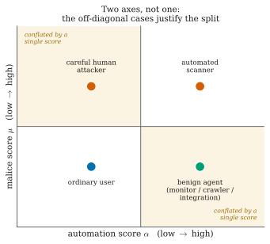

**Figure 3 — The two-axis threat space and why one score is insufficient.**

A single score is a projection of this plane onto a line, and any such projection
must collapse two of the four quadrants together. The **automated-and-harmless**
quadrant — uptime monitors, crawlers, nightly reporting integrations — is the
casualty. A nightly reporting job walks record identifiers in ascending order at
machine speed, which is precisely the signature of an object-reference sweep. Any
single score that is high for scanners will also be high for that job.

This is not a hypothetical concern. An earlier version of this project contained two
features, `mal_seq_id_run` (a run of ascending object identifiers) and
`mal_touched_sensitive` (any access to `/api`, `/auth` or `/admin` paths), which
together diverted **100 % of benign JSON-API integration clients**. The failure was
completely invisible while the benign corpus contained only simulated humans; it
appeared the moment automated-but-harmless clients were added. Both features were
removed, and the detection they had been providing was delegated to the probe —
which is the correct place for it, because a probe distinguishes a reporting job from
an IDOR sweep by asking rather than by guessing.

The design consequence is that the meter maintains **two independent axes**:

- an **automation axis**, answering *is this client a program?*
- a **malice axis**, answering *are these inputs hostile?*

and, critically, only the malice axis contributes to the hostility belief on which
the decision is made. The automation axis is spent on **bait selection** — choosing
which probe to deploy, since a scripted client and a human client are enticed by
different things — and never on the decision to divert.

#### Feature extraction

Each request is reduced to **eighteen numbers**, computed only from what the live
proxy can observe. Nothing is derived from ground-truth labels, and the feature
extractor never has access to them; a model that could read labels would be reading
the answer sheet.

| # | Feature | Meaning |
|---|---|---|
| 1 | `auto_interarrival_last` | Seconds since this session's previous request |
| 2 | `auto_interarrival_cv` | Coefficient of variation of inter-arrival times; machine regularity is low-variance |
| 3 | `auto_requests_per_min` | Session request rate |
| 4 | `auto_asset_fetch_ratio` | Fraction of page loads followed by sub-resource fetches |
| 5 | `auto_fetched_assets` | Count of distinct static assets fetched |
| 6 | `auto_browser_header_ratio` | Fraction of requests carrying `Accept`, `Accept-Language`, `Accept-Encoding` |
| 7 | `auto_header_count` | Number of headers; scripted clients send fewer |
| 8 | `auto_ua_is_tool` | User-agent matches a known tool string |
| 9 | `auto_ua_stable` | User-agent unchanged across the session |
| 10 | `auto_cookie_carried` | Client returns the session cookie it was issued |

**Table 4 — Automation-axis features (10).**

| # | Feature | Meaning |
|---|---|---|
| 11 | `mal_input_length` | Length of the longest parameter value |
| 12 | `mal_special_char_ratio` | Proportion of quote, comment and operator characters in inputs |
| 13 | `mal_db_keyword_hits` | Count of SQL keywords appearing in parameters |
| 14 | `mal_db_keyword_any` | Binary indicator that any SQL keyword appeared |
| 15 | `mal_failed_auth` | Count of failed authentication attempts in the session |
| 16 | `mal_error_ratio` | Fraction of responses in the 4xx/5xx range |
| 17 | `mal_param_mutation` | Rate at which the same parameter is re-sent with a changed value |
| 18 | `mal_distinct_usernames` | Number of distinct usernames tried — separates spray from a forgetful user |

**Table 5 — Malice-axis features (8).**

Feature 18 deserves comment because it was added in response to a measured false
positive. An early version diverted a simulated user who had forgotten their
password, and this was initially written up as an inherent cost of including hard
negatives. It was not inherent at all. It was a *missing feature* — the system could
not distinguish "one user, many password attempts" from "one password, many users" —
compounded by a *double count*, since login rejections were also inflating
`mal_error_ratio`. Once `mal_distinct_usernames` was added and the double count
removed, the false positive disappeared entirely.

#### Fusion into a belief

Each axis is a logistic head. For a feature vector **x** with automation
sub-vector **x**_A and malice sub-vector **x**_M:

```
    a(x) = σ( w_A · x_A + b_A )          automation score,  a ∈ (0, 1)
    m(x) = σ( w_M · x_M + b_M )          malice score,      m ∈ (0, 1)

    where  σ(z) = 1 / (1 + e^(−z))
```

The two are fused into a single hostility belief by a weighted combination whose
weights are part of the frozen model:

```
    p = clamp( w_auto · a(x) + w_mal · m(x),  ε,  1 − ε )      ε = 10⁻⁶
```

with the shipped configuration setting **w_auto = 0.0** and **w_mal = 1.0**. In
other words, the automation axis carries *zero weight in the hostility belief* — the
belief equals the malice score exactly. This is a deliberate consequence of the
argument above and of the bot-detection literature [30], [31]: automation is not
evidence of hostility. It was verified against the logs rather than merely against
the configuration; across 12,954 scored requests in an audit, the belief equals the
malice score exactly within the documented 10⁻⁶ clamp, while the automation score
ranges over its whole domain.

The clamp exists so that the log-odds transform used in the belief update never
diverges.

#### The Bayesian update on a bite

When a probe is deployed and the client subsequently acts on it, the belief is
updated in log-odds space by that bait's measured likelihood ratio:

```
    logit(p′) = logit(p) + log Λ⁺        if the client bit
    logit(p′) = logit(p) + log Λ⁻        if the probe was shown and ignored

    where   Λ⁺ = β_attack / β_benign          (the bite likelihood ratio)
            Λ⁻ = (1 − β_attack) / (1 − β_benign)
```

Here β_attack is the probability that a hostile session bites this bait when shown
it, and β_benign the probability that a benign session does. Both are **measured**
in a dedicated calibration round rather than assumed; Section 3.2.3 gives the
estimator and Table 8 the values.

This is ordinary Bayesian evidence accumulation, and its correctness is precisely
why the two rates must be measured rather than chosen. A likelihood ratio invented
by the designer is a free parameter in disguise.

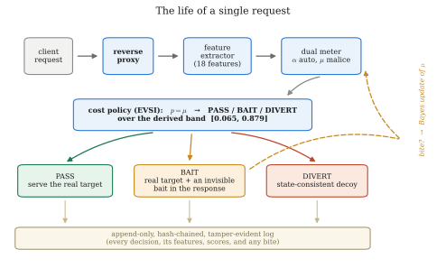

**Figure 4 — Life of a single request through the framework.** The loop is the
important part: a bait deployed on one request is only evidence when a *later*
request in the same session does or does not act on it. This is why the framework is
session-scoped rather than request-scoped, and why session identity (§3.2.5) is a
security-relevant component rather than plumbing.

### 3.2.2 Pricing the Probe as an Information Purchase

This subsection contains the core contribution and is developed in full, because
every number in Chapter 4 depends on it.

#### The cost model

Every combination of true session label and defender action is assigned a cost.
These numbers were written down, hashed and committed **before any evaluation data
existed**, and the hash is verified on every load — the file cannot be edited after
results are seen without the system refusing to run.

| | **PASS** | **BAIT** | **DIVERT** |
|---|---:|---:|---:|
| **Session is benign** | 0 | 1 | 200 |
| **Session is an attack** | 25 | 25 | −20 |

**Table 6 — The frozen cost matrix.**

Each entry encodes a judgement, and each is worth stating explicitly:

- **benign / PASS = 0.** The correct outcome. The baseline against which every
  other cost is measured.
- **benign / BAIT = 1.** A real user was shown a probe and did not notice, because
  the invisibility gate guarantees the rendered page is unchanged. This is
  deliberately *not* zero. Setting it to zero would assert that the gate is perfect,
  and would also make baiting a **free action**, which would let the policy probe
  everybody with no penalty. The value of 1 prices the residual risk that a defective
  bait escapes the gate, and it is what forces the policy to be selective.
- **benign / DIVERT = 200.** A real user sent into a fake copy of the application:
  the outcome that must almost never happen. Priced at 200 times a wasted probe, so
  that the policy demands overwhelming evidence before diverting. This ratio is a
  direct consequence of the base-rate argument [35].
- **attack / PASS = 25.** A missed attack.
- **attack / BAIT = 25.** *The same as passing.* This is essential and easy to
  overlook: baiting confers **no immediate benefit**, because the request still
  reaches the real application. Whatever the attacker was going to accomplish on this
  request, they still accomplish. The probe's worth lies entirely in the future.
- **attack / DIVERT = −20.** Negative, i.e. a gain: the attacker is contained inside
  a decoy where their actions are recorded and harmless.

#### Why cost alone yields no middle action

Let *p* be the belief that the session is hostile. Expected costs are:

```
    E[C(pass)]   = (1 − p)·0   + p·25   = 25p
    E[C(bait)]   = (1 − p)·1   + p·25   = 1 + 24p
    E[C(divert)] = (1 − p)·200 + p·(−20) = 200 − 220p
```

Now subtract:

```
    E[C(bait)] − E[C(pass)] = (1 + 24p) − 25p = 1 − p
```

For every belief strictly below certainty, **1 − p > 0**. Therefore:

> **Property 0.** Under cost accounting alone, baiting is *strictly worse* than
> passing at every belief *p* < 1. The BAIT band is empty everywhere.

The rule collapses to a two-action policy with a single boundary where passing and
diverting cross:

```
    25p = 200 − 220p   ⟹   245p = 200   ⟹   p* = 200/245 = 0.8163
```

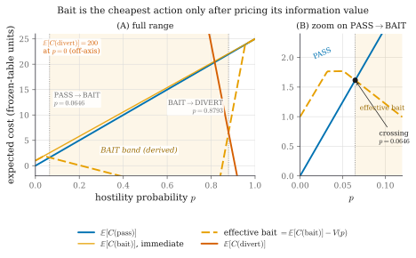

**Figure 5 — Expected cost of each action under cost accounting alone.** The bait
line never dips below both others, at any belief. The BAIT region is empty, and the
rule reduces to a single PASS/DIVERT boundary at 0.8163.

This is not a defect in the cost table; it is the **most important structural fact
in the design**. It means the middle action cannot be recovered by adjusting a
threshold, because there is no threshold to adjust — the region does not exist.
Anything that produces a middle band must come from somewhere other than immediate
cost.

#### The information term

What cost accounting omits is that a probe may *change what the defender does next*.
That is exactly the object Howard [32] formalised.

Let *Z* denote the observation the probe produces: `bite` or `no-bite`. Before
probing, the defender's best achievable expected cost is

```
    min_a E[C(a) | p]
```

After observing *Z*, the belief becomes a posterior *p′*, and the defender may
choose a different action. The expected best cost *after* observing is

```
    E_Z[ min_a E[C(a) | p′] ]
```

The **expected value of sample information** is the difference:

```
    V(p) = min_a E[C(a) | p]  −  E_Z[ min_a E[C(a) | p′] ]
```

Concretely, with the bait's measured rates:

```
    P(bite)    = p·β_attack + (1 − p)·β_benign

    p′(bite)   = p·β_attack / P(bite)                                  (Bayes)

    p′(no)     = p·(1 − β_attack) / (1 − P(bite))

    V(p) = min_a E[C(a) | p]
           − [ P(bite)·min_a E[C(a) | p′(bite)]
             + (1 − P(bite))·min_a E[C(a) | p′(no)] ]
```

The **effective cost of baiting** is then its immediate cost minus the value of what
it buys:

```
    effective(bait) = E[C(bait)] − V(p) = 1 + 24p − V(p)
```

and the policy selects whichever of `pass`, `effective(bait)`, `divert` is least.

#### Three properties of V(p)

**Property 1 — V(p) ≥ 0 for all p (information never hurts).**
`min_a E[C(a) | p]` is a minimum of affine functions of *p*, and a minimum of affine
functions is concave. Jensen's inequality applied to the posterior mean of the belief
gives `E_Z[min_a E[C(a) | p′]] ≤ min_a E[C(a) | p]` immediately, hence V(p) ≥ 0.
This is a standard lemma and **not a contribution of this work**; the report claims
the application, not the mathematics. It is nevertheless enforced as a runtime
invariant with a test (`test_information_is_never_harmful`), which is a stronger and
more checkable statement than an informal assertion that "bait is cheap".

**Property 2 — V(0) = V(1) = 0 (the band is bounded on both sides by construction).**
When the belief is already certain, no observation can change the decision, so the
probe is worth exactly nothing. The BAIT band therefore *cannot* swallow the whole
probability range and *cannot* be widened by tuning; its edges are pinned by the cost
geometry at both ends.

**Property 3 — the band exists exactly where V(p) exceeds the residual cost of
baiting.** BAIT is chosen when `effective(bait)` is least, i.e. when

```
    V(p) > E[C(bait)] − min( E[C(pass)], E[C(divert)] )
```

Since Property 0 established that the right-hand side is 1 − p > 0 on the passing
side, the band opens only where the information value strictly exceeds that residual.

#### The derived bands

Applying the arithmetic above to the frozen table and the calibrated bait library
(Table 8) yields:

```
    PASS      p  <  0.0647
    BAIT      0.0647  ≤  p  <  0.8793
    DIVERT    p  ≥  0.8793
```


**Figure 6 — The derived band after subtracting the value of information.** Compare
directly with Figure 5. The only change is that the bait line has been lowered by
V(p); the middle region appears, and both of its edges are consequences of that
subtraction rather than choices.

| Boundary | Value | Origin |
|---|---:|---|
| `pass_to_bait` | **0.06465** | Where V(p) first exceeds the residual cost of baiting |
| `bait_to_divert` | **0.8793** | Where diverting becomes best even after the probe's value is credited |
| Cost-only boundary | 0.8163 | Where PASS and DIVERT cross with no information term |

**Table 7 — Derived action bands under the frozen cost table.**

Two observations follow, and the second is the one a reader should carry away.

First, **neither edge was chosen**. Both are outputs of the arithmetic. Changing them
requires changing either the cost table (which is hashed and frozen) or the measured
bite rates (which come from a calibration round with recorded counts).

Second, notice **which way the upper edge moved**. Introducing the probe raised the
divert threshold from 0.8163 to 0.8793. A system that can probe is therefore *more
reluctant* to divert an honest user than the same system without one, because it now
has a cheaper way of resolving its uncertainty and no longer needs to gamble. This
was not a design goal and was not anticipated; it falls out of the arithmetic. It is
also, as Chapter 4 shows, the property that buys the zero-benign-diversion result:
the highest belief any benign session in the corpus reaches is 0.829, and the derived
divert edge sits at 0.879, above all of them.

#### Sensitivity of the conclusions

Two quantities in the derivation are estimates rather than givens: the cost ratio and
the attacker bite rate β_attack. If the structural conclusions depended on their
exact values, the result would be fragile. They do not.

Sweeping **β_attack across [0.05, 0.99]** and the **divert-to-miss cost ratio from
0.5 to 128** leaves both structural facts intact throughout: the BAIT band remains
non-empty, and the divert threshold never falls below the cost-only boundary of
0.8163. Only the *width* of the band and the *level* of conservatism move.

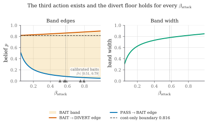

**Figure 7 — Invariance of the band across β_attack.** The upper edge stays above the
cost-only boundary for every value in the plausible range, and the band never closes.
Neither the existence of the third action nor the direction of the safety guarantee
is an artefact of the two estimated numbers.

#### Behaviour against an adaptive adversary

An attacker who learns that probes exist can simply refuse them. The design's
response is not to claim this cannot happen, but to make the consequence bounded.

Each unrewarded exposure of the same bait decays its surviving information value by a
**survival discount**:

```
    V_k(p) = V(p) · (1 − β_attack)^k          k = number of prior unrewarded exposures
```

The reasoning is Bayesian: if a hostile session bites with probability β_attack when
shown a bait, then a session that has been shown it *k* times and never bitten is
progressively less likely to be the kind of session that would. As *k* grows, V_k(p)
falls geometrically toward zero. Once it is negligible, the effective cost of baiting
is its immediate cost, which Property 0 showed is strictly above passing, and the
three-action rule **collapses back to the two-action rule** the passive baseline
already implements.

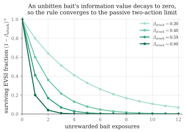

**Figure 26 — Value of information decaying over repeated unrewarded exposures.** As
V falls toward zero the effective cost of baiting rises to its immediate cost, which
is strictly above passing, and the three-action rule collapses to the two-action rule.

> **Limiting-rule guarantee.** Against an adversary who refuses every probe, the
> policy converges to the passive two-action policy as exposures accumulate. It
> therefore cannot be *asymptotically* worse than the detector it is built on.

The guarantee is deliberately stated as a limiting property and not as per-session
dominance, because per-session dominance is false and Chapter 4 reports the cases
where it fails: 197 of 11,880 matched attack sessions go the other way, where the
probing arm defers a diversion that the passive arm would have made.

### 3.2.3 The Bait Library and the Invisibility Gate

#### What a bait is

A bait is a small piece of content added to a response that a real browser will never
display and that a client reading raw traffic will see. Every bait must satisfy four
rules, and the fourth is enforced mechanically:

| Rule | Meaning | Enforced by |
|---|---|---|
| **Plausible** | A bait that looks planted warns the attacker the site is defended | Design review |
| **Inert** | Following it must never grant real access or trigger real behaviour | Design and tests |
| **Unique** | Content is randomised per session, so no fixed string can be published and burn the bait permanently | `randomise_per_session`; token suffix derived from (seed, session id) |
| **Invisible** | Must hold a passing invisibility certificate before it may be served | Run-time certificate check |

#### The shipped library

| Bait | Category | Fires when | What is injected | Channel | Bite signal | β_attack | β_benign | Λ⁺ |
|---|---|---|---|---|---|---:|---:|---:|
| `B-SQL-1` | sqli | A quote or comment character appears in a parameter | Verbose fake DB error naming a non-existent table | error text | A later request referencing that table | 0.5632 | 0.0081 | 69.5 |
| `B-SQL-2` | sqli | Repeated malformed parameters | Fake column list inside an HTML comment | HTML comment | A query using any of those column names | 0.5125 | 0.0038 | 134.9 |
| `B-IDOR-1` | idor | Sequential identifier access detected | Unused extra field `ref_uid` in the JSON response | JSON field | Any request submitting that field | 0.7941 | 0.0192 | 41.4 |
| `B-IDOR-2` | idor | Object-reference tampering detected | Fake `internal_view` parameter named in an HTML comment | HTML comment | A request carrying that parameter | 0.7527 | 0.0067 | 112.3 |
| `B-AUTH-1` | auth | Several failed logins in one session | Failure message hints at `/auth/legacy/verify_{suffix}` | error text | Any request to that path | 0.5797 | 0.0056 | 103.5 |
| ~~`B-AUTH-2`~~ | auth | Repeated OTP failures | Inert `mfa_debug_token` in the OTP failure response | JSON field | A request submitting that token | — | — | — |

**Table 8 — The shipped bait library and its calibrated effectiveness.**

`B-AUTH-2` is **withdrawn** and is listed only for completeness. Its channel requires
a JSON authentication response, and this target has none — `/login` and `/otp` both
return HTML — so it was shown to zero sessions while carrying a fabricated β_attack
of 0.45. Removing it is the correct action and is recorded here because a bait that
was designed, certified, and then withdrawn for lack of a surface is part of the
honest record.

#### Estimating the bite rates

Both rates come from a dedicated **calibration round** run before evaluation, using
the Jeffreys posterior mean of a Beta(½, ½) prior:

```
    β̂ = (k + ½) / (n + 1)          floor: β̂_benign ≥ 0.0005
```

where *k* is the number of sessions that bit and *n* the number shown the bait. The
half in the numerator is what stops an observed zero from becoming a certainty: with
zero benign bites in 74 sessions, a naive estimate would give β_benign = 0 and hence
an infinite likelihood ratio, which is nonsense. The Jeffreys estimate gives
(0 + ½)/(74 + 1) = 0.0067.

Two properties of the resulting estimates matter:

1. **None of the deployed baits sits at the smoothing floor.** The five measured
   β_benign values run from 0.0056 to 0.0192 on samples of 25 to 88 benign sessions.
   A likelihood ratio computed against the floor would be a *bound* rather than a
   *measurement*, and it matters that none of them is.
2. **The estimate is deliberately unfavourable to the probe.** With zero benign
   bites observed, any smaller prior — or none at all — would push β_benign toward
   zero and the likelihood ratio toward infinity, making the probe look better. The
   Jeffreys choice is the conservative one.

A further property of the token design determines what evidence may legitimately be
carried across sessions. **Value baits** — where the bite signal is the client
submitting a planted *value* — carry a per-session suffix, so a token seen in
session B could only have come from session B, and cross-session reporting is valid.
**Name baits** — where the signal is the client using a planted parameter *name* —
do not, because the name is fixed. The implementation therefore reports cross-session
bites only for value baits, and Chapter 4's numbers respect that distinction.

#### The invisibility gate

The gate is built **before** any bait, and no bait may enter the library without a
passing certificate. For each candidate bait and each response it can inject into,
the gate performs four checks:

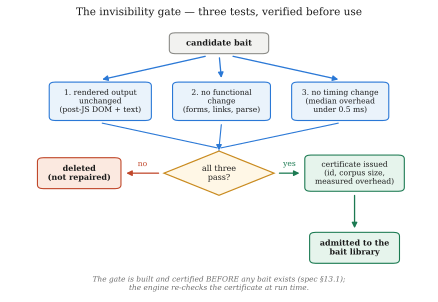

**Figure 8 — The invisibility gate as a decision flowchart.**

The first check deserves emphasis because it is counter-intuitive: the gate
**refuses a bait that applies to none of the corpus**. A bait that never fires cannot
be verified, and an unverifiable bait that nevertheless sits in the library is a
latent hazard.

| Bait | Passed | Responses injected / tested | Median overhead (ms) | p95 overhead (ms) |
|---|:--:|---:|---:|---:|
| `B-SQL-1` | ✅ | 82 / 116 | 0.0116 | 0.0235 |
| `B-SQL-2` | ✅ | 82 / 116 | 0.0122 | 0.0212 |
| `B-IDOR-1` | ✅ | 34 / 116 | 0.1076 | 0.1263 |
| `B-IDOR-2` | ✅ | 82 / 116 | 0.0095 | 0.0168 |
| `B-AUTH-1` | ✅ | 82 / 116 | 0.0107 | 0.0213 |
| `B-AUTH-2` (withdrawn) | ✅ | 34 / 116 | 0.1163 | — |

**Table 9 — Invisibility certificates for the deployed baits.**

The worst certified median overhead among deployed baits is **0.1076 ms** against a
ceiling of 0.5 ms — a factor of 4.6 — and the worst 95th percentile is 0.1263 ms.
Most baits sit 40 to 50 times below the ceiling. These are the figures recorded in
the certificates that the freeze manifest hashes, so a reader can check them rather
than taking them on trust.

It should be stated plainly that the timing criterion is a **threshold on the
median**, not a formal equivalence test. A two-one-sided-tests procedure against a
pre-registered margin [40] would be the stronger claim, and it is named here as the
natural way to tighten the result rather than glossed over.

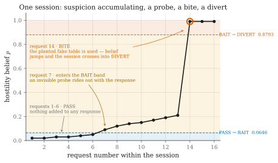

**Figure 9 — Bait life-cycle across one session.** Note that the baited request is
*still forwarded* to the real application and still receives a real answer. The probe
adds information; it withholds nothing.

### 3.2.4 The Decoy Environment and the Fact Notebook

#### The problem a decoy must solve

Once a session is diverted, it must land somewhere that does not contradict itself.
If the decoy answers "user 1041 is Rakesh Malhotra" on one request and "user 1041 is
Priya Nair" two requests later, the deception has announced itself — and, per
Vetterl and Clayton [10], an attacker who can detect the deception is in a *better*
position than one who was never deceived, because they now know they are watched.

This is harder than it sounds because a decoy must generate content for a world that
does not exist, on demand, for arbitrary queries. Any generator that produces content
independently for each request will eventually contradict itself.

#### The Fact Notebook

The design separates **what the fake world contains** from **what generates it**.

The Fact Notebook is a **write-once key-value store**. Every entity the decoy has
ever asserted — a user, a record, a file, a configuration value — is written to it
the first time it is needed. On every subsequent request, the notebook is consulted
*first*:

```
FUNCTION decoy_fact(kind, key):
    IF notebook.has(kind, key):
        RETURN notebook.get(kind, key)        # already asserted; must not change
    value ← generator.produce(kind, key)      # deterministic RNG or language model
    notebook.put(kind, key, value)            # write-once: never overwritten
    RETURN value
```

The consistency guarantee is a property of the **store**, not of the generator. This
is the design decision that makes the layer generator-agnostic: a deterministic
seeded generator and a language model both satisfy it, because neither is ever asked
the same question twice.

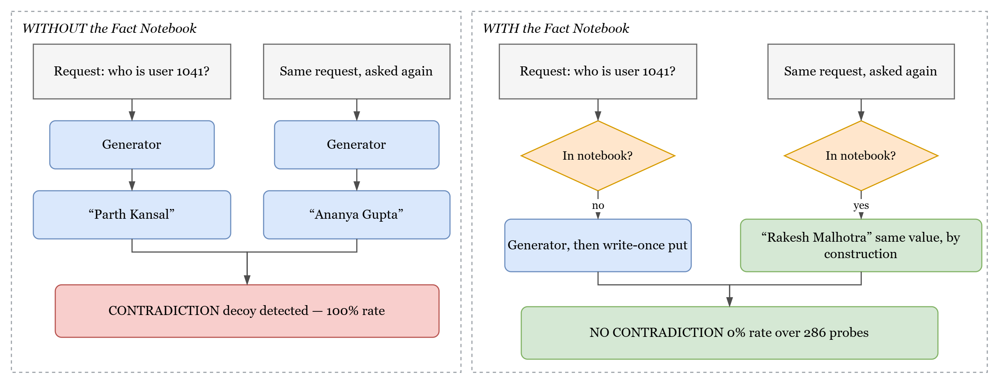

**Figure 10 — Decoy consistency with and without the Fact Notebook.**

#### Target/decoy parity

Consistency of *content* is necessary but not sufficient. The decoy must also match
the real application's **surface**, or the difference itself becomes the tell. Parity
is enforced by tests rather than by inspection, and the tests assert equality in both
directions:

- **Route surfaces are identical.** A route present in the target but absent from the
  decoy would 404; a route present in the decoy but absent from the target is a tell.
  Both directions are asserted.
- **Status codes and content types match** on every shared path.
- **Unauthenticated access is gated identically** — the same redirect, the same code.
- **Bad logins are rejected identically**, including the message text.
- **The injectable surface matches**: a quote in a search parameter produces a 500
  with the same error shape in both.
- **Mundane files are byte-identical**, with exactly one deliberate exception: the
  decoy's `service.ini` contains a planted credential that the real one does not.
  That single asymmetry is the point of the decoy, and the test asserts it in both
  directions.

Crawler-facing files (`robots.txt`, `sitemap.xml`, `favicon.ico`) are served by both
applications. This is not cosmetic: an earlier version diverted a benign crawler
because 404s on these standard paths inflated its error ratio.

### 3.2.5 Tamper-Evident Logging and the Frozen Model

#### Hash-chained decision log

Every decision is written to an append-only store whose records are chained by hash,
following Schneier and Kelsey [39]:

```
    H_i = SHA256( D_i ‖ T_i ‖ H_{i−1} )
```

where D_i is the record content, T_i its timestamp and H_{i−1} the previous record's
hash. A later edit to any record breaks the chain from that point onward and is
detectable by recomputation. Each record carries the request, the extracted features,
both axis scores, the fused belief, the action taken with the expected costs that
justified it, any bait injected with its certificate reference, any bite detected
with its likelihood ratio, and the ground-truth labels for evaluation.

#### Session identity

Because evidence accumulates across a session, session identity is security-relevant.
The proxy mints a cookie on first contact. A coarse IP-plus-user-agent fingerprint
fallback exists and defaults to **off**, which is the honest default: enabling it by
default would let the framework claim robustness against session-resetting attackers
that the shipped configuration does not have. Section 4.4.8 reports a real tool that
exploits exactly this, and reports both what happens with the fallback off and what
happens with it on.

#### Fail-open

Scoring, pricing and injection all sit between the client and the real application, so
a fault in any of them is a fault in front of production traffic. The proxy therefore
**fails open**: if the feature extractor, the meter or the policy raises an exception,
the request is served normally, the fault is recorded with the decision marked
failed-open, and no session is diverted on the strength of a component that did not
run. Failing closed would turn a defect in the detector into an outage for legitimate
users — a worse failure than missing an attack, and the cost table already says so.

This leaves an obvious question about the evaluation: how should a failed-open request
count in a recall figure? The question was settled by checking rather than by ruling.
Across the **875,703 decisions recorded in the reported runs, the fail-open path was
taken zero times**, so no number in this report depends on the answer.

#### The frozen model

Before evaluation, a manifest hashes everything a decision depends on:

```
freeze():
    state ← {
      cost_table     : sha256(costs.yaml),
      features       : { version, sha256(ordered feature-name list) },
      meter          : sha256(trained meter weights),
      schema         : fingerprint(record schema),
      bait_library   : { calibrated?, sha256(per-bait β_attack, β_benign) },
      certificates   : { count, sha256(all invisibility certificates) }
    }
    REFUSE if not state.bait_library.calibrated     # no priors in a frozen model
    WRITE manifest ← state + { timestamp, policy version, seed }

require_frozen():                       # called before ANY reported number
    m ← load_manifest()
    RAISE if m is absent
    FOR each component c in m:
        RAISE if recompute(c) ≠ m[c]    # loud, and names which one moved
```

Two details carry the weight. The feature **list** is hashed, not merely its version
number, so reordering or renaming a feature invalidates a model trained against it —
turning the failure mode where weights and features drift out of step into a start-up
error rather than a silent misprediction. And the refusal is placed at the *reporting*
boundary: a developer may run the stack while iterating, but no tool will emit a
number against a model it cannot vouch for.

The cost table is protected more strictly still. Its loader verifies the hash on
**every load**, so a moved cost table stops every component that makes a decision, not
merely the reporting tools.

## 3.3 Design Constraints

The framework operates under constraints that are technical, legal, economic, ethical
and practical. Each shaped the architecture, and several ruled out designs that would
otherwise have been attractive.

### 1. Safety and non-interference constraints

The hardest constraint, and the one that most shaped the design, is that **the
defence must be invisible to legitimate users**. A security control that honest users
can perceive has not removed a cost; it has moved it. This produced three concrete
requirements:

- Injected content must not change the rendered page — enforced by the gate, not
  promised.
- Injected content must not add perceptible latency — median overhead is certified
  below 0.5 ms, and measured at 0.11 ms in the worst deployed case.
- Following a bait must never grant access or change state — baits are inert by
  design and by test.

### 2. Regulatory and privacy constraints

The framework observes user behaviour, which brings data-protection obligations under
regimes such as the GDPR. Three design responses follow. Features are computed from
request metadata rather than from content wherever possible. No behavioural biometric
requiring client-side instrumentation — mouse movement, keystroke dynamics — is
collected, even though the bot-detection literature [31] shows these are effective;
the privacy cost was judged too high for the benefit. And logs are structured so that
the audit trail can be retained while personal identifiers are minimised.

A deception system also raises a question the technical literature often skips: is it
*ethical* to lie to a visitor? The position taken here is that the deception is
proportionate because it is (a) inert, (b) invisible to anyone not probing the
application, and (c) triggered only by behaviour the visitor chose. A user who never
submits a token that appears only inside an HTML comment never encounters any of it.

### 3. Economic and computational constraints

The framework sits in the request path, so every millisecond is paid on every
request. This ruled out a design in which a language model is consulted during
scoring or during response generation: a model call inside a response would make the
decoy measurably slower than the real site, and a slow decoy is a detectable decoy.
The consequence is the architectural seam of §3.2.4 — generation happens *outside*
the request path, and the notebook serves at database speed.

### 4. Fairness, safety and ethical constraints

A model that produces biased risk scores denies access unfairly. Three mitigations
apply. The two axes are inspectable, and the fusion weights are explicit rather than
learned. The removal of `mal_seq_id_run` and `mal_touched_sensitive` was in part a
fairness fix: those features penalised a *class of legitimate client* rather than a
behaviour. And the decision rule is fully explainable — for any session, the log
records the belief, the expected cost of each action, and which comparison decided it.

### 5. Implementation feasibility constraints

The system had to be buildable by a student team in a semester on a single laptop.
This favoured a Python stack (FastAPI, httpx, scikit-learn, SQLite) over a
distributed one, and favoured a **simulated adversary** over live traffic, since no
ethical source of real attack traffic against a live application was available. That
choice is the origin of the most significant limitation in Chapter 4, and it is
reported there rather than defended.

### 6. Evaluation-integrity constraints

Because the project makes a causal claim, the evaluation had to be designed to be
hard to fudge — a constraint on *method* rather than on the artefact:

- the model is frozen and hashed before evaluation, addressing data snooping [37];
- traffic is seeded and replayed so that arms differ only in the code path selected
  by one flag;
- the primary comparison was fixed before the runs and everything else is labelled
  exploratory;
- an industry-standard ruleset is replayed on identical traffic, addressing the
  inappropriate-baseline pitfall [37];
- the effect of the probe is identified by randomisation rather than inferred from
  a between-system comparison.

### 7. Social and political constraints

Deception technology is unevenly regulated and unevenly trusted. A defence that lies
to visitors invites reasonable questions about proportionality and about what happens
when it misfires. The design's answer is the cost table: the asymmetry between 200
for diverting a benign user and 25 for missing an attack is an explicit, auditable
statement that the system would rather miss eight attacks than wrongly divert one
real person.

## 3.4 Alternative Designs

Three architectures were considered. They differ in what actions the defender has
available and in how the choice among them is made.

### 3.4.1 Design 1: Passive Two-Action Detector

**Structure.** Extract features, score, threshold, allow or block. Deception, if
present at all, is a separate honeypot reached only after a session has been judged
hostile.

**Advantages.** Simple, fast, stateless per decision, easy to explain, and the
industry norm. There is exactly one parameter to tune and its effect is monotone and
intuitive. It has no novel failure modes, because everything about it is understood.

**Limitations.** It inherits the dilemma of §3.1 in full. In the uncertain middle it
must choose between two bad options, and its only response to uncertainty is to move
the threshold, which trades one error for the other. Against valid-syntax attacks it
has no purchase at all, because the requests contain nothing anomalous.

**Measured outcome.** This design was built and is reported as baseline **B2**. It
achieves recall 0.889 with 4 benign diversions out of 7,920 — a strong result that
nonetheless leaves a large share of user-interface IDOR sessions uncaught.

### 3.4.2 Design 2: Always-On Honeytokens

**Structure.** The two-action detector, plus honeytokens planted in every response
regardless of belief, following the standard honeytoken pattern [17], [18], [19].

**Advantages.** Simple to reason about — there is no decision to make, so there is no
decision to get wrong. Maximum coverage: every attacker sees every trap. It removes
the need for a policy entirely.

**Limitations.** Three, and they compound.

First, **cost**. Under the frozen table, showing a probe to a benign session costs 1
unit each time. With 90 % of benign sessions receiving probes on this corpus, a policy
that probes unconditionally accumulates that cost across every honest visitor for the
entire life of the deployment.

Second, **burn**. A token that every visitor sees will eventually be catalogued and
published. This is the honeytoken-fingerprinting result [20] applied at scale: the
tokens become known, and a known token is worse than no token because its absence
becomes informative.

Third, and most importantly, **it answers the wrong question**. The literature gap of
§2.2 is precisely that honeytokens are deployed without regard to belief. Building
that again would reproduce the gap rather than close it.

### 3.4.3 Design 3: Priced Three-Action Policy (Proposed)

**Structure.** The two-axis meter of §3.2.1 produces a belief. A cost-derived policy
selects among PASS, BAIT and DIVERT, where the BAIT band's two edges are computed
from a frozen cost table and measured bite likelihood ratios rather than chosen. A
bite updates the belief in log-odds space; repeated unrewarded exposures decay the
probe's value geometrically. A diverted session lands in a state-consistent decoy.

**Advantages.**

- The middle action exists **only because information has value**, so it cannot be
  reproduced by tuning a threshold — Property 0 proves the band is empty under cost
  alone.
- Both edges are **derived**, so there is no free parameter to accuse of having been
  fitted.
- The upper edge moves **upward** relative to the cost-only boundary, making the
  system *more* cautious about diverting honest users than the passive design.
- The rule **degrades gracefully**: against an adversary who refuses every probe, it
  provably converges to the passive rule rather than to something worse.
- Probing is **selective**, so the burn and cost problems of Design 2 are bounded.

**Limitations and costs.**

- Substantially more complex: a bait library, an invisibility gate, a certificate
  mechanism, a decoy, a fact store and a calibration round all have to exist.
- It introduces a **new failure surface** — injection into live responses — which is
  why the gate exists and why fail-open is mandatory.
- It requires a **calibration round** to measure bite rates, which is additional
  experimental work that a threshold-tuned system does not need.
- Its benefit depends on the attacker actually reading responses. Against a purely
  blind injection engine the probe is unreachable by construction, and Chapter 4
  reports exactly that.

| Criterion | Design 1: Passive | Design 2: Always-on tokens | Design 3: Priced policy |
|---|---|---|---|
| Actions available | 2 | 2 (+ passive tripwire) | **3** |
| Middle action exists | No | Not a decision | **Yes, derived** |
| Free parameters in the policy | 1 threshold | 0 (no policy) | **0 — both edges derived** |
| Cost to benign users | 0 | 1 unit per benign session, always | **1 unit, only when uncertain** |
| Token burn risk | n/a | **High** — every visitor sees them | Low — selective and per-session randomised |
| Behaviour vs. bait-aware adversary | n/a | Tokens ignored, no fallback | **Converges to Design 1** |
| Handles valid-syntax attacks | Poorly | Only if the attacker trips a token | **Yes — the probe creates the evidence** |
| Implementation complexity | Low | Low–medium | **High** |
| Requires calibration round | No | No | **Yes** |
| Reported as | Baseline **B2** | Not built (subsumed) | **B4**, the proposed system |

**Table 10 — Comparison of the three candidate designs.**

## 3.5 Best Design Selection

**Design 3, the priced three-action policy, is selected.** The justification is
developed below against the criteria that matter for this problem.

**It is the only candidate that addresses the identified gap.** Design 1 reproduces
the dilemma; Design 2 reproduces the literature's timing gap. Only Design 3 makes
deception an instrument of the decision rather than a consequence of it or a
constant background.

**Its middle action is not a tuned parameter.** This is the decisive argument. A
reviewer confronted with a three-action system will ask where the two extra numbers
came from, and for Design 3 the answer is arithmetic that the reviewer can redo:
given the cost table and β, the edges follow. Property 0 goes further — under cost
alone the band is *empty*, so the third action cannot be produced by threshold
tuning at all. That is a much stronger position than "we chose 0.3 and 0.7 and it
worked well".

**It improves safety rather than trading it away.** The usual objection to adding an
action is that it must cost something somewhere. Here the arithmetic moves the divert
threshold *up*, from 0.8163 to 0.8793, because a defender with a cheap way to resolve
uncertainty need not gamble. Chapter 4 measures the consequence: **zero benign
diversions out of 7,920**, against 4 for the passive design, on the same traffic.

**It fails gracefully.** The survival discount guarantees convergence to Design 1
against a bait-aware adversary. The system therefore cannot be *asymptotically* worse
than the detector it is built on — a bound Design 2 cannot offer, since an ignored
always-on token contributes nothing and has no fallback.

**Its cost is selective rather than constant.** Probing only in the uncertain band
bounds both the nuisance cost and the token-burn risk that make Design 2
unattractive at scale.

**Its added complexity is contained by construction.** The complexity is real and is
not minimised here. But it is confined behind three seams that are each independently
testable: the invisibility gate (a bait either holds a certificate or is not served),
the fact store (consistency is a property of the store, not the generator), and
fail-open (a fault in any scoring component degrades to plain forwarding). The system
has 358 automated tests, all of which must pass before a model can be frozen.

**Honest counter-argument.** Design 3's benefit depends on an attacker who reads
responses. Against a purely blind injection engine, the probe is unreachable — not
ineffective, but unreachable, because nothing ever reads the planted content.
Chapter 4 measures this directly rather than assuming it away: against an otherwise
identical attacker that ignores response bodies, the bite rate is 0.000 and the
divert rate is 0.000; against one that reads them, both rise to 0.950. That is a
statement about the attacker model, not about the probe, and it is reported as such.


<div style="page-break-after: always;"></div>

## 3.6 System Architecture Overview

The framework follows a **modular, layered architecture**. Each component has one
responsibility and communicates with its neighbours through a narrow interface, so
that components can be tested in isolation and disabled independently — which is what
makes the ablation study of Chapter 4 possible at all.

### 3.6.1 The layers

**Layer 1 — Edge (reverse proxy).** The only component in the request path. It
terminates the client connection, establishes session identity, invokes the layers
below, forwards to the correct upstream, and — if the policy chose BAIT — injects
into the response on its way back. It is also the fail-open boundary: any exception
raised beneath it results in the request being served normally.

**Layer 2 — Perception (feature extraction).** Converts the request, plus the
session's accumulated history, into the eighteen features of Tables 4 and 5. It is
strictly request-side: it never sees ground truth, and it never inspects the response
body. The feature set is versioned and its ordered name list is hashed into the
freeze manifest.

**Layer 3 — Belief (dual meter).** Two logistic heads produce the automation and
malice scores; the fusion block produces the belief *p*. This layer also applies the
Bayesian log-odds update when a bite is detected on a later request.

**Layer 4 — Decision (priced policy).** Computes the expected cost of each action,
computes the value of information for each *deployable* bait, subtracts it, and
returns the action with the least effective cost together with the reasons. This
layer owns the frozen cost table and refuses to operate against an uncalibrated bait
library.

**Layer 5 — Deception (bait engine, gate, decoy, notebook).** Selects and injects
baits, verifies certificates at run time, detects bites on subsequent requests, and —
for diverted sessions — serves the state-consistent decoy backed by the Fact
Notebook.

**Layer 6 — Evidence (hash-chained log, freeze manifest).** Records every decision in
a tamper-evident store and guarantees that no reported number can be produced against
a model that has drifted.

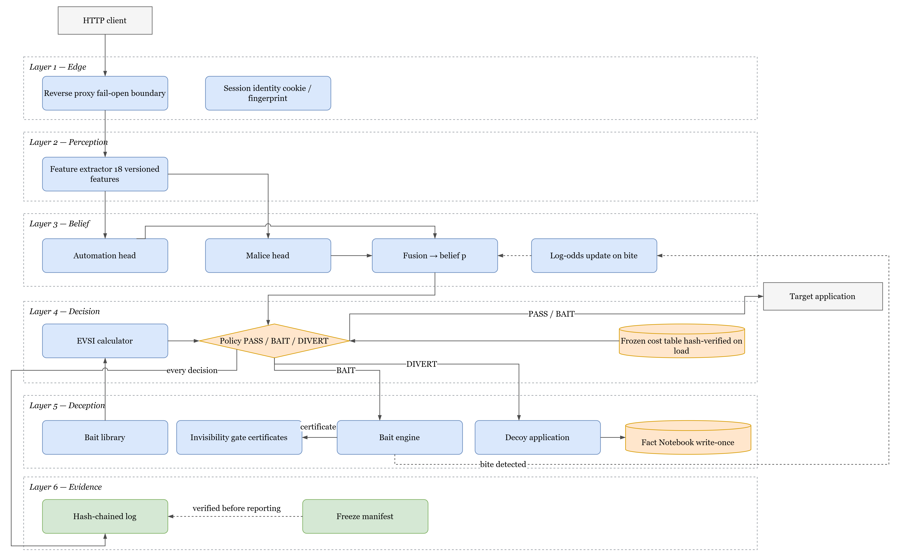

**Figure 11 — Layered system architecture.**

### 3.6.2 Component responsibilities

| Component | Responsibility |
|---|---|
| **Reverse proxy** | Sole request-path component; routes to target or decoy; injects on the response path; enforces fail-open |
| **Session manager** | Mints and tracks session identity; maintains per-session accumulated state |
| **Feature extractor** | Produces 18 versioned features from request and session history; never sees labels |
| **Dual meter** | Two logistic heads plus explicit fusion; owns the belief and its Bayesian updates |
| **Cost table** | Frozen, hashed, verified on every load; the sole source of the loss matrix |
| **EVSI calculator** | Computes V(p) per deployable bait, applies the survival discount |
| **Policy engine** | Selects the least-effective-cost action; records the comparison that decided it |
| **Bait library** | Holds the calibrated baits with their measured β_attack, β_benign |
| **Invisibility gate** | Issues certificates offline; the engine re-checks them at run time |
| **Bait engine** | Selects a bait by max V, injects it, detects bites on later requests |
| **Decoy application** | Serves a parity-matched fake world to diverted sessions |
| **Fact Notebook** | Write-once entity store; the source of the consistency guarantee |
| **Log store** | Append-only, hash-chained; records every decision with its justification |
| **Freeze manifest** | Hashes every artefact a decision depends on; verified before reporting |

**Table 14 (forward reference) — Key architectural components.** Repeated with
implementation detail in Section 4.2.2.

### 3.6.3 Evaluation arms

Because every component is separately switchable, the same binary serves as six
different systems selected by a single mode flag. This is what makes the comparison in
Chapter 4 a comparison of *systems* rather than of *samples*.

| Arm | Rules | Scoring | Probe | Decoy | Purpose |
|---|:--:|:--:|:--:|:--:|---|
| **B0** no defence | – | – | – | – | Undefended traffic; the ceiling on attacker success |
| **B1** signature WAF | ✓ | – | – | – | The conventional baseline |
| **B2** passive | – | ✓ | – | – | The detector without the probe |
| **B3** static | – | ✓ | – | ✓ | Diversion without the priced middle action |
| **B4** full | – | ✓ | ✓ | ✓ | **The system of this report** |
| **B5** fixed edges | – | ✓ | ✓ | ✓ | B4 with hand-set band edges, for §4.5.3 |

**Table 11 — Evaluation arms and the components each enables.**

B4 and B5 differ in exactly one function: B5 prices the probe at its immediate cost
and takes hand-set thresholds, where B4 subtracts the value of information and derives
them. Nothing else in the two paths differs, which is what makes the comparison in
Section 4.5.3 a test of *the derivation* rather than of two different systems.

An arm cannot leak capability into another by accident, because components are
constructed only in the modes that declare them: a mode without probing has no bait
engine object to call.

**A note on the word "diverted".** Throughout the evaluation, *diverted* means **the
policy decided to divert** — a detection event, counted identically in every arm.
Whether the session is then contained depends on whether that arm has a decoy: B4
routes it into one; B2 records the same decision and lets the request continue to the
real application, because B2 exists to measure the detector rather than the
containment. Recall is therefore comparable across arms by construction, and a recall
figure in this report is a claim about *deciding*, not about what the attacker
experienced afterwards.

This also explains why **B3 is implemented but not reported**. Its decision path is
identical to B2's — same features, same meter, same two-action rule — and the only
difference is where a diverted session is sent afterwards, which cannot change whether
the policy decided to divert it. Its recall would equal B2's by construction, and
reporting it as a separate row would suggest an independent measurement that does not
exist.

### 3.6.4 Overall system flow

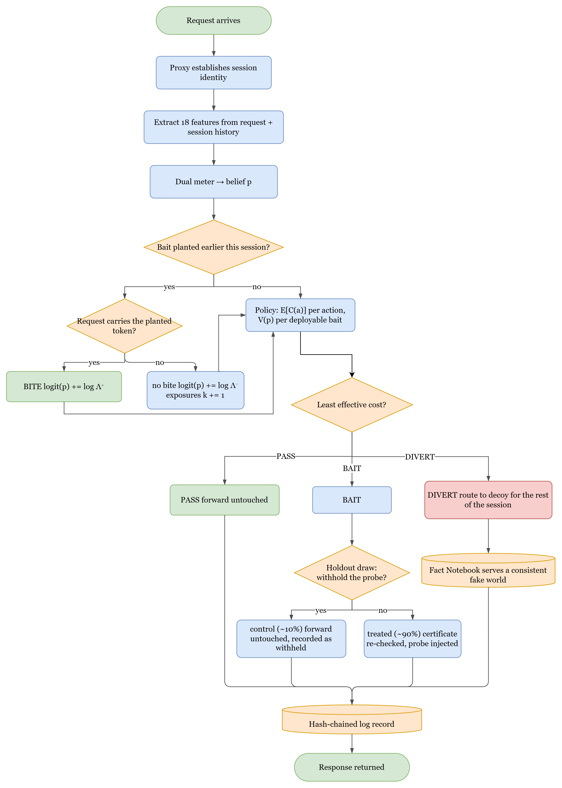

**Figure 12 — Overall system flow, including the randomised holdout.** The holdout
branch is not a production feature; it is an experimental instrument built into the
treated arm so that the probe's causal effect can be identified. It is described in
Section 3.7 and analysed in Section 4.4.3.

## 3.7 Design Flow (Algorithm)

This section states the framework's behaviour as executable pseudocode. It is written
so that the system could be reimplemented from this report alone, without reference to
the source code.

### Algorithm 1 — Request handling (top level)

```
ALGORITHM handle_request(req)
INPUT   req — an incoming HTTP request
OUTPUT  resp — the HTTP response returned to the client

 1  sess ← session_for(req)                       # cookie, else fingerprint if enabled
 2  IF sess is new THEN
 3      sess.state ← { p: prior, exposures: {}, pending_baits: [], diverted: false }
 4
 5  TRY                                            # ---- fail-open boundary ----
 6      x    ← extract_features(req, sess)         # Algorithm 2
 7      sess ← detect_bite_and_update(req, sess)   # Algorithm 3
 8      p    ← fuse(meter.automation(x), meter.malice(x))
 9      dec  ← decide(p, sess)                     # Algorithm 4
10  CATCH any exception e
11      log_fail_open(req, sess, e)
12      RETURN forward(req, target_upstream)       # serve normally; divert nothing
13
14  IF sess.diverted OR dec.action = DIVERT THEN
15      sess.diverted ← true                       # a diverted session stays diverted
16      upstream ← decoy_upstream IF decoy_enabled ELSE target_upstream
17  ELSE
18      upstream ← target_upstream
19
20  resp ← forward(req, upstream)                  # the request is ALWAYS served
21
22  IF dec.action = BAIT THEN
23      IF in_holdout(sess.id) THEN                # deterministic draw; Algorithm 6
24          record(sess, assignment := "holdout")  # control: probe withheld
25      ELSE
26          resp ← inject_bait(resp, dec.bait, sess)   # Algorithm 5
27          record(sess, assignment := "policy")
28
29  append_to_hash_chain(req, x, p, dec, resp_meta, labels)
30  RETURN resp
```

Line 20 is the line that matters most: **the request is always served**. Baiting adds
information; it withholds nothing. This is why `attack / BAIT` costs the same as
`attack / PASS` in Table 6.

### Algorithm 2 — Feature extraction

```
ALGORITHM extract_features(req, sess)
OUTPUT  x — an 18-dimensional feature vector

 1  now ← req.timestamp
 2  # ---- automation axis (10) ----
 3  x.auto_interarrival_last    ← now − sess.last_request_time
 4  x.auto_interarrival_cv      ← stdev(sess.gaps) / mean(sess.gaps)   # 0 if <2 gaps
 5  x.auto_requests_per_min     ← 60 · sess.request_count / age(sess)
 6  x.auto_asset_fetch_ratio    ← sess.asset_fetches / max(sess.page_loads, 1)
 7  x.auto_fetched_assets       ← |sess.distinct_assets|
 8  x.auto_browser_header_ratio ← sess.reqs_with_browser_headers / sess.request_count
 9  x.auto_header_count         ← |req.headers|
10  x.auto_ua_is_tool           ← 1 IF req.user_agent matches TOOL_PATTERNS ELSE 0
11  x.auto_ua_stable            ← 1 IF req.user_agent = sess.first_user_agent ELSE 0
12  x.auto_cookie_carried       ← 1 IF req carries the issued session cookie ELSE 0
13
14  # ---- malice axis (8) ----
15  params ← parse_query_and_body(req)
16  x.mal_input_length       ← max(|v| for v in params.values())
17  x.mal_special_char_ratio ← count(v, SPECIAL_CHARS) / total_length(params)
18  x.mal_db_keyword_hits    ← count of SQL keywords across params
19  x.mal_db_keyword_any     ← 1 IF x.mal_db_keyword_hits > 0 ELSE 0
20  x.mal_failed_auth        ← sess.failed_auth_count
21  x.mal_error_ratio        ← sess.responses_4xx_5xx / sess.request_count
22  x.mal_param_mutation     ← sess.param_revisions / max(sess.request_count, 1)
23  x.mal_distinct_usernames ← |sess.usernames_attempted|
24
25  ASSERT no ground-truth label was read           # enforced by construction
26  RETURN x
```

Line 21 is where the double count of Section 3.2.1 was removed: login rejections
count once, in `mal_failed_auth`, and are excluded from the error ratio.

### Algorithm 3 — Bite detection and Bayesian update

```
ALGORITHM detect_bite_and_update(req, sess)

 1  FOR EACH b IN sess.pending_baits DO
 2      IF bait_signal_present(req, b) THEN             # value, name, or path match
 3          IF b.kind = "value" AND b.session_suffix ≠ sess.suffix THEN
 4              cross_session ← true                    # valid: value tokens are unique
 5          ELSE IF b.kind = "name" AND b.issued_to ≠ sess.id THEN
 6              CONTINUE                                # name tokens are NOT unique:
 7                                                      # cross-session claim invalid
 8          sess.p ← sigmoid( logit(sess.p) + log(b.lambda_plus) )
 9          record_bite(sess, b, cross_session)
10          sess.pending_baits.remove(b)
11      ELSE IF b.was_shown AND request_count_since(b) ≥ 1 THEN
12          sess.p ← sigmoid( logit(sess.p) + log(b.lambda_minus) )
13          sess.exposures[b.id] ← sess.exposures[b.id] + 1
14  RETURN sess
```

Lines 3–7 encode the token-uniqueness distinction of Section 3.2.3. Reporting a
cross-session bite for a *name* bait would be unsound, because the name is fixed and
could have been learned anywhere.

### Algorithm 4 — The priced decision rule

```
ALGORITHM decide(p, sess)
OUTPUT  dec — { action, bait, expected_costs, reason }

 1  # ---- immediate expected costs from the FROZEN cost table ----
 2  E_pass   ← (1 − p)·C[benign][pass]   + p·C[attack][pass]      # = 25p
 3  E_bait   ← (1 − p)·C[benign][bait]   + p·C[attack][bait]      # = 1 + 24p
 4  E_divert ← (1 − p)·C[benign][divert] + p·C[attack][divert]    # = 200 − 220p
 5
 6  # ---- value of information for each DEPLOYABLE bait ----
 7  best_V ← 0 ; best_bait ← NONE
 8  FOR EACH j IN bait_library WHERE applicable(j, sess) AND certified(j) DO
 9      V_j ← evsi(p, j.beta_attack, j.beta_benign)               # Algorithm 5a
10      k   ← sess.exposures[j.id]
11      V_j ← V_j · (1 − j.beta_attack)^k                         # survival discount
12      IF V_j > best_V THEN best_V ← V_j ; best_bait ← j
13
14  ASSERT best_V ≥ 0                                             # Property 1, enforced
15
16  effective_bait ← E_bait − best_V
17
18  # ---- choose the least effective cost ----
19  costs ← { pass: E_pass, bait: effective_bait, divert: E_divert }
20  action ← argmin(costs)
21
22  IF action = BAIT AND best_bait = NONE THEN
23      action ← PASS                     # nothing deployable; do not pretend
24
25  RETURN { action, bait: best_bait, expected_costs: costs,
26           reason: comparison that decided it }
```

### Algorithm 5a — Expected value of sample information

```
ALGORITHM evsi(p, beta_a, beta_b)
OUTPUT  V — the expected value of running this probe at belief p

 1  IF p ≤ 0 OR p ≥ 1 THEN RETURN 0            # Property 2: V(0) = V(1) = 0
 2
 3  P_bite ← p·beta_a + (1 − p)·beta_b
 4  IF P_bite ≤ 0 OR P_bite ≥ 1 THEN RETURN 0
 5
 6  p_yes ← (p · beta_a)       / P_bite                    # Bayes posterior, bite
 7  p_no  ← (p · (1 − beta_a)) / (1 − P_bite)              # Bayes posterior, no bite
 8
 9  before ← min_action_cost(p)
10  after  ← P_bite · min_action_cost(p_yes)
11              + (1 − P_bite) · min_action_cost(p_no)
12
13  RETURN max(before − after, 0)               # clamp enforces Property 1
```

```
ALGORITHM min_action_cost(q)
 1  RETURN min( (1−q)·C[benign][pass]   + q·C[attack][pass],
 2              (1−q)·C[benign][bait]   + q·C[attack][bait],
 3              (1−q)·C[benign][divert] + q·C[attack][divert] )
```

### Algorithm 5b — Bait injection

```
ALGORITHM inject_bait(resp, bait, sess)

 1  cert ← certificate_for(bait)
 2  IF cert is absent OR NOT cert.passed THEN
 3      RETURN resp                            # refuse to serve an uncertified bait
 4  IF cert.median_overhead_ms > MAX_OVERHEAD_MS THEN
 5      RETURN resp
 6
 7  suffix ← sha256(seed ‖ sess.id)[0:6]       # per-session uniqueness
 8  token  ← bait.template.format(suffix)
 9
10  SWITCH bait.channel
11      CASE "error_text":    body ← splice_into_error_message(resp.body, token)
12      CASE "html_comment":  body ← insert_before_closing_body(resp.body, token)
13      CASE "json_field":    body ← add_unused_field(resp.body, bait.field, token)
14
15  ASSERT rendered_text(body) = rendered_text(resp.body)     # invariant, tested
16  resp.body ← body
17  sess.pending_baits.append({ id: bait.id, token, suffix,
18                              kind: bait.bite_kind, issued_to: sess.id,
19                              lambda_plus: bait.beta_a / bait.beta_b,
20                              lambda_minus: (1−bait.beta_a)/(1−bait.beta_b) })
21  RETURN resp
```

### Algorithm 6 — The randomised holdout

```
ALGORITHM in_holdout(session_id)
OUTPUT  true if this session's probe should be WITHHELD (control group)

 1  digest ← sha256( run_seed ‖ session_id )
 2  draw   ← int(digest[0:8]) / 2^64                # uniform in [0, 1)
 3  RETURN draw < holdout_fraction                  # 0.1 in the shipped config
```

The draw is **deterministic given the seed and the session id**, which has two
consequences that matter for the evaluation. It is reproducible: re-running the same
seed reproduces the same assignment exactly. And it is independent of the belief, the
features and the outcome, so the treated and control groups are exchangeable at the
moment of assignment — which is what licenses the causal interpretation in
Section 4.4.3.

### Algorithm 7 — Decoy fact resolution

```
ALGORITHM decoy_fact(kind, key)

 1  IF notebook.has(kind, key) THEN
 2      RETURN notebook.get(kind, key)         # already asserted; MUST NOT change
 3  value ← generator.produce(kind, key)       # deterministic RNG or language model
 4  notebook.put(kind, key, value)             # write-once; never overwritten
 5  RETURN value
```

### Algorithm 8 — Hash-chained log append

```
ALGORITHM append_to_hash_chain(req, x, p, dec, resp_meta, labels)

 1  record ← { request: summarise(req), features: x, scores: {automation, malice},
 2             belief: p, decision: dec, bait: injected_bait_or_none,
 3             bite: bite_or_none, labels: labels, timestamp: now }
 4  prev  ← store.last_hash  OR  "0" × 64
 5  h     ← sha256( canonical_json(record) ‖ record.timestamp ‖ prev )
 6  record.integrity ← { hash: h, prev_hash: prev }
 7  store.append(record)                       # append-only; no update path exists
```

### Worked example: one session end to end

| Req | Path | Features (abridged) | p before | Action | Event | p after |
|---:|---|---|---:|---|---|---:|
| 1 | `GET /` | browser headers, assets fetched | 0.020 | PASS | — | 0.020 |
| 2 | `GET /search?q=widget` | clean parameter | 0.031 | PASS | — | 0.031 |
| 3 | `GET /search?q=widget'` | special char ratio ↑, 500 seen | 0.163 | **BAIT** | `B-SQL-1` injected | 0.163 |
| 4 | `GET /records/1041` | id access | 0.163 | BAIT | already pending | 0.163 |
| 5 | `GET /records/1042` | sequential id | 0.476 | BAIT | `B-IDOR-2` injected | 0.476 |
| 6 | `GET /records/1043?internal_view=1` | **carries planted parameter** | 0.476 | — | **BITE**, Λ⁺ = 112.3 | **0.990** |
| 7 | `GET /records/1044` | — | 0.990 | **DIVERT** | routed to decoy | 0.990 |

At request 6 the belief moves from 0.476 to 0.990 in a single step, because
log(112.3) = 4.72 is added to the log-odds. The probe did not detect the attack; it
*created the evidence* that let the passive meter's belief cross the divert edge.
This is the mechanism the entire report is about.

## 3.8 Flowcharts

### 3.8.1 Sequence Diagram (Step-by-Step Execution)

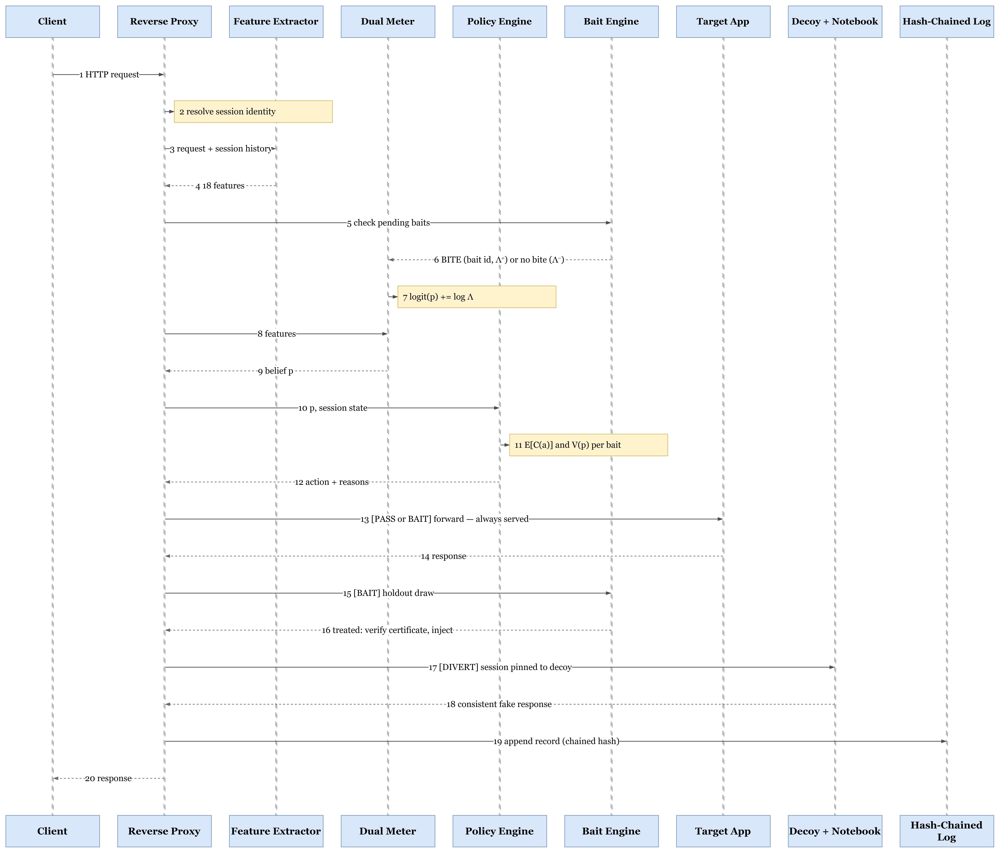

**Figure 13 — Sequence diagram (step-by-step execution).**

### 3.8.2 DFD Level 0 (Context Diagram)

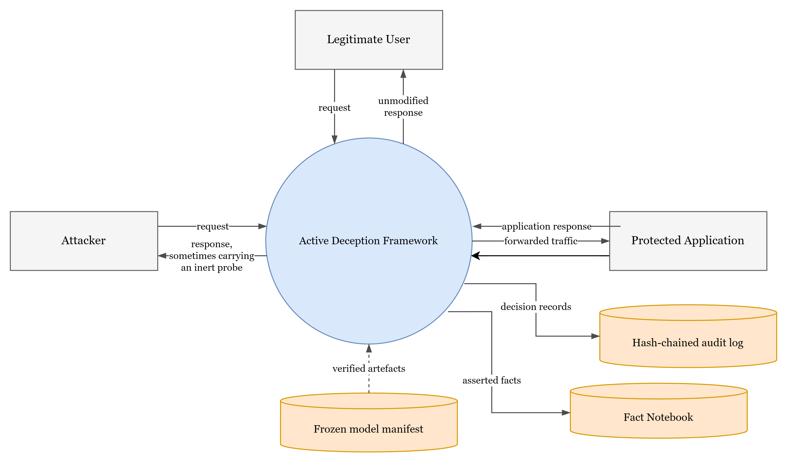

**Figure 14 — DFD Level 0 (context diagram).** From outside, the framework is a
transparent reverse proxy. The legitimate user and the attacker send the same kind of
request and receive responses that differ only in bytes neither a browser nor a human
ever renders.

### 3.8.3 DFD Level 1 (Detailed System Flow)

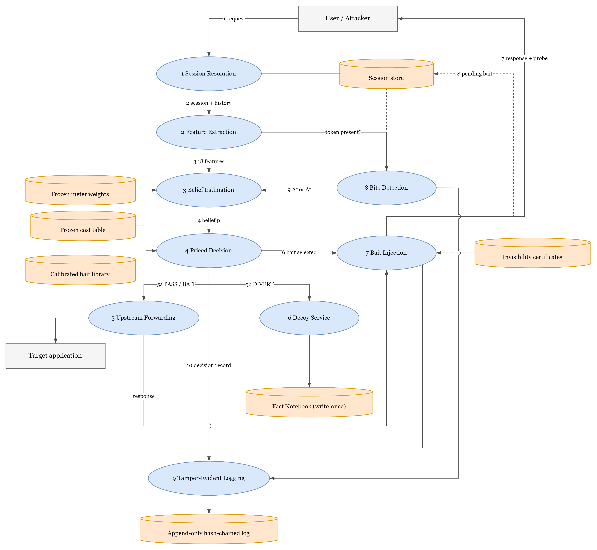

**Figure 15 — DFD Level 1 (detailed system flow).** Process 8 closes the loop:
evidence created by a probe on an earlier request re-enters belief estimation on a
later one.

### 3.8.4 Use Case Diagram

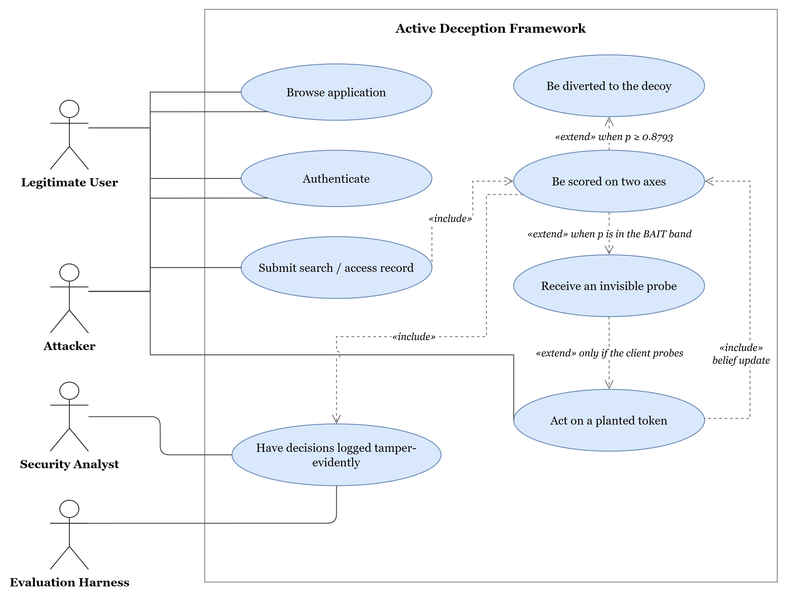

**Figure 16 — Use case diagram.** Only the attacker reaches "act on a planted token":
not because the framework prevents the legitimate user from doing so, but because the
token appears nowhere a browser renders. This was measured: among the benign sessions
that were shown a probe (7,098 of them), **zero** acted on one.

### 3.8.5 Class Diagram

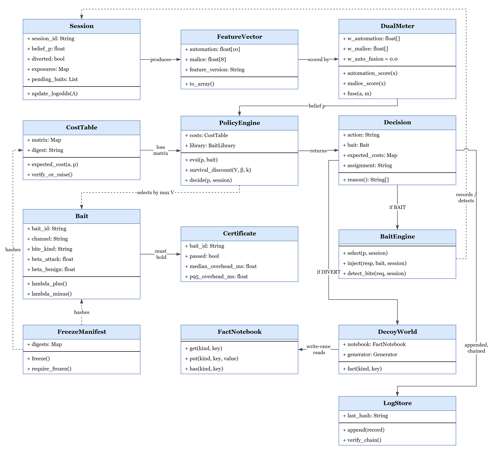

**Figure 17 — Class diagram.** The `Certificate` association on `Bait` is a hard
requirement rather than a convenience: a `Bait` without a passing `Certificate` cannot
be served, and the check happens at run time rather than at load time.

### 3.8.6 Session State Machine

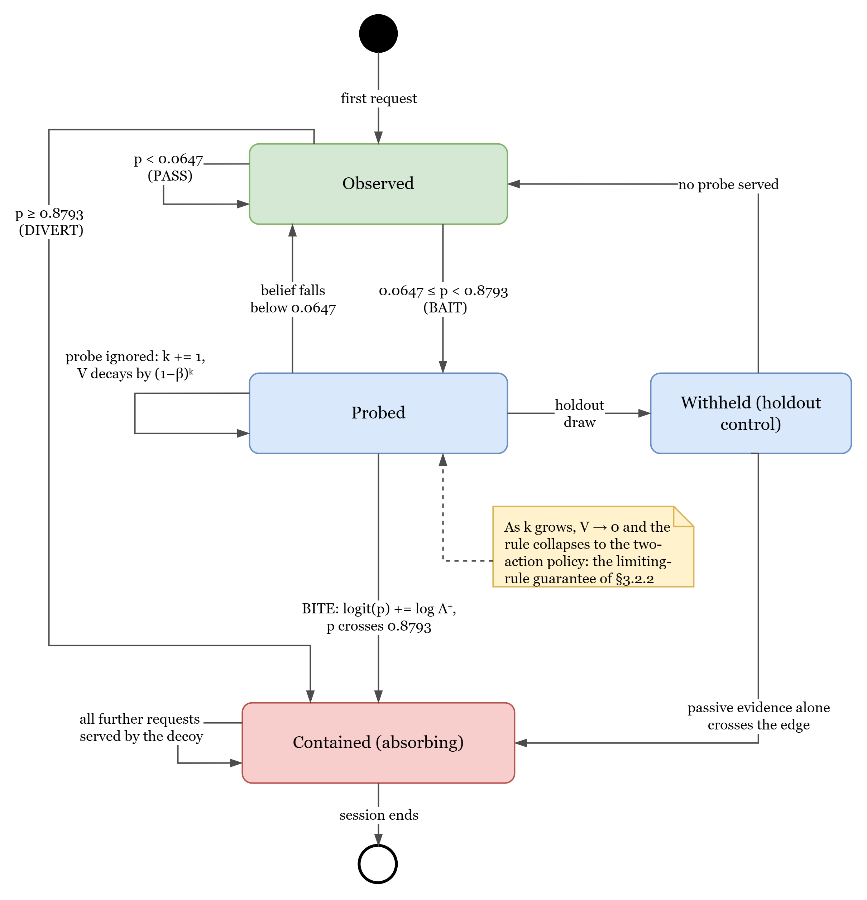

**Figure 18 — Session state machine.** `Contained` is absorbing: once a session is
diverted it stays diverted for its lifetime, so an attacker cannot oscillate back into
the real application by behaving well for a few requests.

## 3.9 Implementation Plan

Implementation proceeded in eight phases. Each had a written exit condition that was
verified before the next began.

| Phase | Objective | Exit condition | Verified by |
|---|---|---|---|
| 0 | Foundation | Cost table written, hashed, committed; label schema fixed; logging skeleton | Hash recorded in changelog; schema tests |
| 1 | Target app + benign corpus | Six corpus checks pass; hard negatives present | `generate_corpus` verification |
| 2 | Attack round 1 | 2 × 2 automation/malice coverage; label join verified non-empty | Provenance-id join coverage test |
| 3 | Detection engine (B2) | End-to-end on identical traffic; zero benign diversions among automated clients | Multi-seed smoke run |
| 4 | Bait library, **gate first** | Gate exists before any bait; every bait certified; bite rates calibrated | Certificate file; calibration report |
| 5 | Decoy + notebook + fuzzer | 0 % contradiction over 286 probes; full target/decoy parity | Consistency fuzzer; 19 parity tests |
| 6 | Integration, fail-open, freeze | Per-component fail-open verified; manifest frozen and verified | Fault-injection tests; freeze verify |
| 7 | Round 2, baselines, ablations | 99-seed evaluation; protocol pre-registered; ablations reported | Statistical report; figure digests |

**Table 12 — Development phases and their exit conditions.**

### Phase 0 — Foundation

**Objective.** Fix everything that must not move later.

**Detail.** The cost matrix of Table 6 was written, given a SHA-256 digest over its
matrix and fusion blocks, and committed with a dated changelog entry. The loader
verifies this digest on **every load** and raises `FrozenConfigError` on mismatch, so
a moved cost table stops every component that makes a decision. The record schema was
fixed at this point too, because retrofitting a schema after data collection is the
classic way to lose a corpus.

**Output.** A hashed cost table, a versioned record schema, and an append-only log
store with hash chaining.

### Phase 1 — Target application and benign corpus

**Objective.** Build something worth defending and traffic worth defending it against.

**Detail.** The target is a FastAPI records application with deliberate weaknesses: an
SQL-injectable search, object-reference endpoints without ownership checks, and a
login flow that leaks account existence. The benign generator produces **80 sessions
per draw**: three-quarters simulated humans and one quarter automated-but-harmless
clients.

The composition of the benign set is the single most consequential decision in the
whole evaluation, because a safety metric measures only what its inputs contain. The
human quarter deliberately includes **hard negatives** — honest users who behave in
ways an attacker also behaves:

- a staff member searching for a colleague named *O'Connell* (apostrophe in a query);
- a user who has forgotten their password (repeated failed logins);
- a user who mistypes URLs (elevated 404 rate).

The automated quarter contains an uptime monitor, a search-engine crawler, and a
nightly reporting integration that walks record identifiers in ascending order. That
last client is not decoration: it produced the most useful finding in the project, and
it is the reason the benign numbers in Chapter 4 mean anything.

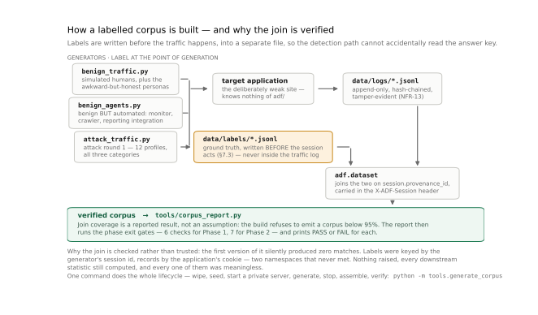

**Figure 19 — Corpus construction and label-join verification.** The refusal at the
coverage check exists because an early version of this project produced a corpus whose
label join matched **zero** requests, and nothing downstream noticed.

**Output.** A labelled, verified benign corpus with hard negatives.

### Phase 2 — Attack round 1 (training corpus)

**Objective.** Produce hostile traffic with reliable labels, covering all four
quadrants of Figure 3.

**Detail.** Generators for SQL injection, object-reference walking and credential
attacks, deliberately spanning the automation/malice grid so that the meter cannot
learn "automated ⇒ hostile". Every session carries a provenance identifier that joins
to its ground-truth label, and the join coverage is asserted before the corpus is
emitted.

**Output.** Round-1 corpus, used **only** for training the meter. It is never used for
any reported result.

### Phase 3 — Detection engine (baseline B2)

**Objective.** A working passive detector, which is both a component and a baseline.

**Detail.** Two logistic heads trained on round 1 with scikit-learn; explicit fusion
weights; the cost policy in two-action mode; the reverse proxy wired end to end. This
phase also established fail-open: the proxy serves normally if any scoring component
raises.

**Output.** Baseline **B2**, and the foundation on which B4 is built.

### Phase 4 — Bait library, invisibility gate first

**Objective.** A calibrated bait library in which every bait is provably invisible.

**Detail.** The ordering is the requirement. The gate (Figure 8) was implemented
first, against a corpus of 116 real responses. Baits were then written and submitted
to it; a bait that failed any check was revised or discarded rather than accepted with
a caveat.

The **calibration round** then measured β_attack and β_benign for each bait by
deploying it against both hostile and benign traffic and counting bites, using the
Jeffreys estimator of Section 3.2.3. The policy refuses to produce reportable results
from an uncalibrated library, so this step cannot be skipped.

During this phase `B-AUTH-2` was withdrawn, because the target has no JSON
authentication response and the bait was therefore shown to zero sessions while
carrying a fabricated β_attack of 0.45.

**Output.** Five deployed baits with measured effectiveness and passing certificates.

### Phase 5 — Decoy, Fact Notebook and consistency fuzzer

**Objective.** A fake world that cannot contradict itself, and evidence that it does
not.

**Detail.** The decoy is a second FastAPI application whose route surface is asserted
identical to the target's in both directions. The Fact Notebook is a write-once SQLite
store. The **consistency fuzzer** is an adversarial prober that asks the same question
in different ways, revisits entities after intervening requests, and cross-references
answers across endpoints — seven probe types in total, several hundred probes per run.

A planted credential is placed in the decoy's `service.ini`, and a test asserts it is
absent from the real one, in both directions.

**Output.** A parity-matched decoy with a measured contradiction rate.

### Phase 6 — Integration, fail-open verification and model freeze

**Objective.** One system, verified to degrade safely, with every artefact hashed.

**Detail.** Fault injection breaks each of the three scoring components in turn and
asserts the request is still served. The freeze manifest is then written over the
meter, cost table, feature list, schema, bait library and certificates. Freezing
refuses if the bait library is uncalibrated.

**Output.** A frozen, hash-verified model.

### Phase 7 — Attack round 2, baselines, ablations

**Objective.** Evaluate honestly against traffic the detector has never seen.

**Detail.** A second attack corpus, written after the detector was built and
deliberately unlike round 1, with **120 attack sessions per draw** across five
subcategories. Each arm runs over **99 independent seeded draws** against the one
frozen model. Within a seed, every arm sees byte-identical traffic.

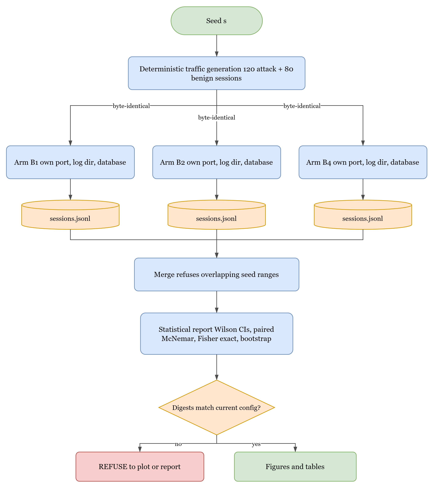

**Figure 20 — Evaluation harness and arm isolation.** Because a draw is serial, the
seed range is split across processes with disjoint seeds and separate ports, logs and
databases; the merge refuses to combine overlapping ranges so that a mistake in the
split fails loudly rather than double-counting sessions into every pooled proportion.

**Output.** The results of Chapter 4.


<div style="page-break-after: always;"></div>

# CHAPTER 4

# RESULTS ANALYSIS AND VALIDATION

## 4.1 Implementation Using Modern Engineering Tools

The framework was implemented as an asynchronous reverse proxy in Python, with the
deliberately weak target application and the decoy running as separate services. The
defence is about **6,600 lines** of Python; the evaluation harness adds a further
**10,700** and the test suite **4,700**, for roughly 22,000 lines in total.

| Category | Technology / Tool | Purpose |
|---|---|---|
| Language | Python 3.11 | Framework, harness, generators and tests |
| Web framework | FastAPI + Uvicorn | Asynchronous reverse proxy; target and decoy services |
| HTTP client | httpx | Upstream forwarding inside the proxy; all traffic generators |
| Machine learning | scikit-learn | Logistic heads of the dual meter; calibration maps |
| Numeric / data | NumPy, pandas | Feature handling and evaluation statistics |
| Database | SQLite | Target world, decoy world and the Fact Notebook |
| Hashing | hashlib (SHA-256) | Log chaining, freeze manifest, per-session bait suffixes |
| Visualisation | matplotlib | Publication-quality SVG/PDF figures (Okabe–Ito palette) |
| Local LLM runtime | Ollama (llama3.2:1b, llama3.2:3b, qwen2.5:7b) | Decoy generation behind the consistency seam; autonomous attacker in §4.4.9 |
| Containerisation | Docker | OWASP CRS, OWASP Juice Shop, browser-driven scanner |
| Third-party attack tools | sqlmap 1.10.8, ghauri 1.4.3, wapiti 3.2.3, OWASP ZAP | External validation |
| Signature baseline | OWASP ModSecurity CRS | Replayed at paranoia levels 1–4 on identical traffic |
| Testing | pytest | 358 automated tests across 26 files |
| Version control | Git | Source management and decision audit trail |

**Table 13 — Technologies used.**

### 4.1.1 Modules implemented

1. **Reverse proxy and session manager** — the only request-path component; owns
   fail-open and routing.
2. **Feature extraction module** — 18 versioned features from request and session
   history.
3. **Dual suspicion meter** — two logistic heads plus explicit fusion.
4. **Priced policy engine** — expected costs, EVSI, survival discount, action
   selection.
5. **Bait engine and invisibility gate** — selection, certified injection, bite
   detection.
6. **Decoy service and Fact Notebook** — parity-matched fake world with a write-once
   entity store.
7. **Tamper-evident log store** — append-only, hash-chained.
8. **Freeze subsystem** — manifest generation and verification.
9. **Evaluation harness** — seeded multi-arm runs, sharded execution, statistical
   reporting.
10. **Consistency fuzzer** — adversarial prober for the decoy.

### 4.1.2 Reproducibility mechanisms

Three mechanisms make the evaluation reproducible and hard to fudge, and they are
worth stating because a measurement that cannot be replayed is difficult to trust.

**The model is frozen before evaluation** [37]. A manifest hashes the two logistic
heads, the cost table, the feature set and its version, the record schema, the
calibrated bait library and the invisibility certificates. Every tool that produces a
reported number recomputes the manifest first and raises rather than proceeding, so a
figure in this report cannot have come from a model that had drifted. The cost table
is additionally verified on **every load**, so altering it stops any component that
makes a decision.

**Traffic is seeded and replayed.** Every generator is deterministic given a seed, so
each arm sees byte-identical traffic. The only thing that differs between arms is the
code path selected by a single mode flag.

**The log is tamper-evident** [39]. Decisions are chained by hash, so a later edit to
any record breaks the chain and is detectable.

## 4.2 System Design and Architecture

### 4.2.1 Overall system workflow

The system operates as a sequential pipeline:

1. Client sends an HTTP request; the proxy resolves session identity.
2. Eighteen features are extracted from the request and the session's history.
3. If a probe was planted earlier, the request is checked for the planted token, and
   the belief is updated in log-odds space by Λ⁺ (bite) or Λ⁻ (ignored).
4. The dual meter produces the hostility belief *p*.
5. The policy computes the expected cost of each action and the value of information
   for each deployable bait, applies the survival discount, and selects the least
   effective cost.
6. The request is forwarded — to the real application unless the session is diverted.
7. If the action is BAIT and the session is not in the holdout, the probe is injected
   into the response after its certificate is re-verified.
8. The decision is appended to the hash-chained log.

### 4.2.2 Key architectural components

| Component | Description |
|---|---|
| **Reverse proxy** | Sole request-path component; routes to target or decoy; injects on the response path; enforces fail-open |
| **Session manager** | Cookie-based identity with an optional coarse fingerprint fallback (default off) |
| **Feature extractor** | 18 versioned features; strictly request-side; never reads labels |
| **Dual meter** | Automation and malice logistic heads with explicit fusion weights (w_auto = 0.0) |
| **Cost table** | Frozen, hashed, verified on every load |
| **Policy engine** | Expected costs, EVSI per bait, survival discount, action selection with recorded reasons |
| **Bait library** | Five deployed baits with measured β_attack and β_benign |
| **Invisibility gate** | Issues certificates offline; the engine re-checks them at run time |
| **Bait engine** | Selects by max V, injects with a per-session suffix, detects bites |
| **Decoy application** | Route-surface parity with the target, asserted in both directions |
| **Fact Notebook** | Write-once entity store; source of the consistency guarantee |
| **Log store** | Append-only, hash-chained decision records |
| **Freeze manifest** | Hashes every decision-relevant artefact; verified before reporting |

**Table 14 — Key architectural components.**

### 4.2.3 Functional description of modules

**Reverse proxy.** Terminates the client connection and is the fail-open boundary.
Any exception raised by feature extraction, the meter or the policy results in the
request being forwarded normally with the decision marked failed-open. Across the
875,703 decisions recorded in the reported runs, this path was taken **zero** times.

**Feature extraction module.** Produces the eighteen features of Tables 4 and 5. Two
features present in an earlier version — `mal_seq_id_run` and
`mal_touched_sensitive` — were **removed** after they were found to divert 100 % of
benign JSON-API integration clients, and the detection they provided was delegated to
the probe.

**Dual meter.** Two logistic heads trained on round-1 traffic only. The fusion places
zero weight on automation, verified against the logs rather than the configuration:
across 12,954 scored requests in an audit, the belief equalled the malice score
exactly within the 10⁻⁶ clamp while the automation score ranged over its whole domain.

**Policy engine.** Implements Algorithms 4 and 5a. It refuses to operate against an
uncalibrated bait library, and asserts V ≥ 0 as a runtime invariant.

**Bait engine and gate.** Selects the applicable, certified bait with the largest
survival-discounted V. Injection re-verifies the certificate; an uncertified bait is
silently not served rather than served with a warning.

**Decoy and Fact Notebook.** Serves diverted sessions from a world whose facts are
pinned on first assertion. Route surfaces, status codes, content types, gating
behaviour and mundane file contents are asserted identical to the target's, with the
single deliberate exception of a planted credential in the decoy's `service.ini`.

**Log store and freeze subsystem.** Append-only with hash chaining; no update path
exists in the API.

### 4.2.4 Design features and advantages

- **Modular architecture** — each component is separately switchable, which is what
  makes the six-arm ablation of Table 11 possible from one binary.
- **Real-time evaluation** — the certified worst-case median injection overhead is
  0.11 ms against a 0.5 ms ceiling.
- **Adaptive but bounded** — the three-action rule provably converges to the
  two-action rule against an adversary who refuses every probe.
- **Tamper-evident by construction** — hash chaining makes post-hoc log edits
  detectable.
- **Fails open** — a defect in the detector degrades to plain forwarding rather than
  to an outage.

## 4.3 Testing and Validation

### 4.3.1 Test suite composition

**358 automated tests across 26 files.** All must pass before a model can be frozen.

| Area | Representative assertions |
|---|---|
| Policy and decision rule | V(p) ≥ 0 for all p; V(0) = V(1) = 0; band non-empty; divert edge ≥ cost-only boundary |
| Statistical sensitivity | Band invariance across β ∈ [0.05, 0.99] and cost ratio 0.5–128 |
| Cost table integrity | Load refuses on digest mismatch; refuses an unfrozen table |
| Feature extraction | Correct values on crafted requests; label isolation |
| Meter | Score ranges; blank-request behaviour; feature-version binding |
| Invisibility gate | Rendered-text equality; JSON parseability; latency ceiling; refusal of inapplicable baits |
| Bait routing and engine | Channel selection; per-session suffix uniqueness; cross-session validity by bite kind |
| Bite detection | Value/name/path matching; correct Λ applied |
| Fact Notebook | Write-once semantics; repeated queries return identical values |
| Decoy indistinguishability | 19 parity tests, both directions |
| Fail-open | Each of three components broken in turn; request still served |
| Freeze | Drift in any component raises; uncalibrated library refuses to freeze |
| Log store | Chain verification; tamper detection |
| Traffic generators | Population mixing; corpus knobs pinned correctly |
| Calibration | Monotonicity; edge inversion; map selection |

**Table 15 — Test suite composition.**

### 4.3.2 Unit testing

Individual components were verified in isolation: the policy's arithmetic against
hand-computed expected costs, the feature extractor against crafted requests with
known feature values, the gate against responses it should and should not accept, and
the notebook's write-once semantics under repeated queries.

### 4.3.3 Integration testing

Module interactions were verified end to end: features flow to the meter, the belief
flows to the policy, a BAIT decision reaches the bait engine, an injected token is
detected on a later request, the resulting belief update crosses the divert edge, and
the session is routed to the decoy and pinned there.

### 4.3.4 System testing

The complete workflow was exercised over seeded multi-arm runs:
**login → scoring → decision → probe → bite → divert → logging**, with every arm
receiving byte-identical traffic within a seed.

### 4.3.5 Guards added in response to observed failures

This subsection is included because the guards are part of the result. This project's
recurring bug class was **silent wrongness**: tooling that produced a plausible,
parseable, wrong artefact instead of failing.

| Failure observed | Consequence if unguarded | Guard added |
|---|---|---|
| Label join matched zero requests | Entire corpus unusable, silently | Provenance-id join with an asserted coverage floor |
| Evaluation driver wrote an empty dump when a proxy failed to boot | A "successful" run with no data | Driver exits non-zero on empty output |
| Calibration fitted on a still-running draw | Map biased toward early requests where the belief has not moved | Requires the end-of-draw marker file |
| Sweep index overwritten with only the arms just run | Report compared one arm against nothing | Merge function with tests |
| WAF replay counted a transport error as "not blocked" | Deflated the baseline's recall by 13–26 % | Retries plus refusal to publish a level that lost > 1 % of requests |
| Two sweeps sharing one container | Non-monotone, irreproducible results minutes apart | Refuses to start if the container is already running |
| CRS paranoia set without blocking paranoia | Flat, meaningless curve across all levels | Both variables set explicitly |
| Figures with hard-coded band values | Plots showed the pre-recalibration library | Figures read live configuration; refuse to draw on digest mismatch |
| Documentation numbers drifting from data | Reported figures no longer reproducible | Automated checker recomputes canonical facts and compares against every document |

## 4.4 Results and Observations

### 4.4.1 Evaluation setup

Three arms — **B1** (signature WAF), **B2** (passive) and **B4** (full system) — each
ran over **99 independent seeded traffic draws** of 120 attack and 80 benign sessions,
giving **11,880 attack** and **7,920 benign** sessions per arm. One further seed was
discarded from every arm because it lost sessions to a resource fault mid-draw;
dropping it from all three keeps the pairing matched.

| Subcategory | Per draw | What the attacker does |
|---|--:|---|
| `sqli_obfuscated` | 40 | Injection split across inline comments, case-mixed, URL- and double-URL-encoded |
| `sqli_stealth` | 20 | The same intent at low volume and slow pacing |
| `idor_scattered` | 20 | Object ids walked with random strides over the **JSON API** |
| `idor_html_scattered` | 20 | The same walk through the **HTML UI**, where there is no API shape to key on |
| `auth_spray` | 20 | One password tried across many accounts |

**Table 16 — Attack traffic composition per draw.**

The obfuscated-SQLi group is double-weighted deliberately, because it is the category
a signature firewall is supposed to be good at, and the headline comparison should not
rest on categories chosen to favour the proposed system.

### 4.4.2 Statistical protocol

The primary comparison — B2 against B4 on attack recall — was **fixed before the
runs**; everything else is labelled exploratory. Security-ML results are easy to
inflate by choosing the comparison after seeing the data [37] and easy to overstate by
reporting a single draw as a population [36], so the protocol is stated before the
numbers rather than after.

Proportions carry **Wilson intervals**, which behave sensibly near zero — and every
benign rate here is near zero. B2 against B4 uses an **exact paired McNemar test** on
matched sessions: only discordant pairs carry information about the difference, and
using them is far more powerful than comparing two pooled proportions as if they were
independent. The randomised holdout uses **Fisher's exact test** with a bootstrap
interval on the difference. Per-seed distributions are reported alongside pooled
intervals, because a narrow pooled interval can still hide an effect that appears in
only a few draws.

### 4.4.3 The causal estimate

The comparison that matters most is *not* B2 against B4, because those are two whole
systems that differ in more than the probe. The design that isolates the probe is a
**randomised holdout inside the treated arm**: whenever the policy decides to bait, a
deterministic pseudo-random draw over the session id withholds the probe from about
one session in ten. Withheld sessions sit at the same belief state, under the same
policy, in the same band — they are simply passed instead of probed.

| Group | n | Diverted | Divert rate |
|---|---:|---:|---:|
| Baited (policy) | 10,643 | 10,112 | **0.950** |
| Withheld (holdout) | 1,237 | 1,089 | **0.880** |

**Table 19 — Randomised holdout outcome.**

Effect **+0.070**, bootstrap 95 % CI **[+0.052, +0.088]**, odds ratio **2.59**,
Fisher exact **p = 3.4 × 10⁻¹⁹**.


**Figure 23 — Randomised holdout: treated against withheld.** Both groups sit at the
same belief state under the same policy; the only difference is whether the probe was
served. The gap is therefore attributable to the probe rather than to any other
difference between two configurations.

A randomised design is only worth the name if the draw actually balanced, so this was
checked rather than asserted. The withheld group is 10.4 % of the sessions that
reached the band, and its composition tracks the treated group closely.

| Subcategory | Baited | Withheld | Share difference |
|---|---:|---:|---:|
| `sqli_obfuscated` | 3,552 (0.334) | 408 (0.330) | −0.004 |
| `idor_scattered` | 1,786 (0.168) | 194 (0.157) | −0.011 |
| `sqli_stealth` | 1,779 (0.167) | 201 (0.162) | −0.005 |
| `auth_spray` | 1,765 (0.166) | 215 (0.174) | +0.008 |
| `idor_html_scattered` | 1,761 (0.165) | 219 (0.177) | +0.012 |

**Table 20 — Holdout balance check across subcategories.** The largest share
difference is 1.2 percentage points, and a chi-square test of the withheld mix against
the treated mix gives **2.58 on four degrees of freedom**, well inside the 9.49 that
would matter at the 5 % level. This matters because the subcategories differ
enormously in how catchable they are (§4.4.5); had the draw put more of the easy
categories in one group, the effect above would be measuring composition rather than
the probe.

### 4.4.4 Baselines

| Arm | Attack recall (95 % CI) | Per-seed sd | Benign diverted |
|---|---|---:|---:|
| **B1** signature WAF | 0.366 [0.358, 0.375] | 0.020 | 0 / 7,920 |
| **B2** passive | 0.889 [0.883, 0.894] | 0.024 | 4 / 7,920 |
| **B4** full system | **0.943 [0.939, 0.947]** | 0.018 | **0 / 7,920** |

**Table 17 — Headline results by arm.**

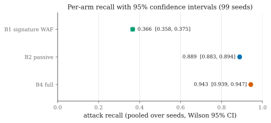

**Figure 21 — Recall with 95 % confidence intervals by arm.** The separation between
the B2 and B4 intervals is the fastest way to read the headline result.

The B2 and B4 intervals **do not overlap**. The paired test confirms it:

| | **B4 diverts** | **B4 misses** | Total |
|---|---:|---:|---:|
| **B2 diverts** | 10,458 | **197** (c) | 10,655 |
| **B2 misses** | **842** (b) | 383 | 1,225 |
| Total | 11,300 | 580 | 11,880 |

**Table 18 — Paired McNemar contingency table.** Exact two-sided
**p = 1.9 × 10⁻⁹⁵**; concordant pairs 10,841. **B4 is ahead in 99 of 99 seeds.**


**Figure 22 — Per-seed paired comparison across 99 draws.** Every point lies on the
same side of the diagonal, which is what rules out the possibility that the pooled
result rests on a handful of lucky draws.

The 197 discordant pairs in the other direction are reported rather than buried: these
are sessions the passive arm diverts and the probing arm defers, because the probing
arm's higher divert edge (0.8793 against the cost-only 0.8163) makes it wait. This is
the price of the safety property and it is visible in the data.

B1 is a real signature firewall — regular expressions for injection, scripting,
traversal and command injection, plus scanner user-agents — and it is a fair reference
rather than a straw man, since it false-positives on zero benign sessions. Its recall
is low because round-2 attacks are obfuscated and, more decisively, because reading
another user's record by changing an identifier is perfectly valid syntax with nothing
for a signature to match.

**A real ruleset, not only ours.** To confirm B1 is not a weak in-house baseline, the
**OWASP ModSecurity Core Rule Set** was replayed on identical traffic.

| CRS paranoia level | Attack recall (95 % CI) | Benign sessions blocked |
|---|---|---:|
| 1 (default) | 0.353 [0.305, 0.404] | **0 / 240** |
| 2 | 0.544 [0.493, 0.595] | **0 / 240** |
| 3 | 0.544 [0.493, 0.595] | **0 / 240** |
| 4 (maximum) | **1.000** [0.989, 1.000] | **72 / 240 (30 %)** |

**Table 22 — OWASP CRS paranoia sweep on identical traffic.**

At its default setting the real ruleset scores **0.353** against B1's 0.366, and the
intervals overlap — so the in-house baseline is, if anything, slightly generous to the
signature approach. The CRS reaches perfect recall only at paranoia 4, where it blocks
**thirty per cent of legitimate sessions**, which is not a deployable operating point.
The honest summary is that a signature ruleset tops out around **0.54** at settings
that leave benign users alone, against **0.943** at zero benign diversions here.

### 4.4.5 Where the gain lives

| Subcategory | n | B1 | B2 | B4 | B4 − B2 | Bite rate (B4) |
|---|---:|---:|---:|---:|---:|---:|
| **`idor_html_scattered`** | 1,980 | 0.000 | 0.540 | **0.823** | **+0.282** | 0.620 |
| `sqli_obfuscated` | 3,960 | 0.985 | 0.898 | 0.921 | +0.022 | 0.162 |
| `sqli_stealth` | 1,980 | 0.000 | 1.000 | 1.000 | +0.000 | 0.503 |
| `idor_scattered` (API) | 1,980 | 0.107 | 0.994 | 0.993 | −0.001 | 0.000 |
| `auth_spray` | 1,980 | 0.122 | 1.000 | 1.000 | +0.000 | 0.000 |

**Table 21 — Recall by attack subcategory.**

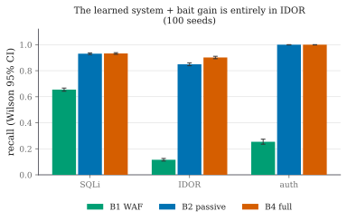

**Figure 24 — Recall by attack subcategory.**

This is the sharpest result in the project, and it is exactly what the theory
predicts. **Almost the entire gain is in user-interface object-reference attacks:
+0.282, against +0.022 or less everywhere else.** Three observations follow.

First, the probe helps *only where the passive detector is genuinely uncertain*. In
`sqli_stealth`, `idor_scattered` and `auth_spray` the passive meter is already at or
near 1.000, so there is no headroom and the probe correctly adds nothing. A probe that
raised recall everywhere would be a sign that the meter was weak, not that the pricing
was right.

Second, `idor_html_scattered` is precisely the category with no signature surface —
B1 scores **exactly zero** on it — and the one where a request is byte-identical to a
legitimate one. It is the case the entire design was built for, and it is where the
gain appears.

Third, note the `sqli_stealth` row: the bite rate is 0.503, so the probe *is* being
taken, yet recall does not move because the passive meter already catches every
session. This is the design behaving correctly rather than wastefully — the probe is
deployed where belief is uncertain, and uncertainty is not the same thing as
difficulty.

### 4.4.6 Safety on the benign side

| Benign client class | Sessions | Diverted | Shown a probe | Acted on a probe |
|---|---:|---:|---:|---:|
| Ordinary human users | ~4,455 | **0** | most | **0** |
| Hard negative: apostrophe search | ~594 | **0** | yes | **0** |
| Hard negative: forgetful login | ~594 | **0** | yes | **0** |
| Hard negative: URL mistyper | ~297 | **0** | yes | **0** |
| Automated: uptime monitor | ~660 | **0** | some | **0** |
| Automated: search crawler | ~660 | **0** | some | **0** |
| Automated: reporting integration | ~660 | **0** | yes | **0** |
| **Total** | **7,920** | **0** | **7,098 (89.6 %)** | **0** |

**Table 23 — Benign safety by client class.**

Two numbers carry this table. **Zero of 7,920 benign sessions were diverted.** And among the benign sessions
that were shown a probe — **7,098 of them, 89.6 %, effectively nine in ten** — not one
acted on it. The second number is the invisibility gate holding at scale
rather than only on the bench: the probes were served to real benign traffic
throughout, and produced no false evidence whatsoever.

The reporting-integration row deserves comment. Before the two offending features were
removed, this class was diverted **100 %** of the time, because a nightly integration
walks record identifiers in ascending order exactly as an attacker sweep does. No
passive feature separates those two honestly. The detection was delegated to the probe,
which distinguishes them by *asking* — and the integration, which does not read
response bodies looking for a way in, never bites.

### 4.4.7 Decoy consistency

| Configuration | Contradictions | Probes | Distinct bodies | Distinct names |
|---|---:|---:|---:|---:|
| Deterministic generator **with** Fact Notebook | **0 (0 %)** | 286 | 1 | 15 |
| Deterministic generator **without** notebook | **286 (100 %)** | 286 | 1 | 15 |
| Language model **with** notebook | **0 / 15 entities** | — | 12 | 13 |
| Language model **without** notebook | **15 / 15 entities** | — | 12 | 13 |

The consistency fuzzer asks the same question in different ways, revisits entities
after intervening requests, and cross-references answers across endpoints. With the
notebook the contradiction rate is **0 %**; without it, **100 %** — a generator with
no memory answers the second identical question differently almost every time, and a
decoy that contradicts itself has announced the trap.

A sceptic could read that as an artefact of a weak deterministic generator, so the
same ablation was run with a language model behind the same seam: **0 contradictions
with the notebook, 15 of 15 without it**, over 15 entities. The consistency property
therefore belongs to the notebook rather than to whatever produces the content, which
is exactly the claim §3.2.4 makes.

The trade in the other direction is worth reporting in the same breath. The language
model writes more varied free text — 12 distinct bodies against the deterministic
generator's 1 — while the deterministic generator produces more distinct names, 15
against 13. Richer prose, no better consistency; the two properties are independent.

### 4.4.8 Validation against third-party attack tools

Synthetic attackers are the project's own construction, so the sharpest objection is
that the attacker model was chosen to suit the defence. This was bounded from one side
by running real, third-party tools against the full system on an isolated local stack.

| Tool | Cookie behaviour | Requests | Outcome | Bit a probe? |
|---|---|---:|---|:--:|
| **sqlmap 1.10.8** | persists | — | Diverted on its **3rd** request, p → 1.0 | **No** |
| **wapiti 3.2.3** | persists | — | Diverted on its **13th** request, p → 1.0 | **No** |
| **ghauri 1.4.3** | **refuses** | 1,321 | Session-less; 46 % of individual requests diverted on their own lexical evidence | **No** |
| **sqlmap** vs OWASP Juice Shop | persists | — | Diverted on its **2nd** request | **No** |
| **OWASP ZAP** vs Juice Shop | browser-driven | 682 sessions, 589 endpoints crawled | Separated correctly rather than blanket-diverted | **No** |

**Table 28 — Third-party attack tools against the framework.**

Every cookie-persistent tool is diverted within a handful of requests, and **not one
tool bites a probe in any configuration**. That is not a failure of the probe; it is
the scope claim measured. A blind injection engine does not read a planted HTML
comment and decide to chase a deprecated-endpoint hint, and it does not need to be
caught that way, because its own behaviour is loud enough for the passive meter. The
probe exists for the adversary the scanner is not.

**One tool found a real evasion.** ghauri refuses the proxy's cookie, so every request
arrives session-less and the accumulating meter is reset before it can build a case —
the score-resetting attack the design anticipates. Even so, 46 % of its individual
requests are diverted on their own lexical evidence, and enabling the fingerprint
fallback the system already ships collapses its 1,321 requests into a single session
that is diverted outright. The evasion is real, it was anticipated, and the mitigation
is a configuration flag rather than a redesign.

**Transfer to a second application.** The same frozen model was placed in front of
OWASP Juice Shop — a Node/Express single-page application with a JSON API,
structurally unlike the target — in its passive configuration, since what transfer
tests is whether the features fire rather than whether the probe is taken. A
browser-driven ZAP scan that crawled 589 endpoints and mixed benign spidering with
payloads was **separated correctly rather than blanket-diverted**: diverted requests
carry a mean of 0.91 SQL-keyword hits, passed requests 0.00. What transfers is the
app-agnostic core — lexical context, error ratio, timing, header shape. What does not
is the app-specific authentication features, which key on the target's form-POST login
and stay silent against a JSON login endpoint; they would need re-pointing, and this is
stated rather than presented as a complete transfer.

These tool runs predate the bait recalibration and were made against the previous
freeze. Nothing in them depends on the bait weights, because no tool bit anything.

### 4.4.9 Validation against adversaries the project did not choose

Two further results test the system against adversaries whose behaviour the project
did not set.

**The adaptive adversary.** Attacker bait-*awareness* was swept from 0 (follows a
planted hint) to 1 (never bites, on principle) in five steps, forty sessions each,
against two profiles: an escalating attacker that raises its own signal as it works,
and a low-and-slow attacker that is precisely the case a passive score finds hard.

| Awareness | 0.00 | 0.25 | 0.50 | 0.75 | 1.00 |
|---|---:|---:|---:|---:|---:|
| Low-and-slow — bite rate | 0.925 | 0.975 | 0.850 | 0.775 | **0.000** |
| Low-and-slow — diverted | 1.000 | 1.000 | 1.000 | 1.000 | **1.000** |
| Escalating — diverted | 0.952 | 1.000 | 1.000 | 1.000 | **1.000** |
| Median requests to divert | 5 | 5 | 5 | 5 | **5** |

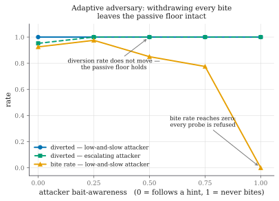

**Figure 28 — Adaptive adversary: bite rate against awareness.** The two claims the
figure separates are that the bite rate genuinely reaches zero, and that the diversion
rate genuinely does not move.

The bite rate falls to zero as awareness reaches one, which is the sweep working: a
fully aware attacker really does refuse every probe. The diversion rate does not move,
and the number of requests taken to reach the decision is unchanged at five throughout.

The honest reading is narrower than "the system always wins". What the sweep
establishes is that **bait never blinds the detector it is built on**: withdrawing
every bite leaves the passive floor intact rather than below it, which is the property
the survival discount exists to guarantee. It does *not* establish that timing is
unaffected in general — this target's error-ratio and username features are strong
enough that the probe has little to add against these two profiles.

**An autonomous language-model attacker.** Three local models were given a tool
interface and twelve steps per session, reading each response and choosing their own
next request. Nothing in the prompt mentions bait, HTML comments, parameters or any
token.

| Model | Shown a probe | Bite \| shown (95 % CI) | Diverted | Mean peak belief |
|---|---:|---:|---:|---:|
| Llama 3.2 1B | 13 / 20 | 0.077 [0.014, 0.333] | 0.55 | 0.687 |
| Llama 3.2 3B | 16 / 20 | 0.375 [0.185, 0.614] | 0.30 | 0.511 |
| Qwen 2.5 7B | 18 / 20 | **0.556** [0.337, 0.754] | 0.85 | 0.928 |

**Table 29 — Autonomous language-model attackers.**

The conditional bite rate rises monotonically with model size, and the largest model's
**0.556 falls inside the [0.51, 0.79] range measured for the scripted attacker model**
in the calibration round. That is the answer to the objection this evaluation was
built to face: the curiosity assumption chosen by hand brackets the bite rate of an
autonomous adversary that was not chosen. It is a single overlapping interval on
twenty sessions per model, not a tight agreement, and no more than that is claimed.

The trajectories say what the rates cannot. The 1B model is shown a probe thirteen
times and never once mentions it in its reasoning — it is not declining the probe, it
is not perceiving it. The 3B model finds the hint by itself in thirteen sessions and
reasons about it in its own words, from a prompt that never mentions HTML comments,
parameters or any token. Capability does not order everything: the 3B model is by some
distance the stealthiest (peak belief 0.511, passively diverted in six sessions of
twenty) while the larger 7B is the loudest (0.928, seventeen of twenty), so the probe's
marginal value is highest against the *middle* of this range rather than the top.

**How this number was nearly wrong, three times.** All three failures produced a
confident number and none raised an error.

| The same measurement, four ways (bite rate over all 20 sessions) | 1B | 3B |
|---|---:|---:|
| Probe truncated out of the response | 0.000 | 0.000 |
| No structured way to submit a parameter | 0.000 | 0.000 |
| Prompt naming the channels and a token | 0.650 | 1.000 |
| **None of the three** | **0.050** | **0.300** |

**Table 30 — The same agent measurement under four harness conditions.**

First, the agent's view of each response was capped at 1,400 characters while the
probe sits at 96 % of a median page; 88 % of baited responses exceeded the cap, so the
agent was shown a body with the probe removed and recorded as having declined it.
Second, the agent had no structured way to *submit* a query parameter — it could name
one in its reasoning but could only write it into the search text, where the bait
engine cannot see it; under that interface all three models bit 0.000 while being
shown *more* probes than in the corrected runs (80 %, 90 % and 90 % exposure against
65 %, 80 % and 90 %). Third, after both were fixed, the system prompt still enumerated
the planted channels and used a real bait token as its example, which measured the
instruction rather than the adversary.

These are unconditional rates over all twenty sessions, which is why the corrected
column reads 0.050 and 0.300 against the 0.077 and 0.375 conditional rates above. The
table is in this report because the lesson generalises: an agentic evaluation can be
wrong in **both directions** while every number in it looks plausible, and the only
thing that distinguishes them is reading what the agent actually did. Harness
adjustment was stopped at the point where the remaining failures were the model's
rather than ours — the 3B model has a structured way to submit a parameter, is told
about it, and mostly still writes it into the query text. Continuing past that point
would have been coaching, not measurement.

## 4.5 Data Analysis and Interpretation

### 4.5.1 Why the gain is where it is

The subcategory table is not a curiosity; it is the mechanism made visible. The probe
is deployed when the belief lies in [0.0647, 0.8793), and belief lands in that band
exactly when the passive features are ambiguous. Three regimes appear in the data:

- **Belief already high** (`sqli_stealth`, `auth_spray`, `idor_scattered`): the
  passive meter reaches near-certainty on its own, the session diverts before or
  regardless of any probe, and the measured gain is zero. The probe is not wasted here
  so much as unnecessary.
- **Belief already low and staying low**: the session passes, correctly, and no probe
  is deployed.
- **Belief in the uncertain middle** (`idor_html_scattered`): the passive meter
  hovers, the probe is deployed, 62 % of these sessions bite, and the belief jumps
  across the divert edge in a single log-odds step. Recall moves **+0.282**.

This is the strongest available evidence that the pricing is doing what it claims. The
gain is not distributed; it is concentrated precisely where the theory says the
information purchase is worth making.

### 4.5.2 The cost view

| Configuration | Cost per session | Recall | Benign diverted |
|---|---:|---:|---:|
| Hand-set [0.200, 0.800] | **−10.393** [−10.545, −10.242] | 0.952 | 3 / 3,840 |
| Hand-set [0.050, 0.816] | −10.168 [−10.322, −10.015] | 0.948 | 3 / 3,840 |
| **Derived (as shipped)** | −10.030 [−10.167, −9.892] | 0.940 | **0 / 3,840** |
| Hand-set [0.300, 0.700] | −9.989 [−10.284, −9.694] | 0.971 | 46 / 3,840 |
| Hand-set [0.100, 0.900] | −9.881 [−10.050, −9.712] | 0.935 | **0 / 3,840** |
| Hand-set [0.050, 0.950] | −9.246 [−9.395, −9.098] | 0.911 | **0 / 3,840** |

**Table 24 — Hand-set against derived band edges on expected cost.** Paired over 48
seeds, 9,600 sessions per arm. More negative is better; negative cost is a gain.

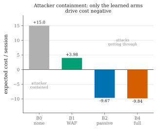

**Figure 25 — Expected cost per session by arm.** Reported separately from recall so
that neither figure is read as the other.

**The derived edges do not win on expected cost.** This is reported rather than
withheld, and the analysis of *why* is more useful than the headline would have been.

Three measurements explain the result, and none of them is that a person guessed
better.

**The gap is benign nuisance baiting, not detection.** The derived arm shows a probe
to 89 % of benign sessions (3,433 of 3,840) against 65 % for the arms that beat it, at
one unit each. That difference — not any difference in what the arms *catch* — is most
of the cost gap.

**The edge is not choosing a value; it is choosing a side.** The belief takes only a
handful of distinct values, and two of them account for **56 % of every decision the
policy makes** (0.163 and 0.476). Every edge below 0.163 behaves identically, and so
does every edge between 0.163 and 0.463. The measured benign-bait rates confirm it:
**0.897, 0.896 and 0.903** for the three arms whose edge falls below 0.163, against
**0.650, 0.650 and 0.650** for the three above it. The second group is identical to
three decimal places even though its lower edge runs from 0.187 to 0.300 — the plateau
made visible. The derived band's four decimal places are not doing the work their
precision suggests.

**The derived DIVERT edge is what buys zero benign diversion.** Benign belief ceilings
top out at **0.829**; the derived edge sits at **0.879**, above all of them. Every
configuration that beats the derived pair on cost does so by diverting benign users —
3, 3 and 46 sessions respectively. **Among the configurations that divert none, the
derived edges are the best available**, by a margin of 0.15 cost units over the next
best.

That is a narrower claim than the project set out to make and a more useful one,
because it says what the derivation *buys* — a placement that clears the benign belief
distribution by construction — rather than asserting a superiority the data does not
support.

### 4.5.3 Is the belief a probability?

Section 4.5.2 leaves an obvious question. Every band edge is a threshold on a
probability, and the meter that produces that probability was given its weights by
hand and never fitted to a label. If the belief is not calibrated, the edges do not
land where the derivation intends.

This was measured on four draws held out by construction — the calibration split runs
on seeds far below the evaluation range, so nothing fitted on it can reach a reported
number.

| Map | Held-out ECE | Held-out Brier |
|---|---:|---:|
| As shipped (identity) | 0.157 ± 0.008 | 0.149 |
| Platt [41] | 0.040 | 0.120 |
| Beta [43] | 0.045 | 0.120 |
| **Isotonic** [42] | **0.018 ± 0.004** | **0.116** |

**Table 25 — Probability calibration map selection.** Selected by leave-one-draw-out
held-out expected calibration error over 14,270 scored requests, so the winner is the
one that survives a withheld draw rather than the one that fits best.

**The belief is not calibrated.** Binned as the calibration error itself bins them,
into fifteen equal-width intervals:

| Belief bin | Requests | Mean belief | Actual attack rate | Gap |
|---|---:|---:|---:|---:|
| [0.00, 0.07) | 107 | 0.0222 | 0.0654 | +0.0432 |
| [0.07, 0.13) | 4 | 0.0793 | 0.5000 | +0.4207 |
| **[0.13, 0.20)** | **2,225** | **0.1629** | **0.0036** | **−0.1593** |
| [0.20, 0.27) | 5 | 0.2493 | 0.0000 | −0.2493 |
| [0.33, 0.40) | 33 | 0.3603 | 0.9394 | +0.5791 |
| [0.40, 0.47) | 1,545 | 0.4521 | 0.0764 | −0.3757 |
| [0.47, 0.53) | 6,106 | 0.4761 | 0.3472 | −0.1289 |
| [0.53, 0.60) | 228 | 0.5772 | 0.6053 | +0.0281 |
| **[0.60, 0.67)** | **555** | **0.6332** | **0.8685** | **+0.2353** |
| [0.67, 0.73) | 441 | 0.6989 | 0.9773 | +0.2785 |
| [0.73, 0.80) | 509 | 0.7730 | 0.9980 | +0.2250 |
| [0.80, 0.87) | 340 | 0.8426 | 0.9971 | +0.1545 |
| [0.87, 0.93) | 228 | 0.9073 | 1.0000 | +0.0927 |
| [0.93, 1.00) | 1,944 | 0.9910 | 1.0000 | +0.0090 |

**Table 26 — Reliability table of the shipped belief.** The meter is **over-confident
below about 0.6** — the 2,225 requests it scores in [0.13, 0.20), mean belief 0.163,
are attacks 0.4 % of the time — and **under-confident above it**, where the 555
requests in [0.60, 0.67), mean belief 0.633, are attacks 87 % of the time. The sign of
the gap flips around 0.6, which is the entire shape of the miscalibration.

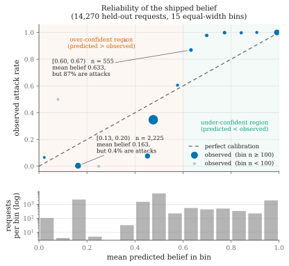

**Figure 27 — Reliability diagram of the shipped belief.** Points below the diagonal
are over-confident, points above it under-confident, and the sign flips around 0.6.
The population strip beneath is there so the two bins holding four and five requests
are not read as evidence.

Measuring the consequence needs no change to any frozen artefact. A calibration map is
monotone, so applying the derived edges to a calibrated belief is arithmetically the
same policy as applying inverse-mapped edges to the raw one. The derived pair
(0.0647, 0.8793) becomes **(0.187, 0.619)** on the raw belief.

| | Recall | Benign diverted | Cost / session |
|---|---:|---:|---:|
| Derived, as shipped | 0.940 | **0 / 3,840** | **−10.030** |
| Derived, calibrated belief | **0.979** | 81 / 3,840 | −9.497 |

**Table 27 — Effect of calibrating the belief under the frozen cost table.**

Calibrating produces the **best recall of any configuration measured**, and the
improvement is not marginal: on matched attack sessions, 245 are caught by the
calibrated policy alone against 21 by the shipped one, **p = 1.3 × 10⁻⁴⁹**. It also
diverts 81 benign sessions where the shipped configuration diverts none, and under the
frozen cost table that decides it. The break-even price of a benign diversion is
**137**; the table, written before any data existed, prices it at 200.

Two conclusions follow and they point in opposite directions, which is why both belong
here. As a **detector**, the calibrated belief is clearly better. As a **policy under
this cost table**, it is clearly worse. Which of those is the improvement is not a
question the data answers — it is a question the cost table answers, and the cost table
was fixed in advance precisely so that it could.

There is a third reading, and it is the most useful. **Two modelling errors are
present and they point opposite ways.** The belief is under-confident at the top, which
pushes the operating edge higher on the raw scale than the cost model intends; and the
rule is derived for a *single decision* but deployed as a *first-crossing test over a
whole session*, which means the cost-optimal edge is higher still. The shipped
configuration sits close to the session-level optimum because those two errors very
nearly cancel. Correcting either alone moves it away. This is reported because a rule
that is right for compensating reasons is a different object from a rule that is right,
and a reader deciding whether to adopt the method is entitled to know which one this is.

## 4.6 Validation of the System

| Criterion | Method | Result |
|---|---|---|
| Probe causes additional diversions | Randomised holdout, Fisher exact | **Confirmed** — +0.070 [+0.052, +0.088], p = 3.4 × 10⁻¹⁹ |
| Gain over passive detector is real | Exact paired McNemar, 11,880 pairs | **Confirmed** — 0.889 → 0.943, p = 1.9 × 10⁻⁹⁵ |
| Result is not a lucky draw | Per-seed paired comparison | **Confirmed** — B4 ahead in 99 / 99 seeds |
| Baseline is not a straw man | OWASP CRS replayed on identical traffic | **Confirmed** — CRS 0.353 at default vs B1 0.366 |
| No benign users diverted | Wilson interval on 7,920 sessions | **Confirmed** — 0 / 7,920 |
| Probes invisible to benign users | Bite count on 7,098 exposed benign sessions | **Confirmed** — 0 acted on a probe |
| Injection imperceptible | Certified median overhead vs 0.5 ms ceiling | **Confirmed** — worst 0.11 ms, p95 0.13 ms |
| Band exists only with information term | Algebra plus runtime invariant test | **Confirmed** — Property 0; band empty under cost alone |
| Band robust to estimated inputs | Sweep β ∈ [0.05, 0.99], cost ratio 0.5–128 | **Confirmed** — band non-empty, divert edge ≥ 0.8163 throughout |
| Degrades safely against bait-aware attacker | Awareness sweep, 5 levels × 40 sessions | **Confirmed** — divert rate unchanged at 1.000; bite → 0.000 |
| Decoy self-consistent | Consistency fuzzer, 286 probes | **Confirmed** — 0 % with notebook, 100 % without |
| Consistency independent of generator | Same ablation with a language model | **Confirmed** — 0 vs 15/15 over 15 entities |
| Robust to real attack tools | sqlmap, ghauri, wapiti, ZAP | **Confirmed** — every cookie-persistent tool diverted |
| Attacker model not self-serving | Autonomous LLM attacker, 3 models × 20 sessions | **Confirmed** — 0.556 falls inside the assumed [0.51, 0.79] |
| Fails open under component fault | Fault injection on three components | **Confirmed** — request served; 0 fail-opens in 875,703 decisions |
| Log tamper-evident | Chain verification with induced edits | **Confirmed** — any edit breaks the chain |
| Model cannot drift silently | Freeze manifest verification | **Confirmed** — reporting refuses on any digest mismatch |
| Derived edges beat hand-set ones on cost | 48-seed threshold sweep | **NOT confirmed** — see §4.5.2; derived best only among zero-diversion arms |
| Belief behaves as a probability | Held-out calibration, 14,270 requests | **NOT confirmed** — ECE 0.157; see §4.5.3 |

**Table 31 — Validation criteria and outcomes.**

The final two rows are the reason this table is useful. Two pre-stated criteria were
**not** met, both are reported in full, and the analysis of why they failed produced
the most informative findings in the project.

## 4.7 Challenges and Limitations

### 4.7.1 Limitations retired by fixing the underlying problem

**Benign false positives on automated clients.** An early version diverted **every**
benign reporting-integration client, because two features treated any API access and
any run of ascending object identifiers as hostile — the exact shape of a harmless
integration. A human-only benign set had hidden this completely. Adding
automated-but-harmless clients exposed it; removing the two features fixed it, at the
cost of delegating that detection to bait.

**A benign crawler diverted on 404s** for standard files, fixed by serving
`robots.txt`, `sitemap.xml` and `favicon.ico` from both applications.

**A false positive on a forgetful user**, which an earlier draft reported as an
inherent cost of a hard negative, turned out not to be inherent at all: it was a
missing feature (`mal_distinct_usernames`) plus a double count (login rejections
counted in the error ratio as well). Once both were addressed, the benign diversion
rate is zero across every benign class.

**A corpus artefact that would have invalidated the automation axis.** This one is
reported at length because of how it was found. The attack generator spoke raw HTTP
and never fetched a page sub-resource; the benign generator fetched them like a
browser. The corpus therefore contained **no attack session that fetched an asset** and
almost no human-paced benign session that did not, and a logistic regression on the
automation features alone separated the two at an out-of-sample **AUC of 0.9935** — on
a property of the two scripts, not of hostility.

No reported number was affected, because automation carries weight zero in the
hostility belief and the logs confirm it. But the corpus was easier than reality, so
half the attackers now drive a browser. The automation-only figure falls to 0.898, and
every arm loses recall on the harder corpus:

| Corpus | B1 | B2 | B4 | B4 − B2 | Benign diverted (B4) |
|---|---:|---:|---:|---:|---:|
| Raw-HTTP attackers only | 0.408 | 0.917 | 0.951 | +0.034 | 0 / 7,920 |
| **Browser-mixed (reported)** | **0.366** | **0.889** | **0.943** | **+0.054** | **0 / 7,920** |

Every arm gets worse and the probe's contribution gets **larger** — from +0.034 to
+0.054, more than half again — because the passive automation signal that used to catch
these sessions is gone. **All numbers in this report are the harder ones.**

Because attributing a drop of that size to the corpus is easy to claim and hard to
check, the control was run: the browser-driven fraction is a pinned parameter, and
setting it to zero on the *current* frozen model reproduces the pre-browser numbers to
within 0.005 on every arm (B1 0.412, B2 0.918, B4 0.949 over twenty matched seeds,  <!-- not-the-headline -->
against 0.408, 0.917 and 0.951). The corpus is what changed, not the detector.

The browser-driven fraction was **not** raised further to drive the AUC down, which
would be fitting the corpus to a desired measurement; attack tooling genuinely does
skew scripted, and the separation that remains is real.

### 4.7.2 Irreducible limitations

**The traffic is synthetic** [36]. The benign mix, hard negatives included,
approximates office traffic; it is not a sample of it, and every rate in this report is
a statement about this distribution. Replaying a public labelled corpus such as CSIC
2010 [27] and recruiting human browsers would bound the benign side, and is the natural
next step. The band's derivation and the randomised-holdout design do not depend on the
traffic being real, but the magnitudes do.

**The probe's effectiveness is a property of an attacker model we chose.** This is
addressed three ways rather than caveated. The adaptive-adversary sweep shows the gain
decays to the passive floor as the attacker learns to refuse probes. The parameter
sweep shows the band's existence and the safety direction hold across the whole
plausible range. And an autonomous language-model attacker, told nothing about bait,
bites at a rate whose interval overlaps the range assumed by hand. None of that rescues
the *magnitude* of the gain, which remains a property of this attacker population.

**The belief is not calibrated, and the shipped rule is right for compensating
reasons.** This is the sharpest limitation and it sits under the decision rule rather
than beside it. Expected calibration error is 0.157 on held-out draws; the edges do not
land where the derivation intends; and the shipped configuration sits near the
session-level optimum only because two modelling errors of opposite sign nearly cancel.
Deriving the rule for the *sequential* decision it actually makes, rather than for a
single request, is the piece of theory this work leaves undone.

**The system is tuned on one application.** Transfer was checked by placing the frozen
model in front of OWASP Juice Shop: the app-agnostic features fire correctly, the
app-specific authentication features would need re-pointing, and a full evaluation with
a matched decoy on a second application remains future work.

**The cost table is a reasoned estimate**, not a real organisation's incident data. It
is frozen so it cannot be tuned to the results, and the sweep shows the conclusions
survive across two orders of magnitude of the one ratio it encodes, but the particular
level of conservatism it sets is a judgement.

**The deception is assessed by the researchers and a consistency fuzzer**, not by
independent human participants. Whether a human attacker *feels* that something is off
is not measured, and it is the single most valuable thing left to measure.

**Session identity can be reset.** ghauri demonstrated this in practice. The
fingerprint fallback mitigates it and ships disabled by default, which is the honest
configuration to evaluate.


<div style="page-break-after: always;"></div>

# CHAPTER 5

# CONCLUSION AND FUTURE WORK

## 5.1 Conclusion

The objective of this project was to address a structural weakness in web attack
detection that cannot be fixed by improving the classifier. A web application firewall
must commit to allowing or blocking a session using only the evidence that arrives on
its own. In the region where the detector is genuinely uncertain — which is precisely
where valid-syntax attacks such as insecure direct object references live — neither
action is defensible, and the detector has no mechanism by which it could *acquire*
the evidence that would let it decide correctly.

The project's answer is to give the detector a **third action** and, more importantly,
to derive rather than tune the rule that governs it. When the belief that a session is
hostile is neither low enough to ignore nor high enough to act on, the framework adds
an invisible, inert **probe** to the response — a fake table name inside a database
error, an unused field in a JSON reply, a hint at a deprecated endpoint. A real
browser never renders any of it. A client reading raw traffic and probing the
application will act on it, and the moment it does, it has identified itself.

The contribution is not the probe but the pricing. Probing has no immediate benefit,
because the request still reaches the real application; its entire worth is the
information a bite would reveal. Modelling that worth as the **expected value of
sample information** [32] makes probing the cost-optimal action over a belief band
whose two edges are *outputs* of a frozen cost table and a measured bite likelihood
ratio. The strongest structural result in the report is a negative one: under cost
accounting alone, `E[C(bait)] − E[C(pass)] = 1 − p > 0` for every belief short of
certainty, so **the middle band is empty**. The third action cannot be reproduced by
tuning a threshold, because there is no threshold to tune — the region does not exist
until information is priced.

The evaluation supports the mechanism rather than a headline number.

- A **randomised holdout inside the treated arm** — the probe withheld from about one
  session in ten at the same belief state — estimates the probe's causal effect at
  **+0.070 [+0.052, +0.088]**, Fisher exact **p = 3.4 × 10⁻¹⁹**, with the treated and
  control groups verified balanced across attack subcategories (χ² = 2.58 on 4 df).
- Attack recall rises from **0.889** to **0.943** over 11,880 matched pairs, exact
  paired McNemar **p = 1.9 × 10⁻⁹⁵**, with the full system ahead in **99 of 99 seeds**.
- The gain is not distributed but **concentrated**: **+0.282** in user-interface
  object-reference attacks, and +0.022 or less everywhere else. This is exactly what
  the theory predicts — the probe helps only where the passive detector is genuinely
  uncertain, and a probe that raised recall everywhere would indicate a weak meter
  rather than correct pricing.
- **None of 7,920 benign sessions is diverted**, and of the **7,098 benign sessions
  shown a probe — 89.6 % — not one acted on it.**
- Against the **OWASP ModSecurity Core Rule Set** replayed on identical traffic, a
  real signature ruleset reaches 0.544 at settings that leave benign users alone, and
  1.000 only by blocking 30 % of legitimate sessions.

Two results test the parts a cost model cannot reach. A write-once **Fact Notebook**
holds the decoy's story together over 286 adversarial probes at a **0 %** contradiction
rate against **100 %** without it, and the same ablation with a language model behind
the same seam gives 0 against 15 of 15 — establishing that the consistency property
belongs to the store rather than to the generator. And an **autonomous language-model
attacker**, told nothing about bait and choosing its own requests, takes probes at a
rate (0.556) whose interval falls inside the range measured for the scripted adversary
the calibration assumed.

An unanticipated safety property fell out of the arithmetic and deserves the last
word. Introducing the probe raised the divert threshold from the cost-only boundary of
0.8163 to **0.8793**, because a defender with a cheap way to resolve uncertainty need
not gamble. Benign belief ceilings on this corpus top out at 0.829. The derived edge
therefore clears the entire benign belief distribution **by construction** rather than
by tuning, and that is what buys the zero-benign-diversion result. A system that can
probe is *more* reluctant to divert an honest user than the same system without one.

If a reader remembers one thing from this report, it should be that last point stated
generally: **without the information term there is no third action at all**, so the
middle option cannot be a tuned threshold. It is priced.

## 5.2 Deviation from Expected Results

Several results deviated from what was expected. Two of them were failures of
pre-stated success criteria, and both produced more useful findings than success would
have.

### 5.2.1 The derived edges did not beat hand-set edges on expected cost

**Expected:** that deriving the band edges from the cost table would produce a
configuration that dominates hand-set thresholds on expected cost.

**Observed:** it does not. Three hand-set configurations achieve lower cost per
session than the derived pair (Table 24).

**Why, and what it actually means.** The analysis is more informative than the
expectation would have been. First, **the gap is benign nuisance baiting, not
detection**: the derived arm shows a probe to 89 % of benign sessions against 65 % for
the arms that beat it, at one unit each, and that difference is most of the cost gap.
Second, **the edge is not choosing a value; it is choosing a side.** The belief takes
only a handful of distinct values, two of which account for 56 % of every decision the
policy makes (0.163 and 0.476). The measured benign-bait rates are 0.897, 0.896 and
0.903 for the three arms whose edge falls below 0.163, against **0.650, 0.650 and
0.650** for the three above it — identical to three decimal places even though that
group's lower edge runs from 0.187 to 0.300. Four decimal places of derived precision
are not doing the work their precision suggests. Third, **every configuration that
beats the derived pair on cost does so by diverting benign users** (3, 3 and 46
sessions). Among the configurations that divert none, the derived edges are the best
available.

The revised claim is narrower and more defensible: the derivation buys a *placement
that clears the benign belief distribution by construction*, not a superiority on
aggregate cost.

### 5.2.2 The belief is not calibrated

**Expected:** that a hand-weighted meter would be approximately calibrated, so that
thresholds on it would land where the derivation intends.

**Observed:** held-out expected calibration error is **0.157**, against 0.018 for an
isotonic map fitted on data that cannot reach any reported number. The meter is
over-confident below about 0.6 and under-confident above it, with the sign of the gap
flipping around 0.6.

**Why it matters, and the finding it produced.** Calibrating gives the best recall of
anything measured — 0.979 against 0.940, with 245 attack sessions caught by the
calibrated policy alone against 21 by the shipped one (p = 1.3 × 10⁻⁴⁹) — but costs
the zero-benign-diversion property, diverting 81 of 3,840. Under the frozen cost table
that decides it: the break-even price of a benign diversion is 137 and the table,
written before any data existed, prices it at 200. The calibrated policy is a better
*detector* and a worse *policy under this cost table*, and which of those is "the
improvement" is a question the cost table answers rather than the data.

The third reading is the most useful and was not anticipated at all. **Two modelling
errors are present and they point in opposite directions.** The belief is
under-confident at the top, which pushes the operating edge higher on the raw scale
than the cost model intends; and the rule is derived for a single decision but deployed
as a first-crossing test over a whole session, which puts the cost-optimal edge higher
still. The shipped configuration sits close to the session-level optimum **because
those two errors very nearly cancel.** Correcting either alone moves it away. A rule
that is right for compensating reasons is a different object from a rule that is right,
and this report states which one it has.

### 5.2.3 The corpus was easier than intended

**Expected:** that the attack and benign corpora differed in hostility.

**Observed:** they also differed in a property of the *generators*. The attack
generator spoke raw HTTP and never fetched a page sub-resource; the benign generator
fetched them like a browser. A logistic regression on the automation features alone
separated the two populations at an out-of-sample **AUC of 0.9935** — on script
behaviour, not on hostility.

**Response.** No reported number was contaminated, because automation carries weight
zero in the hostility belief and this was verified against the logs rather than the
configuration. But the corpus was easier than reality, so half the attackers now drive
a browser; the automation-only figure falls to 0.898, every arm loses recall, and the
probe's contribution **rises** from +0.034 to +0.054. All numbers in this report are
the harder ones. A pinned-parameter control confirms the attribution: setting the
browser fraction to zero on the current frozen model reproduces the pre-browser figures
to within 0.005 on every arm.

### 5.2.4 The auth probe appeared ineffective, and was not

**Expected:** that all five baits would show measurable bite rates.

**Observed:** the authentication probe initially measured 0.000.

**Response.** The round-1 attacker never read response bodies, so a probe planted in a
failure page was **unreachable by construction** rather than ineffective. Against an
otherwise identical attacker that reads bodies, the bite rate rises from 0.000 to 0.950
and the divert rate with it. This relocated the limitation from the defence to the
attacker model, and the headline arms are still reported against the response-reading
population rather than the more favourable one.

### 5.2.5 The agentic measurement was nearly wrong three times

**Expected:** that measuring an autonomous LLM attacker would be a straightforward
addition.

**Observed:** three independent harness defects each produced a confident, plausible,
wrong number, and none raised an error. The response was truncated before the probe
(0.000); the agent had no structured way to submit a parameter (0.000 across all three
models, while being shown *more* probes than in the corrected runs); and the prompt
enumerated the planted channels and used a real bait token as its example (0.650 and
1.000). The corrected measurement is 0.050 and 0.300 unconditionally.

**Response.** All four conditions are reported side by side (Table 30), because the
lesson generalises: an agentic evaluation can be wrong in **both directions** while
every number in it looks plausible. Harness adjustment was stopped at the point where
the remaining failures were the model's rather than ours; continuing would have been
coaching rather than measurement.

## 5.3 Future Work (Way Ahead)

### 5.3.1 Derive the rule for the sequential decision it actually makes

This is the most important theoretical gap and the project's own analysis exposed it.
The current rule is derived for a **single decision** at a given belief, but it is
deployed as a **first-crossing test over a whole session**: the session diverts the
first time the belief crosses the edge, and the policy is invoked many times per
session. These are different decision problems, and their optimal thresholds differ.

Deriving the band for the sequential problem — as an optimal stopping problem over the
belief trajectory rather than a one-shot comparison — would remove one of the two
compensating errors identified in §5.2.2, and would allow a calibrated belief to be
*adopted* rather than merely measured. This is the single most valuable extension of
the work.

### 5.3.2 Adopt calibration once the sequential rule exists

With the sequential derivation in place, an isotonic-calibrated belief [42] becomes
usable rather than merely better on paper. The measured gain is substantial — 0.940 to
0.979 recall — and the reason it is not adopted here is entirely the interaction with
the frozen cost table, not the calibration itself.

### 5.3.3 A human-participant deception study

The deception is currently assessed by the researchers and a consistency fuzzer.
Whether a human attacker *feels* that something is off is not measured, and it is the
single most valuable empirical gap. A block-randomised study in which participants
explore either the real application or the decoy, without being told the study concerns
deception, and are asked afterwards whether anything felt wrong, would bound this
directly. The protocol is designed and the analysis pre-specified; only the
participants remain. The comparison of interest is not whether anyone says "felt fake"
but whether the *rate* differs between the two groups.

### 5.3.4 Replay a public labelled corpus

Replaying CSIC 2010 [27] would bound the passive half of the system against traffic the
project did not generate, and would directly address the synthetic-traffic limitation.
It cannot exercise the probe — a recorded request log contains no responses for an
attacker to react to — but it would make the passive baseline's numbers comparable
against published work.

### 5.3.5 A second full deployment with a matched decoy

Transfer was checked against OWASP Juice Shop in a passive configuration. A complete
evaluation on a second application, with a decoy matched to *that* application and the
app-specific features re-pointed, would establish how much of the framework is
genuinely app-agnostic.

### 5.3.6 Learned bait selection

Bait selection currently maximises the survival-discounted value of information over
applicable baits. A contextual-bandit formulation would let the system learn which
bait works against which attacker profile, using the automation axis — which is
deliberately excluded from the hostility belief — as context. The exploration/
exploitation trade-off is well matched to the setting, since a bait that is never
deployed is never re-calibrated.

### 5.3.7 Stronger invisibility guarantees

The timing criterion is a threshold on the median rather than a formal equivalence
test. A two-one-sided-tests procedure [40] against a pre-registered margin would be the
stronger claim. Extending the gate to cover response-size distributions and header
ordering would close the remaining fingerprinting surfaces identified by [10] and [20].

### 5.3.8 Adaptive and continuously recalibrated bite rates

The bite rates β_attack and β_benign are measured once in a calibration round and then
frozen. In a live deployment they would drift as attacker populations change. A
mechanism that re-estimates them from observed bites — while preserving the freeze
discipline through explicit, dated re-freezes rather than silent updates — would keep
the derivation honest over time.

### 5.3.9 Integration with production identity and policy infrastructure

The framework is a reverse proxy and is deliberately independent of any identity
provider. Integrating the diversion decision with policy engines and identity systems
would let the framework contribute a risk signal to a wider Zero Trust architecture
[52] rather than acting alone.

### 5.3.10 Privacy-preserving deployment

Since the framework observes behaviour, a deployment in a regulated environment would
benefit from federated estimation of the meter's weights, keeping per-user behavioural
data on the serving node and sharing only model updates.

## 5.4 Final Remarks

This project began from a narrow observation — that a two-action detector has nothing
useful to do in the region where it is most uncertain — and ended with a framework in
which deception is an instrument of the decision rather than a consequence of it.

The result the authors consider most durable is not the recall figure. It is the
structural fact that **under cost accounting alone the middle band is empty**, and
therefore that a priced third action is a genuinely different object from a tuned
threshold. Everything else in the report follows from taking that seriously: the
derived edges, the causal holdout that measures what the probe actually contributes,
the frozen cost table that decides the calibration question rather than letting the
results decide it, and the safety property that emerged from the arithmetic rather than
from design.

What the study cannot claim is bounded by its setting: synthetic traffic, a single
tuned application, one laboratory. The parts meant to outlast that setting are not
measurements but a derivation, a design and a structural property — the priced band,
which follows by arithmetic from a frozen cost table; the randomised treatment, which
identifies the probe's effect whatever its size; and the convergence to passive
detection under an adaptive adversary, which is a property of the survival discount
rather than a result about this target.

The report has also tried to be useful about its own failures. Two pre-stated success
criteria were not met and are reported as such. A corpus artefact that would have
flattered the automation axis was found by asking what a classifier could separate the
corpus on, and the corpus was made harder rather than the finding softened. An agentic
measurement was wrong three times in two directions before it was right. These are
included because a security evaluation that hides its near-misses is worth less than
one that reports them, and because the guards added in response are, in the authors'
view, as much a part of the contribution as the headline number.

## 5.5 References

**Verification note.** References [1]–[43] are the entries used in the associated
research paper; the twelve highest-risk entries (2024–2026 publications and preprints)
were each verified individually against publisher or arXiv records, and the remainder
against DBLP or publisher pages. References [44]–[58] are classical and standards
works added for this report; their metadata should be re-confirmed against a publisher
record before final submission rather than accepted from this list.

### Deception: theory and surveys

[1] M. H. Almeshekah and E. H. Spafford, "Planning and Integrating Deception into Computer Security Defenses," in *Proc. 2014 New Security Paradigms Workshop (NSPW '14)*, ACM, 2014, pp. 127–138. doi: 10.1145/2683467.2683482.

[2] X. Han, N. Kheir, and D. Balzarotti, "Deception Techniques in Computer Security: A Research Perspective," *ACM Computing Surveys*, vol. 51, no. 4, art. 80, 2018. doi: 10.1145/3214305.

[3] J. Pawlick, E. Colbert, and Q. Zhu, "A Game-theoretic Taxonomy and Survey of Defensive Deception for Cybersecurity and Privacy," *ACM Computing Surveys*, vol. 52, no. 4, art. 82, 2019. doi: 10.1145/3337772.

[4] M. Zhu, A. H. Anwar, Z. Wan, J.-H. Cho, C. A. Kamhoua, and M. P. Singh, "A Survey of Defensive Deception: Approaches Using Game Theory and Machine Learning," *IEEE Communications Surveys & Tutorials*, vol. 23, no. 4, pp. 2460–2493, 2021. doi: 10.1109/COMST.2021.3102874.

[5] P. Beltrán-López, M. Gil Pérez, and P. Nespoli, "Cyber Deception: Taxonomy, State of the Art, Frameworks, Trends, and Open Challenges," *IEEE Communications Surveys & Tutorials*, vol. 28, pp. 1520–1556, 2026. doi: 10.1109/COMST.2025.3594788.

### Honeypots

[6] N. Provos, "A Virtual Honeypot Framework," in *Proc. 13th USENIX Security Symposium*, San Diego, CA, USA, 2004, pp. 1–14.

[7] M. Nawrocki, M. Wählisch, T. C. Schmidt, C. Keil, and J. Schönfelder, "A Survey on Honeypot Software and Data Analysis," arXiv:1608.06249, 2016.

[8] A. Javadpour, F. Ja'fari, T. Taleb, M. Shojafar, and C. Benzaïd, "A comprehensive survey on cyber deception techniques to improve honeypot performance," *Computers & Security*, vol. 140, art. 103792, 2024. doi: 10.1016/j.cose.2024.103792.

[9] T. Barron and N. Nikiforakis, "Picky Attackers: Quantifying the Role of System Properties on Intruder Behavior," in *Proc. 33rd Annual Computer Security Applications Conference (ACSAC '17)*, ACM, 2017, pp. 387–398. doi: 10.1145/3134600.3134614.

[10] A. Vetterl and R. Clayton, "Bitter harvest: systematically fingerprinting low- and medium-interaction honeypots at internet scale," in *Proc. 12th USENIX Workshop on Offensive Technologies (WOOT '18)*, 2018.

[11] J.-H. Cho, D. P. Sharma, H. Alavizadeh, S. Yoon, N. Ben-Asher, T. J. Moore, D. S. Kim, H. Lim, and F. F. Nelson, "Toward Proactive, Adaptive Defense: A Survey on Moving Target Defense," *IEEE Communications Surveys & Tutorials*, vol. 22, no. 1, pp. 709–745, 2020. doi: 10.1109/COMST.2019.2963791.

### LLM-based honeypots

[12] M. Sladić, V. Valeros, C. Catania, and S. Garcia, "LLM in the Shell: Generative Honeypots," in *2024 IEEE European Symposium on Security and Privacy Workshops (EuroS&PW)*, 2024, pp. 430–435. doi: 10.1109/EuroSPW61312.2024.00054.

[13] Reworr and D. Volkov, "LLM Agent Honeypot: Monitoring AI Hacking Agents in the Wild," arXiv:2410.13919, 2025.

[14] R. A. Bridges, T. R. Mitchell, M. Muñoz, and T. Henriksson, "SoK: Honeypots & LLMs, More Than the Sum of Their Parts?," in *2026 IEEE 11th European Symposium on Security and Privacy (EuroS&P)*, 2026, pp. 910–928. doi: 10.1109/EuroSP68448.2026.00063.

[15] M. Vero, F. Kaczmarczyck, I. Petrov, I. Shumailov, J. Hayes, N. Heinen, T. Fan, L. Invernizzi, and M. Vechev, "Honeyval: A Comprehensive Evaluation Framework for LLM-powered HTTP Honeypots," arXiv:2605.29963, 2026.

[16] A. Adebimpe, H. Neukirchen, and T. Welsh, "SBASH: a Framework for Designing and Evaluating RAG vs. Prompt-Tuned LLM Honeypots," in *2025 3rd International Conference on Foundation and Large Language Models (FLLM)*, IEEE, 2025, pp. 851–856.

### Honeytokens, decoys and bait

[17] J. Yuill, M. Zappe, D. Denning, and F. Feer, "Honeyfiles: deceptive files for intrusion detection," in *Proc. Fifth Annual IEEE SMC Information Assurance Workshop*, 2004, pp. 116–122. doi: 10.1109/IAW.2004.1437806.

[18] B. M. Bowen, S. Hershkop, A. D. Keromytis, and S. J. Stolfo, "Baiting Inside Attackers Using Decoy Documents," in *Security and Privacy in Communication Networks (SecureComm)*, Springer, 2009, pp. 51–70.

[19] A. Juels and R. L. Rivest, "Honeywords: making password-cracking detectable," in *Proc. 2013 ACM SIGSAC Conference on Computer & Communications Security (CCS '13)*, 2013, pp. 145–160. doi: 10.1145/2508859.2516671.

[20] S. Srinivasa, J. M. Pedersen, and E. Vasilomanolakis, "Towards systematic honeytoken fingerprinting," in *Proc. 13th International Conference on Security of Information and Networks (SIN 2020)*, ACM, 2021, art. 28. doi: 10.1145/3433174.3433599.

[21] R. Timmer, D. Liebowitz, S. Nepal, and S. Kanhere, "Evaluating Honeyfile Realism and Enticement Metrics," *ACM Transactions on Privacy and Security*, vol. 28, no. 4, art. 54, 2025. doi: 10.1145/3763792.

### Application-layer deception

[22] M. Kahlhofer and S. Rass, "Application Layer Cyber Deception Without Developer Interaction," in *2024 IEEE European Symposium on Security and Privacy Workshops (EuroS&PW)*, 2024, pp. 416–429. doi: 10.1109/EuroSPW61312.2024.00053.

[23] M. Kahlhofer, S. Achleitner, S. Rass, and R. Mayrhofer, "Honeyquest: Rapidly Measuring the Enticingness of Cyber Deception Techniques with Code-based Questionnaires," in *Proc. 27th International Symposium on Research in Attacks, Intrusions and Defenses (RAID '24)*, ACM, 2024, pp. 317–336. doi: 10.1145/3678890.3678897.

[24] M. Kahlhofer, M. Golinelli, and S. Rass, "Koney: A Cyber Deception Orchestration Framework for Kubernetes," in *2025 IEEE European Symposium on Security and Privacy Workshops (EuroS&PW)*, 2025, pp. 690–702. doi: 10.1109/EuroSPW67616.2025.00084.

### Web attack detection and web application firewalls

[25] C. Kruegel and G. Vigna, "Anomaly Detection of Web-based Attacks," in *Proc. 10th ACM Conference on Computer and Communications Security (CCS '03)*, 2003, pp. 251–261. doi: 10.1145/948109.948144.

[26] W. Robertson, G. Vigna, C. Kruegel, and R. A. Kemmerer, "Using generalization and characterization techniques in the anomaly-based detection of web attacks," in *Proc. Network and Distributed System Security Symposium (NDSS)*, 2006.

[27] C. Torrano-Giménez, A. Pérez-Villegas, and G. Álvarez-Marañón, "HTTP DATASET CSIC 2010," Information Security Institute, Spanish Research National Council (CSIC), 2010.

[28] A. Tekerek, "A novel architecture for web-based attack detection using convolutional neural network," *Computers & Security*, vol. 100, art. 102096, 2021. doi: 10.1016/j.cose.2020.102096.

[29] M. Amouei, M. Rezvani, and M. Fateh, "RAT: Reinforcement-Learning-Driven and Adaptive Testing for Vulnerability Discovery in Web Application Firewalls," *IEEE Transactions on Dependable and Secure Computing*, vol. 19, no. 5, pp. 3371–3386, 2022. doi: 10.1109/TDSC.2021.3095417.

### Bot and automation detection

[30] C. Iliou, T. Kostoulas, T. Tsikrika, V. Katos, S. Vrochidis, and Y. Kompatsiaris, "Towards a framework for detecting advanced Web bots," in *Proc. 14th International Conference on Availability, Reliability and Security (ARES '19)*, ACM, 2019, art. 18. doi: 10.1145/3339252.3339267.

[31] C. Iliou, T. Kostoulas, T. Tsikrika, V. Katos, S. Vrochidis, and I. Kompatsiaris, "Detection of Advanced Web Bots by Combining Web Logs with Mouse Behavioural Biometrics," *Digital Threats: Research and Practice*, vol. 2, no. 3, art. 24, 2021. doi: 10.1145/3447815.

### Decision theory and cost-sensitive learning

[32] R. A. Howard, "Information Value Theory," *IEEE Transactions on Systems Science and Cybernetics*, vol. 2, no. 1, pp. 22–26, 1966. doi: 10.1109/TSSC.1966.300074.

[33] C. Elkan, "The foundations of cost-sensitive learning," in *Proc. 17th International Joint Conference on Artificial Intelligence (IJCAI '01)*, Morgan Kaufmann, 2001, pp. 973–978.

[34] J. Pawlick, E. Colbert, and Q. Zhu, "Modeling and Analysis of Leaky Deception Using Signaling Games With Evidence," *IEEE Transactions on Information Forensics and Security*, vol. 14, no. 7, pp. 1871–1886, 2019. doi: 10.1109/TIFS.2018.2886472.

[35] S. Axelsson, "The base-rate fallacy and the difficulty of intrusion detection," *ACM Transactions on Information and System Security*, vol. 3, no. 3, pp. 186–205, 2000. doi: 10.1145/357830.357849.

### Evaluation methodology in security machine learning

[36] R. Sommer and V. Paxson, "Outside the Closed World: On Using Machine Learning for Network Intrusion Detection," in *2010 IEEE Symposium on Security and Privacy*, 2010, pp. 305–316. doi: 10.1109/SP.2010.25.

[37] D. Arp, E. Quiring, F. Pendlebury, A. Warnecke, F. Pierazzi, C. Wressnegger, L. Cavallaro, and K. Rieck, "Dos and Don'ts of Machine Learning in Computer Security," in *Proc. 31st USENIX Security Symposium*, Boston, MA, USA, 2022, pp. 3971–3988.

[38] K. J. Ferguson-Walter, M. M. Major, C. K. Johnson, and D. H. Muhleman, "Examining the Efficacy of Decoy-based and Psychological Cyber Deception," in *Proc. 30th USENIX Security Symposium*, 2021, pp. 1127–1144.

### Supporting work

[39] B. Schneier and J. Kelsey, "Secure audit logs to support computer forensics," *ACM Transactions on Information and System Security*, vol. 2, no. 2, pp. 159–176, 1999. doi: 10.1145/317087.317089.

[40] D. J. Schuirmann, "A comparison of the two one-sided tests procedure and the power approach for assessing the equivalence of average bioavailability," *Journal of Pharmacokinetics and Biopharmaceutics*, vol. 15, no. 6, pp. 657–680, 1987.

[41] J. C. Platt, "Probabilistic Outputs for Support Vector Machines and Comparisons to Regularized Likelihood Methods," in *Advances in Large Margin Classifiers*, MIT Press, 1999, pp. 61–74.

[42] B. Zadrozny and C. Elkan, "Transforming classifier scores into accurate multiclass probability estimates," in *Proc. Eighth ACM SIGKDD International Conference on Knowledge Discovery and Data Mining (KDD '02)*, 2002, pp. 694–699. doi: 10.1145/775047.775151.

[43] M. Kull, T. S. Filho, and P. Flach, "Beta calibration: a well-founded and easily implemented improvement on logistic calibration for binary classifiers," in *Proc. 20th International Conference on Artificial Intelligence and Statistics (AISTATS)*, PMLR vol. 54, 2017, pp. 623–631.

### Additional references (classical, statistical and standards works)

[44] E. B. Wilson, "Probable Inference, the Law of Succession, and Statistical Inference," *Journal of the American Statistical Association*, vol. 22, no. 158, pp. 209–212, 1927.

[45] Q. McNemar, "Note on the sampling error of the difference between correlated proportions or percentages," *Psychometrika*, vol. 12, no. 2, pp. 153–157, 1947.

[46] R. A. Fisher, "On the Interpretation of χ² from Contingency Tables, and the Calculation of P," *Journal of the Royal Statistical Society*, vol. 85, no. 1, pp. 87–94, 1922.

[47] H. Jeffreys, "An Invariant Form for the Prior Probability in Estimation Problems," *Proceedings of the Royal Society of London A*, vol. 186, no. 1007, pp. 453–461, 1946.

[48] G. W. Brier, "Verification of Forecasts Expressed in Terms of Probability," *Monthly Weather Review*, vol. 78, no. 1, pp. 1–3, 1950.

[49] B. Efron, "Bootstrap Methods: Another Look at the Jackknife," *The Annals of Statistics*, vol. 7, no. 1, pp. 1–26, 1979.

[50] B. Efron and R. J. Tibshirani, *An Introduction to the Bootstrap*. New York, NY, USA: Chapman & Hall, 1993.

[51] T. Hastie, R. Tibshirani, and J. Friedman, *The Elements of Statistical Learning: Data Mining, Inference, and Prediction*, 2nd ed. New York, NY, USA: Springer, 2009.

[52] C. M. Bishop, *Pattern Recognition and Machine Learning*. New York, NY, USA: Springer, 2006.

[53] S. Rose, O. Borchert, S. Mitchell, and S. Connelly, "Zero Trust Architecture," NIST Special Publication 800-207, National Institute of Standards and Technology, 2020.

[54] K. Scarfone and P. Mell, "Guide to Intrusion Detection and Prevention Systems (IDPS)," NIST Special Publication 800-94, National Institute of Standards and Technology, 2007.

[55] L. Spitzner, *Honeypots: Tracking Hackers*. Boston, MA, USA: Addison-Wesley, 2002.

[56] B. Cheswick, "An Evening with Berferd in Which a Cracker is Lured, Endured, and Studied," in *Proc. Winter USENIX Conference*, San Francisco, CA, USA, 1992.

[57] C. Stoll, *The Cuckoo's Egg: Tracking a Spy Through the Maze of Computer Espionage*. New York, NY, USA: Doubleday, 1989.

[58] OWASP Foundation, "OWASP Top 10:2021 — The Ten Most Critical Web Application Security Risks," 2021. [Online]. Available: https://owasp.org/Top10/

[59] OWASP Foundation, "OWASP ModSecurity Core Rule Set (CRS)," 2024. [Online]. Available: https://coreruleset.org/

[60] R. Fielding and J. Reschke, "Hypertext Transfer Protocol (HTTP/1.1): Semantics and Content," RFC 7231, Internet Engineering Task Force, 2014.
